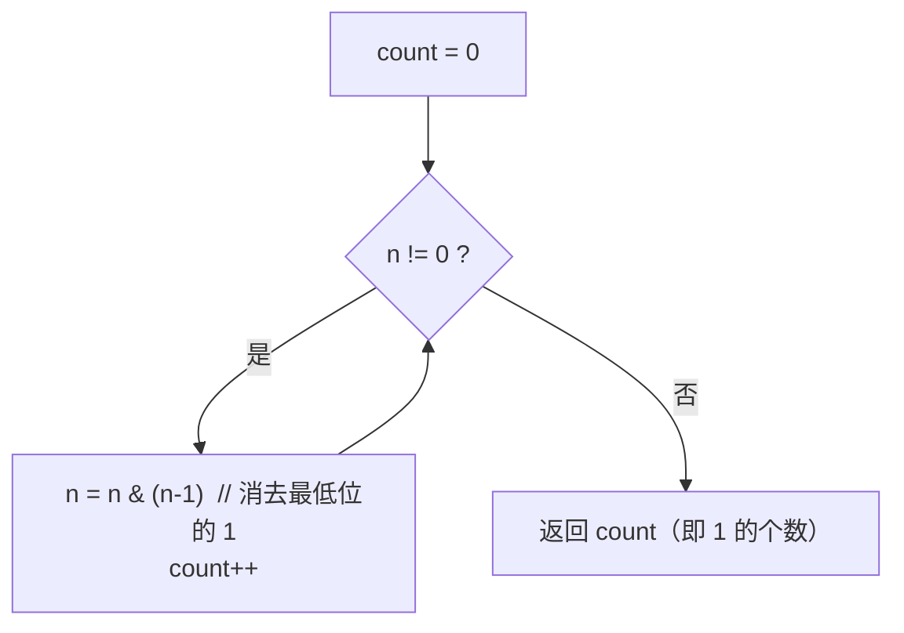

#位运算

## 位运算 AND 技巧 (Bitwise AND)

相关笔记：[[xor]]

利用 `n & (n-1)` 可以消除二进制中最低位的 1，这是很多位运算题目的基础操作。

### 移除最后一个 1

`n & (n-1)` 将 `n` 的二进制表示中最低位的 1 置为 0：

```
n     = 1010 1000
n-1   = 1010 0111
n&n-1 = 1010 0000  // 最后一个1被移除
```

```go
a = n & (n - 1)
```

最典型的应用是 **Brian Kernighan 算法数 1 的个数**：每次 `n & (n-1)` 消掉一个 1，循环几次就有几个 1，复杂度 O(1 的个数) 而非 O(位数)：



### 获取最后一个 1

`(n & (n-1)) ^ n` 或等价的 `n & (-n)` 提取最低位的 1：

```
n       = 1010 1000
n&(n-1) = 1010 0000
异或结果 = 0000 1000  // 只保留最后一个1
```

```go
diff = (n & (n - 1)) ^ n
// 等价写法
diff = n & (-n)
```

### 常见应用

| 操作 | 用途 |
|:---|:---|
| `n & (n-1)` | 判断是否为 2 的幂（结果为 0 则是） |
| `n & (n-1)` 循环 | 统计二进制中 1 的个数 |
| `n & (-n)` | 提取最低位的 1（用于树状数组、异或分组等） |

## 面试要点

### 高频问题

**Q: `n & (n-1)` 为什么能消除二进制中最低位的 1？**

> [!question]- 参考答案（点击展开）
>
> 设 `n` 最低位的 1 在第 `k` 位，那么 `n-1` 会因借位把第 `k` 位变成 0、并把比它低的所有 0 全部变成 1，而第 `k` 位以上保持不变。两者按位 AND 后：第 `k` 位（一个 1、一个 0）被清零，更低位（一个全 0、一个全 1）也都是 0，高位保持原样，因此恰好移除了最低位的那个 1。

**Q: 如何用位运算统计一个整数二进制中 1 的个数（popcount）？**

> [!question]- 参考答案（点击展开）
>
> 循环执行 `n = n & (n-1)` 并计数，直到 `n == 0`，循环次数就是 1 的个数。时间复杂度 O(k)，`k` 为 set bit 个数，优于逐位移位的 O(位宽) 写法，这就是 Brian Kernighan 算法。生产代码优先用内建：Go `bits.OnesCount`、C++20 `std::popcount`（旧标准 `__builtin_popcount`）、Java `Integer.bitCount`，它们一般直接映射到 CPU 的 `POPCNT` 指令。

**Q: 怎么判断一个数是不是 2 的幂？**

> [!question]- 参考答案（点击展开）
>
> 2 的幂在二进制里有且仅有一个 1，所以 `n > 0 && (n & (n-1)) == 0` 即为 2 的幂。必须加 `n > 0`：当 `n == 0` 时 `n & (n-1)` 是 `0 & (-1) == 0`，会被误判为 true；负数也应被排除。

**Q: `n & (-n)` 是怎么提取出最低位的 1 的（lowbit）？**

> [!question]- 参考答案（点击展开）
>
> 在补码下 `-n == ~n + 1`。取反再加一的效果是：最低位 1 及其以下的位保持原状，更高的位全部翻转。于是 `n` 与 `-n` 只有「最低位的那个 1」同时为 1，AND 之后只剩下它（即 lowbit）。它等价于笔记里的 `(n & (n-1)) ^ n`，但更简洁，是树状数组（Fenwick Tree）下标跳转的核心。

**Q: 用 `n & (n-1)` 做 popcount 时，对负数和位宽有什么坑？**

> [!question]- 参考答案（点击展开）
>
> Kernighan 循环本身只用 `&` 和减法，对补码下的负数同样成立、且能正常终止（每轮清掉一个 1），不需要算术右移，所以没有「负数右移」的坑。真正要注意的是位宽：Go 的 `int` 是平台相关的 32/64 位，负数按补码会有高位的 1，统计结果取决于字长，想要确定行为应转成定宽无符号类型（如 `uint32` 配 `bits.OnesCount32`）。对照之下，C/C++ 里负数的算术右移是实现定义行为，所以那种「逐位右移」的写法对负数才需要先转 `unsigned`。

**Q: `n & (-n)` 在 INT_MIN 时会有什么问题？**

> [!question]- 参考答案（点击展开）
>
> 对 32 位有符号整数，`INT_MIN == 0x80000000` 本身就只有最高位（符号位）一个 1，它的 lowbit 就是这个最高位，所以 `n & (-n)` 的结果正确（仍是 `0x80000000`）。语言差异在取负这一步：C/C++ 中 `-INT_MIN` 是有符号溢出，属于未定义行为；Go 中有符号溢出是定义良好的回绕（`-INT_MIN` 回绕成自身），结果正确但仍建议用无符号类型表达 lowbit 以避免歧义。

**Q: 求区间 [m, n] 内所有整数 AND 的结果（LeetCode 201），怎么用这个技巧？**

> [!question]- 参考答案（点击展开）
>
> 结果等于 `m` 与 `n` 二进制公共前缀后面补 0。做法是不断对 `n` 执行 `n = n & (n-1)` 消除其最低位的 1，直到 `n <= m`，此时的 `n` 就是答案。原理：只要区间在某一位上发生过进位翻转，那一位上必然出现过 0，AND 后该位必为 0，只有不变的公共高位前缀能保留。

### 面试加分点

- `n & (n-1)` 把 popcount 的复杂度从 O(位宽) 降到 O(set bit 数)，这就是 Brian Kernighan's algorithm。
- lowbit `x & (-x)` 是树状数组（Fenwick Tree）的核心：更新时 `i += i & (-i)` 向上跳到父节点，查询前缀和时 `i -= i & (-i)` 向下累加，使单点更新与前缀查询都做到 O(log n)。
- 异或分组求「只出现一次的两个数」（LeetCode 260）：先全体异或得到 `diff = a ^ b`，再用 `diff & (-diff)` 取出任意一个不同的二进制位作为分组依据，把数组分两组分别异或即可。
- 能区分 `n & (-n)`（取出最低位 1，结果是 2 的幂）与 `n & (n-1)`（清除最低位 1）这两个互补操作，是位运算熟练度的标志。
- 多数现代 CPU 提供单条 `POPCNT` 指令，高层语言（Go `math/bits`、C++20 `std::popcount`、Java `Integer.bitCount`）会直接映射到它，性能远好于手写循环；面试时点出「生产代码优先用内建」是加分项。
