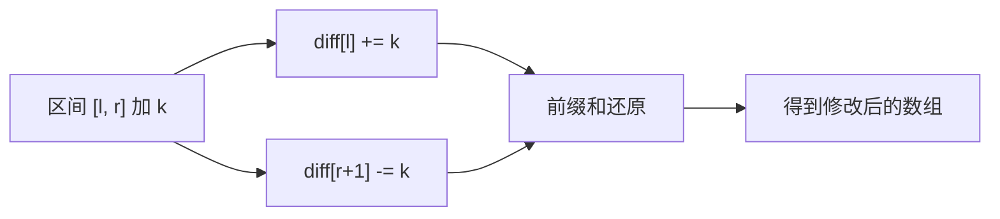

#差分数组 #前缀和

## 差分数组 (Difference Array)

相关笔记：[[prefix-sum]] | [[binary-search]]

差分数组是前缀和的逆运算。对差分数组求前缀和可以还原出原数组。常用于**区间批量修改**场景，将 O(N) 的区间加操作优化为 O(1)。

### 核心思想



### 复杂度分析

| 指标 | 复杂度 |
|:---:|:---:|
| 单次区间修改 | O(1) |
| 还原数组 | O(N) |
| Space | O(N) |

## 一维差分

### 航班预订统计

[1109. 航班预订统计](https://leetcode.cn/problems/corporate-flight-bookings/)

有 `n` 个航班，预订记录 `bookings[i] = [first, last, seats]` 表示从 `first` 到 `last` 的每个航班上预订了 `seats` 个座位。返回每个航班的预订座位总数。

思路：
1. 创建差分数组 `cnt`
2. 对每个预订 `[i, j, k]`：`cnt[i] += k`，`cnt[j+1] -= k`
3. 对差分数组求前缀和得到结果

```go
func corpFlightBookings(bookings [][]int, n int) []int {
    cnt := make([]int, n+2)
    for _, book := range bookings {
        cnt[book[0]] += book[2]
        cnt[book[1]+1] -= book[2]
    }
    // 累加前缀和
    for i := 1; i < len(cnt); i++ {
        cnt[i] += cnt[i-1]
    }
    // 提取结果
    ans := make([]int, n)
    for i := 0; i < n; i++ {
        ans[i] = cnt[i+1]
    }
    return ans
}
```

## 等差数列差分

在差分数组的基础上支持区间等差数列修改。需要两次前缀和还原。

### 原理

对区间 `[l, r]` 加上首项为 `s`、末项为 `e`、公差为 `d` 的等差数列：

```
diff[l]   += s
diff[l+1] += d - s
diff[r+1] -= d + e
diff[r+2] += e
```

两次前缀和后即可还原出原始数组。

```go
package main

import (
    "bufio"
    "fmt"
    "os"
    "strconv"
    "strings"
)

const MAXN = 10000005

var arr [MAXN]int64
var n, m int

func main() {
    scanner := bufio.NewScanner(os.Stdin)
    writer := bufio.NewWriter(os.Stdout)
    defer writer.Flush()

    for scanner.Scan() {
        inputs := strings.Fields(scanner.Text())
        n, _ = strconv.Atoi(inputs[0])
        m, _ = strconv.Atoi(inputs[1])

        for i := 0; i < m; i++ {
            scanner.Scan()
            ops := strings.Fields(scanner.Text())
            l, _ := strconv.Atoi(ops[0])
            r, _ := strconv.Atoi(ops[1])
            s, _ := strconv.Atoi(ops[2])
            e, _ := strconv.Atoi(ops[3])
            d := (e - s) / (r - l)
            set(l, r, s, e, d)
        }
        build()
        var max int64 = 0
        var xor int64 = 0
        for i := 1; i <= n; i++ {
            if arr[i] > max {
                max = arr[i]
            }
            xor ^= arr[i]
        }
        fmt.Fprintf(writer, "%d %d\n", xor, max)
    }
}

func set(l, r, s, e, d int) {
    arr[l] += int64(s)
    arr[l+1] += int64(d - s)
    arr[r+1] -= int64(d + e)
    arr[r+2] += int64(e)
}

func build() {
    for i := 1; i <= n; i++ {
        arr[i] += arr[i-1]
    }
    for i := 1; i <= n; i++ {
        arr[i] += arr[i-1]
    }
}
```

## 面试要点

### 高频问题

**Q: 什么是差分数组？它和前缀和是什么关系？**
A: 差分数组 `diff[i] = a[i] - a[i-1]`（约定 `a[-1]=0`），记录相邻元素之差。它和前缀和互为逆运算：对差分数组求一次前缀和就能还原原数组 `a`，反过来对原数组求差分就得到 `diff`。核心价值是把「区间批量加」从每次 O(N) 降到 O(1)，所有修改做完后只需一次 O(N) 前缀和统一还原。

**Q: 区间 [l, r] 整体加 k，差分数组怎么操作？为什么是 r+1 而不是 r？**
A: 只需 `diff[l] += k` 和 `diff[r+1] -= k` 两步。原理是还原时做前缀和，`diff[l] += k` 会让从 `l` 开始的所有元素都累积上 `+k`，因此要在 `r+1` 处 `-= k` 把这个影响「截断」，保证 `[r+1, n)` 不受影响。落在 `r` 处会让区间少加最后一个元素，落在 `r+1` 才正好覆盖闭区间 `[l, r]`。

**Q: 为什么差分数组要开 n+2 而不是 n 的长度？**
A: 笔记用 1-indexed，航班下标取 `1..n`。当右端点 `last = n` 时，`cnt[last+1]` 要写到下标 `n+1`，长度 n 的数组会越界。`make([]int, n+2)` 让下标覆盖 `0..n+1`，使 `diff[r+1]` 永远有合法位置可写，省掉边界判断。这个多出来的「哨兵」位置在提取结果时不取，不影响有效输出。

**Q: 差分适用什么场景？什么时候不能用？**
A: 适用于「多次区间修改、最后一次性查询」的离线场景，每次修改 O(1)，加上一次 O(N) 还原，整体 O(N+M)。如果是「边修改边查询」交替进行，或需要在修改过程中做区间求和/求最值的动态查询，差分就不够了，应改用线段树或树状数组（Fenwick Tree），它们支持 O(log N) 的单点/区间修改与查询。

**Q: 1109 航班预订统计为什么是差分的典型应用？**
A: 每条 `bookings[i]=[first,last,seats]` 本质就是对闭区间 `[first, last]` 加 `seats`。用差分把每条记录处理成 O(1)（`cnt[first] += seats`、`cnt[last+1] -= seats`），M 条记录处理完后一次前缀和即得每个航班的总座位，整体 O(M+N)，远优于逐条暴力区间加的 O(M·N)。

**Q: 等差数列差分是怎么做的？需要几次前缀和？**
A: 对区间 `[l, r]` 加首项 `s`、末项 `e`、公差 `d` 的等差数列，做四点修改：`diff[l] += s`、`diff[l+1] += d-s`、`diff[r+1] -= d+e`、`diff[r+2] += e`，然后做**两次前缀和**还原。直觉是二阶差分：第一次前缀和把它变成「区间 [l,r] 上为常数 d 的一阶差分」形态（这正是普通区间加的差分），第二次前缀和再把这个常数差分累积成等差数列本身，所以需要二阶前缀和。其中公差 `d = (e-s)/(r-l)`。

**Q: 二维差分如何对子矩阵 [(r1,c1),(r2,c2)] 加 k？**
A: 用二维差分做四点容斥：`diff[r1][c1] += k`、`diff[r1][c2+1] -= k`、`diff[r2+1][c1] -= k`、`diff[r2+1][c2+1] += k`。所有修改完成后对差分矩阵做二维前缀和还原。单次子矩阵修改 O(1)，构建 O(N·M)，是一维差分用容斥推广到二维的自然结果。

### 面试加分点

- 能说清差分与前缀和互为逆运算：`diff` 求前缀和得原数组，原数组求差分得 `diff`，理解这点就能自行推导各种变体。
- 明确差分是**离线批量修改**的利器，并能对比线段树/树状数组的适用边界：在线、修改查询交替、过程中需要区间聚合查询时用后者。
- 注意溢出风险：多次区间加之后累计值可能超 int 范围，笔记的等差数列例子（`MAXN` 大数组、`int64` 累加）正是为此，面试中主动提及数据范围与类型选择是细节分。
- 掌握等差数列差分的「二阶差分」本质，并能解释公差 `d=(e-s)/(r-l)` 的来历，体现对高阶差分的理解。
- 边界与哨兵处理：解释为何数组要多开 1~2 位以容纳 `r+1`、`r+2` 或 `c2+1`，避免越界，这是工程实现中常见 bug 点。
- 能将差分迁移到二维/多维场景，并用容斥原理统一解释边界增减项的正负号。
