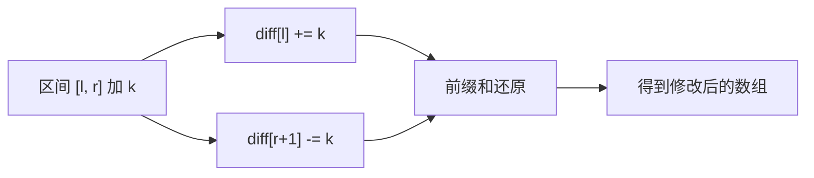

#差分数组 #前缀和

## 差分数组 (Difference Array)

相关笔记：[[prefix-sum]] | [[binary-search]]

差分数组是前缀和的逆运算。对差分数组求前缀和可以还原出原数组。常用于**区间批量修改**场景，将 O(N) 的区间加操作优化为 O(1)。

### 核心思想



### 复杂度分析

| 指标 | 复杂度 |
|:---:|:---:|
| 单次区间修改 | O(1) |
| 还原数组 | O(N) |
| Space | O(N) |

## 一维差分

### 航班预订统计

[1109. 航班预订统计](https://leetcode.cn/problems/corporate-flight-bookings/)

有 `n` 个航班，预订记录 `bookings[i] = [first, last, seats]` 表示从 `first` 到 `last` 的每个航班上预订了 `seats` 个座位。返回每个航班的预订座位总数。

思路：
1. 创建差分数组 `cnt`
2. 对每个预订 `[i, j, k]`：`cnt[i] += k`，`cnt[j+1] -= k`
3. 对差分数组求前缀和得到结果

```go
func corpFlightBookings(bookings [][]int, n int) []int {
    cnt := make([]int, n+2)
    for _, book := range bookings {
        cnt[book[0]] += book[2]
        cnt[book[1]+1] -= book[2]
    }
    // 累加前缀和
    for i := 1; i < len(cnt); i++ {
        cnt[i] += cnt[i-1]
    }
    // 提取结果
    ans := make([]int, n)
    for i := 0; i < n; i++ {
        ans[i] = cnt[i+1]
    }
    return ans
}
```

## 等差数列差分

在差分数组的基础上支持区间等差数列修改。需要两次前缀和还原。

### 原理

对区间 `[l, r]` 加上首项为 `s`、末项为 `e`、公差为 `d` 的等差数列：

```
diff[l]   += s
diff[l+1] += d - s
diff[r+1] -= d + e
diff[r+2] += e
```

两次前缀和后即可还原出原始数组。

```go
package main

import (
    "bufio"
    "fmt"
    "os"
    "strconv"
    "strings"
)

const MAXN = 10000005

var arr [MAXN]int64
var n, m int

func main() {
    scanner := bufio.NewScanner(os.Stdin)
    writer := bufio.NewWriter(os.Stdout)
    defer writer.Flush()

    for scanner.Scan() {
        inputs := strings.Fields(scanner.Text())
        n, _ = strconv.Atoi(inputs[0])
        m, _ = strconv.Atoi(inputs[1])

        for i := 0; i < m; i++ {
            scanner.Scan()
            ops := strings.Fields(scanner.Text())
            l, _ := strconv.Atoi(ops[0])
            r, _ := strconv.Atoi(ops[1])
            s, _ := strconv.Atoi(ops[2])
            e, _ := strconv.Atoi(ops[3])
            d := (e - s) / (r - l)
            set(l, r, s, e, d)
        }
        build()
        var max int64 = 0
        var xor int64 = 0
        for i := 1; i <= n; i++ {
            if arr[i] > max {
                max = arr[i]
            }
            xor ^= arr[i]
        }
        fmt.Fprintf(writer, "%d %d\n", xor, max)
    }
}

func set(l, r, s, e, d int) {
    arr[l] += int64(s)
    arr[l+1] += int64(d - s)
    arr[r+1] -= int64(d + e)
    arr[r+2] += int64(e)
}

func build() {
    for i := 1; i <= n; i++ {
        arr[i] += arr[i-1]
    }
    for i := 1; i <= n; i++ {
        arr[i] += arr[i-1]
    }
}
```
