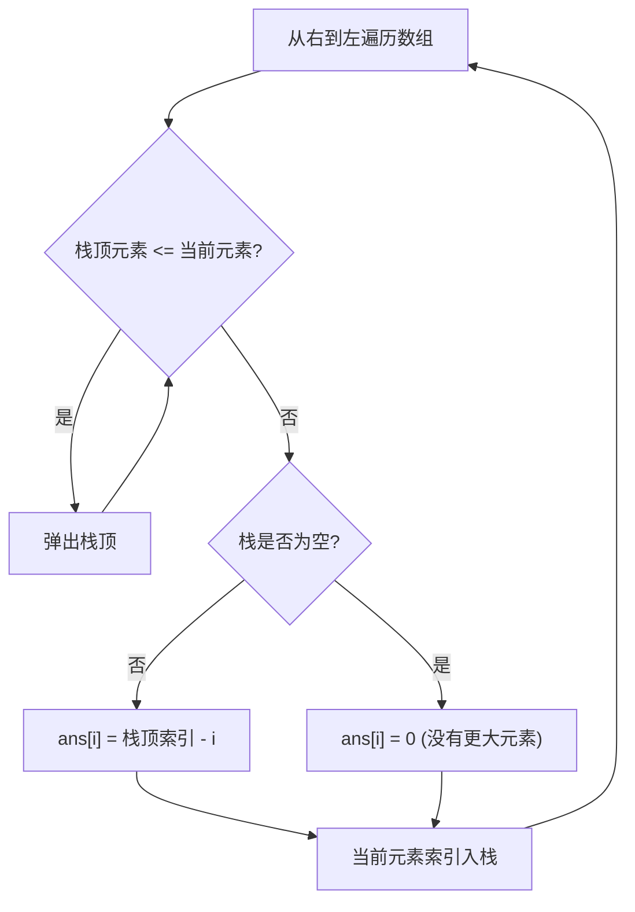

#单调栈

## 单调栈 (Monotonic Stack)

相关笔记：[[sliding-window]] | [[prefix-sum]]

单调栈是一种特殊的 stack 数据结构，栈内元素始终保持单调递增或单调递减。常用于解决 **Next Greater Element（下一个更大元素）** 类问题。

### 算法流程



### 复杂度分析

| 指标 | 复杂度 |
|:---:|:---:|
| Time | O(N)，每个元素最多入栈出栈各一次 |
| Space | O(N) |

## 例题：每日温度

[739. 每日温度](https://leetcode.cn/problems/daily-temperatures/)

给定整数数组 `temperatures` 表示每天的温度，返回一个数组 `answer`，其中 `answer[i]` 是第 `i` 天之后下一个更高温度出现在几天后。如果之后都不会升高，用 `0` 代替。

```go
func dailyTemperatures(temperatures []int) []int {
    n := len(temperatures)
    ans := make([]int, n)
    st := []int{} // 单调栈，存储索引
    for i := n - 1; i >= 0; i-- {
        t := temperatures[i]
        for len(st) > 0 && t >= temperatures[st[len(st)-1]] {
            st = st[:len(st)-1] // 弹出不满足条件的栈顶
        }
        if len(st) > 0 {
            ans[i] = st[len(st)-1] - i
        }
        st = append(st, i) // 当前索引入栈
    }
    return ans
}
```

## 面试要点

### 高频问题

**Q: 什么是单调栈？它适合解决哪类问题？**

> [!question]- 参考答案（点击展开）
>
> 单调栈是栈内元素从栈底到栈顶始终保持单调递增或单调递减的 stack 结构。它专门用于「为每个元素找到左/右侧第一个比它大（或小）的元素」这类问题，典型代表是 Next Greater Element、每日温度、柱状图最大矩形、接雨水等。核心思想是用栈维护一批「尚未找到答案」的候选下标，遇到能给候选确定答案的元素时批量出栈结算。

**Q: 单调栈的时间复杂度为什么是 O(N)？**

> [!question]- 参考答案（点击展开）
>
> 虽然代码里有嵌套循环（外层遍历 + 内层 while 出栈），但每个元素一生只会入栈一次、出栈一次，总的入栈/出栈操作次数加起来不超过 2N。因此整体是 O(N) 时间、O(N) 空间（栈最坏装下全部元素），这是典型的均摊（amortized）分析，不能简单按双重循环算成 O(N²)。

**Q: 单调递增栈和单调递减栈分别用来解决什么？怎么区分？**

> [!question]- 参考答案（点击展开）
>
> 关键看「栈底到栈顶」的单调性。维护栈底到栈顶递减的栈（入栈时把 <= 当前值的更小元素弹出），用于求下一个/上一个更大元素；维护递增栈用于求下一个/上一个更小元素。一个实用记法：要找「更大」就在入栈时把更小的弹掉，要找「更小」就把更大的弹掉，被弹出元素的答案恰好由当前元素给出。笔记里每日温度的栈 pop 完后栈顶恒大于当前值，正是一个栈底到栈顶递减的栈。

**Q: 笔记里的每日温度是从右往左遍历，能不能从左往右做？两者有什么区别？**

> [!question]- 参考答案（点击展开）
>
> 都可以。笔记的从右往左写法栈里存的是「右侧已遍历过、可能成为更大值的候选下标」，遇到当前元素时把高度 <= 它的栈顶弹掉，剩下的栈顶就是它右侧第一个更大元素，`ans[i] = 栈顶下标 - i`。从左往右写法栈里存「还没找到右侧更大元素的下标」，当 `temperatures[i] > temperatures[st.top()]` 时，当前 i 正是栈顶元素的答案，循环弹栈并填 `ans[top] = i - top`。两者复杂度一致；注意两种写法栈的语义不同，不要混用。

**Q: 出栈条件用 `>=` 还是 `>` 有区别吗？如何处理相等元素？**

> [!question]- 参考答案（点击展开）
>
> 有区别，取决于题目对「相等」的定义。每日温度求严格更高的温度，所以遇到相等值也要把它弹出（继续往后找），笔记中用 `t >= temperatures[st[len(st)-1]]` 把相等的也弹掉是正确的。如果题目改成「找下一个大于等于」当前的元素（相等也算答案），则出栈条件要收紧成严格 `t > temperatures[top]`，即相等时不再弹出。处理重复元素时这个边界最容易写错，面试时务必先确认题意再定符号。

**Q: 单调栈和滑动窗口（单调队列）有什么联系和区别？**

> [!question]- 参考答案（点击展开）
>
> 两者都靠「单调性 + 均摊 O(N)」的思想剪枝。单调栈解决「为每个位置找最近的更大/更小元素」，只在一端（栈顶）操作；单调队列（如滑动窗口最大值）需要在队首和队尾两端操作，队尾维护单调性、队首淘汰滑出窗口的元素，用来维护一个滑动窗口内的极值。可以说单调队列是单调栈在「需要从两端淘汰元素」场景下的扩展。

**Q: 用单调栈怎么解「接雨水」和「柱状图中最大的矩形」？**

> [!question]- 参考答案（点击展开）
>
> 接雨水维护一个栈底到栈顶递减的栈存下标，当遇到更高的柱子时弹栈，被弹出的柱子作为「凹槽底」，用左边新栈顶和右边当前柱子的较小高度减去底高得到水位，乘以两者下标差得到的宽度累加水量。柱状图最大矩形维护一个栈底到栈顶递增的栈，遇到更矮的柱子时弹栈，以被弹出柱子的高度为高、其左右第一个更矮柱子之间的距离为宽计算矩形面积，通常在数组两端加哨兵（高度 0）简化边界。两题都是单调栈的经典进阶应用。

### 面试加分点

- 能主动点出 O(N) 是**均摊复杂度**，并解释「每个元素入栈出栈各一次、总操作不超过 2N」的证明，而不是被双重循环吓到误答 O(N²)。
- 掌握用「栈底到栈顶的单调方向」+「找更大/更小」两个维度，快速推导该用递增还是递减栈，以及出栈条件该取 `>` 还是 `>=`（严格 vs 非严格）。
- 能把同一思想迁移到接雨水、柱状图最大矩形、子数组最小值之和（Sum of Subarray Minimums）、股票跨度（Online Stock Span）等多道题，说明单调栈是一类问题的通用模板。
- 知道处理边界时常用「哨兵元素」技巧：在数组首尾补一个极值（如柱状图补 0 高度），可以避免栈为空和末尾未结算的特判，让代码更简洁。
- 能区分单调栈与单调队列：前者只操作栈顶解决「最近更大/更小元素」，后者双端操作解决「窗口内极值」，体现对单调结构这一族算法的整体理解。
- 注意栈中存**索引而非值**的好处：既能 O(1) 取到对应高度/温度，又能直接用下标差计算「相隔几天」或「矩形宽度」，是这类题的通用工程实践。
