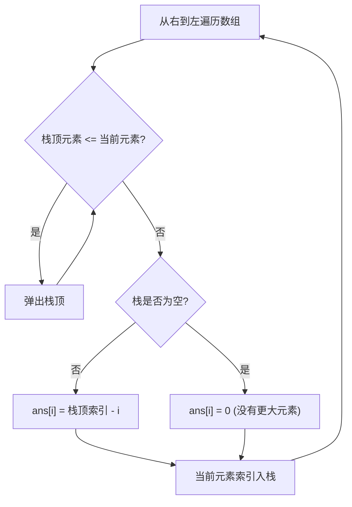

#单调栈

## 单调栈 (Monotonic Stack)

相关笔记：[[sliding-window]] | [[prefix-sum]]

单调栈是一种特殊的 stack 数据结构，栈内元素始终保持单调递增或单调递减。常用于解决 **Next Greater Element（下一个更大元素）** 类问题。

### 算法流程



### 复杂度分析

| 指标 | 复杂度 |
|:---:|:---:|
| Time | O(N)，每个元素最多入栈出栈各一次 |
| Space | O(N) |

## 例题：每日温度

[739. 每日温度](https://leetcode.cn/problems/daily-temperatures/)

给定整数数组 `temperatures` 表示每天的温度，返回一个数组 `answer`，其中 `answer[i]` 是第 `i` 天之后下一个更高温度出现在几天后。如果之后都不会升高，用 `0` 代替。

```go
func dailyTemperatures(temperatures []int) []int {
    n := len(temperatures)
    ans := make([]int, n)
    st := []int{} // 单调栈，存储索引
    for i := n - 1; i >= 0; i-- {
        t := temperatures[i]
        for len(st) > 0 && t >= temperatures[st[len(st)-1]] {
            st = st[:len(st)-1] // 弹出不满足条件的栈顶
        }
        if len(st) > 0 {
            ans[i] = st[len(st)-1] - i
        }
        st = append(st, i) // 当前索引入栈
    }
    return ans
}
```
