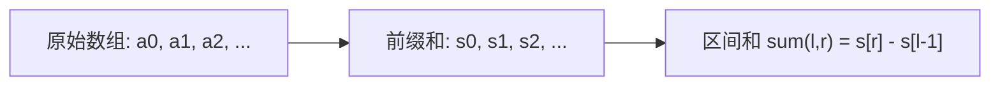

#前缀和

## 前缀和 (Prefix Sum)

相关笔记：[[diff-array]] | [[sliding-window]]

前缀和是一种预处理技术，通过预先计算数组前缀的累加和，可以在 O(1) 时间内求出任意区间的和。常与 HashMap 结合使用。

### 核心思想



### 常用技巧

- **HashMap + 前缀和**：用 map 存储前缀和首次/最后一次出现的位置
  - 最长子数组 → map 存储第一次出现的位置
  - 最短子数组 → map 存储最后一次出现的位置
- **状态压缩**：只有大小关系时可以抽象为 `[0, 1, -1]`

### 复杂度分析

| 指标 | 复杂度 |
|:---:|:---:|
| 预处理 Time | O(N) |
| 查询 Time | O(1) |
| Space | O(N) |

## 一维前缀和

### 表现良好的时间段

给你一份工作时间表 `hours`，工作小时数大于 `8` 小时的是「劳累的一天」。「表现良好的时间段」意味着「劳累的天数」严格大于「不劳累的天数」。返回最大长度。

思路：大于 8 记为 +1，否则记为 -1。问题转化为找最长的前缀和 > 0 的子数组。

```go
func longestWPI(hours []int) int {
    mp := map[int]int{}
    mp[0] = -1 // 初始前缀和为0，位置为-1
    ans := 0
    sum := 0
    for i := 0; i < len(hours); i++ {
        if hours[i] > 8 {
            sum += 1
        } else {
            sum -= 1
        }
        if sum > 0 {
            // 前缀和大于0，整段时间都是表现良好的
            ans = i + 1
        } else {
            // 前缀和小于等于0时，查找最早出现的 sum-1
            if idx, ok := mp[sum-1]; ok {
                ans = max(ans, i-idx)
            }
        }
        if _, ok := mp[sum]; !ok {
            mp[sum] = i
        }
    }
    return ans
}
```

### 移除最短子数组使和被 p 整除

给你一个正整数数组 `nums`，移除**最短**子数组使得剩余元素的和能被 `p` 整除。返回最短长度，不可行返回 `-1`。

思路：利用前缀和取模 + HashMap 记录最近出现的位置。

```go
func minSubarray(nums []int, p int) int {
    mod := 0
    for _, num := range nums {
        mod = (mod + num) % p
    }
    if mod == 0 {
        return 0
    }
    mp := map[int]int{}
    mp[0] = -1
    ans := math.MaxInt64
    for i, cur := 0, 0; i < len(nums); i++ {
        cur = (cur + nums[i]) % p
        find := 0
        if cur >= mod {
            find = cur - mod
        } else {
            find = cur + p - mod
        }
        if v, ok := mp[find]; ok {
            ans = min(ans, i-v)
        }
        mp[cur] = i
    }
    if ans == len(nums) {
        return -1
    }
    return ans
}
```

### 每个元音恰好出现偶数次的最长子串

利用 bitmask 状态压缩 + 前缀异或的思想。5 个元音字母用 5 位 bitmask 表示奇偶状态。

```go
func findTheLongestSubstring(s string) int {
    hash := [32]int{}
    for i := range hash {
        hash[i] = -2
    }
    hash[0] = -1
    ans := 0
    status := 0
    for i := 0; i < len(s); i++ {
        m := move(s[i])
        if m != -1 {
            status ^= 1 << m
        }
        if hash[status] != -2 {
            ans = max(ans, i-hash[status])
        } else {
            hash[status] = i
        }
    }
    return ans
}

func move(cha byte) int {
    switch cha {
    case 'a':
        return 0
    case 'e':
        return 1
    case 'i':
        return 2
    case 'o':
        return 3
    case 'u':
        return 4
    default:
        return -1
    }
}
```

### 删去链表中总和为零的连续节点

[1171. 从链表中删去总和值为零的连续节点](https://leetcode.cn/problems/remove-zero-sum-consecutive-nodes-from-linked-list/)

思路：前缀和 + HashMap 记录每个前缀和最后出现的节点。第二次遍历时直接跳过中间节点。

```go
type ListNode struct {
    Val  int
    Next *ListNode
}

func removeZeroSumSublists(head *ListNode) *ListNode {
    dummy := &ListNode{0, head}
    prefixSum := make(map[int]*ListNode)
    prefixSum[0] = dummy

    sum := 0
    for node := dummy; node != nil; node = node.Next {
        sum += node.Val
        prefixSum[sum] = node
    }

    sum = 0
    for node := dummy; node != nil; node = node.Next {
        sum += node.Val
        if nextNode, ok := prefixSum[sum]; ok {
            node.Next = nextNode.Next
        }
    }

    return dummy.Next
}
```

## 二维前缀和

![[二维前缀和.png]]

## 面试要点

### 高频问题

**Q: 什么是前缀和？它解决了什么问题？**
A: 前缀和是一种预处理技术，预先计算 `s[i] = a[0]+a[1]+...+a[i-1]`（前缀和数组长度为 N+1，本笔记示例采用这种「不含 `a[i]`、带哨兵 `s[0]=0`」的定义）。它把任意区间和的查询从每次 O(N) 降到 O(1)：`sum(l, r) = s[r+1] - s[l]`。代价是 O(N) 预处理时间和 O(N) 额外空间，适合**原数组不变、需要多次区间和查询**的场景；若数组会被频繁修改则应换用差分或树状数组/线段树。

**Q: 为什么前缀和数组通常要预留一个哨兵 `s[0] = 0`（或 `mp[0] = -1`）？**
A: 为了统一处理「从下标 0 开始」的区间，避免对 `l == 0` 单独写边界分支。`s[0] = 0` 表示空前缀的和，这样 `sum(0, r) = s[r+1] - s[0]` 也能套用同一公式。在 HashMap 解法中 `mp[0] = -1` 表示「前缀和 0 在起点之前（下标 -1）就已存在」，使得整段从头开始、和满足条件的子数组能被算出正确长度（`i - (-1) = i+1`）。

**Q: 前缀和 + HashMap 如何求「和为 k 的子数组」？**
A: 边遍历边维护当前前缀和 `sum`，对每个右端点查找是否存在 `sum - k` 已出现过。因为 `sum(l,r) = sum[r] - sum[l-1] = k`，即 `sum[l-1] = sum[r] - k`。**求子数组个数**时 map 累加每个前缀和的出现次数（`ans += mp[sum-k]`）；**求最长子数组**时 map 只记录每个前缀和**第一次**出现的位置（对应本笔记 `longestWPI` 里 `if !ok { mp[sum] = i }`）；**求最短子数组**时让 map 记录**最后一次**出现的位置（对应 `minSubarray` 里直接 `mp[cur] = i` 覆盖）。

**Q: 涉及「能被 p 整除」「模 m 同余」的题为什么用前缀和取模？**
A: 关键性质是 `(s[r] - s[l]) % p == 0` 等价于 `s[r] % p == s[l] % p`，即两个前缀和**同余**。所以对前缀和取模后用 HashMap 找相同余数即可。如本笔记「移除最短子数组使和被 p 整除」中，先求 `mod = total % p`，要移除的子数组余数必须等于 `mod`，于是对每个右端点查找目标余数 `(cur - mod + p) % p` 最近出现的位置（代码里用 `cur >= mod ? cur-mod : cur+p-mod` 等价实现）。

**Q: 元音偶数次、字符奇偶性这类题为什么用异或代替加法？**
A: 当只关心每个元素出现次数的**奇偶性**而非具体数值时，用 bitmask + 异或做「前缀异或」。每遇到一个元音就翻转对应位 `status ^= (1 << k)`，相同的 status 在两个位置出现，说明这段区间内每一位都被翻转了偶数次（即每个元音都出现偶数次）。这是前缀和思想在 XOR 上的推广，5 个元音用 5 位、共 32 种状态（本笔记用 `[32]int` 哈希所有状态）。

**Q: 链表「删除总和为零的连续节点」如何用前缀和做？**
A: 加 dummy 头节点 + 两次遍历。第一次遍历记录每个前缀和**最后一次**出现的节点到 map（`prefixSum[sum] = node` 覆盖）；若某前缀和在两处相等，说明这两点之间的子段和为 0。第二次遍历时，让 `node.Next` 直接指向 `prefixSum[sum].Next`，一次性跳过所有和为零的中间节点，整体 O(N)。

**Q: 二维前缀和的递推与区间和公式是什么？**
A: 定义 `S[i][j]` 为左上角到 `(i,j)` 的矩形和，递推式 `S[i][j] = S[i-1][j] + S[i][j-1] - S[i-1][j-1] + a[i][j]`（容斥，左上块被加了两次要减回去）。查询子矩阵 `(r1,c1)-(r2,c2)` 的和为 `S[r2][c2] - S[r1-1][c2] - S[r2][c1-1] + S[r1-1][c1-1]`，预处理 O(MN)、单次查询 O(1)。

### 面试加分点

- **前缀和 vs 差分**：前缀和适合**多次查询、不修改**的区间求和；差分适合**多次区间修改、最后一次性查询**，两者互为逆运算（差分数组的前缀和即还原原数组）。
- **前缀和 vs 滑动窗口**：滑动窗口依赖单调性（如元素全为正时区间和随窗口扩大单调增），前缀和 + HashMap 能处理**含负数/正负混合**的区间和问题，这是滑窗做不到的，代价是 O(N) 额外空间。
- 口诀「**最长**子数组存第一次出现、**最短**子数组存最后一次出现」是 HashMap 解法的核心，能避免大量边界 WA。
- 模运算注意负数：Go/Java 中 `a % p` 对负数会得到负余数，比较余数时要写成 `(cur - mod + p) % p` 保证落在 `[0, p)`。
- 状态压缩思想：当题目只关心大小关系或奇偶性时，可把元素抽象为 `+1/-1`（如 `longestWPI`）或 bitmask（如元音题），把复杂判定转化为标准的前缀和/前缀异或查重问题。
- 遍历时「**先查询后写入** map」还是「先写入后查询」决定了是否允许空子数组、是否允许 `l == r`，要根据题意确定顺序。
