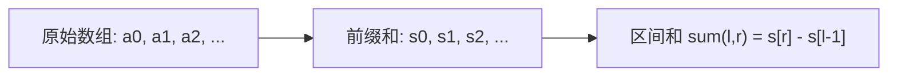

#前缀和

## 前缀和 (Prefix Sum)

相关笔记：[[diff-array]] | [[sliding-window]]

前缀和是一种预处理技术，通过预先计算数组前缀的累加和，可以在 O(1) 时间内求出任意区间的和。常与 HashMap 结合使用。

### 核心思想



### 常用技巧

- **HashMap + 前缀和**：用 map 存储前缀和首次/最后一次出现的位置
  - 最长子数组 → map 存储第一次出现的位置
  - 最短子数组 → map 存储最后一次出现的位置
- **状态压缩**：只有大小关系时可以抽象为 `[0, 1, -1]`

### 复杂度分析

| 指标 | 复杂度 |
|:---:|:---:|
| 预处理 Time | O(N) |
| 查询 Time | O(1) |
| Space | O(N) |

## 一维前缀和

### 表现良好的时间段

给你一份工作时间表 `hours`，工作小时数大于 `8` 小时的是「劳累的一天」。「表现良好的时间段」意味着「劳累的天数」严格大于「不劳累的天数」。返回最大长度。

思路：大于 8 记为 +1，否则记为 -1。问题转化为找最长的前缀和 > 0 的子数组。

```go
func longestWPI(hours []int) int {
    mp := map[int]int{}
    mp[0] = -1 // 初始前缀和为0，位置为-1
    ans := 0
    sum := 0
    for i := 0; i < len(hours); i++ {
        if hours[i] > 8 {
            sum += 1
        } else {
            sum -= 1
        }
        if sum > 0 {
            // 前缀和大于0，整段时间都是表现良好的
            ans = i + 1
        } else {
            // 前缀和小于等于0时，查找最早出现的 sum-1
            if idx, ok := mp[sum-1]; ok {
                ans = max(ans, i-idx)
            }
        }
        if _, ok := mp[sum]; !ok {
            mp[sum] = i
        }
    }
    return ans
}
```

### 移除最短子数组使和被 p 整除

给你一个正整数数组 `nums`，移除**最短**子数组使得剩余元素的和能被 `p` 整除。返回最短长度，不可行返回 `-1`。

思路：利用前缀和取模 + HashMap 记录最近出现的位置。

```go
func minSubarray(nums []int, p int) int {
    mod := 0
    for _, num := range nums {
        mod = (mod + num) % p
    }
    if mod == 0 {
        return 0
    }
    mp := map[int]int{}
    mp[0] = -1
    ans := math.MaxInt64
    for i, cur := 0, 0; i < len(nums); i++ {
        cur = (cur + nums[i]) % p
        find := 0
        if cur >= mod {
            find = cur - mod
        } else {
            find = cur + p - mod
        }
        if v, ok := mp[find]; ok {
            ans = min(ans, i-v)
        }
        mp[cur] = i
    }
    if ans == len(nums) {
        return -1
    }
    return ans
}
```

### 每个元音恰好出现偶数次的最长子串

利用 bitmask 状态压缩 + 前缀异或的思想。5 个元音字母用 5 位 bitmask 表示奇偶状态。

```go
func findTheLongestSubstring(s string) int {
    hash := [32]int{}
    for i := range hash {
        hash[i] = -2
    }
    hash[0] = -1
    ans := 0
    status := 0
    for i := 0; i < len(s); i++ {
        m := move(s[i])
        if m != -1 {
            status ^= 1 << m
        }
        if hash[status] != -2 {
            ans = max(ans, i-hash[status])
        } else {
            hash[status] = i
        }
    }
    return ans
}

func move(cha byte) int {
    switch cha {
    case 'a':
        return 0
    case 'e':
        return 1
    case 'i':
        return 2
    case 'o':
        return 3
    case 'u':
        return 4
    default:
        return -1
    }
}
```

### 删去链表中总和为零的连续节点

[1171. 从链表中删去总和值为零的连续节点](https://leetcode.cn/problems/remove-zero-sum-consecutive-nodes-from-linked-list/)

思路：前缀和 + HashMap 记录每个前缀和最后出现的节点。第二次遍历时直接跳过中间节点。

```go
type ListNode struct {
    Val  int
    Next *ListNode
}

func removeZeroSumSublists(head *ListNode) *ListNode {
    dummy := &ListNode{0, head}
    prefixSum := make(map[int]*ListNode)
    prefixSum[0] = dummy

    sum := 0
    for node := dummy; node != nil; node = node.Next {
        sum += node.Val
        prefixSum[sum] = node
    }

    sum = 0
    for node := dummy; node != nil; node = node.Next {
        sum += node.Val
        if nextNode, ok := prefixSum[sum]; ok {
            node.Next = nextNode.Next
        }
    }

    return dummy.Next
}
```

## 二维前缀和

![[二维前缀和.png]]
