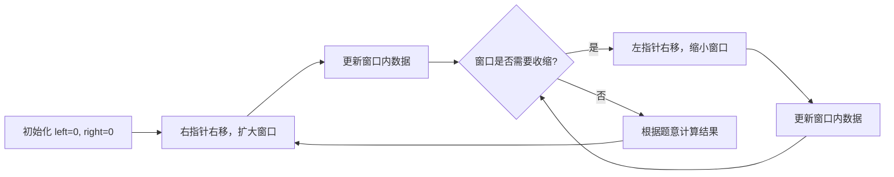

#滑动窗口

## 滑动窗口 (Sliding Window)

相关笔记：[[prefix-sum]] | [[monotonic-stack]]

滑动窗口是一种利用双指针维护一个动态区间的技巧，常用于解决子串/子数组的最优化问题。

### 算法流程



### 模版

需要变化的地方：
1. 右指针右移之后窗口数据更新
2. 判断窗口是否要收缩
3. 左指针右移之后窗口数据更新
4. 根据题意计算结果

```go
func slidingWindow(s string, t string) {
    need := make(map[byte]int)
    window := make(map[byte]int)

    for i := 0; i < len(t); i++ {
        need[t[i]]++
    }

    left, right := 0, 0
    valid := 0
    for right < len(s) {
        c := s[right] // c 是将移入窗口的字符
        // 进行窗口内数据的一系列更新 ...

        // 判断左侧窗口是否要收缩
        for windowNeedsShrink() {
            d := s[left] // d 是将移出窗口的字符
            left++
            // 进行窗口内数据的一系列更新 ...
        }
        right++
    }
}
```

### 复杂度分析

| 指标 | 复杂度 |
|:---:|:---:|
| Time | O(N)，每个元素最多被左右指针各访问一次 |
| Space | O(K)，K 为窗口内元素种类数 |

## 例题

### 无重复字符的最长子串

[3. 无重复字符的最长子串](https://leetcode.cn/problems/longest-substring-without-repeating-characters/)

给定字符串 `s`，找出不含重复字符的最长子串的长度。

```go
func lengthOfLongestSubstring(str string) int {
    s := []rune(str)
    last := make([]int, 128)
    for i := range last {
        last[i] = -1
    }
    ans := 0
    l := 0
    for r := range s {
        l = max(l, last[s[r]]+1)
        ans = max(ans, r-l+1)
        last[s[r]] = r
    }
    return ans
}
```

### 长度最小的子数组

[209. 长度最小的子数组](https://leetcode.cn/problems/minimum-size-subarray-sum/)

给定含 `n` 个正整数的数组和正整数 `target`，找出总和大于等于 `target` 的长度最小的连续子数组。

```go
func minSubArrayLen(target int, nums []int) int {
    ans := 100001
    l := 0
    r := 0
    for sum := 0; r < len(nums); r++ {
        sum += nums[r]
        for sum-nums[l] >= target {
            sum -= nums[l]
            l++
        }
        if sum >= target {
            ans = min(ans, r-l+1)
        }
    }
    if ans == 100001 {
        return 0
    }
    return ans
}
```

### 最小覆盖子串

[minimum-window-substring](https://leetcode-cn.com/problems/minimum-window-substring/)

给你字符串 S 和 T，在 S 中找出包含 T 所有字母的最小子串。

```go
func minWindow(s string, t string) string {
    ansLeft, ansRight, l := -1, len(s), 0
    var cntT, cntS [128]int
    for _, c := range t {
        cntT[c]++
    }
    for r, c := range s {
        cntS[c]++
        for isCovered(cntS[:], cntT[:]) {
            if ansRight-ansLeft > r-l {
                ansRight = r
                ansLeft = l
            }
            cntS[s[l]]--
            l++
        }
    }
    if ansLeft < 0 {
        return ""
    }
    return s[ansLeft : ansRight+1]
}

func isCovered(cntS, cntT []int) bool {
    for i := 'A'; i <= 'Z'; i++ {
        if cntS[i] < cntT[i] {
            return false
        }
    }
    for i := 'a'; i <= 'z'; i++ {
        if cntS[i] < cntT[i] {
            return false
        }
    }
    return true
}
```
