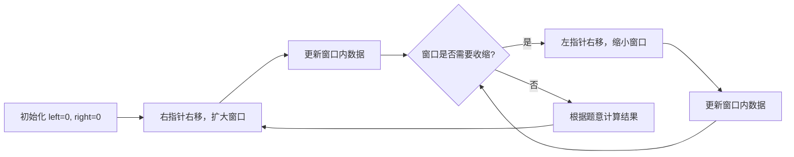

#滑动窗口

## 滑动窗口 (Sliding Window)

相关笔记：[[prefix-sum]] | [[monotonic-stack]]

滑动窗口是一种利用双指针维护一个动态区间的技巧，常用于解决子串/子数组的最优化问题。

### 算法流程



### 模版

需要变化的地方：
1. 右指针右移之后窗口数据更新
2. 判断窗口是否要收缩
3. 左指针右移之后窗口数据更新
4. 根据题意计算结果

```go
func slidingWindow(s string, t string) {
    need := make(map[byte]int)
    window := make(map[byte]int)

    for i := 0; i < len(t); i++ {
        need[t[i]]++
    }

    left, right := 0, 0
    valid := 0
    for right < len(s) {
        c := s[right] // c 是将移入窗口的字符
        // 进行窗口内数据的一系列更新 ...

        // 判断左侧窗口是否要收缩
        for windowNeedsShrink() {
            d := s[left] // d 是将移出窗口的字符
            left++
            // 进行窗口内数据的一系列更新 ...
        }
        right++
    }
}
```

### 复杂度分析

| 指标 | 复杂度 |
|:---:|:---:|
| Time | O(N)，每个元素最多被左右指针各访问一次 |
| Space | O(K)，K 为窗口内元素种类数 |

## 例题

### 无重复字符的最长子串

[3. 无重复字符的最长子串](https://leetcode.cn/problems/longest-substring-without-repeating-characters/)

给定字符串 `s`，找出不含重复字符的最长子串的长度。

```go
func lengthOfLongestSubstring(str string) int {
    s := []rune(str)
    last := make([]int, 128)
    for i := range last {
        last[i] = -1
    }
    ans := 0
    l := 0
    for r := range s {
        l = max(l, last[s[r]]+1)
        ans = max(ans, r-l+1)
        last[s[r]] = r
    }
    return ans
}
```

### 长度最小的子数组

[209. 长度最小的子数组](https://leetcode.cn/problems/minimum-size-subarray-sum/)

给定含 `n` 个正整数的数组和正整数 `target`，找出总和大于等于 `target` 的长度最小的连续子数组。

```go
func minSubArrayLen(target int, nums []int) int {
    ans := 100001
    l := 0
    r := 0
    for sum := 0; r < len(nums); r++ {
        sum += nums[r]
        for sum-nums[l] >= target {
            sum -= nums[l]
            l++
        }
        if sum >= target {
            ans = min(ans, r-l+1)
        }
    }
    if ans == 100001 {
        return 0
    }
    return ans
}
```

### 最小覆盖子串

[minimum-window-substring](https://leetcode-cn.com/problems/minimum-window-substring/)

给你字符串 S 和 T，在 S 中找出包含 T 所有字母的最小子串。

```go
func minWindow(s string, t string) string {
    ansLeft, ansRight, l := -1, len(s), 0
    var cntT, cntS [128]int
    for _, c := range t {
        cntT[c]++
    }
    for r, c := range s {
        cntS[c]++
        for isCovered(cntS[:], cntT[:]) {
            if ansRight-ansLeft > r-l {
                ansRight = r
                ansLeft = l
            }
            cntS[s[l]]--
            l++
        }
    }
    if ansLeft < 0 {
        return ""
    }
    return s[ansLeft : ansRight+1]
}

func isCovered(cntS, cntT []int) bool {
    for i := 'A'; i <= 'Z'; i++ {
        if cntS[i] < cntT[i] {
            return false
        }
    }
    for i := 'a'; i <= 'z'; i++ {
        if cntS[i] < cntT[i] {
            return false
        }
    }
    return true
}
```

## 面试要点

### 高频问题

**Q: 滑动窗口和普通双指针的区别是什么？**

> [!question]- 参考答案（点击展开）
>
> 滑动窗口是双指针的一种特例，特点是 left 和 right 都从左向右单向移动、永不回退，二者之间维护一个连续的动态区间（窗口）。普通双指针还包括对撞指针（如有序数组 two-sum 左右逼近）、快慢指针（如链表判环 Floyd）等，移动方向和语义不局限于"维护连续区间"。

**Q: 滑动窗口为什么是 O(N) 而不是 O(N²)？**

> [!question]- 参考答案（点击展开）
>
> 因为 right 只增不减、left 也只增不减，每个元素最多被 right 移入一次、被 left 移出一次，总移动次数不超过 2N。虽然代码里有嵌套 for 循环（外层 right、内层 left 收缩），但内层 left 在整个过程中累计只走 N 步，单步均摊 O(1)，所以总时间是 O(N)。这是典型的均摊（amortized）分析，不能简单看到双层循环就判定 O(N²)。

**Q: 什么时候适合用滑动窗口？关键前提是什么？**

> [!question]- 参考答案（点击展开）
>
> 适合求"连续子数组/子串"满足某条件的最优解（最长/最短/计数）。关键前提是窗口具有单调性：窗口扩大时某个指标单调变化，从而能确定"何时该收缩"。例如 LeetCode 209 要求数组元素全为正整数，sum 才随窗口扩大单调递增；若含负数，扩大窗口 sum 不再单调，就不能用滑动窗口，需改用前缀和+哈希等方法。

**Q: 滑动窗口求"最长"和求"最短"的写法有什么区别？**

> [!question]- 参考答案（点击展开）
>
> 关键是想清楚"窗口何时处于候选答案状态"。求最长（如 3 无重复字符）：在收缩循环结束、窗口重新"合法"时更新答案，因为越大越优。求最短（如 209 长度最小子数组）：要在满足条件的最小窗口处取值，因为越小越优。注意本笔记 209 的写法是先把 left 收缩到"再移出一个元素就不满足"的临界位置（`for sum-nums[l] >= target` 收缩），收缩循环结束后再用 `if sum >= target` 判断并更新答案——而非在收缩循环内部更新，这是一种把更新点放在循环外的等价变体。

**Q: 最小覆盖子串（76）如何高效判断"窗口已覆盖 T 的所有字符"？**

> [!question]- 参考答案（点击展开）
>
> 本笔记示例每次用 isCovered 扫描 A-Z、a-z 共 52 个字母逐一比较 cntS[i] >= cntT[i]，单次判断 O(Σ)（这里 Σ≈52），整体退化到 O(NΣ)。更优做法是维护一个 valid 计数和 need 哈希表：当某字符 window[c] 恰好达到 need[c] 时 valid++，当 valid 等于 need 中不同字符数时即完全覆盖，把覆盖判断降到 O(1)，整体 O(N)。这正是滑动窗口模板里 valid 变量的典型用途。

**Q: 无重复字符最长子串（3）的两种写法有何不同？**

> [!question]- 参考答案（点击展开）
>
> 本笔记用的是"记录每个字符上次出现位置 last[]"的优化写法：遇到重复字符时 `l = max(l, last[s[r]]+1)`，left 直接跳到上次出现位置的下一格，O(1) 跳跃，无需逐步收缩。另一种是标准模板写法：用 window 哈希记录字符计数，当 window[c]>1 时内层循环逐个右移 left 直到去重。两者都是 O(N)，但 last[] 写法 left 跳跃式前进、常数更小。

**Q: 窗口内数据该用什么结构维护？**

> [!question]- 参考答案（点击展开）
>
> 取决于题意。字符/小范围整数计数用定长数组（如 `[128]int`，比 map 快且无哈希开销）；任意 key 计数用 map；求窗口最值（如滑动窗口最大值 239）用单调队列 deque；求窗口中位数等用有序结构（如对顶堆或平衡 BST）。选错结构会让单步更新从 O(1) 退化，进而拖垮整体复杂度。

### 面试加分点

- 能用均摊分析（amortized analysis）解释"双重循环却是 O(N)"，并指出 left 单调不回退、累计走 N 步是关键，是面试官最想听到的复杂度论证。
- 能识别滑动窗口的适用边界：强调"窗口单调性"前提，并举反例（含负数的子数组和问题不能用滑动窗口，要退化为前缀和+哈希，或前缀和+单调队列）。
- 最小覆盖子串能把逐字符扫描的 O(NΣ) 判断优化为 O(N) 的 valid 计数法，体现对模板里"need / window / valid 三件套"的深入理解。
- 用定长数组替代 map 做字符计数（`var cntT, cntS [128]int`），能说明这是用空间换常数、避免哈希计算与扩容开销的工程优化。
- 能把滑动窗口与单调队列结合，O(N) 解决"滑动窗口最大值"（LeetCode 239），并说清窗口内维护最值不能简单计数、需要额外的单调结构。
- 清楚区分"定长窗口"（窗口大小固定，right 到位后 left 同步右移）和"变长窗口"（按条件收缩）两类题型，能据此快速套用对应模板。
