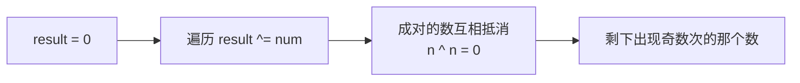

#位运算

## 异或运算 (XOR)

相关笔记：[[bitwise-and]]

### 异或运算性质

1. 异或运算就是**无进位相加**
2. 满足交换律、结合律 -- 同一批数字不管异或顺序是什么，最终结果都一样
3. `0 ^ n = n`，`n ^ n = 0`
4. 整体异或和为 `x`，某部分异或和为 `y`，则剩下部分异或和为 `x ^ y`

其中第 1 条最重要，所有其他结论都可以由此推导。第 4 条相关的题目最多，利用区间上异或和的性质。

「消消乐」是异或最经典的直觉——一组数全部异或，成对的互相抵消，剩下出现奇数次的那个（如「只出现一次的数字」）：



### Brian Kernighan 算法

提取二进制状态中最右侧的 1：`rightOne = n & (-n)`

## 题目

### 题目 1：交换两个数

不使用额外变量交换两个数：

```go
func swap(a, b *int) {
    *a = *a ^ *b
    *b = *a ^ *b
    *a = *a ^ *b
}
```

### 题目 2：不用判断语句返回最大值

利用符号位判断大小：

```go
func max(a, b int) int {
    c := a - b
    k := (c >> 31) & 1
    return a - k*c
}
```

### 题目 3：找到缺失的数字

数组 `[0, n]` 中缺失一个数，利用索引和值异或抵消：

```go
func missingNumber(nums []int) int {
    xor := 0
    for i := 0; i < len(nums); i++ {
        xor ^= i ^ nums[i]
    }
    return xor ^ len(nums)
}
```

### 题目 4：出现奇数次的数（1 种）

数组中 1 种数出现奇数次，其他数都出现偶数次。全部异或即可：

```go
func findOdd(nums []int) int {
    xor := 0
    for _, num := range nums {
        xor ^= num
    }
    return xor
}
```

### 题目 5：出现奇数次的数（2 种）

数组中有 2 种数出现奇数次。先全部异或得到两数的异或值，再用最低位的 1 将数组分成两组：

```go
func findTwoOdds(nums []int) (int, int) {
    xor := 0
    for _, num := range nums {
        xor ^= num
    }
    rightOne := xor & (-xor) // 获取最右侧的1
    onlyOne := 0
    for _, num := range nums {
        if (num & rightOne) != 0 {
            onlyOne ^= num
        }
    }
    return onlyOne, xor ^ onlyOne
}
```

### 题目 6：出现次数少于 m 次的数

数组中只有 1 种数出现次数少于 m 次，其他数都出现了 m 次。统计每一位上 1 的个数，对 m 取模即可：

```go
func findLessThanMTimes(nums []int, m int) int {
    bits := make([]int, 32)
    for _, num := range nums {
        for j := 0; j < 32; j++ {
            bits[j] += (num >> j) & 1
        }
    }
    result := 0
    for i, count := range bits {
        if count%m != 0 {
            result |= 1 << i
        }
    }
    return result
}
```

## 面试要点

### 高频问题

**Q: 为什么说异或运算的本质是「无进位相加」？这能帮我们记住哪些性质？**

> [!question]- 参考答案（点击展开）
>
> 异或对二进制每一位独立做加法但丢弃进位，所以 `0^0=0`、`1^0=1`、`0^1=1`、`1^1=0`。由这个本质能直接推出三条核心性质：`0^n=n`（和 0 相加不变）、`n^n=0`（两个相同的数每一位都是 1^1=0）、以及满足交换律和结合律（每位独立相加，顺序无关）。记住「无进位相加」一条就能现场推出其余结论。

**Q: 数组中只有一个数出现奇数次、其余都出现偶数次，怎么 O(n) 时间 O(1) 空间找出它？**

> [!question]- 参考答案（点击展开）
>
> 把所有数全部异或起来即可。出现偶数次的数两两异或抵消成 0（`n^n=0`），最后只剩那个出现奇数次的数。这利用了异或的交换律、结合律和 `n^n=0` 性质，完全不需要哈希表。

**Q: 如果有两种数各出现奇数次、其余偶数次，如何分别找出这两个数？**

> [!question]- 参考答案（点击展开）
>
> 先全部异或得到 `xor = a^b`，因为 a≠b 所以 `xor≠0`，至少有一位是 1。用 `rightOne = xor & (-xor)` 取出最低位的 1（lowbit），这一位上 a 和 b 必然不同。以这一位是否为 1 把数组分成两组，每组各含一个目标数（出现偶数次的数也会被分到某一组但成对抵消），组内再做异或即可分离出 a，另一个就是 `xor ^ a`。

**Q: `n & (-n)` 为什么能取出最右侧的 1？**

> [!question]- 参考答案（点击展开）
>
> 在补码表示下 `-n = ~n + 1`。取反后最右侧 1 那一位变 0、其右边的 0 全变 1，再加 1 会把这串变 1 的低位重新进位归 0，结果是：最右侧 1 及其右边保持原样（该位仍为 1、右边仍为 0），而该位左边全部按位取反。于是 `n` 和 `-n` 只在最右侧 1 那一位同时为 1，相与后恰好只保留这一位。这个操作通常叫 lowbit，是树状数组（Fenwick Tree）的核心；注意它与统计 1 的个数的 Brian Kernighan 算法 `n & (n-1)`（每次清掉最低位的 1）不是同一个操作。

**Q: 找缺失数字时，`i ^ nums[i]` 的思路是什么？**

> [!question]- 参考答案（点击展开）
>
> 数组有 n 个元素，下标范围是 `[0, n-1]`，而完整数值范围是 `[0, n]`。把所有下标 i 和对应值 `nums[i]` 全部异或，再异或一个 n，相当于让 `[0,n]` 的完整序列和实际出现的数两两配对抵消，没被抵消的就是缺失的那个数。同样的配对抵消思想也能处理「找数组中的重复数字」一类问题。

**Q: 不用额外变量交换两个数的写法有什么隐患？**

> [!question]- 参考答案（点击展开）
>
> 经典写法是连续三次异或赋值。隐患在于如果 a、b 指向同一块内存（同一变量自交换），第一步 `*a = *a ^ *b` 会把该地址清零（`x^x=0`），导致结果错误。实践中可读性差、对现代编译器的优化也没有帮助，面试可以讲清原理但说明工程中并不推荐。

**Q: 有一种数出现次数少于 m 次、其余都恰好出现 m 次，怎么找？**

> [!question]- 参考答案（点击展开）
>
> 异或抵消只适用于「成对」即偶数次的情况，遇到 m 次需要换思路：统计 32 位（按 32 位 int 假设，64 位应为 64）上每一位 1 出现的总次数，对 m 取模。出现 m 次的数在每一位的贡献都是 m 的倍数被模掉，剩下的模值就是那个少于 m 次的数在该位的贡献，逐位还原即可。

### 面试加分点

- 能从「无进位相加」这一本质统一推导出所有异或性质，而不是死记 `n^n=0`，体现对运算本质的理解。
- 第 4 条性质「区间/前缀异或和」是高频考点延伸：维护 `prefix[i]` 后，子数组 `[l, r]` 的异或和 = `prefix[r] ^ prefix[l-1]`，可用于「异或和为目标值的子数组」「最大异或对」（配合 Trie）等题。
- 清楚 `n & (-n)`（lowbit）依赖补码表示，在 Go 中 int 通常是 64 位，而本笔记演示代码里用 `>> 31` 或 `bits[32]` 是按 32 位 int 假设的，能指出这一边界并说明 64 位下应改为 `>> 63` 或 `bits[64]`。
- 题目 2 用 `(c >> 31) & 1` 取符号位判最大值，要点是 `a - b` 可能溢出的陷阱；进阶写法需同时考虑 a、b 的符号是否相同来规避溢出，能讲清这一点说明思考严谨。
- 出现奇数/偶数次系列（出现 1 次、3 次、奇数次、k 次）是一整类「按位统计 + 取模」的模板题，能说出「异或处理偶数次、逐位计数取模处理任意 k 次」的统一框架是加分项。
- 异或在工程中的实际应用：RAID/纠删码的奇偶校验、哈希散列、加密（一次性密码本 XOR cipher），以及竞赛中树状数组、线性基（求最大异或和）等数据结构，能联系实际更显深度。
