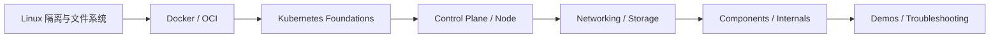

# 云原生学习索引

> ⬆ 返回 [知识库首页](../README.md)

云原生目录只按领域组织：`docker/` 负责容器与镜像基础，`kubernetes/` 负责 Kubernetes 的概念、组件、源码、排障、路线和可运行 Demo。

## 推荐顺序

## 领域入口

| 方向 | 入口 | 主要内容 |
| --- | --- | --- |
| 容器与镜像 | [Docker 笔记](docker/) | Cgroup、Namespace、UnionFS、Dockerfile、网络和镜像工具 |
| Kubernetes | [Kubernetes 学习索引](kubernetes/README.md) | 基础、控制面、节点、调度、网络、存储、扩展、源码和 Demo |

第一次学习 Kubernetes 从 [Kubernetes 基础架构](kubernetes/foundations/kubernetes-basics.md) 开始；已有使用经验、希望进入源码或平台开发，直接进入 [Kubernetes 开发路线](kubernetes/roadmaps/k8s-development-roadmap.md)。
