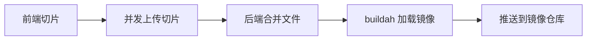
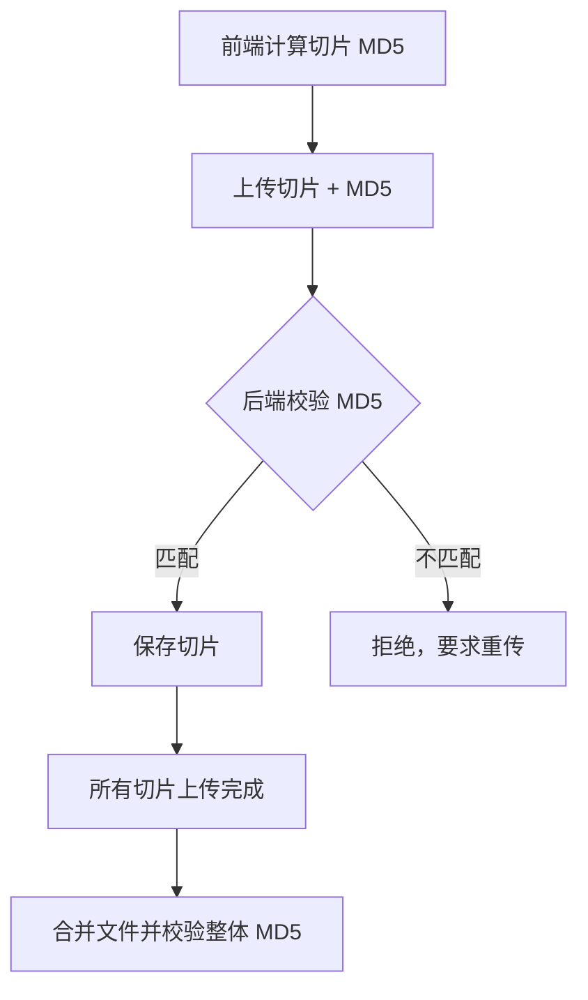
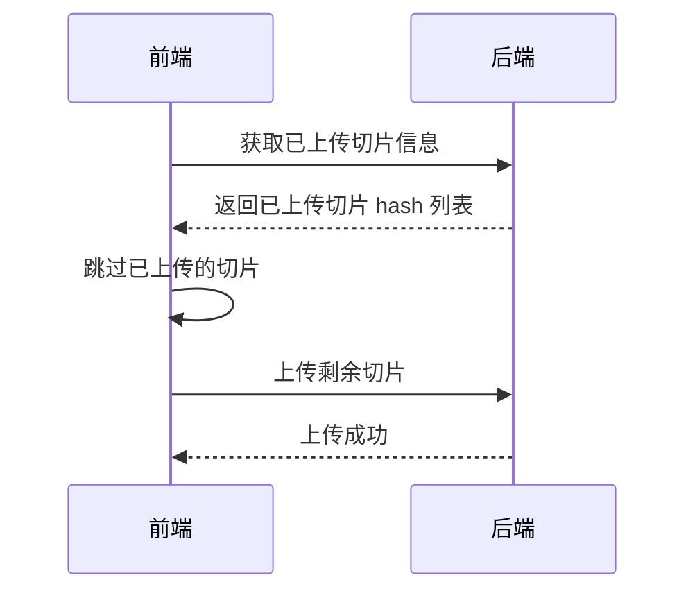

#docker #buildah

相关笔记：[[docker-basics]] | [[dockerfile]]

## 背景

在项目中，客户训练完大模型后打包成镜像（约 20G），需要通过平台上传镜像。原有版本上传功能受制于入口控制器及上层负载均衡的配置，上传大镜像会因超时失败，严重阻塞客户的正常开发流程。

## 核心难点

1. 上传大文件如何保证不超时？
2. 如何保证上传文件的唯一性？
3. 上传过程如何保证断点续传？
4. K8s 1.27 不再内置 Docker，如何适配？
5. 镜像仓库默认开启 HTTPS，如何配置证书或跳过验证？
6. 镜像上传涉及的目录是否支持挂载 PVC？

## 整体方案

大文件镜像上传需要前后端协作完成。



### 接口拆分

原有只提供一个流式上传接口，没有上传状态信息。现拆分为四个接口：

| 接口 | 用途 |
|------|------|
| 获取已上传切片信息 | 支持断点续传，返回已上传切片的 hash 列表 |
| 上传文件切片 | 接收单个切片及其元数据 |
| 合并文件并推送镜像 | 异步操作，触发合并 + 加载 + 推送 |
| 获取推送状态 | 从 Redis 获取各步骤的执行状态 |


### 切片上传

为避免大文件整体上传，前端将文件切片后逐片上传。后端按 `文件名称_切片序号` 规则保存切片。

#### 切片方式一：按固定大小 + 序号

参数：总切片数、切片序号、上传文件名称

当上传切片序号等于总切片数时，表示上传完成。


#### 切片方式二：按固定大小 + 偏移量

参数：总文件大小、切片起始位置、切片偏移量、上传文件名称

当起始位置 + 偏移量等于总文件大小时，表示上传完成。


### 文件一致性校验

切片上传无法自动保证文件一致性，需要通过信息摘要算法（MD5 / SHA256）进行校验。同时保存整个文件的 MD5 值，在合并文件时做最终校验。




MD5 计算可使用 [spark-md5](https://www.npmjs.com/package/spark-md5) 库优化性能。


### 控制上传过程

前端需要控制并发上传数量（避免浏览器资源耗尽），同时提供暂停功能。使用先进先出的有界队列实现：


```javascript
function createPromiseQueue(size, maxRetries = 3) {
    const queue = [];
    const results = [];
    let activeCount = 0;
    let totalTasks = 0;
    let completedTasks = 0;
    let resolveAll;
    const allPromise = new Promise((resolve) => {
        resolveAll = resolve;
    });

    async function enqueue(promiseGenerator) {
        totalTasks++;
        while (activeCount >= size) {
            await Promise.race(queue);
        }
        activeCount++;
        let retries = 0;
        const attemptPromise = () => {
            return promiseGenerator()
                .then((result) => {
                    results.push(result);
                    return result;
                })
                .catch((error) => {
                    if (retries < maxRetries) {
                        retries++;
                        console.log("重新尝试", retries);
                        return attemptPromise();
                    } else {
                        console.error("超过最大重试次数", error);
                        throw error;
                    }
                })
                .finally(() => {
                    activeCount--;
                    completedTasks++;
                    queue.splice(queue.indexOf(promise), 1);
                    if (completedTasks === totalTasks) {
                        resolveAll(results);
                    }
                });
        };
        const promise = attemptPromise();
        queue.push(promise);
        return promise;
    }

    async function all() {
        await allPromise;
        return results;
    }

    return { enqueue, all };
}

export default createPromiseQueue;
```

### 断点续传



- **前端方案**：保存每次上传成功的切片信息，失败后跳过已上传切片
- **后端方案**：将每份切片的 hash 值保存在后端，前端上传前先调用获取接口，跳过已存在的切片


### 合并文件

合并包含三个步骤：合并切片文件 -> 加载为镜像 -> 推送镜像。这是一个耗时较长的异步操作，通过 Redis 同步每个步骤的状态。


## 镜像工具选型

上传的镜像文件需要通过工具加载为镜像才能推送，对比了三种工具：

| 特性 | Docker | nerdctl | Buildah |
|------|--------|---------|---------|
| 主要功能 | 容器管理 | 容器管理（Docker CLI 兼容） | 镜像构建 |
| 资源占用 | 较高（需要 Daemon） | 较低（使用 containerd） | 较低（无 Daemon） |
| 证书验证 | 需要配置 | 需要配置 | 通过参数可跳过 |
| 容器内运行 | 需挂载 socket 文件 | 需挂载 socket 文件 | 无需依赖，直接运行 |
| K8s 1.27 支持 | 不支持 | 支持 | 支持 |

### 为什么选择 Buildah


[containers/buildah](https://github.com/containers/buildah/tree/main)

1. 不需要依赖后端 daemon，可直接在容器中运行，支持 OCI 和 Docker 镜像格式
2. 无后端服务，资源占用较低
3. 支持在 K8s 1.27 中以 Pod 形式运行
4. 构建和推送支持命令行参数直接跳过证书验证

### 构建 Buildah 镜像

**Alpine 版本：**

```dockerfile
FROM alpine:3.18
RUN sed -i 's/dl-cdn.alpinelinux.org/mirrors.aliyun.com/g' /etc/apk/repositories
RUN apk add iptables ip6tables cni-plugins containers-common fuse3 fuse-overlayfs buildah
RUN sed -i -e 's|#mount_program = "/usr/bin/fuse-overlayfs"|mount_program = "/usr/bin/fuse-overlayfs"|' /etc/containers/storage.conf
WORKDIR /workspace
ENTRYPOINT ["buildah"]
```

**Debian 版本：**

```dockerfile
FROM debian:11
RUN sed -i "s@http://\(deb\|security\).debian.org@http://mirrors.aliyun.com@g" /etc/apt/sources.list
RUN apt-get update && apt-get install -y fuse-overlayfs buildah
WORKDIR /workspace
ENTRYPOINT ["buildah"]
```

### Buildah 常用命令

```bash
# 拉取镜像
buildah pull --tls-verify=false harbor.com/myregistry/test:v1

# 加载本地镜像
buildah pull docker-archive:./test-v1.tar

# 构建镜像
buildah build --tls-verify=false -t harbor.com/myregistry/test:v1 -f Dockerfile .

# 推送镜像到远端仓库
buildah push harbor.com/myregistry/test:v1

# 推送镜像到本地文件
buildah push harbor.com/myregistry/test:v1 docker-archive:./test-v1.tar

# 多架构构建
buildah build --jobs=2 --platform=linux/arm64/v8,linux/amd64 \
  --manifest harbor.com/myregistry/test:v1 .

# 推送多架构信息
buildah manifest push --all harbor.com/myregistry/test:v1 \
  docker://harbor.com/myregistry/test:v1
```

### 常见问题

| 问题 | 解决方案 |
|------|---------|
| 容器内运行无法正常构建 | 使用特权模式运行，赋予网络管理、存储管理等权限 |
| 无法存储镜像 | 设置环境变量 `export BUILDAH_STORAGE=vfs` 使用兼容性更好的存储驱动 |

## 镜像存储挂载 PVC

Buildah 涉及的工作目录：

- `/var/lib/containers` — 镜像文件及相关配置
- `/var/tmp` — 加载镜像产生的临时目录，加载完成后删除

> 注意：MinIO 的对象存储无法支持 buildah 存储镜像的文件格式。hostpath、emptyDir、NFS 都能正常工作。

## 文件清理

配置定时任务每小时扫描上传文件目录，超过 6 小时的文件自动删除，防止磁盘写满。


## 遗留问题

- **并发上传**：未验证多用户同时上传大文件的场景，可能存在性能压力
- **大文件上传协议**：可研究专门支持大文件上传的协议（如 tus 协议）

## 面试要点

### 高频问题

**Q: 为什么大镜像（约 20G）上传会超时，分片上传是如何解决这个问题的？**
A: 单次流式上传整个 20G 文件，会受制于 Ingress controller、上层负载均衡（如 Nginx）的连接超时与 `client_max_body_size` 等限制，长连接极易被中断。分片上传把大文件切成多个小切片，每个切片单独发一个 HTTP 请求，单请求体积小、耗时短，不触发超时阈值；同时还能并发上传、失败重传、断点续传，整体可靠性远高于单流上传。

**Q: 分片上传如何保证文件一致性？**
A: 分片本身不能自动保证合并后文件完整。方案是双层校验：前端对每个切片计算 MD5/SHA256，上传时带上摘要，后端逐片校验，不匹配则拒绝并要求重传；同时保存整个文件的 MD5，在所有切片合并完成后做一次整体校验。前端可用 spark-md5 库分块增量计算，避免一次性读入大文件导致浏览器卡死或 OOM。

**Q: 断点续传是怎么实现的？前端方案和后端方案有什么区别？**
A: 核心是上传前先查询哪些切片已成功，跳过它们只传剩余部分。前端方案在本地（如 localStorage）记录已成功切片，刷新或断网后续传时跳过；缺点是换设备/清缓存就失效。后端方案把每个切片的 hash 保存在服务端，前端上传前调用「获取已上传切片信息」接口拿到已存在的 hash 列表，跨设备也能续传，更可靠，通常以后端为准。

**Q: 为什么选择 Buildah 而不是 Docker 或 nerdctl 来加载并推送镜像？**
A: 关键约束是 K8s 从 1.24 起移除了内置的 dockershim，节点默认运行时收敛到 containerd/CRI-O，不再内置 Docker（本项目平台基于 K8s 1.27，已是无 Docker 环境）。Buildah 是 daemonless 工具，无需常驻 daemon，可直接以普通进程/Pod 形式在容器内运行，资源占用低，支持 OCI 和 Docker 两种镜像格式；构建和推送都能通过 `--tls-verify=false` 命令行参数直接跳过证书验证，无需改全局配置。Docker 和 nerdctl 在容器内运行还需挂载 socket 依赖外部 daemon（containerd/dockerd），不适合这种「在 Pod 里临时拉起一个镜像处理任务」的场景。

**Q: 在容器内运行 Buildah 常见会遇到哪些坑？怎么解决？**
A: 一是构建/挂载失败，因为 OverlayFS 在容器内嵌套使用受限，需要以特权模式（privileged）运行并赋予网络管理、存储管理等权限，或安装 fuse-overlayfs 并在 `storage.conf` 中启用 `mount_program`；二是无法存储镜像，可把存储驱动切换到兼容性更好的 vfs（设置环境变量 `STORAGE_DRIVER=vfs`，注意笔记里写的 `BUILDAH_STORAGE=vfs` 并非真实变量名），代价是占用更多磁盘空间。

**Q: Buildah 的存储目录能挂 PVC 吗？有什么限制？**
A: Buildah 关键目录是 `/var/lib/containers`（镜像与配置）和 `/var/tmp`（加载镜像的临时目录，加载完成后删除）。hostPath、emptyDir、NFS 都能正常挂载工作；但 MinIO 这类对象存储不支持 Buildah 存储镜像所需的文件语义（如硬链接、特殊文件类型、随机写），无法直接当镜像存储后端使用。

**Q: 合并、加载、推送是耗时长的异步操作，前端怎么感知进度？**
A: 「合并文件并推送镜像」接口设计为异步触发，内部按合并切片 → 加载为镜像 → 推送仓库三步执行，每一步把状态写入 Redis；前端通过单独的「获取推送状态」接口轮询 Redis 中的步骤状态，从而展示当前进度而不必阻塞等待整个流程。

### 面试加分点

- 前端并发控制用先进先出的有界队列（信号量思想）限制同时上传的切片数，避免浏览器并发请求过多耗尽连接/内存，并内置失败重试（maxRetries），是工程上对「并发 + 容错」的典型处理。
- 理解 K8s 移除 dockershim 的背景：dockershim 在 1.20 标记弃用、1.24 正式移除，CRI 标准化后运行时收敛到 containerd/CRI-O，构建与运行解耦，因此构建侧选用 Buildah/Kaniko 这类 daemonless 工具是主流趋势。
- 镜像处理目录配套定时清理：每小时扫描上传目录，删除超过 6 小时的残留文件，防止磁盘被占满，体现对长期运行服务的资源治理意识。
- 切片完成判定有两种等价设计：按「切片序号 == 总切片数」（固定大小 + 序号），或按「起始位置 + 偏移量 == 总文件大小」（固定大小 + 偏移量），后者对最后一片不整除、动态分片更灵活。
- 多架构镜像可用 `buildah build --platform=linux/arm64/v8,linux/amd64 --manifest` 一次构建，再 `buildah manifest push --all` 推送 manifest list，对应 Docker 的 buildx + manifest 能力。
- 进一步演进可引入专门的大文件上传协议 tus（基于 HTTP 的可恢复上传标准），把断点续传、偏移协商标准化，减少自研接口的边界处理成本。
