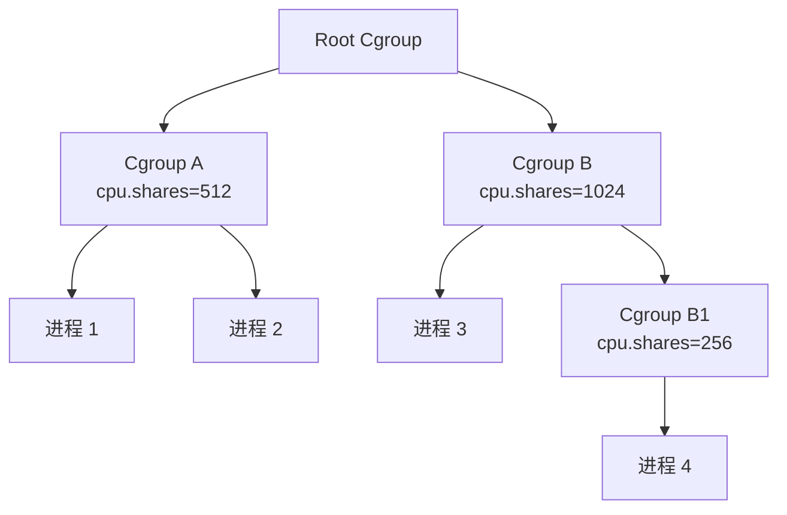
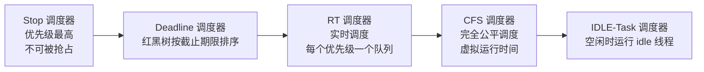
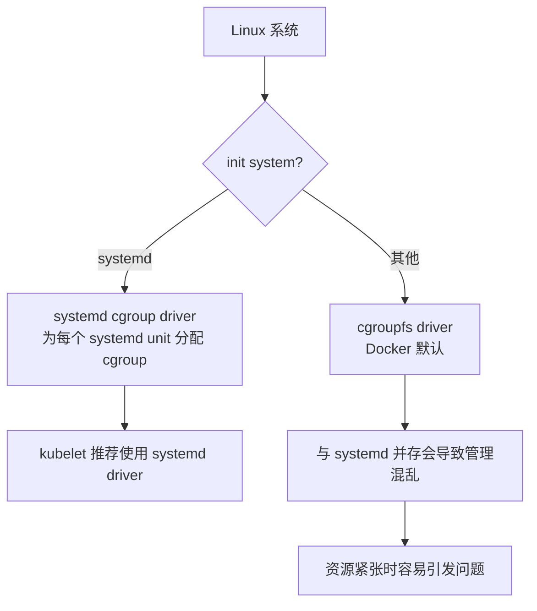

#docker #cgroup

相关笔记：[[namespace]] | [[docker-basics]]

## Cgroup 概述

Cgroup (Control Group) 是 Linux 下用于对一个或一组进程进行资源控制和监控的机制：

- 可以对 CPU 使用时间、内存、磁盘 I/O 等进程所需的资源进行限制
- 不同资源的管理由相应的 Cgroup 子系统 (Subsystem) 实现
- 针对不同类型的资源限制，只需将限制策略在不同的子系统上进行关联
- 以层级树 (Hierarchy) 的方式组织管理：子 Cgroup 受本 Cgroup 和父 Cgroup 的双重资源限制



## 子系统一览

![[可配额可度量 - Control Groups (cgroups).png]]

| 子系统 | 功能 |
|--------|------|
| `blkio` | 限制每个块设备的输入输出控制（磁盘、光盘、USB 等） |
| `cpu` | 使用调度程序为 cgroup 任务提供 CPU 访问 |
| `cpuacct` | 生成 cgroup 任务的 CPU 资源使用报告 |
| `cpuset` | 多核 CPU 下为 cgroup 任务分配单独的 CPU 和内存 |
| `devices` | 允许或拒绝 cgroup 任务对设备的访问 |
| `freezer` | 暂停和恢复 cgroup 任务 |
| `memory` | 设置每个 cgroup 的内存限制并生成内存资源报告 |
| `net_cls` | 标记每个网络包以供 cgroup 方便使用 |
| `ns` | 名称空间子系统 |
| `pid` | 进程标识子系统 |

## CPU 子系统

### 关键参数

| 参数 | 说明 |
|------|------|
| `cpu.shares` | 可出让的能获得 CPU 使用时间的相对值 |
| `cpu.cfs_period_us` | 配置时间周期长度，单位为 us（微秒） |
| `cpu.cfs_quota_us` | 当前 Cgroup 在 `cfs_period_us` 内最多能使用的 CPU 时间，单位为 us |
| `cpu.stat` | Cgroup 内进程使用的 CPU 时间统计 |

`cpu.stat` 包含：

- `nr_periods` — 经过 `cpu.cfs_period_us` 的时间周期数量
- `nr_throttled` — 在经过的周期内，因用光配额而受到限制的次数
- `throttled_time` — 进程被限制使用 CPU 的总用时，单位为 ns（纳秒）

### 示例：限制 CPU 使用

```bash
# 创建 cgroup
mkdir /sys/fs/cgroup/cpu/test_group

# 设置 CPU 配额：每 100ms 周期内最多使用 50ms CPU（相当于 0.5 核）
echo 100000 > /sys/fs/cgroup/cpu/test_group/cpu.cfs_period_us
echo 50000 > /sys/fs/cgroup/cpu/test_group/cpu.cfs_quota_us

# 将进程加入 cgroup
echo <pid> > /sys/fs/cgroup/cpu/test_group/cgroup.procs
```

## Linux 调度器

内核默认提供 5 个调度器，使用 `struct sched_class` 进行抽象：



### CFS 调度器 (Completely Fair Scheduler)

CFS 的核心思想是维护任务处理器时间方面的平衡 — 给每个进程分配相当数量的处理器时间。

通过 **虚拟运行时间 (vruntime)** 实现平衡：

```
vruntime = 实际运行时间 * 1024 / 进程权重
```

- 优先级高的进程权重大，其虚拟时钟比真实时钟跑得慢，但获得更多实际运行时间
- 当某任务的时间分配失去平衡时，优先给它分配时间让其执行

#### vruntime 红黑树

CFS 调度器维护一个以 vruntime 为顺序的红黑树（而非传统的运行队列）：

1. **自平衡** — 树上没有一条路径会比其他路径长出两倍
2. **O(log n) 时间复杂度** — 快速高效地插入或删除进程
3. 最左节点（vruntime 最小）是下一个要调度的进程

## cpuacct 子系统

用于统计 Cgroup 及其子 Cgroup 下进程的 CPU 使用情况：

- `cpuacct.usage` — 进程使用 CPU 的时间，单位为 ns（纳秒）
- `cpuacct.stat` — 进程使用的 CPU 时间，包含用户态和内核态时间

## Memory 子系统

| 参数 | 说明 |
|------|------|
| `memory.usage_in_bytes` | 当前内存使用量（含子 cgroup） |
| `memory.max_usage_in_bytes` | 历史最大内存使用量（含子 cgroup） |
| `memory.limit_in_bytes` | 内存使用上限，设为 `-1` 表示不做限制 |
| `memory.soft_limit_in_bytes` | 软限制，不阻止超限使用，但系统内存不足时优先回收超限部分 |
| `memory.oom_control` | 是否启用 OOM Killer，默认启用。超过限定值时进程会被 OOM Killer 处理 |

### 示例：限制内存

```bash
# 创建 cgroup
mkdir /sys/fs/cgroup/memory/test_group

# 设置内存上限为 256MB
echo 268435456 > /sys/fs/cgroup/memory/test_group/memory.limit_in_bytes

# 将进程加入 cgroup
echo <pid> > /sys/fs/cgroup/memory/test_group/cgroup.procs

# 查看当前内存使用
cat /sys/fs/cgroup/memory/test_group/memory.usage_in_bytes
```

## Cgroup Driver



- **systemd**：当系统使用 systemd 作为 init system 时，初始化进程生成根 cgroup 目录结构。systemd 与 cgroup 紧密结合，为每个 systemd unit 分配 cgroup。
- **cgroupfs**：Docker 默认使用 cgroupfs 作为 cgroup 驱动。

**问题**：在 systemd 系统中默认并存两套 cgroup driver，Docker 和 kubelet 管理的进程被 cgroupfs 驱动管理，而 systemd 拉起的服务由 systemd 驱动管理，让 cgroup 管理混乱。

**因此 kubelet 默认 `--cgroup-driver=systemd`，若运行时 cgroup driver 不一致，kubelet 会报错。**

## 面试要点

### 高频问题

**Q: Cgroup 是什么？它和 Namespace 的区别是什么？**

> [!question]- 参考答案（点击展开）
>
> Cgroup (Control Group) 是 Linux 内核对一个或一组进程进行资源**限制、统计与控制**的机制，管的是「能用多少」CPU、内存、磁盘 I/O 等资源。Namespace 管的是「能看到什么」，做的是**资源隔离**（让进程拥有独立的 PID、network、mount、UTS 等视图）。二者是容器实现的两大基石：Namespace 负责隔离，Cgroup 负责限额。

**Q: 容器是怎么用 Cgroup 限制 CPU 的？`cpu.shares` 和 `cpu.cfs_quota_us` 有什么区别？**

> [!question]- 参考答案（点击展开）
>
> `cpu.shares` 是**相对权重**，只在 CPU 发生竞争时按比例生效（如 512 vs 1024 即 1:2），不竞争时进程仍可占满空闲 CPU；`cpu.cfs_quota_us` 配合 `cpu.cfs_period_us` 是**绝对硬上限**，比如 period=100000us、quota=50000us 表示每 100ms 最多用 50ms CPU，即 0.5 核，超了就被 throttle。对应到 Kubernetes（cgroup v1）：`requests.cpu` 映射为 `cpu.shares`（按 1 核 = 1024 折算），`limits.cpu` 映射为 `cfs_quota/period`。

**Q: 容器被 CPU throttle 了怎么排查？**

> [!question]- 参考答案（点击展开）
>
> 看该 Cgroup 的 `cpu.stat` 文件，重点关注 `nr_throttled`（在经过的周期内因用光配额被限制的次数）和 `throttled_time`（被限制使用 CPU 的总用时，单位 ns）。如果这两个值持续增长，说明 `cpu.cfs_quota_us`（即 limit）相对负载设得偏低，进程频繁触顶被节流，需要调大 limit 或优化负载。

**Q: 容器内存超限会发生什么？OOM 是怎么触发的？**

> [!question]- 参考答案（点击展开）
>
> 内存上限由 `memory.limit_in_bytes` 控制（设为 `-1` 表示不限）。当 Cgroup 内进程使用量（`memory.usage_in_bytes`）超过该上限、且回收无法腾出空间时，若 `memory.oom_control` 启用了 OOM Killer（默认启用），内核会触发 cgroup 级 OOM Killer 杀掉该 Cgroup 内的进程。此外还有 `memory.soft_limit_in_bytes` 软限制，平时不阻止超用，仅在系统整体内存紧张时优先回收超限部分。

**Q: kubelet 的 cgroup driver 为什么要和容器运行时保持一致？**

> [!question]- 参考答案（点击展开）
>
> cgroup driver 有两种：`systemd` 和 `cgroupfs`。在以 systemd 为 init system 的机器上，systemd 自己会管理一套 cgroup 树并为每个 unit 分配 cgroup。如果 kubelet/运行时用 `cgroupfs`、systemd 用自己的 driver，就会出现两套 driver 并存、各管一摊，导致 cgroup 视图不一致、资源核算混乱，资源紧张时容易出问题。因此要求 kubelet 与容器运行时使用同一种 driver；在 systemd 机器上推荐统一为 `systemd`（kubeadm 部署默认即 systemd，虽然 kubelet 二进制的历史默认值是 `cgroupfs`）。

**Q: CFS 调度器是怎么做到「完全公平」的？vruntime 是什么？**

> [!question]- 参考答案（点击展开）
>
> CFS (Completely Fair Scheduler) 通过**虚拟运行时间 vruntime** 实现公平，公式为 `vruntime = 实际运行时间 * 1024 / 进程权重`。权重越大（优先级越高）vruntime 增长越慢，从而能获得更多实际 CPU 时间。CFS 用一棵以 vruntime 为序的红黑树替代传统运行队列，每次取**最左节点**（vruntime 最小）来调度，插入/删除均为 O(log n)。

**Q: Cgroup v1 和 v2 有什么核心区别？**

> [!question]- 参考答案（点击展开）
>
> 笔记中的目录结构（如 `/sys/fs/cgroup/cpu/...`、`/sys/fs/cgroup/memory/...`）是 **v1** 的特征——每个子系统挂载成独立的层级树，互相割裂。**v2** 改为**统一层级 (unified hierarchy)**，所有控制器挂在同一棵树下，通过 `cgroup.controllers`/`cgroup.subtree_control` 逐级启用，接口更一致（如 `memory.max`、`cpu.max`）。现代发行版和 Kubernetes 已普遍转向 v2，`systemd` driver 也更契合 v2 模型。

### 面试加分点

- **能区分相对/绝对限制**：`cpu.shares` 只在争抢时按比例生效（默认值 1024 对应 nice 0 的权重基准，是相对值而非核数），`cfs_quota/period` 才是硬天花板；把它和 K8s 的 requests（调度 + 权重）与 limits（throttle 上限）对应起来。
- **了解 throttle 带来的延迟毛刺**：CPU limit 设得过紧会导致即使整机有空闲 CPU，容器也会被节流，引发 P99 延迟抖动；可结合 `nr_throttled`/`throttled_time` 量化，部分延迟敏感场景会选择不设 CPU limit。
- **理解 Cgroup 的层级约束**：子 Cgroup 同时受本级和父级的双重限制，父级 quota 是子级的上界，这是 K8s Pod/容器两级 cgroup 嵌套核算的基础。
- **熟悉内核调度器全景**：5 个调度类按优先级 Stop > Deadline > RT > CFS > IDLE，通过 `struct sched_class` 抽象串联，普通进程走 CFS，实时任务走 RT/Deadline。
- **了解 OCI/runc 视角**：容器创建时 runc 按 OCI spec 写入对应子系统的限制文件，并把 PID 写进 `cgroup.procs`；cAdvisor/kubelet 则通过读取 `cpuacct.usage`、`memory.usage_in_bytes` 等文件采集容器资源指标。
- **能解释软硬限制配合**：`limit_in_bytes`（硬）+ `soft_limit_in_bytes`（软）+ `oom_control` 三者协作，软限制用于内存压力下的回收优先级，硬限制触顶且回收无果才 OOM。
