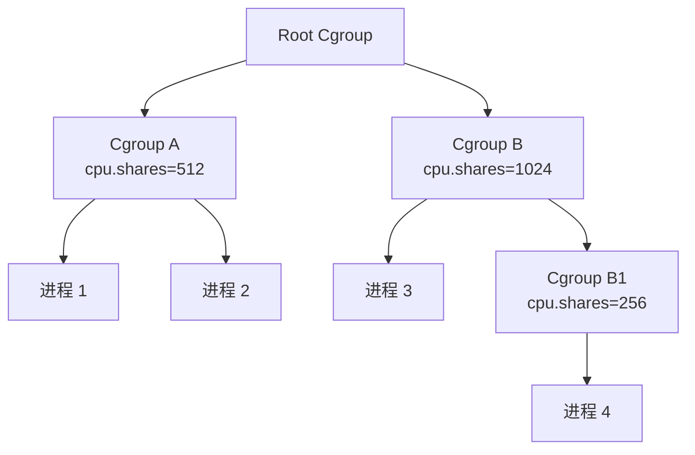
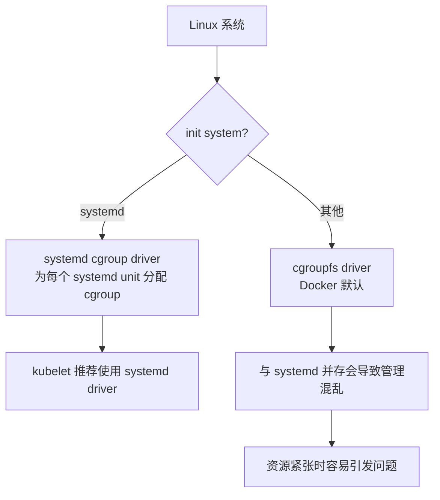

#docker #cgroup

相关笔记：[[namespace]] | [[docker-basics]]

## Cgroup 概述

Cgroup (Control Group) 是 Linux 下用于对一个或一组进程进行资源控制和监控的机制：

- 可以对 CPU 使用时间、内存、磁盘 I/O 等进程所需的资源进行限制
- 不同资源的管理由相应的 Cgroup 子系统 (Subsystem) 实现
- 针对不同类型的资源限制，只需将限制策略在不同的子系统上进行关联
- 以层级树 (Hierarchy) 的方式组织管理：子 Cgroup 受本 Cgroup 和父 Cgroup 的双重资源限制



## 子系统一览

![[可配额可度量 - Control Groups (cgroups).png]]

| 子系统 | 功能 |
|--------|------|
| `blkio` | 限制每个块设备的输入输出控制（磁盘、光盘、USB 等） |
| `cpu` | 使用调度程序为 cgroup 任务提供 CPU 访问 |
| `cpuacct` | 生成 cgroup 任务的 CPU 资源使用报告 |
| `cpuset` | 多核 CPU 下为 cgroup 任务分配单独的 CPU 和内存 |
| `devices` | 允许或拒绝 cgroup 任务对设备的访问 |
| `freezer` | 暂停和恢复 cgroup 任务 |
| `memory` | 设置每个 cgroup 的内存限制并生成内存资源报告 |
| `net_cls` | 标记每个网络包以供 cgroup 方便使用 |
| `ns` | 名称空间子系统 |
| `pid` | 进程标识子系统 |

## CPU 子系统

### 关键参数

| 参数 | 说明 |
|------|------|
| `cpu.shares` | 可出让的能获得 CPU 使用时间的相对值 |
| `cpu.cfs_period_us` | 配置时间周期长度，单位为 us（微秒） |
| `cpu.cfs_quota_us` | 当前 Cgroup 在 `cfs_period_us` 内最多能使用的 CPU 时间，单位为 us |
| `cpu.stat` | Cgroup 内进程使用的 CPU 时间统计 |

`cpu.stat` 包含：

- `nr_periods` — 经过 `cpu.cfs_period_us` 的时间周期数量
- `nr_throttled` — 在经过的周期内，因用光配额而受到限制的次数
- `throttled_time` — 进程被限制使用 CPU 的总用时，单位为 ns（纳秒）

### 示例：限制 CPU 使用

```bash
# 创建 cgroup
mkdir /sys/fs/cgroup/cpu/test_group

# 设置 CPU 配额：每 100ms 周期内最多使用 50ms CPU（相当于 0.5 核）
echo 100000 > /sys/fs/cgroup/cpu/test_group/cpu.cfs_period_us
echo 50000 > /sys/fs/cgroup/cpu/test_group/cpu.cfs_quota_us

# 将进程加入 cgroup
echo <pid> > /sys/fs/cgroup/cpu/test_group/cgroup.procs
```

## Linux 调度器

内核默认提供 5 个调度器，使用 `struct sched_class` 进行抽象：


### CFS 调度器 (Completely Fair Scheduler)

CFS 的核心思想是维护任务处理器时间方面的平衡 — 给每个进程分配相当数量的处理器时间。

通过 **虚拟运行时间 (vruntime)** 实现平衡：

```
vruntime = 实际运行时间 * 1024 / 进程权重
```

- 优先级高的进程权重大，其虚拟时钟比真实时钟跑得慢，但获得更多实际运行时间
- 当某任务的时间分配失去平衡时，优先给它分配时间让其执行

#### vruntime 红黑树

CFS 调度器维护一个以 vruntime 为顺序的红黑树（而非传统的运行队列）：

1. **自平衡** — 树上没有一条路径会比其他路径长出两倍
2. **O(log n) 时间复杂度** — 快速高效地插入或删除进程
3. 最左节点（vruntime 最小）是下一个要调度的进程

## cpuacct 子系统

用于统计 Cgroup 及其子 Cgroup 下进程的 CPU 使用情况：

- `cpuacct.usage` — 进程使用 CPU 的时间，单位为 ns（纳秒）
- `cpuacct.stat` — 进程使用的 CPU 时间，包含用户态和内核态时间

## Memory 子系统

| 参数 | 说明 |
|------|------|
| `memory.usage_in_bytes` | 当前内存使用量（含子 cgroup） |
| `memory.max_usage_in_bytes` | 历史最大内存使用量（含子 cgroup） |
| `memory.limit_in_bytes` | 内存使用上限，设为 `-1` 表示不做限制 |
| `memory.soft_limit_in_bytes` | 软限制，不阻止超限使用，但系统内存不足时优先回收超限部分 |
| `memory.oom_control` | 是否启用 OOM Killer，默认启用。超过限定值时进程会被 OOM Killer 处理 |

### 示例：限制内存

```bash
# 创建 cgroup
mkdir /sys/fs/cgroup/memory/test_group

# 设置内存上限为 256MB
echo 268435456 > /sys/fs/cgroup/memory/test_group/memory.limit_in_bytes

# 将进程加入 cgroup
echo <pid> > /sys/fs/cgroup/memory/test_group/cgroup.procs

# 查看当前内存使用
cat /sys/fs/cgroup/memory/test_group/memory.usage_in_bytes
```

## Cgroup Driver



- **systemd**：当系统使用 systemd 作为 init system 时，初始化进程生成根 cgroup 目录结构。systemd 与 cgroup 紧密结合，为每个 systemd unit 分配 cgroup。
- **cgroupfs**：Docker 默认使用 cgroupfs 作为 cgroup 驱动。

**问题**：在 systemd 系统中默认并存两套 cgroup driver，Docker 和 kubelet 管理的进程被 cgroupfs 驱动管理，而 systemd 拉起的服务由 systemd 驱动管理，让 cgroup 管理混乱。

**因此 kubelet 默认 `--cgroup-driver=systemd`，若运行时 cgroup driver 不一致，kubelet 会报错。**
