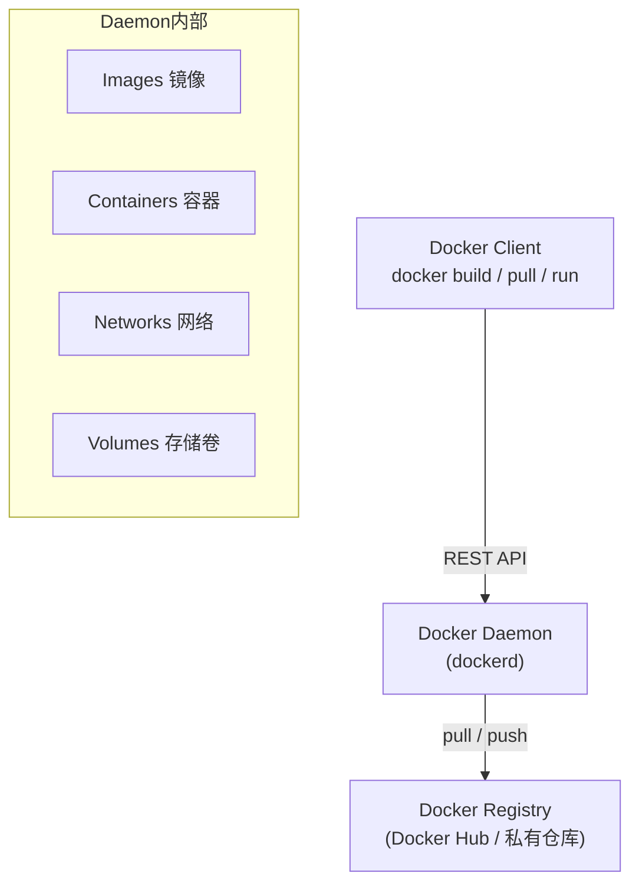
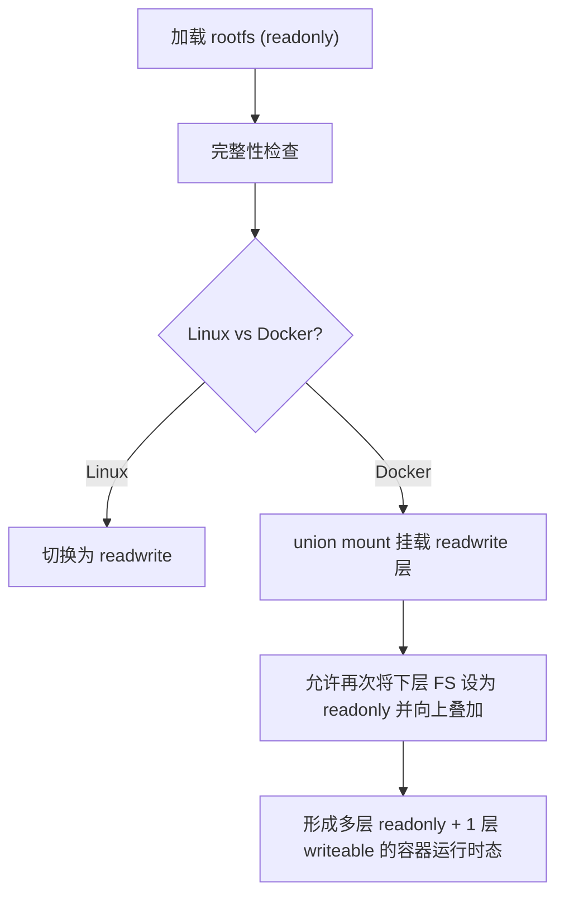
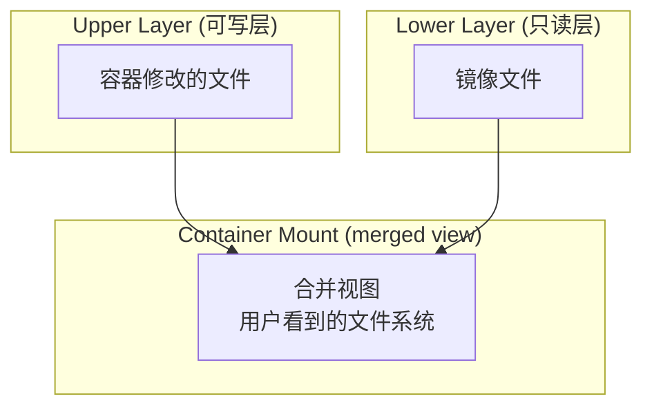
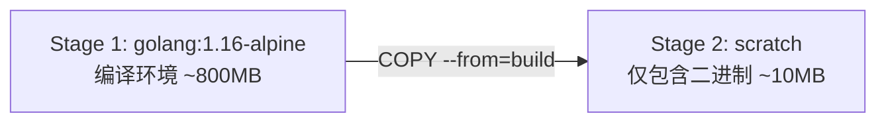

#docker

相关笔记：[[kubernetes-basics]] | [[dockerfile]] | [[docker-commands]] | [[cgroup]] | [[namespace]] | [[union-fs]]

## Docker 概述

Docker 是基于 Linux 内核的 [[cgroup]]、[[namespace]] 以及 [[union-fs]] 等技术，对进程进行封装隔离的操作系统层面虚拟化技术。由于隔离的进程独立于宿主和其它隔离进程，因此也称其为容器。

- 最初基于 LXC 实现，从 0.7 版本开始去除 LXC，转而使用自行开发的 Libcontainer
- 从 1.11 版本开始进一步演进为使用 runC 和 Containerd
- 在容器的基础上进行了进一步封装（文件系统、网络互联、进程隔离等），使得 Docker 比虚拟机更轻便快捷

### Docker 架构



## 容器镜像

Docker 主要采取增量分发的策略来解决文件分发问题。

![[容器镜像.png]]

## Docker 的文件系统

典型的 Linux 文件系统组成：

- **Bootfs (boot file system)**
  - Bootloader — 引导加载 kernel
  - Kernel — 当 kernel 被加载到内存中后 umount bootfs
- **rootfs (root file system)**
  - `/dev`、`/proc`、`/bin`、`/etc` 等标准目录和文件
  - 对于不同的 Linux 发行版，bootfs 基本一致，但 rootfs 会有差别

### Docker 启动流程



- **Linux 启动**：将 rootfs 设置为 readonly，进行一系列检查，然后切换为 readwrite 供用户使用
- **Docker 启动**：将 rootfs 以 readonly 方式加载并检查，然后利用 union mount 将一个 readwrite 文件系统挂载在 readonly 的 rootfs 之上，每一个 FS 被称作一个 FS 层

### 写操作

由于镜像具有共享特性，对容器可写层的操作依赖存储驱动提供的写时复制和用时分配机制：

- **写时复制 (Copy-on-Write)**：一个镜像可以被多个容器使用，不需要在内存和磁盘上做多个拷贝。需要修改时，文件从镜像层复制到容器可写层进行修改，镜像里的文件不变。不同容器的修改相互独立、互不影响。
- **用时分配 (Allocate-on-Demand)**：按需分配空间，当文件被创建出来后才会分配空间。

[[docker-commands]]

### 容器存储驱动

![[容器存储驱动.png]]
![[容器存储驱动比较.png]]

#### 以 OverlayFS 为例

OverlayFS 是一种与 AUFS 类似的联合文件系统，属于文件级存储驱动，包含最初的 Overlay 和更新更稳定的 overlay2。

**Overlay 只有两层：upper 层和 lower 层。Lower 层代表镜像层，upper 层代表容器可写层。**

![[容器和overlayFS视图.png]]



查找逻辑：如果 upper 层有文件则直接使用，没有则从 lower 层拉取。

### OCI 容器标准

Open Container Initiative (OCI) 组织于 2015 年创建，致力于定义容器镜像标准和运行时标准。

OCI 定义了三个规范：
- **Runtime Specification (运行时标准)** — 定义如何解压应用包并运行
- **Image Specification (镜像标准)** — 定义应用如何打包
- **Distribution Specification (分发标准)** — 定义如何分发容器镜像

## Docker 网络

### 单主机网络

| 模式 | 说明 |
|------|------|
| [[network-null]] (`--net=none`) | 把容器放入独立的网络空间但不做任何网络配置，用户需手动配置 |
| Host (`--net=host`) | 使用主机网络命名空间，复用主机网络 |
| Container | 重用其他容器的网络 |
| [[network-bridge]] (`--net=bridge`) | 使用 Linux 网桥和 iptables 提供容器互联，通过 veth pair 连接 |

![[查看容器网络.jpg]]

### 跨主机网络

| 模式 | 说明 |
|------|------|
| Overlay (libnetwork, libkv) | 通过网络封包实现 |
| [[network-underlay]] | 使用现有底层网络，为每个容器配置可路由的网络 IP |
| Overlay | 通过网络封包实现 |

## 理解构建上下文 (Build Context)

- 运行 `docker build` 时，当前工作目录被称为构建上下文
- 默认查找当前目录的 Dockerfile 作为构建输入，也可通过 `-f` 指定：
  ```bash
  docker build -f ./Dockerfile
  ```
- 构建时首先会把构建上下文传输给 docker daemon，包含无用文件会导致传输时间长、资源消耗多、镜像体积大
- 可通过 `.dockerignore` 文件排除不需要的文件
- **最佳实践**：创建专门目录放置 Dockerfile，在该目录中运行 `docker build`

### Build Cache

构建镜像时，Docker 依次读取 Dockerfile 中的指令并按顺序执行。Docker 会先判断缓存中是否有可用的已存镜像，只有不存在时才会重新构建：

- 通常简单判断 Dockerfile 中的指令与镜像是否匹配
- 针对 `ADD` 和 `COPY` 指令，Docker 计算每个文件内容的 checksum 与现存镜像比较
- 其他指令（如 `RUN apt-get -y update`），简单比较指令字串是否一致
- **当某一层 cache 失效后，所有后续层级的 cache 均一并失效，后续指令都重新构建**

### 多段构建 (Multi-stage Build)

有效减少镜像层级的方式：

```dockerfile
# 第一阶段：编译
FROM golang:1.16-alpine AS build
RUN apk add --no-cache git
RUN go get github.com/golang/dep/cmd/dep

COPY Gopkg.lock Gopkg.toml /go/src/project/
WORKDIR /go/src/project/
RUN dep ensure -vendor-only

COPY . /go/src/project/
RUN go build -o /bin/project  # 只有这个二进制文件是产线需要的

# 第二阶段：运行
FROM scratch
COPY --from=build /bin/project /bin/project
ENTRYPOINT ["/bin/project"]
CMD ["--help"]
```



## [[dockerfile]]

常用指令速查：

| 指令 | 用途 | 示例 |
|------|------|------|
| `FROM` | 选择基础镜像（推荐 alpine） | `FROM [--platform=<platform>] <image>[@<digest>] [AS <name>]` |
| `LABEL` | 按标签组织项目 | `LABEL version="1.0" maintainer="dev@example.com"` |
| `RUN` | 执行命令 | `RUN apt-get update && apt-get install -y curl` |
| `CMD` | 容器默认运行命令 | `CMD ["executable","param1","param2"]` |
| `EXPOSE` | 声明端口 | `EXPOSE 80/tcp` |
| `ENV` | 设置环境变量 | `ENV KEY=value` |
| `ADD` | 复制文件（支持 URL 和解压） | `ADD [--chown=<user>:<group>] <src> <dest>` |
| `COPY` | 复制本地文件（推荐） | `COPY [--chown=<user>:<group>] <src> <dest>` |
| `ENTRYPOINT` | 容器入口命令 | `ENTRYPOINT ["executable","param1"]` |
| `VOLUME` | 定义外挂存储卷 | `VOLUME ["/data"]` |
| `USER` | 切换运行用户 | `USER <user>[:<group>]` |
| `WORKDIR` | 切换工作目录 | `WORKDIR /app` |

### ADD vs COPY 区别

- `COPY` 只支持本地文件复制，不支持 URL，不解压文件，语义更直白
- `ADD` 支持 URL 下载和自动解压本地压缩文件
- `COPY` 可用于多阶段构建：`COPY --from=build /bin/project /bin/project`
- **复制本地文件时优先使用 `COPY`**

### ENTRYPOINT 最佳实践

用 `ENTRYPOINT` 定义主命令，`CMD` 定义默认参数：

```dockerfile
ENTRYPOINT ["s3cmd"]
CMD ["--help"]
```

### 其他指令

`ARG` | `ONBUILD` | `STOPSIGNAL` | `HEALTHCHECK` | `SHELL`
