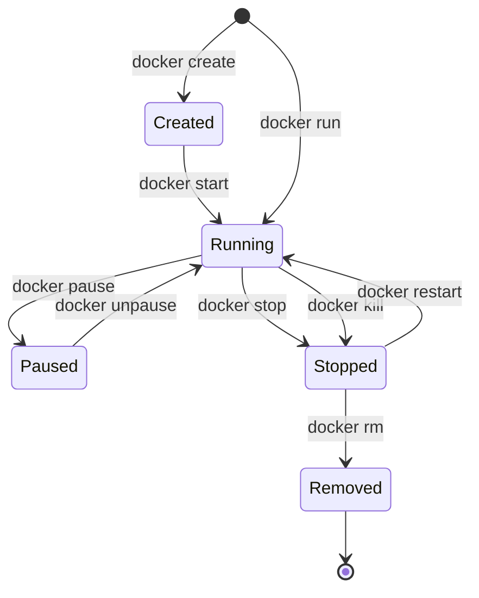

#docker #docker常用

相关笔记：[[docker-basics]] | [[dockerfile]]

## Docker 常用命令

### 镜像管理

```bash
# 拉取镜像
docker pull <image>:<tag>

# 查看本地镜像
docker images

# 按标签过滤镜像
docker images -f label=<key>=<value>

# 构建镜像
docker build -t <name>:<tag> -f Dockerfile .

# 删除镜像
docker rmi <image_id>

# 导出/导入镜像
docker save -o image.tar <image>:<tag>
docker load -i image.tar
```

### 容器生命周期



```bash
# 创建并启动容器
docker run -d --name <name> -p <host_port>:<container_port> <image>

# 进入运行中的容器
docker exec -it <container_id> /bin/bash

# 查看运行中的容器
docker ps
docker ps -a  # 包含已停止的容器

# 停止/删除容器
docker stop <container_id>
docker rm <container_id>

# 查看容器日志
docker logs -f <container_id>

# 查看容器详细信息
docker inspect <container_id>
```

### 网络管理

```bash
# 创建网络
docker network create <network_name>
docker network create <network_name> --driver bridge

# 查看网络
docker network ls

# 将容器连接到网络
docker run --network=<network_name> <image>
```

### 数据卷

```bash
# 挂载主机目录
docker run -v /host/path:/container/path <image>

# 使用命名卷
docker volume create <volume_name>
docker run -v <volume_name>:/container/path <image>
```

---

## 常用服务部署示例

### Elasticsearch + Kibana

```bash
docker network create elastic

# 启动 Elasticsearch
docker run --name elasticsearch \
  --net elastic \
  -p 9200:9200 \
  -e discovery.type=single-node \
  -e "ES_JAVA_OPTS=-Xms1g -Xmx1g" \
  -e xpack.security.enabled=false \
  -d docker.elastic.co/elasticsearch/elasticsearch:8.6.0

# 启动 Kibana
docker run --name kibana \
  --net elastic \
  -p 5601:5601 \
  -d docker.elastic.co/kibana/kibana:8.6.0
```

### Portainer (容器管理 UI)

```bash
docker run -d --restart=always --name portainer \
  -p 9000:9000 \
  -v /var/run/docker.sock:/var/run/docker.sock \
  portainer/portainer
```

### Lazydocker (终端 UI)

```bash
docker run --rm -it \
  -v /var/run/docker.sock:/var/run/docker.sock \
  -v /yourpath:/.config/jesseduffield/lazydocker \
  lazyteam/lazydocker
```

### Kafka + Zookeeper

```bash
# 拉取镜像
docker pull zookeeper
docker pull wurstmeister/kafka

# 创建网络
docker network create zeroim --driver bridge

# 启动 Zookeeper
docker run -d --name zookeeper \
  --network zeroim \
  -p 2181:2181 \
  zookeeper

# 启动 Kafka
docker run -d --name kafka \
  --network zeroim \
  -p 9092:9092 \
  -e KAFKA_BROKER_ID=0 \
  -e KAFKA_ZOOKEEPER_CONNECT=zookeeper:2181 \
  -e KAFKA_ADVERTISED_LISTENERS=PLAINTEXT://localhost:9092 \
  -e KAFKA_LISTENERS=PLAINTEXT://0.0.0.0:9092 \
  wurstmeister/kafka

# 进入 Kafka 容器操作 topic
docker exec -it <container_id> /bin/bash
cd /opt/kafka/bin

# 创建 topic
./kafka-topics.sh --create --topic my-topic --bootstrap-server localhost:9092

# 生产消息
./kafka-console-producer.sh --topic my-topic --bootstrap-server localhost:9092

# 消费消息
./kafka-console-consumer.sh --topic my-topic --from-beginning --bootstrap-server localhost:9092
```

## 面试要点

### 高频问题

**Q: `docker run` 和 `docker start` 有什么区别？`docker create` 又是做什么的？**

> [!question]- 参考答案（点击展开）
>
> `docker create` 仅根据镜像创建一个处于 Created 状态的容器但不启动，`docker start` 用于启动一个已存在（已停止或刚创建）的容器，而 `docker run` 等价于 `docker create + docker start`，既创建又启动，是最常用的命令。`docker run` 还支持 `-d`（后台运行）、`-p`（端口映射）、`--name`（命名）等参数。

**Q: `docker stop` 和 `docker kill` 有什么区别？**

> [!question]- 参考答案（点击展开）
>
> `docker stop` 先向容器主进程（PID 1）发送 `SIGTERM`，给应用优雅退出的机会，默认等待 10 秒（可用 `-t`/`--time` 调整）后仍未退出才发 `SIGKILL`；`docker kill` 默认直接发送 `SIGKILL` 强制终止，不给优雅关闭的机会（也可用 `--signal` 指定其他信号）。生产中优先用 `docker stop` 让应用做清理。

**Q: `-v /host/path:/container/path` 和命名卷（named volume）有什么区别，分别适合什么场景？**

> [!question]- 参考答案（点击展开）
>
> 前者是 bind mount，直接把宿主机指定目录挂进容器，路径由用户完全控制，适合开发时挂源码、共享宿主机文件；命名卷由 Docker 通过 `docker volume create` 管理，存储在 Docker 数据目录（如 `/var/lib/docker/volumes`）下，跨容器复用、迁移和备份更方便，适合数据库等持久化数据。命名卷在首次把空卷挂载到容器内非空目录时还会自动把镜像里该目录的原有内容复制进卷（bind mount 没有这一行为，会直接遮盖目标目录）。

**Q: `docker exec -it` 中的 `-i` 和 `-t` 分别是什么意思？它和 `docker attach` 有何不同？**

> [!question]- 参考答案（点击展开）
>
> `-i`（interactive）保持 STDIN 打开，使你能向容器输入；`-t`（tty）分配一个伪终端，使输出带有终端格式（如可交互的 shell 提示符），两者常组合用于进入 shell。`docker exec` 是在运行中的容器里**新起一个进程**（如 `/bin/bash`），退出不影响容器主进程；`docker attach` 是接管容器主进程（PID 1）的 STDIN/STDOUT/STDERR，误操作 Ctrl+C 把信号转发给主进程可能直接杀掉容器。

**Q: 为什么很多容器管理工具（如 Portainer、Lazydocker）要挂载 `/var/run/docker.sock`？这有什么安全风险？**

> [!question]- 参考答案（点击展开）
>
> `docker.sock` 是 Docker daemon 的 Unix socket，Docker CLI 正是通过它与 daemon 通信。把它挂进容器后，容器内进程就能直接调用 Docker API 管理宿主机上的所有容器和镜像。风险在于：容器一旦被攻破，攻击者等同于拿到宿主机 root 权限（可启动特权容器并挂载宿主机根目录），因此生产中要严格控制能挂载它的容器，或改用 socket 代理做 API 白名单限制。

**Q: `docker save`/`docker load` 和 `docker export`/`docker import` 有什么区别？**

> [!question]- 参考答案（点击展开）
>
> `docker save`/`load` 操作的是**镜像**，会保留完整的镜像分层（layers）和元数据（构建历史、标签），适合离线传输镜像；`docker export`/`import` 操作的是**容器**文件系统，会把容器打平成单层、丢弃所有镜像历史和分层信息（且不含数据卷内容）。需要完整迁移镜像时用 save/load。

**Q: `docker logs` 默认从哪里读取日志？为什么有些时候 `docker logs` 看不到应用日志？**

> [!question]- 参考答案（点击展开）
>
> 默认情况下 Docker 使用 `json-file` 日志驱动，`docker logs` 读取的是容器主进程（PID 1）的 STDOUT/STDERR。如果应用把日志写到了容器内的文件而非标准输出，`docker logs` 就看不到；同样如果配置了 `none`、`syslog` 等其他 logging driver，本地 `docker logs` 也可能无法读取（`json-file`/`journald`/`local` 等少数驱动才支持 `docker logs`）。容器化最佳实践是让应用日志输出到 stdout/stderr。

### 面试加分点

- 能说清 `docker run` 后台容器立即退出的常见原因：容器主进程（PID 1）退出，容器就退出。前台进程跑完即结束，需要让主进程持续在前台运行（如 `nginx -g 'daemon off;'`），不能靠 `-d` 把一个会自然退出的命令变成长驻服务。
- 理解 `docker stop` 的 `SIGTERM` 只发给 PID 1：如果用 shell 脚本作为启动命令而没用 `exec`，信号会被 shell 拦截传不到真正的应用进程，导致优雅退出失效，应在 Dockerfile 用 exec 形式的 `ENTRYPOINT`/`CMD`，或加 `--init`/tini 处理僵尸进程回收与信号转发。
- 了解 Kafka 示例中 `KAFKA_ADVERTISED_LISTENERS` 的坑：它决定了 broker 返回给客户端用于回连的地址，配成 `localhost` 只能本机客户端访问，跨主机或容器互联时必须配成实际可达的主机名/IP，否则客户端首次连上后会拿着返回的 `localhost` 再去连而失败。
- 清楚自定义 bridge 网络相比默认 bridge 的优势：用 `docker network create` 创建的用户自定义网络内置嵌入式 DNS，同网络容器之间可直接用容器名互相访问（如示例里 Kafka 用 `KAFKA_ZOOKEEPER_CONNECT=zookeeper:2181` 连 Zookeeper，Kibana 默认通过 `http://elasticsearch:9200` 回连 ES），而默认 bridge 网络不解析容器名，只能靠已废弃的 `--link` 或 IP。
- 知道 `docker images -f label=...` 依赖镜像构建时通过 Dockerfile 的 `LABEL` 写入的元数据，配合 OCI 规范的标准 label（如 `org.opencontainers.image.*`）可做镜像治理与过滤。
- 注意 `docker rmi` 删除镜像前需先删除依赖它的容器（或用 `-f` 强制），且镜像被多个 tag 引用时删 tag 只是解除引用、不会真正删除底层 layer，理解镜像分层的引用计数有助于排查"删了还在占空间"的问题（可用 `docker image prune` 清理悬空层）。
