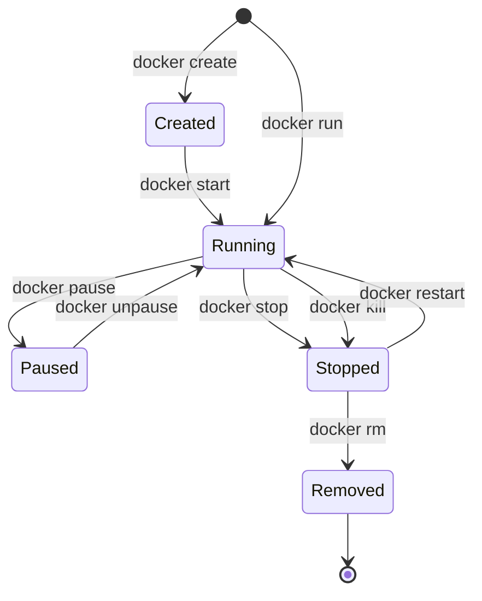

#docker #docker常用

相关笔记：[[docker-basics]] | [[dockerfile]]

## Docker 常用命令

### 镜像管理

```bash
# 拉取镜像
docker pull <image>:<tag>

# 查看本地镜像
docker images

# 按标签过滤镜像
docker images -f label=<key>=<value>

# 构建镜像
docker build -t <name>:<tag> -f Dockerfile .

# 删除镜像
docker rmi <image_id>

# 导出/导入镜像
docker save -o image.tar <image>:<tag>
docker load -i image.tar
```

### 容器生命周期



```bash
# 创建并启动容器
docker run -d --name <name> -p <host_port>:<container_port> <image>

# 进入运行中的容器
docker exec -it <container_id> /bin/bash

# 查看运行中的容器
docker ps
docker ps -a  # 包含已停止的容器

# 停止/删除容器
docker stop <container_id>
docker rm <container_id>

# 查看容器日志
docker logs -f <container_id>

# 查看容器详细信息
docker inspect <container_id>
```

### 网络管理

```bash
# 创建网络
docker network create <network_name>
docker network create <network_name> --driver bridge

# 查看网络
docker network ls

# 将容器连接到网络
docker run --network=<network_name> <image>
```

### 数据卷

```bash
# 挂载主机目录
docker run -v /host/path:/container/path <image>

# 使用命名卷
docker volume create <volume_name>
docker run -v <volume_name>:/container/path <image>
```

---

## 常用服务部署示例

### Elasticsearch + Kibana

```bash
docker network create elastic

# 启动 Elasticsearch
docker run --name elasticsearch \
  --net elastic \
  -p 9200:9200 \
  -e discovery.type=single-node \
  -e "ES_JAVA_OPTS=-Xms1g -Xmx1g" \
  -e xpack.security.enabled=false \
  -d docker.elastic.co/elasticsearch/elasticsearch:8.6.0

# 启动 Kibana
docker run --name kibana \
  --net elastic \
  -p 5601:5601 \
  -d docker.elastic.co/kibana/kibana:8.6.0
```

### Portainer (容器管理 UI)

```bash
docker run -d --restart=always --name portainer \
  -p 9000:9000 \
  -v /var/run/docker.sock:/var/run/docker.sock \
  portainer/portainer
```

### Lazydocker (终端 UI)

```bash
docker run --rm -it \
  -v /var/run/docker.sock:/var/run/docker.sock \
  -v /yourpath:/.config/jesseduffield/lazydocker \
  lazyteam/lazydocker
```

### Kafka + Zookeeper

```bash
# 拉取镜像
docker pull zookeeper
docker pull wurstmeister/kafka

# 创建网络
docker network create zeroim --driver bridge

# 启动 Zookeeper
docker run -d --name zookeeper \
  --network zeroim \
  -p 2181:2181 \
  zookeeper

# 启动 Kafka
docker run -d --name kafka \
  --network zeroim \
  -p 9092:9092 \
  -e KAFKA_BROKER_ID=0 \
  -e KAFKA_ZOOKEEPER_CONNECT=zookeeper:2181 \
  -e KAFKA_ADVERTISED_LISTENERS=PLAINTEXT://localhost:9092 \
  -e KAFKA_LISTENERS=PLAINTEXT://0.0.0.0:9092 \
  wurstmeister/kafka

# 进入 Kafka 容器操作 topic
docker exec -it <container_id> /bin/bash
cd /opt/kafka/bin

# 创建 topic
./kafka-topics.sh --create --topic my-topic --bootstrap-server localhost:9092

# 生产消息
./kafka-console-producer.sh --topic my-topic --bootstrap-server localhost:9092

# 消费消息
./kafka-console-consumer.sh --topic my-topic --from-beginning --bootstrap-server localhost:9092
```
