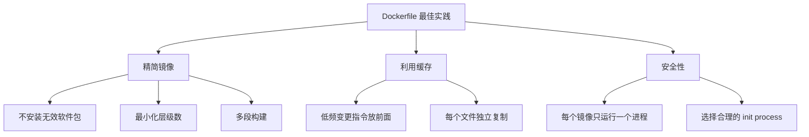
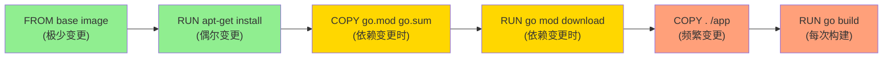

#docker #dockerfile

相关笔记：[[docker-basics]] | [[docker-commands]]

## Dockerfile 最佳实践

### 核心原则



### 1. 精简镜像体积

- **不要安装无效软件包** — 只安装运行时必需的依赖
- **最小化层级数**
  - 最新版 Docker 只有 `RUN`、`COPY`、`ADD` 创建新层，其他指令创建临时层，不会增加镜像大小
  - 多条 `RUN` 命令可通过 `&&` 连接成一条指令以减少层数
  - 通过多段构建 (multi-stage build) 减少镜像层数

### 2. 简化进程数

- 理想状况下，每个镜像应该只有一个进程
- 当无法避免同一镜像运行多进程时，应选择合理的初始化进程 (init process)
  - 如 `tini` 或 `dumb-init`

### 3. 利用 Build Cache

- 把变更频率低的指令优先构建，放在镜像底层，以有效利用 build cache
- 复制文件时，每个文件应独立复制，确保某个文件变更时只影响该文件对应的缓存
- 把多行参数按字母排序，减少重复参数并提高可读性

### 4. 示例：优化前后对比

```dockerfile
# 不推荐：缓存利用率低，层数多
FROM ubuntu:22.04
RUN apt-get update
RUN apt-get install -y curl
RUN apt-get install -y git
COPY . /app
```

```dockerfile
# 推荐：合并 RUN，利用缓存，多段构建
FROM ubuntu:22.04 AS builder
RUN apt-get update && apt-get install -y --no-install-recommends \
    curl \
    git \
    && rm -rf /var/lib/apt/lists/*
COPY go.mod go.sum /app/
WORKDIR /app
RUN go mod download
COPY . /app/
RUN go build -o /app/server

FROM alpine:3.18
COPY --from=builder /app/server /usr/local/bin/
ENTRYPOINT ["server"]
```

### 5. 层级缓存策略



越靠近底层变更频率越低，cache 命中率越高。

## 面试要点

### 高频问题

**Q: Dockerfile 中哪些指令会创建新的镜像层 (layer)？**

> [!question]- 参考答案（点击展开）
>
> 在较新版本的 Docker 中只有 `RUN`、`COPY`、`ADD` 会创建新的只读层 (read-only layer) 并增加镜像体积，`ENV`、`LABEL`、`WORKDIR`、`CMD`、`ENTRYPOINT`、`EXPOSE` 等只创建临时元数据层 (metadata)，不增加镜像大小。注意镜像层都是只读的，真正的可写层 (writable layer) 是容器运行时叠加在镜像之上的容器层。每一层都是相对上一层的差异 (diff)，最终通过 UnionFS 叠加成完整文件系统。

**Q: 什么是多段构建 (multi-stage build)？它解决了什么问题？**

> [!question]- 参考答案（点击展开）
>
> 多段构建在一个 Dockerfile 中用多个 `FROM` 定义多个 build stage，前面的 stage 负责编译，最后的 stage 通过 `COPY --from=builder` 只拷贝产物到一个精简的 base image。它的核心价值是把编译器、源码、依赖等构建期工具排除在最终镜像之外，从而大幅减小体积、缩小攻击面，典型场景是 Go 编译后只把二进制拷进 alpine 或 distroless。

**Q: Docker build cache 是怎么工作的？如何最大化缓存命中率？**

> [!question]- 参考答案（点击展开）
>
> Docker 逐条执行指令，每条指令的结果会缓存，只要指令文本和上下文（如 `COPY` 的文件内容校验和）未变就复用缓存层；一旦某层失效，其后所有层都会重建。因此应把变更频率低的指令放前面（如 base image、系统依赖），把频繁变更的源码 `COPY` 放后面。Go 项目的经典做法是先 `COPY go.mod go.sum` 再 `go mod download`，最后才 `COPY . .`，这样源码改动不会让依赖下载层失效。

**Q: 为什么要把多条 `RUN apt-get install` 合并成一条？**

> [!question]- 参考答案（点击展开）
>
> 每条 `RUN` 都会创建一层，分开写会产生多余层级，且各层间的缓存容易出问题——比如 `RUN apt-get update` 单独成层后被缓存，后续 install 可能基于过期的包索引拿到旧版本。合并成 `RUN apt-get update && apt-get install -y ... && rm -rf /var/lib/apt/lists/*` 既减少层数，又能在同一层清理 apt 缓存避免残留撑大镜像（分层清理无效，删除的文件仍占据之前层的空间）。

**Q: 容器里为什么推荐每个镜像只运行一个进程？无法避免多进程时怎么办？**

> [!question]- 参考答案（点击展开）
>
> 单进程符合容器"一个容器一个职责"的设计哲学，便于独立扩缩容、日志收集和生命周期管理，也让 Docker/K8s 能正确感知主进程的存活状态。当确实需要多进程时，应引入一个轻量 init process（如 `tini` 或 `dumb-init`）作为 PID 1，负责转发信号 (signal forwarding) 和回收僵尸进程 (zombie reaping)，否则子进程退出后会变成僵尸进程无人回收。

**Q: `ADD` 和 `COPY` 有什么区别？该用哪个？**

> [!question]- 参考答案（点击展开）
>
> `COPY` 只做本地文件/目录的拷贝，行为简单可预期；`ADD` 额外支持自动解压本地 tar 归档（注意仅本地 tar 会自动解压，远程 URL 下载的文件不会）和从远程 URL 下载。最佳实践是默认用 `COPY`，仅在需要解压本地归档时才用 `ADD`，远程文件建议用 `RUN curl/wget` 以便在同一层更可控地清理临时文件和缓存。

**Q: `ENTRYPOINT` 和 `CMD` 有什么区别？为什么推荐用 exec 格式？**

> [!question]- 参考答案（点击展开）
>
> `ENTRYPOINT` 定义容器启动时固定执行的主程序，`CMD` 提供默认参数且可在 `docker run` 时被覆盖，两者常配合使用（`ENTRYPOINT` 定命令、`CMD` 给默认参数）。推荐用 exec 格式 `ENTRYPOINT ["server"]` 而非 shell 格式，因为 exec 格式让进程直接成为 PID 1，能正确接收 `SIGTERM` 等信号实现优雅退出；shell 格式会被 `/bin/sh -c` 包一层，导致 sh 占据 PID 1、信号无法透传到实际进程。

### 面试加分点

- 进一步压缩镜像可选 distroless 或 scratch 作为最终 base：scratch 是空镜像，配合静态编译的 Go 二进制能得到几 MB 的镜像；distroless 不含 shell 和包管理器，攻击面更小但仍带 CA 证书和时区数据。
- 使用 `.dockerignore` 排除 `.git`、`node_modules`、本地构建产物，既加快 build context 上传，又避免无关文件变动导致 `COPY . .` 缓存失效。
- 了解 BuildKit：通过 `DOCKER_BUILDKIT=1` 或 buildx 启用，支持并行构建无依赖关系的 stage、`RUN --mount=type=cache` 缓存依赖目录（如 Go module、apt 缓存）、`--mount=type=secret` 安全传递密钥而不写进镜像层。
- 安全实践：用 `USER` 指令以非 root 运行容器、固定 base image 的具体 tag 或 digest（避免 `latest` 带来的不确定性）、用 trivy/grype 扫描镜像漏洞。
- 理解层去重与共享：相同的 base layer 在多个镜像间通过 content-addressable digest 共享存储，所以选用统一的 base image 能显著节省节点上的磁盘和拉取带宽。
- `apt-get install` 加 `--no-install-recommends` 可跳过推荐但非必需的包，进一步精简镜像；同理 alpine 用 `apk add --no-cache` 避免缓存残留。
