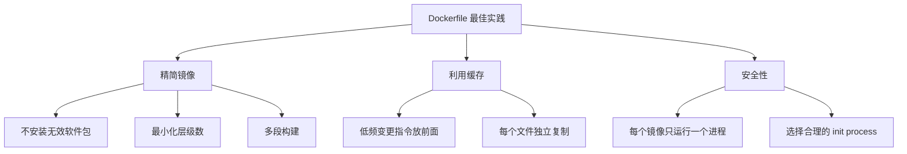

#docker #dockerfile

相关笔记：[[docker-basics]] | [[docker-commands]]

## Dockerfile 最佳实践

### 核心原则



### 1. 精简镜像体积

- **不要安装无效软件包** — 只安装运行时必需的依赖
- **最小化层级数**
  - 最新版 Docker 只有 `RUN`、`COPY`、`ADD` 创建新层，其他指令创建临时层，不会增加镜像大小
  - 多条 `RUN` 命令可通过 `&&` 连接成一条指令以减少层数
  - 通过多段构建 (multi-stage build) 减少镜像层数

### 2. 简化进程数

- 理想状况下，每个镜像应该只有一个进程
- 当无法避免同一镜像运行多进程时，应选择合理的初始化进程 (init process)
  - 如 `tini` 或 `dumb-init`

### 3. 利用 Build Cache

- 把变更频率低的指令优先构建，放在镜像底层，以有效利用 build cache
- 复制文件时，每个文件应独立复制，确保某个文件变更时只影响该文件对应的缓存
- 把多行参数按字母排序，减少重复参数并提高可读性

### 4. 示例：优化前后对比

```dockerfile
# 不推荐：缓存利用率低，层数多
FROM ubuntu:22.04
RUN apt-get update
RUN apt-get install -y curl
RUN apt-get install -y git
COPY . /app
```

```dockerfile
# 推荐：合并 RUN，利用缓存，多段构建
FROM ubuntu:22.04 AS builder
RUN apt-get update && apt-get install -y --no-install-recommends \
    curl \
    git \
    && rm -rf /var/lib/apt/lists/*
COPY go.mod go.sum /app/
WORKDIR /app
RUN go mod download
COPY . /app/
RUN go build -o /app/server

FROM alpine:3.18
COPY --from=builder /app/server /usr/local/bin/
ENTRYPOINT ["server"]
```

### 5. 层级缓存策略


越靠近底层变更频率越低，cache 命中率越高。
