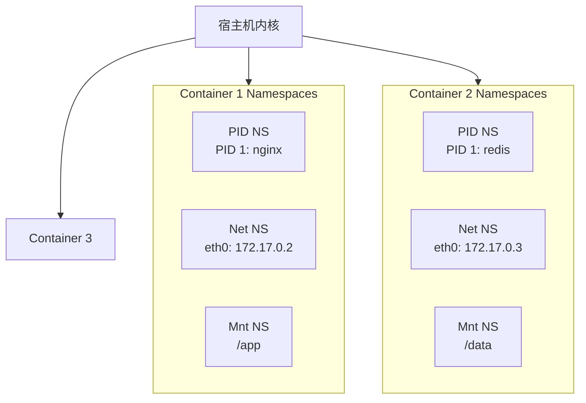
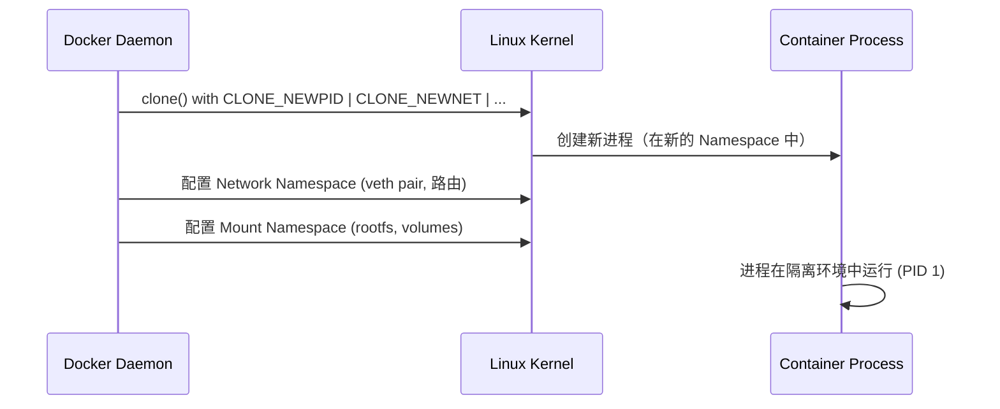

#docker #namespace

相关笔记：[[cgroup]] | [[docker-basics]]

## Namespace 概述

Linux Namespace 是内核提供的资源隔离机制，使得不同进程组看到不同的系统资源视图。Docker 利用 Namespace 实现容器间的隔离。



## Namespace 类型

| Namespace | 隔离内容 | 系统调用参数 |
|-----------|---------|-------------|
| PID | 进程 ID | `CLONE_NEWPID` |
| Network | 网络设备、端口、协议栈 | `CLONE_NEWNET` |
| Mount | 文件系统挂载点 | `CLONE_NEWNS` |
| UTS | 主机名和域名 | `CLONE_NEWUTS` |
| IPC | 信号量、消息队列、共享内存 | `CLONE_NEWIPC` |
| User | 用户和用户组 | `CLONE_NEWUSER` |
| Cgroup | Cgroup 根目录 | `CLONE_NEWCGROUP` |

## 常用操作

### 查看系统 Namespace

```bash
# 查看指定类型的 namespace
lsns -t <type>

# 类型可选：mnt, net, pid, user, ipc, uts, cgroup
lsns -t net
lsns -t pid
```

### 查看进程的 Namespace

```bash
ls -la /proc/<pid>/ns/

# 示例输出
# lrwxrwxrwx 1 root root 0 Jan 1 00:00 cgroup -> 'cgroup:[4026531835]'
# lrwxrwxrwx 1 root root 0 Jan 1 00:00 ipc -> 'ipc:[4026531839]'
# lrwxrwxrwx 1 root root 0 Jan 1 00:00 mnt -> 'mnt:[4026531840]'
# lrwxrwxrwx 1 root root 0 Jan 1 00:00 net -> 'net:[4026531992]'
# lrwxrwxrwx 1 root root 0 Jan 1 00:00 pid -> 'pid:[4026531836]'
# lrwxrwxrwx 1 root root 0 Jan 1 00:00 user -> 'user:[4026531837]'
# lrwxrwxrwx 1 root root 0 Jan 1 00:00 uts -> 'uts:[4026531838]'
```

### 进入指定 Namespace 运行命令

```bash
# 进入某进程的 network namespace 执行命令
nsenter -t <pid> -n ip addr

# 进入多个 namespace
nsenter -t <pid> -m -u -i -n -p -- /bin/bash

# 参数说明：
# -t <pid>  目标进程 PID
# -m        Mount namespace
# -u        UTS namespace
# -i        IPC namespace
# -n        Network namespace
# -p        PID namespace
```

### 使用 unshare 创建新 Namespace

```bash
# 创建新的 PID 和 Mount namespace 并运行 shell
sudo unshare --pid --mount --fork /bin/bash

# 创建新的 Network namespace
sudo unshare --net /bin/bash
```

## Namespace 与 Docker 的关系

Docker 创建容器时，会为每个容器创建一组独立的 Namespace：



## 面试要点

### 高频问题

**Q: Linux Namespace 是什么？它和 Cgroup 的区别是什么？**
A: Namespace 是内核提供的资源隔离机制，让不同进程组看到独立的系统资源视图（如 PID、网络、挂载点），解决"看见什么"的问题。Cgroup 则负责资源限制与统计（CPU、内存、IO 等），解决"能用多少"的问题。容器隔离正是靠 Namespace（隔离视图）+ Cgroup（限制配额）+ rootfs（UnionFS 文件系统）三者共同实现。

**Q: Linux 一共有哪几种 Namespace？分别隔离什么？**
A: 常说的有 7 种（本笔记表格列出）：PID（进程 ID）、Network（网络设备/端口/协议栈）、Mount（文件系统挂载点）、UTS（主机名和域名）、IPC（信号量/消息队列/共享内存）、User（用户和用户组 UID/GID 映射）、Cgroup（cgroup 根目录视图）；从 Linux 5.6 起又新增了 Time namespace（隔离系统启动时间/单调时钟），所以当前内核实际是 8 种。其中 Mount 是最早引入的（Linux 2.4.19，参数为 `CLONE_NEWNS`，命名上没有 MNT 后缀），Cgroup namespace 是较晚（Linux 4.6）加入的。

**Q: Namespace 是通过哪些系统调用创建和加入的？**
A: 主要有三个：`clone()` 在创建新进程时通过 `CLONE_NEW*` flag（如 `CLONE_NEWPID`、`CLONE_NEWNET`）一并创建新 namespace；`unshare()` 让当前进程脱离原 namespace 进入新建的 namespace；`setns()` 让进程加入一个已存在的 namespace（`nsenter` 命令底层即调用它）。Docker 创建容器时正是用 `clone()` 带上一组 `CLONE_NEW*` flag。

**Q: PID Namespace 有什么特殊之处？容器里的 PID 1 有什么含义？**
A: PID Namespace 内的进程从 1 开始独立编号，容器内第一个进程就是 PID 1，承担"init 进程"角色，需负责回收（reap）僵尸子进程，否则容易出现僵尸进程堆积（因此常用 tini/dumb-init 作为 PID 1）。同一进程在不同层级 namespace 中拥有不同 PID（容器内可能是 1，宿主机上是某个大数）。PID 1 被杀死会导致整个 namespace 内所有进程被终止，这也是容器退出的机制。

**Q: 如何查看和进入一个容器（进程）的 Namespace？**
A: 用 `lsns -t <type>`（type 可取 mnt/net/pid/user/ipc/uts/cgroup）列出系统中某类 namespace；用 `ls -la /proc/<pid>/ns/` 查看某进程所属的各 namespace（软链接形如 `net:[inode号]`，inode 相同即同一 namespace）；用 `nsenter -t <pid> -n ip addr` 进入目标进程的 network namespace 执行命令，常用于调试容器网络而无需进入容器本身。

**Q: User Namespace 解决了什么安全问题？**
A: User Namespace 实现 UID/GID 映射，让容器内的 root（UID 0）映射到宿主机上的一个普通非特权用户。这样即使容器内进程以 root 运行、发生逃逸，在宿主机上也只是普通用户权限，大幅缩小攻击面。它也是实现 rootless container（如 rootless Docker/Podman）的核心机制。

**Q: 同一个 Pod 里的多个容器是如何共享 Namespace 的？**
A: Kubernetes Pod 内的容器默认共享 Network、IPC、UTS namespace（因此可以用 localhost 互相访问、共享端口空间），但默认各自拥有独立的 PID 和 Mount namespace（PID 可通过 `shareProcessNamespace: true` 共享）。实现上 Pod 会先启动一个 pause（infra）容器持有这些共享 namespace，其余业务容器通过 `setns()` 加入，从而保证即使业务容器重启，共享的网络栈也不丢失。

### 面试加分点

- 能从内核数据结构角度解释：`/proc/<pid>/ns/` 下每个软链接指向的 inode 号唯一标识一个 namespace，两个进程该 inode 相同即处于同一 namespace，可借此判断隔离关系。
- 理解 Namespace 不是万能隔离：内核态资源（如 syscall 接口、内核版本、`/proc/sys` 部分参数、time namespace 引入前的系统时钟）默认是共享的，这也是容器隔离弱于虚拟机、需配合 seccomp/AppArmor/SELinux 加固的原因。
- 知道 Time Namespace 是 Linux 5.6 引入的较新成员（隔离 `CLOCK_MONOTONIC`/`CLOCK_BOOTTIME`，注意不隔离 `CLOCK_REALTIME` 墙上时钟），主要服务于容器热迁移（CRIU checkpoint/restore）场景。
- 能讲清 `unshare --pid --fork` 为何必须带 `--fork`：unshare 自身进程不会进入新 PID namespace，只有它 fork 出的子进程才会成为新 namespace 的 PID 1，否则在新 PID namespace 内无法正常 fork 出进程。
- 理解 network namespace 与 veth pair 的配合：Docker 默认 bridge 网络下，为容器创建独立 net namespace 后，用一对 veth 将容器内的 eth0 与宿主机 docker0 网桥相连，实现容器与外部通信。
- 能区分容器逃逸的常见路径与 namespace 的关系：`--privileged`、挂载宿主机 `/proc` 或 docker.sock、共享 host namespace（`--pid=host`/`--net=host`）都会削弱隔离，面试中可结合最小权限原则展开。
