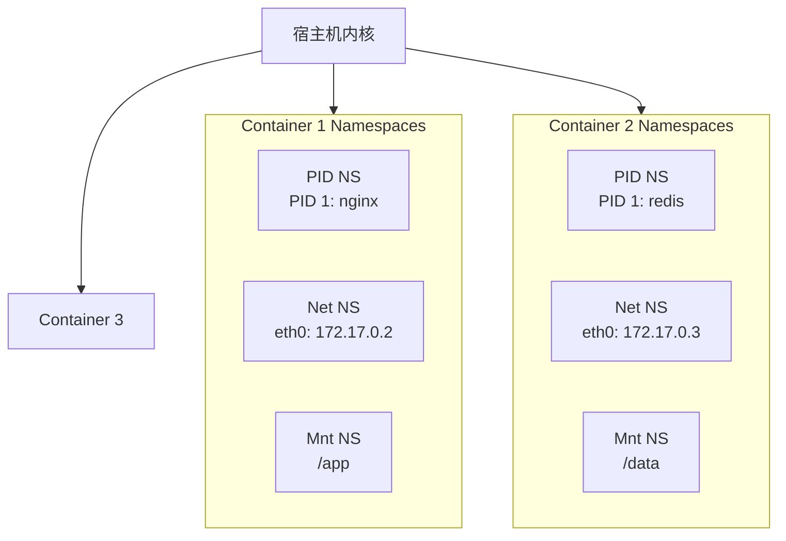
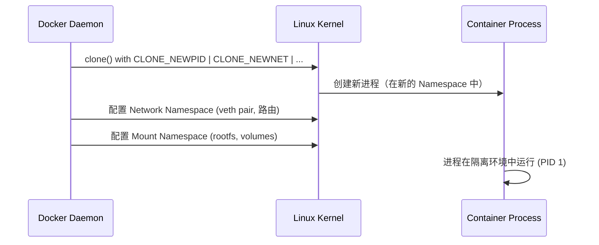

#docker #namespace

相关笔记：[[cgroup]] | [[docker-basics]]

## Namespace 概述

Linux Namespace 是内核提供的资源隔离机制，使得不同进程组看到不同的系统资源视图。Docker 利用 Namespace 实现容器间的隔离。



## Namespace 类型

| Namespace | 隔离内容 | 系统调用参数 |
|-----------|---------|-------------|
| PID | 进程 ID | `CLONE_NEWPID` |
| Network | 网络设备、端口、协议栈 | `CLONE_NEWNET` |
| Mount | 文件系统挂载点 | `CLONE_NEWNS` |
| UTS | 主机名和域名 | `CLONE_NEWUTS` |
| IPC | 信号量、消息队列、共享内存 | `CLONE_NEWIPC` |
| User | 用户和用户组 | `CLONE_NEWUSER` |
| Cgroup | Cgroup 根目录 | `CLONE_NEWCGROUP` |

## 常用操作

### 查看系统 Namespace

```bash
# 查看指定类型的 namespace
lsns -t <type>

# 类型可选：mnt, net, pid, user, ipc, uts, cgroup
lsns -t net
lsns -t pid
```

### 查看进程的 Namespace

```bash
ls -la /proc/<pid>/ns/

# 示例输出
# lrwxrwxrwx 1 root root 0 Jan 1 00:00 cgroup -> 'cgroup:[4026531835]'
# lrwxrwxrwx 1 root root 0 Jan 1 00:00 ipc -> 'ipc:[4026531839]'
# lrwxrwxrwx 1 root root 0 Jan 1 00:00 mnt -> 'mnt:[4026531840]'
# lrwxrwxrwx 1 root root 0 Jan 1 00:00 net -> 'net:[4026531992]'
# lrwxrwxrwx 1 root root 0 Jan 1 00:00 pid -> 'pid:[4026531836]'
# lrwxrwxrwx 1 root root 0 Jan 1 00:00 user -> 'user:[4026531837]'
# lrwxrwxrwx 1 root root 0 Jan 1 00:00 uts -> 'uts:[4026531838]'
```

### 进入指定 Namespace 运行命令

```bash
# 进入某进程的 network namespace 执行命令
nsenter -t <pid> -n ip addr

# 进入多个 namespace
nsenter -t <pid> -m -u -i -n -p -- /bin/bash

# 参数说明：
# -t <pid>  目标进程 PID
# -m        Mount namespace
# -u        UTS namespace
# -i        IPC namespace
# -n        Network namespace
# -p        PID namespace
```

### 使用 unshare 创建新 Namespace

```bash
# 创建新的 PID 和 Mount namespace 并运行 shell
sudo unshare --pid --mount --fork /bin/bash

# 创建新的 Network namespace
sudo unshare --net /bin/bash
```

## Namespace 与 Docker 的关系

Docker 创建容器时，会为每个容器创建一组独立的 Namespace：


