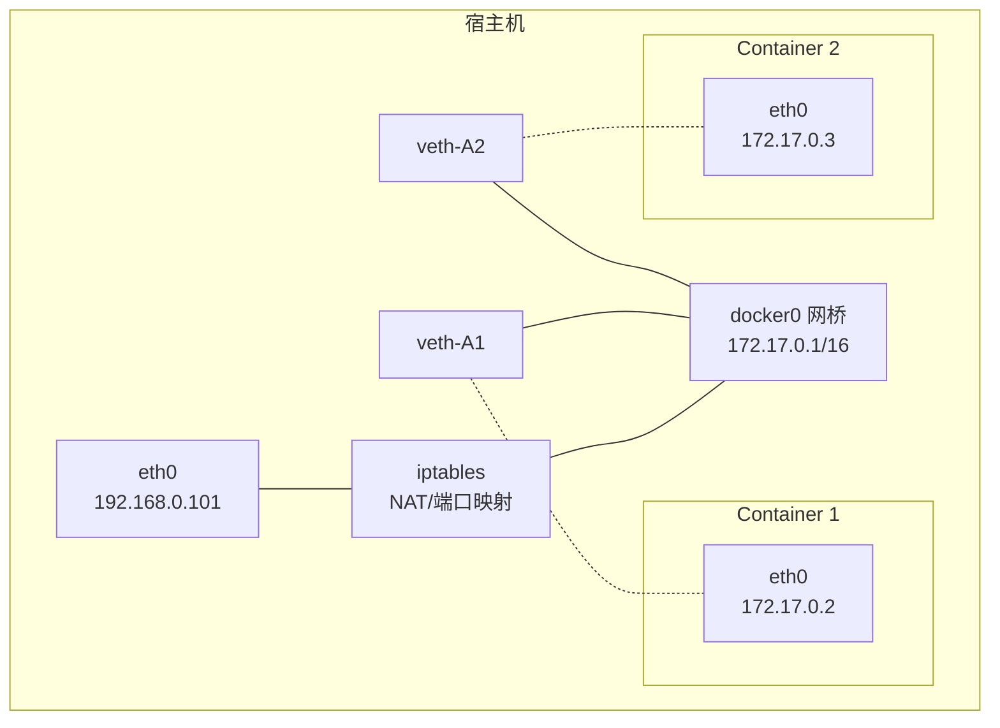
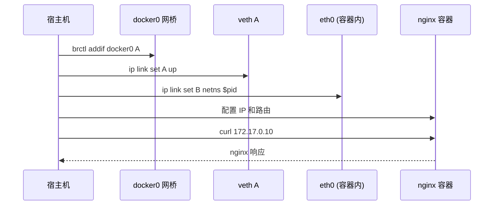

#docker #docker网络

相关笔记：[[docker-basics]] | [[network-null]] | [[network-underlay]] | [[namespace]]

## Bridge 网络模式

Bridge 是 Docker 默认的网络模式。Docker 在每台主机上创建一个名为 `docker0` 的网桥，通过 veth pair 连接每个容器。

### 工作原理



### 网络配置流程

为主机 eth0 分配 IP `192.168.0.101`，启动 docker daemon 后：

1. 创建 veth pair
2. 将 veth pair 的一端连接到 docker0 网桥
3. veth pair 的另一端设置为容器 namespace 的 eth0
4. 为容器 namespace 的 eth0 分配 IP

**iptables 规则：**

```bash
# SNAT：容器访问外网时进行源地址转换
-A POSTROUTING -s 172.17.0.0/16 ! -o docker0 -j MASQUERADE

# DNAT：外部访问映射端口时进行目标地址转换（docker run -p 2333:22）
-A DOCKER ! -i docker0 -p tcp -m tcp --dport 2333 -j DNAT --to-destination 172.17.0.2:22
```

![[Docker网络Bridge.jpg]]

## 手动配置 Bridge 网络实验

以下示例演示如何手动为一个无网络的容器配置 Bridge 网络。

### 1. 准备网络 namespace

```bash
mkdir -p /var/run/netns
find -L /var/run/netns -type l -delete
```

### 2. 启动无网络模式的 nginx 容器

```bash
docker run --network=none -d nginx
```

### 3. 获取容器 PID

```bash
docker ps | grep nginx
docker inspect <containerid> | grep -i pid
# "Pid": 876884,
```

### 4. 检查容器当前网络配置（无网络）

```bash
nsenter -t 876884 -n ip a
```

### 5. 链接 network namespace

```bash
export pid=876884
ln -s /proc/$pid/ns/net /var/run/netns/$pid
ip netns list
```

### 6. 查看宿主机 docker0 网桥

```bash
brctl show
ip a
# 4: docker0: <BROADCAST,MULTICAST,UP,LOWER_UP> mtu 1500
#     inet 172.17.0.1/16 brd 172.17.255.255 scope global docker0
```

### 7. 创建 veth pair

```bash
ip link add A type veth peer name B
```

### 8. 配置 veth A 端（接入网桥）

```bash
brctl addif docker0 A
ip link set A up
```

### 9. 配置 veth B 端（放入容器 namespace）

```bash
SETIP=172.17.0.10
SETMASK=16
GATEWAY=172.17.0.1

ip link set B netns $pid
ip netns exec $pid ip link set dev B name eth0
ip netns exec $pid ip link set eth0 up
ip netns exec $pid ip addr add $SETIP/$SETMASK dev eth0
ip netns exec $pid ip route add default via $GATEWAY
```

### 10. 验证连通性

```bash
curl 172.17.0.10
```



## 面试要点

### 高频问题

**Q: Docker 默认的网络模式是什么？它的核心组件有哪些？**
A: 默认是 bridge 模式。Docker 在宿主机上创建一个名为 `docker0` 的 Linux bridge（默认网段 `172.17.0.0/16`，网关 `172.17.0.1`），每个容器通过一对 veth pair 接入：一端接在 `docker0` 上，另一端作为容器 namespace 内的 `eth0`。容器间通过网桥二层互通，容器访问外网和外部访问容器则依赖 iptables 做 NAT。

**Q: veth pair 是什么？在 bridge 模式里起什么作用？**
A: veth pair 是一对成对出现的虚拟网卡，像一根虚拟网线，从一端进入的数据包必然从另一端出来。在 bridge 模式里它用来打通容器 network namespace 和宿主机：一端（如 `A`）通过 `brctl addif docker0 A` 接到网桥，另一端（如 `B`）通过 `ip link set B netns $pid` 移入容器 namespace 并改名为 `eth0`，从而让容器获得网络连通性。

**Q: 容器访问外网和外部访问容器端口，分别依赖什么机制？**
A: 容器访问外网依赖 SNAT（MASQUERADE）：`POSTROUTING` 链上对源地址 `172.17.0.0/16` 且出口不是 `docker0` 的包做源地址转换，伪装成宿主机出口网卡 IP 出去。外部访问容器映射端口（如 `docker run -p 2333:22`）依赖 DNAT：在 `DOCKER` 链对从非 `docker0` 网卡进入、目的为宿主机 `2333` 端口的包做目标地址转换到 `172.17.0.2:22`，把流量转给容器。

**Q: 容器的 IP 是私有的且会变化，为什么外部还能稳定访问到容器服务？**
A: 容器 IP（如 `172.17.0.x`）只在 `docker0` 网段内可见，宿主机外不可路由。外部访问的是宿主机 IP + 映射端口，由 iptables DNAT 规则转换到容器内部 IP 和端口。因此即使容器重启换了 IP，只要端口映射规则随之更新，外部访问的宿主机端口保持不变即可。

**Q: 同一台主机上两个 bridge 容器是怎么通信的？跨主机呢？**
A: 同主机两个容器都接在 `docker0` 上，属于同一二层网络，通过网桥直接转发即可互通（彼此可见对方的 `172.17.0.x` 地址）。但默认 `docker0` 网段是主机本地的，跨主机时不同主机各自的 `172.17.0.0/16` 互相冲突且不可路由，所以原生 bridge 不能跨主机通信，需要 overlay 网络（VXLAN 封装）或 CNI 插件来解决。

**Q: 简述手动给一个 `--network=none` 容器配置 bridge 网络的关键步骤。**
A: 先用 `ln -s /proc/$pid/ns/net /var/run/netns/$pid` 把容器的 net namespace 暴露给 `ip netns`；接着 `ip link add A type veth peer name B` 创建 veth pair；A 端 `brctl addif docker0 A` 接网桥并 `up`；B 端 `ip link set B netns $pid` 移入容器、改名 `eth0`、`up`、配置同网段 IP（如 `172.17.0.10/16`）；最后 `ip route add default via 172.17.0.1` 配默认网关指向 `docker0`，即可连通。

**Q: bridge 模式相比 host 模式有什么取舍？**
A: bridge 模式有独立的 network namespace，端口隔离、可做端口映射、安全性好，但多了一层 NAT 和 veth 转发，性能略有损耗、端口需显式映射。host 模式容器直接复用宿主机网络栈，没有 NAT 开销、性能最好，但失去网络隔离、端口直接占用宿主机端口、易冲突。高吞吐低延迟场景可考虑 host，需要隔离和端口编排时用 bridge。

### 面试加分点

- 能指出 `docker0` 本质是一个 Linux bridge（二层交换设备），容器流量在网桥内走二层转发、出网桥才走 iptables 的三层 NAT，理解「网桥负责二层、iptables 负责三层 NAT」的分工。
- 清楚 SNAT 用 `MASQUERADE`（动态取出口网卡 IP，适合 IP 不固定的场景）而非固定 SNAT，并能写出 `POSTROUTING -s 172.17.0.0/16 ! -o docker0 -j MASQUERADE` 这类规则的语义。
- 理解容器跨主机通信的演进：原生 bridge 不可跨主机 → Docker overlay 用 VXLAN 封装 → Kubernetes 用 CNI（Flannel/Calico/Cilium）统一网络模型，能把 bridge 知识迁移到 K8s Pod 网络（Pod 内也是 veth pair + 网桥/路由）。
- 知道容器间默认开启 ICC（inter-container communication），可在 daemon 级用 `--icc=false` 配合 legacy `--link` 或自定义网络做隔离；并了解自定义 bridge 网络相比默认 `docker0` 多了内置 DNS 服务发现（按容器名解析），默认 `docker0` 不支持。
- 能定位故障：用 `nsenter -t $pid -n ip a`、`brctl show`、`iptables -t nat -L -n` 分别排查容器内网卡、网桥挂载关系和 NAT 规则，快速判断是 veth、网桥还是 iptables 哪一层断了。
