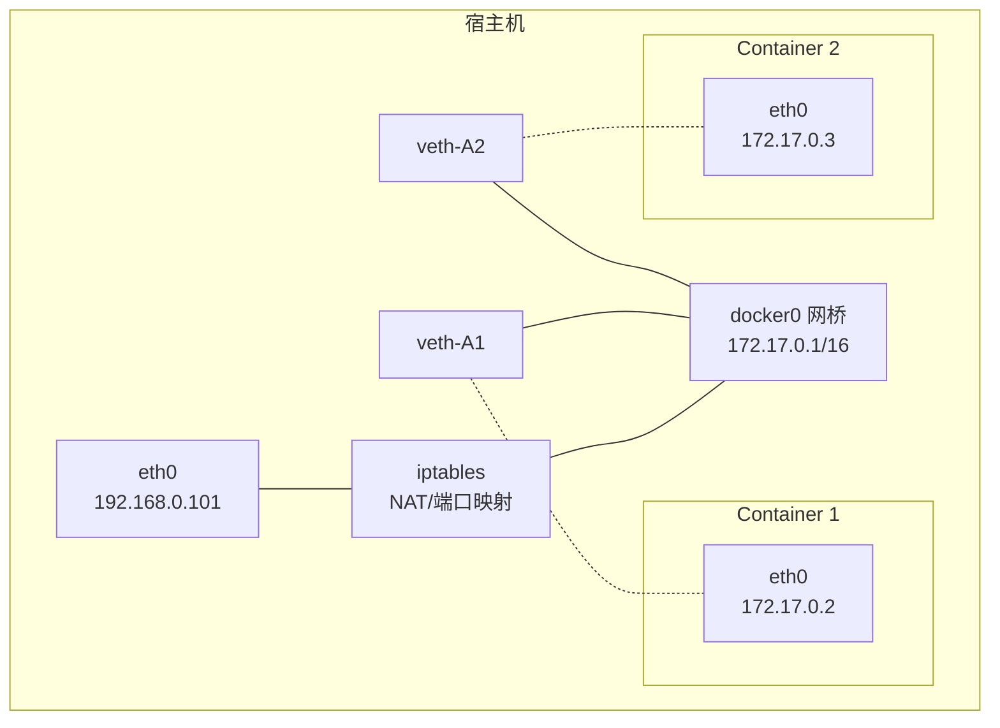
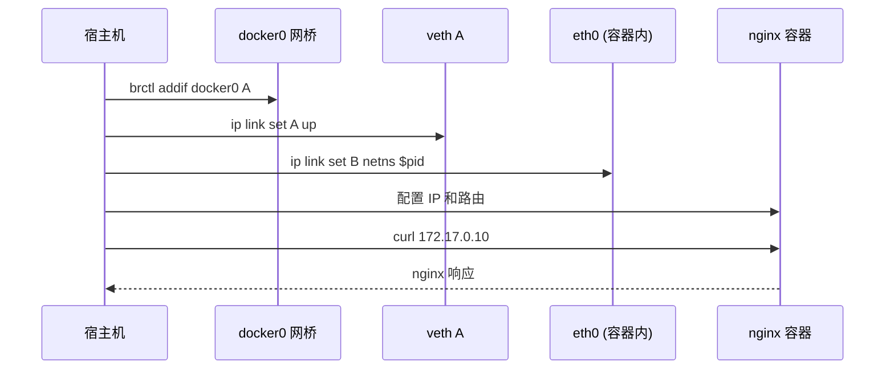

#docker #docker网络

相关笔记：[[docker-basics]] | [[network-null]] | [[network-underlay]] | [[namespace]]

## Bridge 网络模式

Bridge 是 Docker 默认的网络模式。Docker 在每台主机上创建一个名为 `docker0` 的网桥，通过 veth pair 连接每个容器。

### 工作原理



### 网络配置流程

为主机 eth0 分配 IP `192.168.0.101`，启动 docker daemon 后：

1. 创建 veth pair
2. 将 veth pair 的一端连接到 docker0 网桥
3. veth pair 的另一端设置为容器 namespace 的 eth0
4. 为容器 namespace 的 eth0 分配 IP

**iptables 规则：**

```bash
# SNAT：容器访问外网时进行源地址转换
-A POSTROUTING -s 172.17.0.0/16 ! -o docker0 -j MASQUERADE

# DNAT：外部访问映射端口时进行目标地址转换（docker run -p 2333:22）
-A DOCKER ! -i docker0 -p tcp -m tcp --dport 2333 -j DNAT --to-destination 172.17.0.2:22
```

![[Docker网络Bridge.jpg]]

## 手动配置 Bridge 网络实验

以下示例演示如何手动为一个无网络的容器配置 Bridge 网络。

### 1. 准备网络 namespace

```bash
mkdir -p /var/run/netns
find -L /var/run/netns -type l -delete
```

### 2. 启动无网络模式的 nginx 容器

```bash
docker run --network=none -d nginx
```

### 3. 获取容器 PID

```bash
docker ps | grep nginx
docker inspect <containerid> | grep -i pid
# "Pid": 876884,
```

### 4. 检查容器当前网络配置（无网络）

```bash
nsenter -t 876884 -n ip a
```

### 5. 链接 network namespace

```bash
export pid=876884
ln -s /proc/$pid/ns/net /var/run/netns/$pid
ip netns list
```

### 6. 查看宿主机 docker0 网桥

```bash
brctl show
ip a
# 4: docker0: <BROADCAST,MULTICAST,UP,LOWER_UP> mtu 1500
#     inet 172.17.0.1/16 brd 172.17.255.255 scope global docker0
```

### 7. 创建 veth pair

```bash
ip link add A type veth peer name B
```

### 8. 配置 veth A 端（接入网桥）

```bash
brctl addif docker0 A
ip link set A up
```

### 9. 配置 veth B 端（放入容器 namespace）

```bash
SETIP=172.17.0.10
SETMASK=16
GATEWAY=172.17.0.1

ip link set B netns $pid
ip netns exec $pid ip link set dev B name eth0
ip netns exec $pid ip link set eth0 up
ip netns exec $pid ip addr add $SETIP/$SETMASK dev eth0
ip netns exec $pid ip route add default via $GATEWAY
```

### 10. 验证连通性

```bash
curl 172.17.0.10
```


