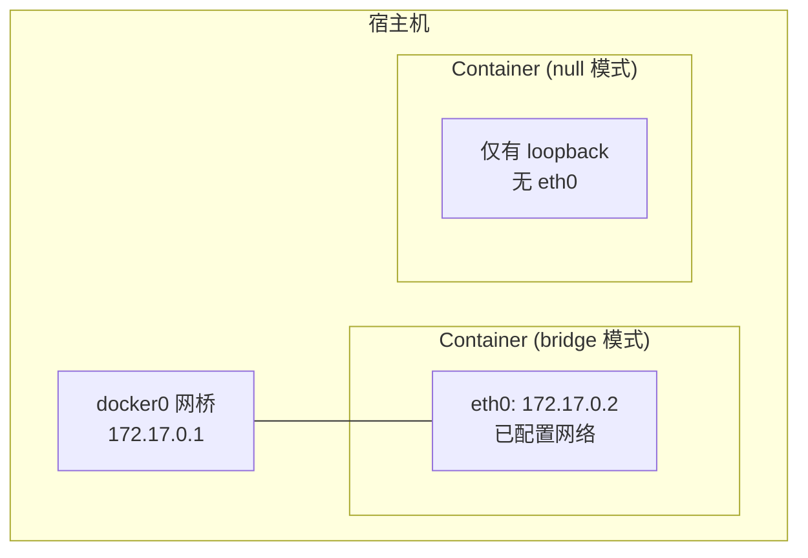

#docker #docker网络

相关笔记：[[docker-basics]] | [[network-bridge]] | [[network-underlay]] | [[namespace]]

## Null 网络模式

Null 模式 (`--net=none`) 是一个空实现 -- 容器拥有独立的 Network Namespace，但 Docker 不做任何网络配置。

### 适用场景

- 需要完全自定义网络配置的容器
- 安全敏感的容器（不需要任何网络访问）
- 测试和调试网络配置

### 工作原理



### 使用方式

```bash
# 以 null 模式启动容器
docker run --network=none -d nginx

# 查看容器网络（仅有 loopback）
docker exec <container_id> ip addr
# 1: lo: <LOOPBACK,UP,LOWER_UP>
#     inet 127.0.0.1/8 scope host lo
```

### 手动配置网络

可以通过 `docker network` 命令或直接操作 namespace 手动为容器配置网络，参考 [[network-bridge]] 中的手动配置实验。

```bash
# 获取容器 PID
docker inspect <container_id> | grep -i pid

# 使用 nsenter 进入容器 namespace 配置网络
nsenter -t <pid> -n ip link add ...
nsenter -t <pid> -n ip addr add ...
nsenter -t <pid> -n ip route add ...
```

### 三种网络模式对比

| 模式 | 网络隔离 | 自动配置 | 使用场景 |
|------|---------|---------|---------|
| Bridge | 独立 namespace + NAT | 自动分配 IP 和路由 | 默认模式，适合大多数场景 |
| Host | 共享宿主机 namespace | 无需配置 | 需要最大网络性能 |
| Null | 独立 namespace，无网络 | 无 | 完全自定义或不需要网络 |

## 面试要点

### 高频问题

**Q: 什么是 Docker 的 Null 网络模式？它和容器"没有网络"是一回事吗？**

> [!question]- 参考答案（点击展开）
>
> Null 模式 (`--net=none`) 下容器仍然拥有独立的 Network Namespace，只是 Docker 不做任何网络配置，namespace 内仅有 loopback (`lo`)，没有 `eth0`、没有 IP、没有路由。所以它不是"没有 namespace"，而是"有隔离但空白"，需要你自己把网络补上，这给了完全自定义的空间。

**Q: Null 模式下容器还能访问外部网络吗？**

> [!question]- 参考答案（点击展开）
>
> 默认完全不能，因为没有 `eth0` 接口、没有 veth pair 接到任何网桥、也没有默认路由。容器内只能走 loopback 自己访问自己（如 `127.0.0.1`）。要联网必须手动创建 veth、配置 IP 和路由，否则它是一个网络上的"孤岛"。

**Q: Bridge、Host、Null 三种网络模式有什么区别？**

> [!question]- 参考答案（点击展开）
>
> Bridge 是默认模式，容器有独立 namespace，Docker 通过 veth 接到 `docker0` 网桥并做 NAT，自动分配 IP 和路由；Host 模式容器直接共享宿主机的 Network Namespace，无隔离、性能最好但端口会冲突；Null 模式有独立 namespace 但完全不配网络。从网络可达性的隔离强度看：Null > Bridge > Host（Null 与 Bridge 都有独立 netns，但 Null 完全断网、隔离最彻底，Bridge 仍接入 `docker0`，Host 直接共享宿主机 netns）；自动化程度 Bridge（自动配） > Host（无需配） > Null（要手动配）。

**Q: Null 模式典型的使用场景有哪些？**

> [!question]- 参考答案（点击展开）
>
> 三类：一是安全敏感容器，彻底切断网络访问以收窄攻击面；二是需要完全自定义网络的场景，比如自己实现网络方案或对接 CNI/SDN；三是网络配置的测试和调试，从干净的空白 namespace 出发逐步搭建。Kubernetes 中 Pod 的 sandbox/pause 容器思路类似——先建空 namespace，再由 CNI 插件填充网络。

**Q: 如何给一个 Null 模式的容器手动配置网络？**

> [!question]- 参考答案（点击展开）
>
> 先 `docker inspect` 拿到容器的 PID，然后用 `nsenter -t <pid> -n` 进入它的 Network Namespace，依次执行 `ip link add`（创建 veth 并把一端塞进容器）、`ip addr add`（配 IP）、`ip route add`（配路由/默认网关），再在宿主机侧把另一端接到网桥并开启转发/NAT。本质就是手动复刻 Bridge 模式自动做的那套配置。

**Q: 为什么 `nsenter -t <pid> -n` 能进入容器的网络？它的原理是什么？**

> [!question]- 参考答案（点击展开）
>
> 容器隔离本质是 Linux Namespace，每个进程的 namespace 通过 `/proc/<pid>/ns/net` 暴露。`nsenter -t <pid> -n` 就是 `setns(2)` 到目标 PID 的 net namespace，之后执行的命令（如 `ip`）就运行在容器的网络视图里。所以配置容器网络不一定要 `docker exec`，在宿主机用 nsenter 操作 namespace 同样有效。

### 面试加分点

- 能点出 Null 模式与 Kubernetes Pod 网络模型的联系：Pod 中 pause 容器先以类似空白 namespace 起来持有 network namespace，CNI 插件再往里注入 veth/IP/路由，业务容器通过 `--net=container:<pause>` 共享，这正是 Null + 手动配置思路的工程化体现。
- 理解 veth pair 的工作方式：一端在容器 namespace 当 `eth0`，另一端在宿主机接到 `docker0`，是连通两个 namespace 的"虚拟网线"；Null 模式缺的正是这根线和对应的 IP/路由。
- 安全维度延伸：Null 模式是最小化网络攻击面的手段，配合只读 rootfs、drop capabilities、seccomp 可以做高隔离的沙箱；区别于用 NetworkPolicy 做应用层策略，Null 是直接在 namespace 层面"物理"断网。
- 能区分 Host 模式与 Null/Bridge 的隔离差异：Host 共享宿主机 namespace 因此没有端口映射、性能高但安全性低；Null 隔离最彻底；面试中常被问"追求极致网络性能选哪个"——答 Host，但要补充其端口冲突与安全代价。
- 知道 loopback 的存在与状态：新建 network namespace 时内核会自带一个 `lo` 接口，但默认处于 DOWN 状态；Docker 在 `--net=none` 下通常会把 `lo` 拉起（如本笔记示例中 `lo` 即为 `UP`），若发现"只有 127.0.0.1 不通"，先确认 `lo` 是否需要 `ip link set lo up`，这是排查空白 namespace 的关键细节。
