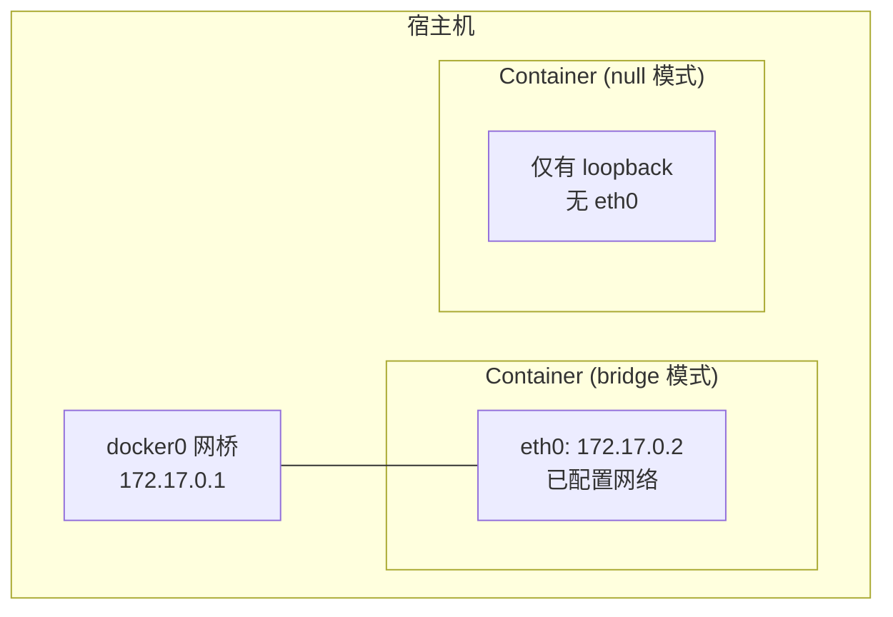

#docker #docker网络

相关笔记：[[docker-basics]] | [[network-bridge]] | [[network-underlay]] | [[namespace]]

## Null 网络模式

Null 模式 (`--net=none`) 是一个空实现 -- 容器拥有独立的 Network Namespace，但 Docker 不做任何网络配置。

### 适用场景

- 需要完全自定义网络配置的容器
- 安全敏感的容器（不需要任何网络访问）
- 测试和调试网络配置

### 工作原理



### 使用方式

```bash
# 以 null 模式启动容器
docker run --network=none -d nginx

# 查看容器网络（仅有 loopback）
docker exec <container_id> ip addr
# 1: lo: <LOOPBACK,UP,LOWER_UP>
#     inet 127.0.0.1/8 scope host lo
```

### 手动配置网络

可以通过 `docker network` 命令或直接操作 namespace 手动为容器配置网络，参考 [[network-bridge]] 中的手动配置实验。

```bash
# 获取容器 PID
docker inspect <container_id> | grep -i pid

# 使用 nsenter 进入容器 namespace 配置网络
nsenter -t <pid> -n ip link add ...
nsenter -t <pid> -n ip addr add ...
nsenter -t <pid> -n ip route add ...
```

### 三种网络模式对比

| 模式 | 网络隔离 | 自动配置 | 使用场景 |
|------|---------|---------|---------|
| Bridge | 独立 namespace + NAT | 自动分配 IP 和路由 | 默认模式，适合大多数场景 |
| Host | 共享宿主机 namespace | 无需配置 | 需要最大网络性能 |
| Null | 独立 namespace，无网络 | 无 | 完全自定义或不需要网络 |
