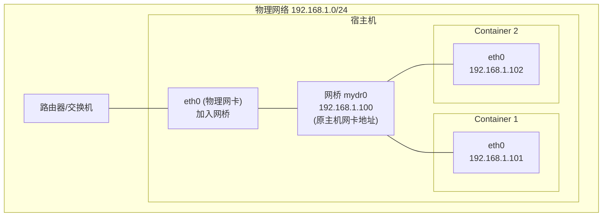

#docker #docker网络

相关笔记：[[docker-basics]] | [[network-bridge]] | [[network-null]]

## Underlay 网络模式

Underlay 网络模式直接使用宿主机的物理网络，为每个容器分配可路由的网络 IP，容器与宿主机处于同一网络平面。

### 工作原理



### 配置步骤

1. 创建新的网桥设备 `mydr0`
2. 将主机物理网卡加入网桥
3. 把主机网卡的地址配置到网桥，并将默认路由规则转移到网桥 `mydr0`
4. 启动容器
5. 创建 veth pair，将一个 peer 添加到网桥 `mydr0`
6. 配置容器的 veth 另一个 peer 作为容器网卡

```bash
# 创建网桥
brctl addbr mydr0

# 将物理网卡加入网桥
brctl addif mydr0 eth0

# 将 IP 从 eth0 迁移到网桥
ip addr del 192.168.1.100/24 dev eth0
ip addr add 192.168.1.100/24 dev mydr0
ip link set mydr0 up

# 修改默认路由
ip route del default
ip route add default via 192.168.1.1 dev mydr0

# 为容器创建 veth pair 并配置
ip link add vethA type veth peer name vethB
brctl addif mydr0 vethA
ip link set vethA up
# 将 vethB 放入容器 namespace 并配置 IP
```

![[Docker网络Underlay.jpg]]

### Bridge vs Underlay 对比

| 特性 | Bridge 模式 | Underlay 模式 |
|------|-------------|---------------|
| 容器 IP | 内部网段（如 172.17.0.x） | 与宿主机同网段 |
| 外部可达性 | 需要 NAT/端口映射 | 直接可达 |
| 性能 | 有 NAT 开销 | 接近原生网络性能 |
| 使用场景 | 单机开发、测试 | 需要容器直接对外暴露的场景 |
