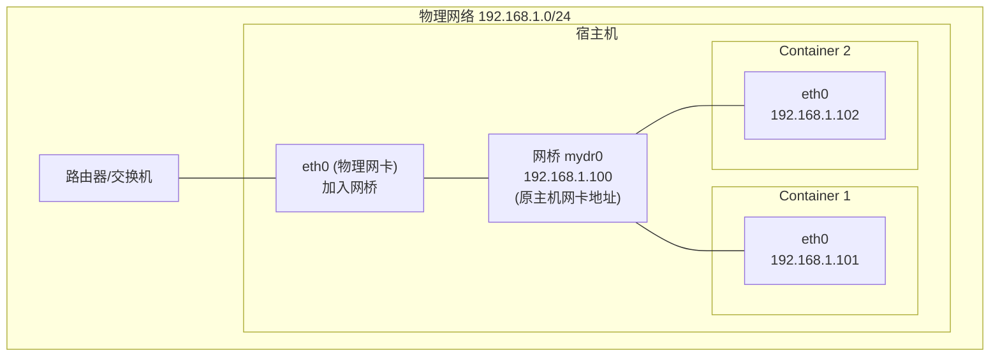

#docker #docker网络

相关笔记：[[docker-basics]] | [[network-bridge]] | [[network-null]]

## Underlay 网络模式

Underlay 网络模式直接使用宿主机的物理网络，为每个容器分配可路由的网络 IP，容器与宿主机处于同一网络平面。

### 工作原理



### 配置步骤

1. 创建新的网桥设备 `mydr0`
2. 将主机物理网卡加入网桥
3. 把主机网卡的地址配置到网桥，并将默认路由规则转移到网桥 `mydr0`
4. 启动容器
5. 创建 veth pair，将一个 peer 添加到网桥 `mydr0`
6. 配置容器的 veth 另一个 peer 作为容器网卡

```bash
# 创建网桥
brctl addbr mydr0

# 将物理网卡加入网桥
brctl addif mydr0 eth0

# 将 IP 从 eth0 迁移到网桥
ip addr del 192.168.1.100/24 dev eth0
ip addr add 192.168.1.100/24 dev mydr0
ip link set mydr0 up

# 修改默认路由
ip route del default
ip route add default via 192.168.1.1 dev mydr0

# 为容器创建 veth pair 并配置
ip link add vethA type veth peer name vethB
brctl addif mydr0 vethA
ip link set vethA up
# 将 vethB 放入容器 namespace 并配置 IP
```

![[Docker网络Underlay.jpg]]

### Bridge vs Underlay 对比

| 特性 | Bridge 模式 | Underlay 模式 |
|------|-------------|---------------|
| 容器 IP | 内部网段（如 172.17.0.x） | 与宿主机同网段 |
| 外部可达性 | 需要 NAT/端口映射 | 直接可达 |
| 性能 | 有 NAT 开销 | 接近原生网络性能 |
| 使用场景 | 单机开发、测试 | 需要容器直接对外暴露的场景 |

## 面试要点

### 高频问题

**Q: 什么是 Underlay 网络？它和 Overlay 的本质区别是什么？**
A: Underlay 直接复用宿主机所在的物理二层/三层网络，容器获得与宿主机同网段、可被路由器/交换机直接路由的真实 IP，数据包不做封装。Overlay（如 VXLAN、IPIP）则在物理网络之上构建逻辑隧道，对原始包做二次封装（如 VXLAN 在原始以太帧外加 UDP+VXLAN header），实现跨主机的虚拟网络。区别在于：Underlay 无封装、性能接近原生但强依赖物理网络规划；Overlay 灵活、与底层解耦但有封装/解封装开销。

**Q: Underlay 模式下容器的 IP 是怎么分配的？**
A: 容器拿到的是与宿主机相同网段（如 `192.168.1.0/24`）的可路由 IP，例如 `192.168.1.101`，相当于网络中一台独立主机。分配可由外部 DHCP、IPAM 或手工指定，但必须保证与宿主机/其他容器不冲突，因此通常需要和物理网络的 IP 规划协调。

**Q: 笔记里把物理网卡 eth0 加入网桥后，为什么必须把 IP 从 eth0 迁移到网桥 mydr0？**
A: 物理网卡一旦加入 Linux bridge，就变成网桥的一个 port，进出流量改由网桥在二层转发，挂在 eth0 上的三层 IP 对宿主机协议栈不再生效。所以要 `ip addr del` 删除 eth0 的 IP，再 `ip addr add` 到 mydr0，并把默认路由 `default via 192.168.1.1` 改挂到 mydr0，否则宿主机自身会失去网络连通性。

**Q: Bridge 模式和 Underlay 模式的核心差异是什么？**
A: Bridge 模式容器用内部私有网段（如 `172.17.0.x`），对外通信要经过 NAT（出方向 iptables MASQUERADE，入方向端口发布走 DNAT），有转发开销且外部无法直接访问容器 IP；Underlay 容器是宿主机同网段的可路由 IP，外部可直接访问、无 NAT 开销、性能接近原生，代价是要占用物理网络的 IP 资源、依赖 IP 规划。

**Q: veth pair 在这套方案里起什么作用？**
A: veth pair 是一对虚拟网卡，像一根管道两端互联，一端（vethA）挂到宿主机网桥 mydr0 上，另一端（vethB）被移入容器的 network namespace 作为容器的 eth0。容器内的流量经 vethB 进入，从 vethA 出到网桥，再由网桥经物理网卡发往物理网络，从而把容器与宿主网络打通。

**Q: Underlay 模式有哪些典型落地实现？**
A: 单机层面就是笔记里的「物理网卡入桥」方案；容器编排中常见的是 Docker macvlan/ipvlan driver，以及 Kubernetes CNI 里的 Calico BGP 模式、Cilium Native Routing、Kube-OVN Underlay 等，都让 Pod 拿到可路由真实 IP。它们多用在对网络性能敏感、需要 Pod 直接对外暴露或与传统物理网络互通的场景。

**Q: Underlay 模式有什么局限或代价？**
A: 它强依赖物理网络规划：需要足够的可用 IP，可能要在网络设备上配合（如 macvlan 通常要求宿主机物理网卡开启 promiscuous 混杂模式以收下多个 MAC 的帧，BGP 方案需路由器/交换机支持 BGP）；macvlan 还存在宿主机与挂在同一父网卡上的自身容器默认无法直接通信的限制；IP 管理和跨网段迁移也比 Overlay 复杂。所以灵活性和可移植性不如 Overlay。

### 面试加分点

- 能区分 macvlan 与 ipvlan：macvlan 给每个子接口独立 MAC，通常需要宿主机物理网卡开启混杂模式，且交换机单端口可见 MAC 数可能受限；ipvlan（L2/L3 模式）所有子接口共享宿主机 MAC，更适合云环境或对 MAC 数量/混杂模式有限制的网络。
- 理解 Linux bridge 是一个二层软件交换机：网卡加入后变成 port，靠 FDB（MAC 地址表）学习并转发，这正解释了为什么三层 IP 必须从物理网卡迁到网桥。
- 能把单机方案映射到 Kubernetes：Calico 的 BGP 模式用路由分发（而非网桥）实现可路由 Pod IP，Cilium Native Routing 同理，说明 Underlay 不一定靠 bridge，也可纯三层路由实现。
- 清楚 Underlay 性能优势的根因：没有 VXLAN/IPIP 封装就没有额外 header 开销和封解包 CPU 消耗，也省去 NAT，转发路径短，吞吐和延迟接近裸金属。
- 知道生产中的取舍：Underlay 适合 IP 可控、需与遗留系统互通的私有数据中心；公有云因 VPC 限制和 IP 配额，常退回 Overlay 或云厂商专属 CNI（如 AWS VPC CNI 这类把 Pod 直接挂到 VPC ENI 二级 IP 的「准 Underlay」方案）。
