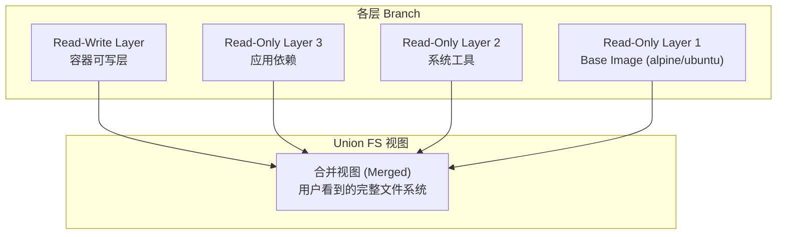
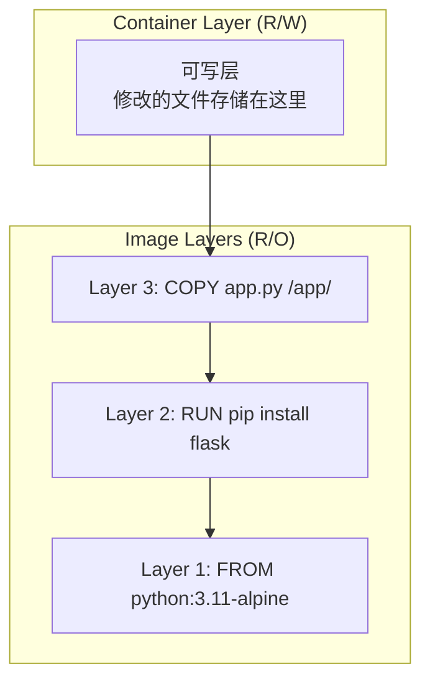

#docker #unionfs

相关笔记：[[docker-basics]] | [[cgroup]] | [[namespace]]

## Union File System 概述

Union FS（联合文件系统）是一种将不同目录挂载到同一个虚拟文件系统下的文件系统 (unite several directories into a single virtual filesystem)。

### 核心特性

- 支持为每个成员目录设定 `readonly`、`readwrite` 和 `whiteout-able` 权限
- 对 readonly 的 branch 可以逻辑上进行增量修改，不影响 readonly 部分
- 类似 Git Branch 的分层概念

### 主要用途

1. 将多个 disk 挂载到同一个目录下
2. 将一个 readonly 的 branch 和一个 writeable 的 branch 联合在一起（Docker 主要使用方式）



## 在 Docker 中的应用

Docker 使用 Union FS 将镜像的多个只读层和容器的一个可写层合并，呈现为一个统一的文件系统：



### 文件操作机制

| 操作 | 行为 |
|------|------|
| 读取文件 | 从上往下逐层查找，返回最先找到的版本 |
| 修改文件 | Copy-on-Write：将文件从只读层复制到可写层再修改 |
| 删除文件 | 在可写层创建 whiteout 标记，屏蔽下层文件 |
| 新建文件 | 直接写入可写层 |

### 常见实现

| 实现 | 说明 |
|------|------|
| AUFS | 早期 Docker 默认，功能丰富但未进入 Linux 主线内核 |
| OverlayFS (overlay2) | 当前 Docker 推荐，已进入 Linux 主线内核，性能好 |
| Device Mapper | 基于块设备，适合无 OverlayFS 支持的场景 |
| Btrfs / ZFS | 利用文件系统原生 CoW 特性 |

```bash
# 查看当前 Docker 使用的存储驱动
docker info | grep "Storage Driver"
# Storage Driver: overlay2
```
