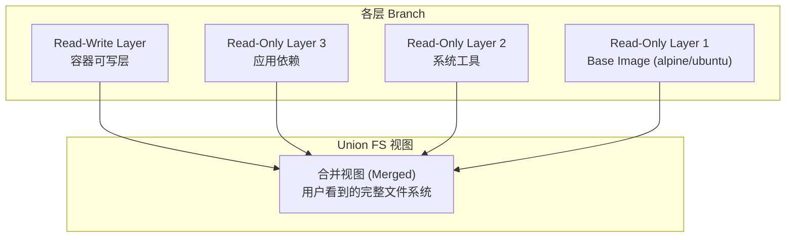
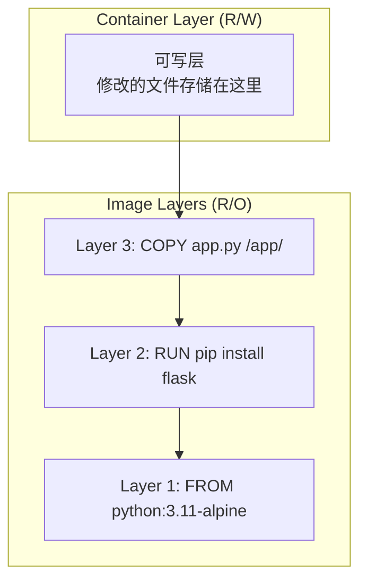

#docker #unionfs

相关笔记：[[docker-basics]] | [[cgroup]] | [[namespace]]

## Union File System 概述

Union FS（联合文件系统）是一种将不同目录挂载到同一个虚拟文件系统下的文件系统 (unite several directories into a single virtual filesystem)。

### 核心特性

- 支持为每个成员目录设定 `readonly`、`readwrite` 和 `whiteout-able` 权限
- 对 readonly 的 branch 可以逻辑上进行增量修改，不影响 readonly 部分
- 类似 Git Branch 的分层概念

### 主要用途

1. 将多个 disk 挂载到同一个目录下
2. 将一个 readonly 的 branch 和一个 writeable 的 branch 联合在一起（Docker 主要使用方式）



## 在 Docker 中的应用

Docker 使用 Union FS 将镜像的多个只读层和容器的一个可写层合并，呈现为一个统一的文件系统：



### 文件操作机制

| 操作 | 行为 |
|------|------|
| 读取文件 | 从上往下逐层查找，返回最先找到的版本 |
| 修改文件 | Copy-on-Write：将文件从只读层复制到可写层再修改 |
| 删除文件 | 在可写层创建 whiteout 标记，屏蔽下层文件 |
| 新建文件 | 直接写入可写层 |

### 常见实现

| 实现 | 说明 |
|------|------|
| AUFS | 早期 Docker 默认，功能丰富但未进入 Linux 主线内核 |
| OverlayFS (overlay2) | 当前 Docker 推荐，已进入 Linux 主线内核，性能好 |
| Device Mapper | 基于块设备，适合无 OverlayFS 支持的场景 |
| Btrfs / ZFS | 利用文件系统原生 CoW 特性 |

```bash
# 查看当前 Docker 使用的存储驱动
docker info | grep "Storage Driver"
# Storage Driver: overlay2
```

## 面试要点

### 高频问题

**Q: 什么是 Union FS？它在 Docker 中解决了什么问题？**
A: Union FS（联合文件系统）通过 union mount 把多个目录（branch/layer）叠加挂载成一个统一的虚拟文件系统。Docker 用它把镜像的多个 read-only 层和容器的一个 read-write 层合并成一个完整视图，从而实现镜像分层、层间复用与共享，避免每个容器都完整复制一份 rootfs，既省磁盘又能加速镜像分发。

**Q: Docker 镜像分层和容器层的区别是什么？**
A: 镜像由若干 read-only 层组成，每个 Dockerfile 指令（FROM/RUN/COPY 等）通常对应一层，这些层只读且可被多个镜像和容器共享。容器启动时在镜像层之上叠加一个独立的 read-write 层（container layer），容器运行期间的所有写操作都发生在这一层；容器删除后该可写层随之销毁，底层镜像层不受影响。

**Q: Copy-on-Write（写时复制）是怎么工作的？**
A: 当容器需要修改一个位于只读层的文件时，Union FS 先把该文件从只读层完整复制到可写层（copy-up），再在可写层上修改，下层原文件保持不变。因此首次修改大文件会有 copy-up 开销和延迟，而读取已有文件、以及新建文件几乎无额外成本。这也是多个容器能共享同一镜像层、只为各自的差异部分单独占用空间的原因。

**Q: Union FS 中删除一个下层文件是如何实现的？**
A: 并不是真的删除只读层里的文件（只读层无法修改），而是在可写层创建一个 whiteout 标记，用来屏蔽下层的同名文件，使其在合并视图中不可见。在 OverlayFS 中 whiteout 实现为一个设备号（major/minor）为 0 的字符设备文件。删除整个目录同样会用 whiteout 屏蔽；而当上层目录需要完全替换下层同名目录（而非与之合并）时，则用 opaque 标记（OverlayFS 中是目录上的 `trusted.overlay.opaque=y` xattr）。

**Q: 读取文件时多层是如何查找的？**
A: 从最上层（可写层）往下逐层查找同名文件，返回最先找到的版本，因此上层文件会覆盖下层同名文件。如果在某一层遇到该文件的 whiteout 标记，则认为文件已被删除、停止向下查找。

**Q: AUFS 和 OverlayFS（overlay2）有什么区别，为什么现在推荐 overlay2？**
A: AUFS 是早期 Docker 默认驱动，功能丰富、支持多个 writable/readonly branch，但始终未被合并进 Linux 主线内核，需要打补丁，维护成本高。OverlayFS 自 Linux 3.18 起进入主线内核，overlay2 是 Docker 当前推荐的存储驱动，结构更简单（lowerdir/upperdir/workdir/merged），相比早期的 `overlay` 驱动减少了 inode 消耗、性能更好，因此成为主流选择。

**Q: OverlayFS（overlay2）的目录结构是怎样的？**
A: overlay2 挂载时由四部分组成：lowerdir（一个或多个只读镜像层，用冒号分隔且可多层）、upperdir（容器可写层）、workdir（OverlayFS 内部用于原子操作如 copy-up 的工作目录，对用户不可见）、merged（用户最终看到的合并挂载点）。写操作落在 upperdir，读操作按 upper→lower 的顺序查找。

### 面试加分点

- 能说明镜像层的内容寻址：现代 Docker 镜像层用 content-addressable 的 sha256 digest 标识，相同内容的层在多个镜像间天然去重，pull 时已存在的层会被跳过。
- 理解 layer 数量对性能的影响：层过多会增加查找深度和构建复杂度，可通过合并 RUN 指令、使用 multi-stage build 来减少层数和最终镜像体积。
- 能指出 overlay2 的 inode/文件系统注意事项：大量小文件或频繁 copy-up 可能耗尽 inode 或放大磁盘占用；生产中需关注底层文件系统配置，overlay2 要求底层支持 `d_type`，xfs 须以 `ftype=1` 格式化。
- 区分存储驱动与卷（volume）：Union FS 适合短生命周期的容器读写，对数据库等需要持久化和高写入性能的数据应使用 volume 或 bind mount，绕过 CoW 直接落到宿主机文件系统。
- 了解其他 CoW 方案：Btrfs/ZFS 利用文件系统原生快照与 CoW 实现分层，Device Mapper 基于块设备的 thin provisioning，适用于无 OverlayFS 支持的旧环境，但 Device Mapper 的 loopback 模式不建议用于生产。
