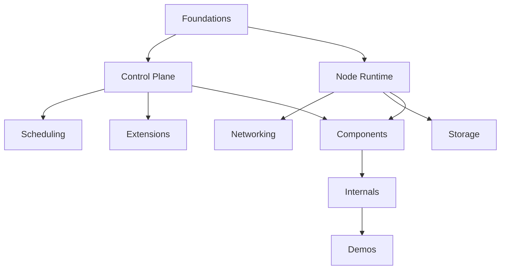

# Kubernetes 学习索引

> 返回 [云原生学习索引](../README.md)

Kubernetes 内容按系统主题组织；组件卡片、源码导读、学习路线、Demo 和题库是领域内的辅助视图，不再散落到跨领域目录。

## 主题入口

| 主题 | 入口 | 关注点 |
| --- | --- | --- |
| 基础 | [Foundations](foundations/README.md) | 集群全局架构与 Borg 背景 |
| 基础设施 | [Infrastructure](infrastructure/README.md) | etcd 与集群持久化基础 |
| 控制面 | [Control Plane](control-plane/README.md) | API、RBAC、Informer |
| 节点 | [Node Runtime](node/README.md) | Probe、OCI、container runtime |
| 调度 | [Scheduling](scheduling/README.md) | Assume/Bind、Scheduler Framework、GPU |
| 网络 | [Networking](networking/README.md) | CNI、Service、kube-proxy、Cilium 与排障 |
| 存储 | [Storage](storage/README.md) | CSI、Volume 生命周期、Sidecar 与排障 |
| 扩展 | [Extension](extension/README.md) | Kubebuilder、Operator、Velero |

## 深入与实践

| 视图 | 入口 | 职责边界 |
| --- | --- | --- |
| 组件拆解 | [Components](components/README.md) | 职责、输入输出、关键链路和故障证据 |
| 源码导读 | [Internals](internals/README.md) | 固定版本下的真实源码调用链 |
| 学习路线 | [Roadmaps](roadmaps/README.md) | 学习顺序、阶段产出和进度 |
| 可运行示例 | [Demos](demos/README.md) | 代码、运行命令、预期结果与环境边界 |
| 复习题库 | [Interview](interview/README.md) | 问答、追问与系统设计复盘 |

## 内容分层约定

- 主题概念页回答“是什么、为什么、如何选”。
- Component 页回答“谁负责、输入输出是什么、故障证据在哪”。
- Internals 页负责逐函数和逐调用链源码，不在其他层重复维护同一源码细节。
- Demo 以实际可运行和可验证为准；题库不作为 canonical 技术正文。
