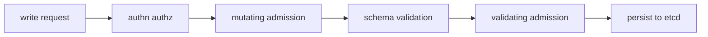

#kubernetes #component #extension #admission

相关笔记：[[k8s-development-roadmap]] | [[controller-runtime-source]] | [[kubebuilder]] | [[operator-pattern]] | [[kube-apiserver-component]] | [[rbac]] | [[k8s-interview]]

# Admission Webhook

## 概述

Admission Webhook 是 apiserver 写入路径上的扩展点，用于在对象持久化前做默认值注入、对象改写和不变量校验。它分为 MutatingAdmissionWebhook 和 ValidatingAdmissionWebhook。

核心边界：**admission 发生在对象写入 etcd 之前；controller reconcile 发生在对象写入之后。**

## 职责边界

| 类型 | 能力 | 例子 |
| --- | --- | --- |
| Mutating Webhook | 修改对象 | 注入 sidecar、默认 resource、补 label |
| Validating Webhook | 拒绝对象 | 校验字段组合、租户策略、不变量 |
| ValidatingAdmissionPolicy | CEL 策略校验 | 简单无副作用校验 |

## 核心链路



## 关键机制

- Mutating webhook 可能多轮执行，因为对象被修改后可能触发重新匹配。
- Validating webhook 不应该修改对象，只能允许或拒绝。
- webhook 服务不可用时，`failurePolicy` 决定 fail open 还是 fail closed。
- `namespaceSelector`、`objectSelector`、`matchPolicy` 决定匹配范围。
- webhook 必须控制延迟，否则会拖慢所有相关写请求。

## 源码导读

| 目标 | 源码位置 | 读什么 |
| --- | --- | --- |
| Admission 接口 | `staging/src/k8s.io/apiserver/pkg/admission/interfaces.go` | `Admit`、`Validate` |
| admission chain | `staging/src/k8s.io/apiserver/pkg/admission/chain.go` | mutating/validating 串联 |
| reinvocation | `staging/src/k8s.io/apiserver/pkg/admission/reinvocation.go` | mutating webhook 重新调用 |
| webhook config manager | `staging/src/k8s.io/apiserver/pkg/admission/configuration/` | watch webhook configuration |
| mutating dispatcher | `staging/src/k8s.io/apiserver/pkg/admission/plugin/webhook/mutating/dispatcher.go` | 调用 mutating webhook |
| validating dispatcher | `staging/src/k8s.io/apiserver/pkg/admission/plugin/webhook/validating/dispatcher.go` | 调用 validating webhook |
| generic webhook | `staging/src/k8s.io/apiserver/pkg/admission/plugin/webhook/generic/` | 匹配规则、REST client |

写请求中的 admission 链路：

```text
request reaches REST handler
  -> create admission.Attributes
  -> mutating admission Admit
      -> built-in mutators
      -> mutating webhook dispatcher
      -> optional reinvocation
  -> object schema validation
  -> validating admission Validate
      -> built-in validators
      -> validating webhook dispatcher
  -> storage write
```

精简源码骨架：

```go
type Interface interface {
    Handles(operation Operation) bool
}

type MutationInterface interface {
    Admit(ctx context.Context, a Attributes, o ObjectInterfaces) error
}

type ValidationInterface interface {
    Validate(ctx context.Context, a Attributes, o ObjectInterfaces) error
}

func (d *validatingDispatcher) Dispatch(ctx context.Context, attr Attributes, hooks []Hook) error {
    for _, hook := range hooks {
        if shouldCall(hook, attr) {
            if err := d.callHook(ctx, hook, attr); err != nil {
                return handleFailurePolicy(hook, err)
            }
        }
    }
    return nil
}
```

## 深入：Mutating/Validating webhook 如何被 apiserver 调用

这条链路回答一个具体问题：**创建 Pod 时，apiserver 如何判断哪些 webhook 要调用、调用失败怎么处理、为什么 webhook 会拖慢整个写路径？**

### 0. 前置条件

| 前置项 | 说明 |
| --- | --- |
| WebhookConfiguration 已存在 | Mutating 或 Validating 配置已写入 apiserver |
| webhook Service 可访问 | apiserver 能解析 DNS、建立 TLS、访问 endpoint |
| CA bundle 正确 | apiserver 能校验证书 |
| 匹配规则命中 | operation、resource、namespaceSelector、objectSelector 等匹配 |

核心边界：Admission Webhook 发生在持久化之前，是同步请求路径；Controller 发生在持久化之后，是异步收敛。

### 1. REST handler 构造 Admission Attributes

源码入口：`staging/src/k8s.io/apiserver/pkg/endpoints/handlers/create.go`

create/update/delete 请求进入 REST handler 后会构造 attributes：

```text
request decoded
  -> admission.NewAttributesRecord
  -> mutating admission Admit
  -> validating admission Validate
  -> storage write
```

Attributes 里包含 operation、kind、resource、subresource、namespace、name、object、oldObject、userInfo、dryRun 等。

### 2. 匹配 webhook

源码入口：`staging/src/k8s.io/apiserver/pkg/admission/plugin/webhook/generic/`

匹配不是只看 URL：

| 条件 | 说明 |
| --- | --- |
| `rules` | operation、apiGroups、apiVersions、resources、scope |
| `namespaceSelector` | 根据 namespace labels 匹配 |
| `objectSelector` | 根据对象 labels 匹配 |
| `matchPolicy` | `Exact` 或 `Equivalent` |
| `matchConditions` | CEL 条件 |
| `sideEffects` | dry-run 请求必须满足无副作用要求 |

很多“webhook 没生效”根因是规则没匹配，而不是服务没收到请求。

### 3. Mutating webhook 调用和 reinvocation

源码入口：

- `staging/src/k8s.io/apiserver/pkg/admission/chain.go`
- `staging/src/k8s.io/apiserver/pkg/admission/reinvocation.go`
- `staging/src/k8s.io/apiserver/pkg/admission/plugin/webhook/mutating/dispatcher.go`

链路：

```text
Mutating admission
  -> built-in mutators
  -> mutating webhook dispatcher
      -> send AdmissionReview
      -> receive JSONPatch
      -> apply patch to object
  -> optional reinvocation
```

精简骨架：

```go
func (d *mutatingDispatcher) Dispatch(ctx context.Context, attr admission.Attributes, hooks []Hook) error {
    for _, hook := range hooks {
        if !shouldCall(hook, attr) {
            continue
        }
        review := buildAdmissionReview(attr)
        response, err := d.callHook(ctx, hook, review)
        if err != nil {
            return handleFailurePolicy(hook, err)
        }
        applyPatch(attr.GetObject(), response.Patch)
    }
    return nil
}
```

### 4. Validating webhook 只允许或拒绝

源码入口：`staging/src/k8s.io/apiserver/pkg/admission/plugin/webhook/validating/dispatcher.go`

Validating webhook 不应该修改对象，只返回 allowed 或 denied：

```text
Validating admission
  -> built-in validators
  -> validating webhook dispatcher
      -> send AdmissionReview
      -> if denied return StatusError
  -> storage write
```

### 5. failurePolicy 和 timeout

| 配置 | 含义 | 风险 |
| --- | --- | --- |
| `failurePolicy: Fail` | webhook 调用失败则拒绝请求 | webhook 挂掉会阻断写入 |
| `failurePolicy: Ignore` | webhook 调用失败则放行 | 策略可能被绕过 |
| `timeoutSeconds` | 单个 webhook 调用超时 | 太大拖慢 apiserver，太小误拒绝 |
| `namespaceSelector` | 排除系统 namespace 或限定租户 | 配错会导致系统组件被拦截 |

### 6. 失败点与排查映射

| 现象 | 对应阶段 | 先看哪里 |
| --- | --- | --- |
| `failed calling webhook` | 网络/TLS/Service | endpoints、CA bundle、DNS、证书 SAN |
| 创建对象超时 | webhook latency | webhook logs、timeoutSeconds、外部依赖 |
| kube-system 被拦截 | 匹配规则 | namespaceSelector/objectSelector |
| webhook 自己起不来 | 自拦截 | failurePolicy、namespace 排除、启动顺序 |
| 对象没被注入 | mutating 未命中 | rules、matchPolicy、objectSelector、reinvocation |

## 源码阅读重点

### 匹配先于调用

webhook 是否被调用，取决于 operation、apiGroup、apiVersion、resource、scope、namespaceSelector、objectSelector、matchConditions 等条件。很多“webhook 没生效”不是服务没收到请求，而是根本没匹配上。

### failurePolicy 是可用性开关

`Fail` 保护一致性，但 webhook 不可用会阻断写请求；`Ignore` 保护可用性，但策略可能被绕过。生产里通常要配合 namespaceSelector、超时和高可用部署。

### Mutating Reinvocation

Mutating webhook 改了对象后，前面某些 webhook 可能需要再次执行。不要写依赖调用顺序的脆弱逻辑，尤其是多个 webhook 都在改 Pod 时。

## 故障信号

| 现象 | 常见方向 |
| --- | --- |
| 创建资源超时 | webhook service 不可达、TLS、DNS |
| kube-system 资源被拦截 | namespaceSelector 缺失 |
| webhook 自己起不来 | 自拦截死锁、failurePolicy |
| 写请求整体变慢 | webhook 延迟高、外部依赖慢 |

## 事故排查

### 先判断故障层级

Admission 事故要先看 apiserver 返回错误：

| 错误 | 优先方向 |
| --- | --- |
| `failed calling webhook` | Service、Endpoints、TLS、DNS |
| `denied the request` | webhook 业务校验 |
| request timeout | webhook 延迟或网络 |
| 某些 namespace 正常某些失败 | selector/matchConditions |
| webhook Pod 自己无法创建 | 自拦截和 failurePolicy |

### Event 保留时间

Webhook 失败主要体现在 apiserver 返回错误和审计日志里，相关 Pod/Deployment Event 默认只保留 `1h`，由 kube-apiserver `--event-ttl` 控制。事故时要保存 apiserver 错误、WebhookConfiguration、webhook Pod logs 和 audit 片段。

### 证据保全

| 证据 | 用途 |
| --- | --- |
| WebhookConfiguration YAML | rules、selectors、failurePolicy、timeout、caBundle |
| webhook Service/Endpoints | apiserver 是否能连到后端 |
| webhook Pod logs | 业务拒绝、panic、证书错误 |
| apiserver audit/logs | 请求被哪个 webhook 拒绝或超时 |
| namespace/object labels | 判断匹配规则 |

### 常见事故路径

1. 控制面大量写请求卡住时，先查最近变更的 webhook 配置和 latency。
2. `failurePolicy: Fail` 的 webhook 必须高可用，并排除自身 namespace 或保证启动顺序。
3. TLS 错误优先查 `caBundle` 和 webhook Service DNS 名是否在证书 SAN 内。
4. 简单策略优先考虑 ValidatingAdmissionPolicy/CEL，减少同步 HTTP webhook 风险。

## 排查命令

```bash
kubectl get mutatingwebhookconfiguration
kubectl get validatingwebhookconfiguration
kubectl describe mutatingwebhookconfiguration <name>
kubectl get svc,endpoints -n <webhook-namespace>
kubectl logs -n <webhook-namespace> deploy/<webhook-deployment> --tail=300
kubectl get events -A --sort-by=.lastTimestamp
```

## 面试要点

### Q: Mutating 和 Validating Webhook 区别？

> [!question]- 参考答案（点击展开）
>
> Mutating 可以修改对象，常用于默认值和注入；Validating 只能校验并允许或拒绝，常用于不变量和策略。

### Q: Webhook 和 Controller 怎么分工？

> [!question]- 参考答案（点击展开）
>
> Webhook 负责写入前的同步校验/改写；Controller 负责写入后的异步 reconcile，把期望状态收敛到实际状态。

### Q: `failurePolicy: Fail` 有什么风险？

> [!question]- 参考答案（点击展开）
>
> webhook 不可用时匹配资源的写请求会失败。若没有排除系统 namespace，可能导致核心组件或 webhook 自身无法恢复。

### Q: 为什么 webhook 不能依赖慢外部服务？

> [!question]- 参考答案（点击展开）
>
> 它在 apiserver 请求路径上，会直接放大写请求延迟和失败率，严重时影响整个集群控制面。

### Q: 简单校验一定要写 webhook 吗？

> [!question]- 参考答案（点击展开）
>
> 不一定。字段级或简单表达式校验可以优先考虑 CRD schema、CEL validation 或 ValidatingAdmissionPolicy。
