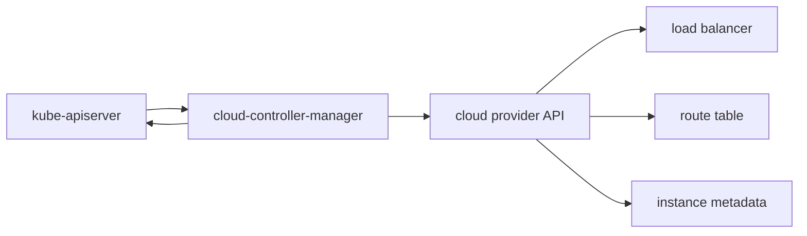

#kubernetes #component #control-plane #cloud

相关笔记：[[k8s-development-roadmap]] | [[kube-controller-manager-component]] | [[service]] | [[cloud-provider-csi]] | [[csi-driver-component]] | [[kube-apiserver-component]] | [[k8s-interview]]

# cloud-controller-manager

## 概述

`cloud-controller-manager` 把 Kubernetes 核心控制面和云厂商 API 解耦。它运行云相关控制器，让 Kubernetes 主仓不再内置每个云厂商的实现细节。

核心边界：它处理云基础设施对象，例如云主机、路由、负载均衡器；存储卷能力更多由 CSI driver 承担。

## 职责边界

| 控制器 | 职责 |
| --- | --- |
| NodeController | 从云 API 校验 Node 是否仍存在 |
| RouteController | 为 Pod CIDR 配置云路由 |
| ServiceController | 为 `LoadBalancer` Service 创建云负载均衡器 |
| CloudNodeLifecycleController | 处理云节点生命周期相关状态 |

## 核心链路



## 关键机制

- `Service type=LoadBalancer` 通常由 cloud-controller-manager 创建外部负载均衡器。
- Node 地址、zone、instance type 等信息可由云控制器补全。
- cloud provider 逻辑从树内迁到树外，降低 Kubernetes 主仓复杂度。
- 云盘 attach/detach 逻辑历史上在云控制器里，现在主流方向是 CSI driver。

## 源码导读

| 目标 | 源码位置 | 读什么 |
| --- | --- | --- |
| 进程入口 | `cmd/cloud-controller-manager/main.go` | cloud provider 初始化 |
| 通用 CCM 框架 | `staging/src/k8s.io/cloud-provider/app/controllermanager.go` | `NewCloudControllerManagerCommand`、`Run` |
| 云 provider 接口 | `staging/src/k8s.io/cloud-provider/cloud.go`、`plugins.go` | `Interface`、`InitCloudProvider` |
| Service controller | `staging/src/k8s.io/cloud-provider/controllers/service/` | LoadBalancer 创建/更新/删除 |
| Route controller | `staging/src/k8s.io/cloud-provider/controllers/route/route_controller.go` | Node PodCIDR 到云路由表 |
| Node controller | `staging/src/k8s.io/cloud-provider/controllers/node/` | 节点地址、实例存在性 |

启动链路：

```text
main
  -> cloudprovider.InitCloudProvider
  -> app.NewCloudControllerManagerCommand
  -> Run
  -> create controller context
  -> start service / route / node controllers
```

精简源码骨架：

```go
func main() {
    cloud := cloudprovider.InitCloudProvider(name, configFile)
    cmd := app.NewCloudControllerManagerCommand(opts, cloud, controllers)
    cmd.Execute()
}

func startServiceController(ctx context.Context, cloud Interface) {
    lb, ok := cloud.LoadBalancer()
    if !ok {
        return
    }
    controller := service.NewController(lb, client, informers)
    controller.Run(ctx)
}
```

## 深入：LoadBalancer Service 如何创建云 LB

这条链路回答一个具体问题：**用户创建 `type: LoadBalancer` Service 后，cloud-controller-manager 如何调用云 API 创建负载均衡器，并把入口地址写回 Service status？**

### 0. 前置条件

| 前置项 | 说明 |
| --- | --- |
| Service 类型正确 | `spec.type=LoadBalancer` |
| CCM 正在运行且是 leader | 避免多个实例重复创建云资源 |
| cloud provider 支持 LoadBalancer | `cloud.LoadBalancer()` 返回可用接口 |
| 云凭证和权限可用 | 需要创建 LB、监听、后端、SG/防火墙等 |
| Node 地址可用 | 云 LB 需要知道后端节点或 Pod/ENI 目标 |

核心边界：CCM 写的是 Service status 和云侧资源；kube-proxy/CNI 仍负责集群内 Service 转发和 Pod 网络。

### 1. Service 事件入队

源码入口：`staging/src/k8s.io/cloud-provider/controllers/service/controller.go`

Service controller watch Service，发现 `LoadBalancer` 类型后入队：

```text
Service informer event
  -> enqueueService
  -> workqueue key: <namespace>/<name>
  -> worker
  -> syncService
```

精简骨架：

```go
func (c *Controller) syncService(ctx context.Context, key string) error {
    namespace, name := cache.SplitMetaNamespaceKey(key)
    service := c.serviceLister.Services(namespace).Get(name)
    if service.Spec.Type != v1.ServiceTypeLoadBalancer {
        return c.processServiceDelete(ctx, service)
    }
    return c.ensureLoadBalancer(ctx, service)
}
```

### 2. 调云 provider 创建或更新 LB

云 provider 接口是 CCM 的核心契约：

```go
type LoadBalancer interface {
    GetLoadBalancer(ctx context.Context, clusterName string, service *v1.Service) (*v1.LoadBalancerStatus, bool, error)
    EnsureLoadBalancer(ctx context.Context, clusterName string, service *v1.Service, nodes []*v1.Node) (*v1.LoadBalancerStatus, error)
    UpdateLoadBalancer(ctx context.Context, clusterName string, service *v1.Service, nodes []*v1.Node) error
    EnsureLoadBalancerDeleted(ctx context.Context, clusterName string, service *v1.Service) error
}
```

简化链路：

```text
syncService
  -> get nodes
  -> ensure finalizer
  -> cloud.LoadBalancer.EnsureLoadBalancer
      -> create/update cloud LB
      -> configure listeners / target groups / firewall
  -> patch service.status.loadBalancer.ingress
```

### 3. 删除和 finalizer

LoadBalancer Service 删除时，CCM 不能只让 Kubernetes 对象消失，还要清理云资源：

```text
Service deletionTimestamp set
  -> processServiceDelete
  -> EnsureLoadBalancerDeleted
  -> remove finalizer
  -> Service can be fully deleted
```

finalizer 是防云资源泄漏的关键。如果 CCM 没权限删除云 LB，Service 可能长时间卡在 terminating。

### 4. 失败点与排查映射

| 现象 | 对应阶段 | 先看哪里 |
| --- | --- | --- |
| EXTERNAL-IP Pending | `EnsureLoadBalancer` 未成功 | CCM logs、Service event、云权限/quota |
| LB 创建了但后端不健康 | 节点/Pod 目标注册 | Node security group、health check、NodePort |
| 删除 Service 后云 LB 泄漏 | finalizer/delete 失败 | Service finalizers、CCM logs、云 API 权限 |
| Node 地址错误 | Node controller/provider | Node `.status.addresses`、metadata API |
| 只某些 zone 不通 | subnet/route/zone | Service annotations、Node zone labels、云侧后端 |

## 源码阅读重点

### Cloud Provider Interface

CCM 的核心抽象是云厂商接口。读接口比读某个云厂商实现更重要，因为它决定了 Kubernetes 期望云 provider 提供哪些能力：Instances、LoadBalancer、Routes、Zones、Clusters 等。

### Service LoadBalancer

Service controller 的关键输入是 `Service` 对象，关键输出是云负载均衡器和 `service.status.loadBalancer.ingress`。排障时对象状态、event 和云侧资源必须一起看。

### 树外云厂商实现

真实生产里常用的是树外 cloud provider，例如 AWS、Azure、GCP、OpenStack 各自的 cloud-controller-manager。Kubernetes 主仓里的 staging 接口是共同契约，不代表所有云厂商实现细节。

## 故障信号

| 现象 | 常见方向 |
| --- | --- |
| LoadBalancer 一直 Pending | cloud controller、权限、quota、subnet/security group |
| Node 地址不正确 | cloud provider 配置、metadata API |
| 路由不通 | RouteController、PodCIDR、云路由表 |
| 云资源泄漏 | finalizer、删除事件失败、权限不足 |

## 事故排查

### 先判断故障层级

LoadBalancer 事故按“Service 对象、CCM、云资源、节点后端、集群内转发”分层：

| 检查 | 结论 |
| --- | --- |
| Service 没有 event/status | CCM 未处理或事件已过期 |
| 云侧没有 LB | CCM 权限、quota、subnet 参数 |
| 云侧 LB 有但 backend unhealthy | NodePort、防火墙、health check、kube-proxy |
| 集群内 ClusterIP 不通 | 不是 CCM 主问题，转 kube-proxy/CNI |

### Event 保留时间

CCM 会把云 API 失败写到 Service Event，但 Event 默认只保留 `1h`，由 kube-apiserver `--event-ttl` 控制。云侧资源创建慢或异步失败时，要及时保存 Service event 和 CCM 日志。

### 证据保全

| 证据 | 用途 |
| --- | --- |
| Service YAML | annotations、finalizers、status、ports |
| Service events | 云 API 用户可读错误 |
| CCM logs | provider 返回的具体错误 |
| Node addresses/labels | LB 后端和 zone/subnet 选择 |
| 云侧 LB 配置 | listener、target、health check、安全组 |

### 常见事故路径

1. `EXTERNAL-IP Pending` 先看 Service event，再查 CCM 日志。没有 event 不代表没错误，可能已经超过 Event TTL。
2. 云 LB 创建成功但访问失败，先查后端健康检查和 NodePort，再查 kube-proxy。
3. Service 删除卡住时看 finalizer。finalizer 还在通常说明云资源清理没成功。
4. 多云或私有云环境要确认树外 CCM 版本和 Kubernetes 版本兼容。

## 排查命令

```bash
kubectl describe svc <service> -n <namespace>
kubectl get svc <service> -n <namespace> -o yaml
kubectl get nodes -o wide
kubectl get events -n <namespace> --sort-by=.lastTimestamp
kubectl -n kube-system logs deploy/cloud-controller-manager --tail=300
```

## 面试要点

### Q: 为什么需要 cloud-controller-manager？

A: Kubernetes 需要和云厂商 API 协作，但不应该把每个云厂商实现都放进核心控制器。cloud-controller-manager 把云相关逻辑外置，降低核心组件耦合。

### Q: `LoadBalancer` Service 是谁创建云负载均衡器？

A: 通常由 cloud-controller-manager 的 ServiceController watch Service 后调用云 API 创建，并把外部地址写回 Service status。

### Q: cloud-controller-manager 和 CSI 的边界？

A: cloud-controller-manager 偏 Node、Route、LoadBalancer；CSI 偏卷的创建、attach、mount、扩容和快照。

### Q: 为什么树内 cloud provider 被逐步移除？

A: 树内实现让 Kubernetes 主仓承担大量云厂商代码和发布节奏耦合。树外 provider 可以独立迭代、测试和发布。

### Q: 排查 LoadBalancer Pending 看什么？

A: 先看 Service event，再看 cloud-controller-manager 日志和云侧权限、quota、子网、安全组、负载均衡器配额。
