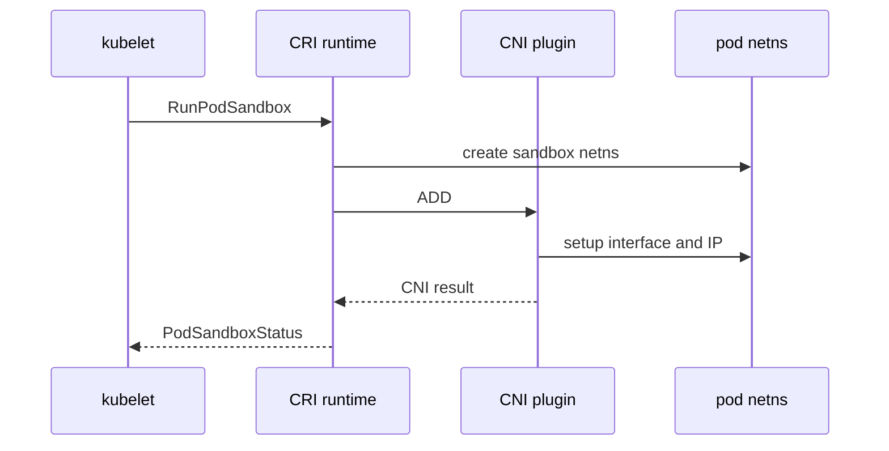

#kubernetes #component #networking #cni

相关笔记：[[k8s-development-roadmap]] | [[cni]] | [[cni-source]] | [[network-model]] | [[calico]] | [[cilium]] | [[cilium-deep-dive]] | [[flannel]] | [[multus]] | [[cni-troubleshooting]] | [[container-runtime-component]] | [[k8s-interview]]

# CNI Plugin

## 概述

CNI Plugin 负责把 Pod sandbox 接入网络，包括创建 veth、分配 Pod IP、配置路由和执行网络策略等。Kubernetes 通过 CRI runtime 间接触发 CNI，常见实现包括 Calico、Cilium、Flannel、Weave、Multus。

核心边界：**CNI 管 Pod 网络，kube-proxy 管 Service 转发，CoreDNS 管名字解析。**

## 职责边界

| 职责 | 说明 |
| --- | --- |
| IPAM | 给 Pod 分配 IP |
| interface | 创建 veth 或其他网络接口 |
| route | 配置默认路由和跨节点路由 |
| policy | 实现 NetworkPolicy 或扩展策略 |
| chaining | 支持多个 CNI 插件串联 |
| datapath | bridge、routing、VXLAN、BGP、eBPF 等 |

## 核心链路



## 关键机制

- CNI 插件是可执行文件，通过 env 和 stdin JSON 接收参数。
- `ADD` 创建网络，`DEL` 清理网络，`CHECK` 校验状态。
- containerd/CRI-O 读取 `/etc/cni/net.d` 配置并执行 `/opt/cni/bin` 下的插件。
- Calico 偏路由和策略，Flannel 偏 overlay，Cilium 基于 eBPF 扩展数据面。
- Multus 允许一个 Pod 挂多张网卡。

## 源码导读

CNI 不在 Kubernetes 主仓实现，Kubernetes 侧只通过 CRI runtime 间接触发。读源码要分三块：

| 目标 | 源码位置 | 读什么 |
| --- | --- | --- |
| CNI 规范和 libcni | `github.com/containernetworking/cni/libcni` | `AddNetworkList`、`DelNetworkList`、`CheckNetworkList` |
| CNI 插件库 | `github.com/containernetworking/plugins/plugins/main/bridge` | bridge 插件如何创建 veth |
| IPAM | `github.com/containernetworking/plugins/plugins/ipam/host-local` | IP 分配和本地文件状态 |
| containerd 调用 CNI | `github.com/containerd/containerd` CRI plugin | sandbox 网络初始化 |
| kubelet 触发点 | `pkg/kubelet/kuberuntime/kuberuntime_sandbox.go` | `RunPodSandbox` |
| Kubernetes CNI 源码笔记 | [[cni-source]] | CNI 规范、libcni、主流插件对照 |

CNI 调用模型：

```text
kubelet
  -> CRI RunPodSandbox
  -> runtime creates sandbox netns
  -> runtime loads /etc/cni/net.d/*.conflist
  -> libcni AddNetworkList
  -> exec /opt/cni/bin/<plugin>
  -> plugin writes stdout JSON result
  -> runtime returns PodSandboxStatus
```

精简插件骨架：

```go
func cmdAdd(args *skel.CmdArgs) error {
    conf := loadNetConf(args.StdinData)
    netns := openNetNS(args.Netns)
    hostVeth, contVeth := createVethPair()
    moveToNetNS(contVeth, netns)
    ip := ipamAllocate(conf.IPAM, args.ContainerID)
    configureInterface(netns, args.IfName, ip)
    return printResult(ip, hostVeth, contVeth)
}

func cmdDel(args *skel.CmdArgs) error {
    releaseIP(args.ContainerID)
    cleanupInterface(args.Netns, args.IfName)
    return nil
}
```

## 深入：runtime 调 CNI ADD 如何创建 Pod 网络

这条链路回答一个具体问题：**kubelet 创建 Pod sandbox 时，containerd/CRI-O 如何调用 CNI 插件，让 Pod 获得 IP、网卡和路由？**

### 0. 前置条件

| 前置项 | 说明 |
| --- | --- |
| runtime 已创建 sandbox netns | `RunPodSandbox` 阶段准备网络命名空间 |
| CNI 配置存在 | `/etc/cni/net.d/*.conf` 或 `*.conflist` |
| CNI binary 存在 | `/opt/cni/bin/<plugin>` 可执行 |
| IPAM 可用 | 本地或集中式地址分配状态正常 |
| plugin daemon 正常 | Calico/Cilium 等需要节点 daemon 配合 |

核心边界：CNI 插件只负责 Pod 网络接入；Service VIP、DNS、Ingress 是其他组件的职责。

### 1. runtime 读取 CNI 配置

runtime 在 `RunPodSandbox` 中加载 CNI 配置：

```text
RunPodSandbox
  -> create sandbox netns
  -> load /etc/cni/net.d/*.conflist
  -> build CNI runtime config
  -> libcni.AddNetworkList
```

配置决定主插件、IPAM、chaining、capabilities 等行为。多个配置文件同时存在时，runtime 的选择顺序本身就可能导致事故。

### 2. libcni 以进程协议调用插件

CNI 不是 Kubernetes API，也不是 gRPC。它是 env + stdin/stdout 的进程协议：

| 输入 | 内容 |
| --- | --- |
| `CNI_COMMAND=ADD` | 要执行创建网络 |
| `CNI_CONTAINERID` | sandbox/container id |
| `CNI_NETNS` | Pod network namespace 路径 |
| `CNI_IFNAME` | 容器内网卡名，常见 `eth0` |
| stdin JSON | 网络配置、IPAM、capabilities |
| stdout JSON | CNI result，包含 IP、route、interface |

精简骨架：

```go
func AddNetworkList(ctx context.Context, conf NetworkConfigList, rt RuntimeConf) (Result, error) {
    var result Result
    for _, plugin := range conf.Plugins {
        env := buildCNIEnv("ADD", rt)
        stdin := injectPrevResult(plugin.Conf, result)
        result = execPlugin(plugin.Path, env, stdin)
    }
    return result, nil
}
```

### 3. 主插件创建接口并调用 IPAM

以 bridge/host-local 思路为例：

```text
plugin ADD
  -> parse stdin config
  -> open CNI_NETNS
  -> create veth pair
  -> move container side into netns as eth0
  -> IPAM allocate IP
  -> configure IP and routes inside netns
  -> configure host side bridge/route
  -> print result JSON
```

不同插件的数据面不同：

| 插件 | 常见实现方式 |
| --- | --- |
| Flannel | overlay/VXLAN/host-gw，策略能力弱 |
| Calico | 路由/BGP/IPIP/VXLAN + policy |
| Cilium | eBPF datapath + policy + kube-proxy replacement |
| Multus | meta plugin，调用多个 delegate CNI |

### 4. runtime 返回 PodSandboxStatus

CNI `ADD` 成功后，runtime 把 Pod IP 放到 sandbox status。kubelet 后续通过 CRI `PodSandboxStatus` 拿到 Pod IP，并更新 Pod status。

如果 CNI 失败，kubelet 通常只看到 `FailedCreatePodSandBox`，真实原因在 runtime/CNI 日志或插件 daemon 中。

### 5. 失败点与排查映射

| 现象 | 对应阶段 | 先看哪里 |
| --- | --- | --- |
| `no CNI configuration file` | 读取配置 | `/etc/cni/net.d` |
| `failed to find plugin` | 执行插件 | `/opt/cni/bin`、权限、架构 |
| IP 分配失败 | IPAM | host-local 状态、IP 池、Cilium/Calico IPAM |
| Pod 有 IP 但跨节点不通 | datapath | 路由、tunnel、BGP、MTU、防火墙 |
| NetworkPolicy 不生效 | policy engine | 插件是否支持、selector、namespace |
| 删除后 IP 不释放 | `DEL`/IPAM | runtime cleanup、插件幂等、IPAM 状态 |

## 源码阅读重点

### env + stdin/stdout

CNI 的接口不是 Go interface，而是进程协议。runtime 通过环境变量传 `CNI_COMMAND`、`CNI_CONTAINERID`、`CNI_NETNS`、`CNI_IFNAME`，通过 stdin 传网络配置 JSON，插件通过 stdout 返回 result JSON。

### 幂等性

`ADD` 和 `DEL` 必须尽量幂等。runtime、kubelet、节点重启都会制造重复调用或半失败状态。插件不能假设“每个 ADD 一定只调用一次”。

### 主插件和 IPAM

bridge/calico/cilium 这类主插件负责网络设备和路由，IPAM 负责地址分配。很多 Pod 无 IP 问题根因在 IPAM 状态，而不是 veth 创建。

## 故障信号

| 现象 | 常见方向 |
| --- | --- |
| FailedCreatePodSandBox | CNI 配置、插件二进制、IPAM、权限 |
| Pod 无 IP | IPAM、CNI daemon、runtime 调用失败 |
| 跨节点 Pod 不通 | 路由、overlay、BGP、MTU、防火墙 |
| NetworkPolicy 不生效 | CNI 是否支持 policy、selector、namespace |

## 事故排查

### 先判断故障层级

CNI 事故先区分创建失败、连通性失败、策略失败：

| 检查 | 结论 |
| --- | --- |
| Pod 卡 `ContainerCreating` 且 event 是 sandbox 失败 | CNI ADD/runtime 阶段 |
| Pod 有 IP 但同节点不通 | veth/bridge/eBPF/iptables/NetworkPolicy |
| 同节点通跨节点不通 | 路由、overlay、BGP、MTU、防火墙 |
| Service 不通但 Pod IP 通 | 转 kube-proxy/eBPF Service |

### Event 保留时间

CNI 失败通常通过 kubelet 写成 Pod Event，例如 `FailedCreatePodSandBox`，默认只保留 `1h`，由 kube-apiserver `--event-ttl` 控制。事故发生后要立即保存 Pod event、kubelet 日志、runtime 日志和 CNI daemon 日志。

### 证据保全

| 证据 | 用途 |
| --- | --- |
| CNI config | 确认插件链、IPAM、capabilities |
| CNI binary | 版本、权限、是否缺失 |
| runtime logs | CNI ADD/DEL 的直接错误 |
| plugin daemon logs | Calico/Cilium 等控制面和 datapath 错误 |
| Pod netns/interface | 验证 IP、route、MTU |
| IPAM 状态 | 判断 IP 泄漏或耗尽 |

### 常见事故路径

1. `FailedCreatePodSandBox` 先看 event message 中的 CNI 错误，再到节点查 runtime 和 CNI daemon。
2. Pod IP 已分配但跨节点不通时，不要继续查 kubelet 拉容器，转查路由、tunnel、BGP、MTU。
3. NetworkPolicy 不生效要先确认当前 CNI 是否实现 policy，Flannel 本身不提供完整 policy。
4. IP 池耗尽会表现为新 Pod 无法创建网络，老 Pod 通常仍然正常。

## 排查命令

```bash
ls -l /etc/cni/net.d
ls -l /opt/cni/bin
journalctl -u kubelet -n 300 --no-pager
journalctl -u containerd -n 300 --no-pager
crictl pods
crictl inspectp <pod-sandbox-id>
kubectl -n kube-system get pods -o wide
kubectl describe pod <pod> -n <namespace>
ip link
ip route
```

## 面试要点

### Q: kubelet 是否直接执行 CNI 插件？

A: 现代 Kubernetes 中不是。kubelet 调 CRI runtime 创建 Pod sandbox，runtime 读取 CNI 配置并执行插件。

### Q: CNI 插件必须实现哪些命令？

A: 常见命令是 `ADD`、`DEL`、`CHECK`、`VERSION`。`ADD` 和 `DEL` 必须尽量幂等，因为 runtime 可能重试。

### Q: Calico、Flannel、Cilium 最大区别？

A: Flannel 主要提供简单 Pod 网络；Calico 强在路由和 NetworkPolicy；Cilium 用 eBPF 实现网络、策略、Service 转发和可观测性。

### Q: Pod IP 是谁分配的？

A: 由 CNI 的 IPAM 逻辑分配。具体实现可能是 host-local、本地 daemon 或集中式 IPAM。

### Q: CNI 和 Service 有什么关系？

A: CNI 保证 Pod IP 可达；Service 的 ClusterIP 转发由 kube-proxy 或 eBPF CNI 的 kube-proxy replacement 实现。
