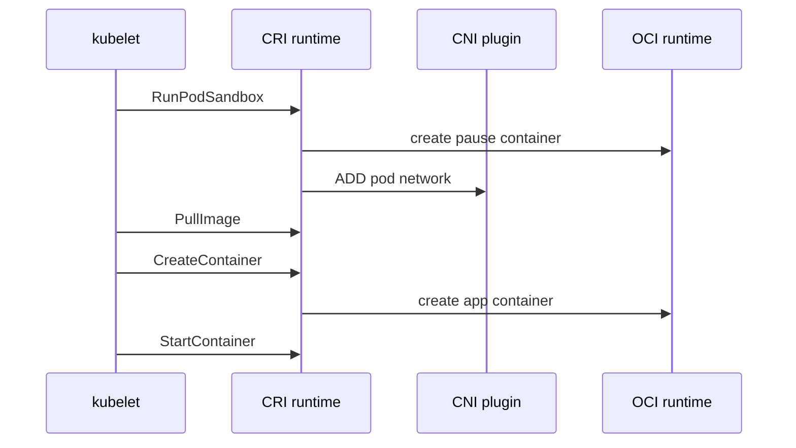

#kubernetes #component #node #cri #runtime

相关笔记：[[k8s-development-roadmap]] | [[kubelet-component]] | [[kubelet-cri-source]] | [[cri-source]] | [[oci-runtime]] | [[demo-fake-cri]] | [[cni-plugin-component]] | [[k8s-interview]]

# Container Runtime

## 概述

Container runtime 是节点上真正管理容器生命周期的组件，常见实现是 containerd 和 CRI-O。kubelet 不直接 fork 容器进程，而是通过 CRI 调用 runtime，再由 runtime 调用 OCI runtime（如 runc）创建 Linux 进程。

## 职责边界

| 层级 | 例子 | 职责 |
| --- | --- | --- |
| CRI runtime | containerd、CRI-O | 实现 Kubernetes CRI |
| low-level runtime | runc、crun | 按 OCI spec 创建容器进程 |
| image service | containerd image store | 拉取、解包、管理镜像 |
| sandbox | pause container | 为 Pod 提供共享 netns 等基础命名空间 |

## 核心链路



## 关键机制

- CRI 分 RuntimeService 和 ImageService。
- Pod sandbox 通常由 pause 容器承载共享 namespace。
- containerd 通过 shim 管理容器进程，runtime 重启不应直接杀掉容器。
- OCI runtime 负责最终的 namespace、cgroup、mount、seccomp、capabilities 等系统调用配置。
- dockershim 已从 Kubernetes 移除，Docker Engine 不再作为内置 runtime 路径。

## 源码导读

Kubernetes 侧只读 CRI client 和 kubelet runtime manager；containerd/CRI-O 的实现要到各自仓库继续读。

| 目标 | 源码位置 | 读什么 |
| --- | --- | --- |
| kubelet runtime manager | `pkg/kubelet/kuberuntime/kuberuntime_manager.go` | `kubeGenericRuntimeManager` |
| sandbox 创建 | `pkg/kubelet/kuberuntime/kuberuntime_sandbox.go` | `RunPodSandbox` 调用 |
| 容器创建 | `pkg/kubelet/kuberuntime/kuberuntime_container.go` | `startContainer` |
| CRI runtime client | `staging/src/k8s.io/cri-client/pkg/remote_runtime.go` | `NewRemoteRuntimeService`、`RunPodSandbox` |
| CRI image client | `staging/src/k8s.io/cri-client/pkg/remote_image.go` | `PullImage`、`ImageStatus` |
| CRI API | `staging/src/k8s.io/cri-api/pkg/apis/runtime/v1/` | RuntimeService、ImageService proto |
| containerd CRI | `github.com/containerd/containerd/pkg/cri` 或新版本 CRI plugin | sandbox/container 实现 |

Pod 创建链路：

```text
kubelet syncPod
  -> kubeGenericRuntimeManager.SyncPod
  -> createPodSandbox
      -> runtimeService.RunPodSandbox
      -> runtime configures netns through CNI
  -> startContainer
      -> imageService.PullImage
      -> runtimeService.CreateContainer
      -> runtimeService.StartContainer
```

精简源码骨架：

```go
func (m *kubeGenericRuntimeManager) SyncPod(ctx context.Context, pod *v1.Pod) error {
    sandboxID := m.createPodSandbox(ctx, pod)
    for _, c := range pod.Spec.Containers {
        m.startContainer(ctx, sandboxID, c, pod)
    }
    return nil
}

func (r *remoteRuntimeService) RunPodSandbox(ctx context.Context, cfg *PodSandboxConfig, handler string) (string, error) {
    resp, err := r.runtimeClient.RunPodSandbox(ctx, &RunPodSandboxRequest{
        Config: cfg,
        RuntimeHandler: handler,
    })
    return resp.PodSandboxId, err
}
```

## 深入：CRI RunPodSandbox/CreateContainer 如何落到 OCI runtime

这条链路回答一个具体问题：**kubelet 发出 CRI 请求后，containerd/CRI-O 如何创建 Pod sandbox、配置网络，并最终让 runc/crun 启动业务容器进程？**

### 0. 前置条件

| 前置项 | 说明 |
| --- | --- |
| kubelet runtime endpoint 可用 | 例如 `unix:///run/containerd/containerd.sock` |
| CRI runtime 插件正常 | containerd CRI plugin 或 CRI-O 正在运行 |
| pause image 可拉取 | sandbox 需要基础容器镜像 |
| CNI 配置可用 | runtime 能找到 CNI config 和 plugin binary |
| OCI runtime 可用 | runc/crun 二进制和 runtime handler 配置正确 |

核心边界：kubelet 只调用 CRI；runtime 负责把 CRI 转成镜像、snapshot、CNI、OCI spec 和 runc/crun 调用。

### 1. kubelet 通过 CRI client 发请求

源码入口：

- `pkg/kubelet/kuberuntime/kuberuntime_sandbox.go`
- `pkg/kubelet/kuberuntime/kuberuntime_container.go`
- `staging/src/k8s.io/cri-client/pkg/remote_runtime.go`
- `staging/src/k8s.io/cri-client/pkg/remote_image.go`

简化调用栈：

```text
kubeGenericRuntimeManager.SyncPod
  -> createPodSandbox
      -> remoteRuntimeService.RunPodSandbox
  -> startContainer
      -> imageService.PullImage
      -> remoteRuntimeService.CreateContainer
      -> remoteRuntimeService.StartContainer
```

CRI 请求里最重要的对象：

| 对象 | 说明 |
| --- | --- |
| `PodSandboxConfig` | namespace、labels、annotations、log dir、Linux sandbox config |
| `ContainerConfig` | image、command、args、env、mounts、devices、security context |
| `RuntimeHandler` | RuntimeClass 映射到具体 runtime 配置 |
| `ImageSpec` | 镜像名、runtime handler 相关拉取上下文 |

### 2. `RunPodSandbox` 创建 pause 和 Pod 网络

containerd/CRI-O 收到 `RunPodSandbox` 后通常做：

```text
RunPodSandbox
  -> reserve sandbox name
  -> ensure sandbox image
  -> create sandbox container metadata
  -> create network namespace
  -> call CNI ADD
  -> create/start pause container through OCI runtime
  -> return sandboxID
```

精简骨架：

```go
func RunPodSandbox(ctx context.Context, req *RunPodSandboxRequest) (*RunPodSandboxResponse, error) {
    sandbox := newSandbox(req.Config)
    image := ensureSandboxImage(req.Config)
    netns := setupNetworkNamespace(sandbox)
    cniResult := cni.Add(ctx, sandbox.ID, netns.Path(), req.Config)
    spec := buildPauseOCISpec(sandbox, image, netns, cniResult)
    task := ociRuntime.Create(ctx, sandbox.ID, spec)
    task.Start(ctx)
    return &RunPodSandboxResponse{PodSandboxId: sandbox.ID}, nil
}
```

不同 runtime 实现细节不同，但边界一致：**CNI 通常在 sandbox 阶段执行，业务容器随后加入 sandbox 的 network namespace。**

### 3. `PullImage` 准备镜像和 rootfs

镜像链路通常包括：

| 阶段 | 说明 |
| --- | --- |
| resolve | 解析 registry、tag、digest |
| auth | 使用 imagePullSecrets、node keyring、credential provider |
| fetch | 拉取 manifest、config、layers |
| unpack | 解压 layer 到 snapshotter |
| content store | 保存 content-addressed blobs |
| snapshot | 为容器准备可写层 |

`ImagePullBackOff` 在 kubelet 里表现为 backoff，但底层原因通常在 runtime 日志和 registry 返回码里。

### 4. `CreateContainer` 生成 OCI spec

`CreateContainer` 把 CRI `ContainerConfig` 转成 OCI runtime spec：

```text
CreateContainer
  -> load image config
  -> create snapshot/rootfs
  -> merge command/args/env
  -> add mounts/devices
  -> join sandbox namespaces
  -> apply Linux security context
  -> write OCI spec/config.json
  -> create container metadata
```

关键映射：

| CRI 字段 | OCI/Linux 结果 |
| --- | --- |
| `Command/Args` | process args |
| `Envs` | process env |
| `Mounts` | OCI mounts |
| `Devices/CDIDevices` | Linux devices / CDI spec |
| `LinuxContainerSecurityContext` | capabilities、seccomp、SELinux、AppArmor、runAsUser |
| sandbox namespace | container joins Pod netns/ipc/uts as needed |

### 5. `StartContainer` 调 OCI runtime

`StartContainer` 才真正让业务进程运行：

```text
StartContainer
  -> create task or start existing task
  -> shim forks/execs runc or crun
  -> OCI runtime sets namespaces/cgroups/mounts/security
  -> container init process starts
  -> runtime records pid and status
```

精简骨架：

```go
func StartContainer(ctx context.Context, containerID string) error {
    container := store.Get(containerID)
    task := shim.CreateTask(ctx, container.OCISpec, container.IO)
    if err := task.Start(ctx); err != nil {
        return err
    }
    eventSink.Publish(ContainerStarted{ID: containerID, Pid: task.Pid()})
    return nil
}
```

containerd shim 的意义是把容器进程生命周期和 containerd daemon 解耦：containerd 重启时，已经运行的容器不应该因为 daemon 进程重启而退出。

### 6. 失败点与排查映射

| 现象 | 对应阶段 | 先看哪里 |
| --- | --- | --- |
| `FailedCreatePodSandBox` | `RunPodSandbox` | pause image、CNI config、netns、runtime logs |
| Pod 没有 IP | CNI ADD 或 sandbox status | CNI plugin logs、`crictl inspectp` |
| `ErrImagePull` | `PullImage` | registry、Secret、DNS、proxy、CA |
| `CreateContainerError` | `CreateContainer` | OCI spec、mount、device、security context |
| `RunContainerError` | `StartContainer` | runc/crun、cgroup、seccomp、AppArmor |
| kubelet 状态滞后 | runtime event/PLEG | kubelet logs、runtime event stream |

## 源码阅读重点

### CRI RuntimeService

RuntimeService 管 sandbox 和 container：`RunPodSandbox`、`CreateContainer`、`StartContainer`、`StopContainer`、`PodSandboxStatus`、`Exec`、`PortForward`。如果 `crictl ps` 能看到容器但 Kubernetes 状态异常，重点看 kubelet 和 runtime status 同步。

### CRI ImageService

ImageService 管镜像：`PullImage`、`ImageStatus`、`ListImages`、`RemoveImage`。`ImagePullBackOff` 主要在这条链路上。

### Sandbox 优先

没有 sandbox 就没有 Pod 网络命名空间。很多 CNI 错误会在 kubelet event 里表现为 `FailedCreatePodSandBox`，根因却在 runtime 读取 CNI 配置或执行 CNI 插件。

## 故障信号

| 现象 | 常见方向 |
| --- | --- |
| ImagePullBackOff | registry、认证、镜像名、网络 |
| FailedCreatePodSandBox | CNI、sandbox、runtime、pause image |
| 容器状态和 kubelet 不一致 | runtime 状态、PLEG、shim |
| crictl 无法连接 | runtime socket、systemd、权限 |

## 事故排查

### 先判断故障层级

runtime 事故要先判断失败发生在 sandbox、image、container create 还是 start：

| 现象 | 优先层级 |
| --- | --- |
| `FailedCreatePodSandBox` | sandbox、pause、CNI、runtime |
| `ImagePullBackOff` | image service、registry、Secret |
| `CreateContainerConfigError` | kubelet 生成 CRI config 前，未到 runtime |
| `CreateContainerError` | runtime 生成 OCI spec、snapshot、mount、device |
| `RunContainerError` | OCI runtime 启动进程、cgroup/security |

### Event 保留时间

kubelet 会把 runtime 失败写成 Pod Event，但 Event 默认只保留 `1h`，由 kube-apiserver `--event-ttl` 控制。节点事故要尽快保存 `describe pod`，同时抓取 kubelet、containerd/CRI-O 和 CNI 日志。

### 证据保全

| 证据 | 用途 |
| --- | --- |
| `crictl inspectp` | sandbox 状态、网络、metadata |
| `crictl inspect` | container config、runtime 状态、exit code |
| runtime logs | CRI plugin、snapshot、CNI、OCI runtime 错误 |
| kubelet logs | CRI 调用失败上下文 |
| CNI logs/config | sandbox 网络失败根因 |
| `/run/containerd` 或 CRI-O 状态 | shim、task、socket、namespace |

### 常见事故路径

1. `FailedCreatePodSandBox` 先查 runtime 日志和 CNI 配置，不要只看 kubelet，因为 kubelet 只拿到 CRI 返回错误。
2. `CreateContainerError` 如果涉及 mount/device，往往要同时查 CSI/Device Plugin 的 Allocate 或 mount 结果。
3. `crictl ps` 看得到容器但 Kubernetes 状态不更新时，重点查 kubelet PLEG 和 runtime event stream。
4. containerd 重启后容器仍在但 kubelet异常，先确认 shim 和 runtime socket，再查 kubelet reconnect。

## 排查命令

```bash
crictl info
crictl images
crictl pods
crictl ps -a
crictl inspectp <pod-sandbox-id>
crictl inspect <container-id>
crictl logs <container-id>
journalctl -u containerd -n 300 --no-pager
journalctl -u crio -n 300 --no-pager
ctr -n k8s.io containers list
ctr -n k8s.io tasks list
```

## 面试要点

### Q: CRI 和 OCI 的区别？

A: CRI 是 kubelet 到容器运行时的 Kubernetes 接口；OCI 是底层运行时创建容器进程和镜像格式的标准。containerd/CRI-O 实现 CRI，再调用 runc/crun 这类 OCI runtime。

### Q: pause 容器有什么用？

A: pause 容器持有 Pod 级别共享 namespace，尤其是 network namespace。业务容器加入这个 sandbox，从而共享 Pod IP 和网络栈。

### Q: kubelet 创建 Pod 时先创建 sandbox 还是业务容器？

A: 先 `RunPodSandbox` 创建 sandbox 并配置网络，再拉镜像、创建和启动业务容器。

### Q: containerd shim 的作用是什么？

A: shim 作为容器进程的父进程和管理代理，使 containerd 重启时容器不必跟着退出，并负责 IO、exit status 等管理。

### Q: dockershim 移除意味着不能用 Docker 镜像了吗？

A: 不是。Docker 镜像遵循 OCI/Docker image 格式，containerd/CRI-O 仍然可以拉取和运行。移除的是 kubelet 内置 Docker Engine 适配层。
