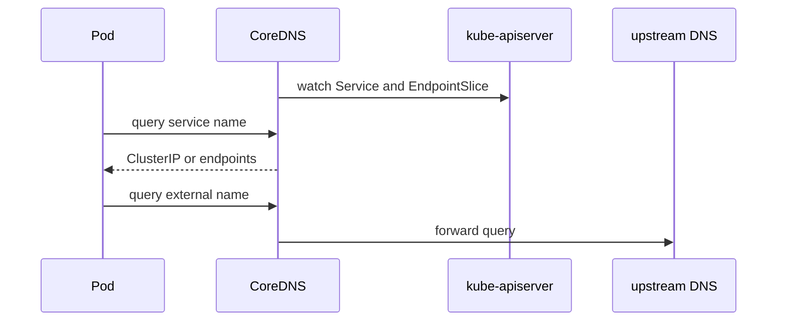

#kubernetes #component #addon #dns

相关笔记：[[k8s-development-roadmap]] | [[kubernetes-basics]] | [[service]] | [[headless-service]] | [[kube-proxy-component]] | [[cni-plugin-component]] | [[cni-troubleshooting]] | [[k8s-interview]]

# CoreDNS

## 概述

`CoreDNS` 是 Kubernetes 默认 DNS addon。它 watch Service 和 EndpointSlice，为 Pod 提供集群内服务发现能力，例如解析 `kubernetes.default.svc.cluster.local` 或 Headless Service 后端地址。

核心边界：**CoreDNS 只负责名字解析，不负责 Service 流量转发。**

## 职责边界

| 职责 | 说明 |
| --- | --- |
| service DNS | 解析 Service FQDN 到 ClusterIP |
| headless DNS | 解析 Headless Service 到后端 Pod IP |
| pod DNS | 可选支持 Pod DNS 记录 |
| upstream forwarding | 把集群外域名转发到上游 DNS |
| cache | 缓存 DNS 查询结果 |

## 核心链路



## 关键机制

- Pod 的 `/etc/resolv.conf` 通常由 kubelet 注入，指向集群 DNS Service。
- 普通 Service 返回 ClusterIP，后续流量由 kube-proxy 或 eBPF 数据面转发。
- Headless Service 返回后端 endpoint 记录，客户端直接连接 Pod IP。
- CoreDNS 通过 Kubernetes plugin watch Service/EndpointSlice。
- DNS 故障会表现为服务名不通，但直接访问 ClusterIP 可能正常。

## 源码导读

CoreDNS 是独立项目，Kubernetes 场景主要读 `kubernetes` plugin。

| 目标 | 源码位置 | 读什么 |
| --- | --- | --- |
| CoreDNS 主程序 | `github.com/coredns/coredns/coremain/` | Corefile 加载、plugin chain 启动 |
| plugin 注册 | `github.com/coredns/coredns/plugin/kubernetes/setup.go` | Corefile 参数解析 |
| kubernetes plugin | `github.com/coredns/coredns/plugin/kubernetes/kubernetes.go` | `ServeDNS` 入口 |
| informer 控制器 | `github.com/coredns/coredns/plugin/kubernetes/controller.go` | Service/EndpointSlice/Pod/Namespace watch |
| DNS 处理 | `github.com/coredns/coredns/plugin/kubernetes/handler.go` | service/pod/reverse 查询分发 |
| 对象模型 | `github.com/coredns/coredns/plugin/kubernetes/object/` | 轻量缓存对象 |
| readiness | `github.com/coredns/coredns/plugin/kubernetes/ready.go` | cache sync 后才 ready |

查询链路：

```text
CoreDNS starts
  -> parse Corefile
  -> initialize kubernetes plugin
  -> create informers for Service / EndpointSlice / Pod / Namespace
  -> wait for cache sync
  -> ServeDNS receives query
  -> parse qname into service namespace zone
  -> lookup local index
  -> return A/AAAA/SRV/CNAME records
```

精简源码骨架：

```go
func (k *Kubernetes) ServeDNS(ctx context.Context, w dns.ResponseWriter, r *dns.Msg) (int, error) {
    state := request.Request{W: w, Req: r}
    qname := state.Name()
    records, err := k.Records(ctx, qname, state)
    if err != nil {
        return plugin.NextOrFailure(k.Name(), k.Next, ctx, w, r)
    }
    return writeDNSResponse(w, r, records), nil
}

func (dns *dnsControl) Run() {
    go dns.svcController.Run(stopCh)
    go dns.epController.Run(stopCh)
    cache.WaitForCacheSync(stopCh, dns.HasSynced)
}
```

## 深入：Service DNS 查询如何命中 CoreDNS cache

这条链路回答一个具体问题：**Pod 内执行 `nslookup my-svc.default.svc.cluster.local` 时，CoreDNS 如何从本地缓存返回 ClusterIP 或 endpoint 记录？**

### 0. 前置条件

| 前置项 | 说明 |
| --- | --- |
| Pod DNS 配置正确 | kubelet 注入 `/etc/resolv.conf`，nameserver 指向 kube-dns Service |
| CoreDNS Pod Ready | Kubernetes plugin informer cache 已同步 |
| kube-dns Service 可达 | Service VIP 到 CoreDNS Pod 的转发正常 |
| Service/EndpointSlice 已存在 | 普通 Service 至少有 ClusterIP，Headless 需要 endpoint |

核心边界：CoreDNS 返回 IP 记录；连接这个 IP 后如何转发由 kube-proxy/eBPF/CNI 决定。

### 1. Pod 查询先到 kube-dns Service

Pod 内 resolver 根据 `ndots`、`search` 和查询名生成 DNS 请求：

```text
/etc/resolv.conf
  -> nameserver <kube-dns-cluster-ip>
  -> search <ns>.svc.cluster.local svc.cluster.local cluster.local
  -> query my-svc.default.svc.cluster.local
```

请求到达 kube-dns Service 后，节点数据面把包转发给某个 CoreDNS Pod。

### 2. CoreDNS 插件链处理请求

源码入口：`github.com/coredns/coredns/plugin/kubernetes/kubernetes.go`

CoreDNS 按 Corefile 中的插件链处理请求：

```text
ServeDNS
  -> request.Request parse qname/qtype
  -> kubernetes plugin checks zone
  -> Records lookup
  -> write DNS response
  -> miss or fallthrough goes to next plugin
```

精简骨架：

```go
func (k *Kubernetes) ServeDNS(ctx context.Context, w dns.ResponseWriter, r *dns.Msg) (int, error) {
    state := request.Request{W: w, Req: r}
    if !k.Zones.Matches(state.Name()) {
        return plugin.NextOrFailure(k.Name(), k.Next, ctx, w, r)
    }
    records, err := k.Records(ctx, state.Name(), state)
    if err != nil {
        return plugin.NextOrFailure(k.Name(), k.Next, ctx, w, r)
    }
    return writeResponse(w, r, records), nil
}
```

### 3. Kubernetes plugin 读 informer cache

源码入口：`github.com/coredns/coredns/plugin/kubernetes/controller.go`

CoreDNS 不会每次查询都访问 apiserver。启动时它 watch 并缓存对象：

| 对象 | 用途 |
| --- | --- |
| Service | 普通 Service、ExternalName、Headless 判断 |
| EndpointSlice | Headless Service、SRV、endpoint records |
| Namespace | namespace 过滤和存在性判断 |
| Pod | Pod A record 可选能力 |

普通 Service：

```text
service.default.svc.cluster.local A
  -> find Service(default/service)
  -> ClusterIP exists
  -> return A=<clusterIP>
```

Headless Service：

```text
headless.default.svc.cluster.local A
  -> find Service clusterIP=None
  -> find EndpointSlices
  -> filter ready endpoints
  -> return A=<podIP1>, A=<podIP2>...
```

### 4. 失败点与排查映射

| 现象 | 对应阶段 | 先看哪里 |
| --- | --- | --- |
| Pod 内 DNS server 不通 | kube-dns Service 转发 | kube-proxy/eBPF、NetworkPolicy |
| `SERVFAIL` | CoreDNS/plugin/upstream | CoreDNS logs、Corefile、loop |
| `NXDOMAIN` | 对象不存在或 search 结果 | Service/namespace/name |
| Headless 缺记录 | EndpointSlice/readiness | endpoint ready、selector、publishNotReadyAddresses |
| 外部域名慢 | forward/upstream | Corefile forward、node DNS、上游延迟 |

## 源码阅读重点

### Corefile 到插件链

CoreDNS 不是专用 Kubernetes DNS 程序，而是通用 DNS server。`kubernetes`、`forward`、`cache`、`loop`、`reload` 都是插件，顺序由 Corefile 决定。

### Informer Cache

CoreDNS 不应该每次 DNS 查询都打 apiserver。它通过 informer 把 Service/EndpointSlice 缓存在本地，查询时读本地索引。DNS 延迟高时要看 cache sync、CoreDNS CPU、上游 forward，而不只是看 apiserver。

### Headless Service

普通 Service 返回 ClusterIP；Headless Service 需要读 EndpointSlice，返回多个 endpoint 记录。StatefulSet 的稳定域名能力也依赖这条路径。

## 故障信号

| 现象 | 常见方向 |
| --- | --- |
| `nslookup` 失败 | CoreDNS Pod、Service、ConfigMap、NetworkPolicy |
| 外部域名不通 | upstream DNS、forward 配置、节点 DNS |
| Headless 记录缺失 | endpoint readiness、selector、EndpointSlice |
| DNS 延迟高 | cache、上游慢、CoreDNS 资源不足 |

## 事故排查

### 先判断故障层级

DNS 事故先区分“DNS 不通”和“DNS 结果不对”：

| 检查 | 结论 |
| --- | --- |
| 直连 ClusterIP 正常但域名不通 | CoreDNS/resolv.conf 问题 |
| kube-dns Service IP 不通 | kube-proxy/eBPF/CNI/NetworkPolicy |
| 普通 Service 有记录但 Headless 没记录 | EndpointSlice/readiness |
| 集群内域名正常，外部域名失败 | CoreDNS forward/upstream |

### Event 保留时间

CoreDNS Pod 的调度、重启和探针事件默认保留 `1h`，由 kube-apiserver `--event-ttl` 控制。DNS 事故要保存 Pod event、CoreDNS logs、Corefile 和测试 Pod 的 `/etc/resolv.conf`。

### 证据保全

| 证据 | 用途 |
| --- | --- |
| Corefile | 插件链、cache、forward、fallthrough |
| CoreDNS logs | SERVFAIL、plugin error、upstream timeout |
| kube-dns Service/EndpointSlice | 判断请求能否到 CoreDNS Pod |
| 测试 Pod resolv.conf | search、ndots、nameserver |
| Service/EndpointSlice YAML | 判断记录是否应该存在 |

### 常见事故路径

1. `nslookup kubernetes.default` 失败时，先查 kube-dns Service 和 CoreDNS Pod，而不是业务 Service。
2. 只有外部域名失败时，重点查 `forward` 上游和 Node DNS。
3. Headless Service 记录缺失时，看 EndpointSlice 的 endpoint ready 状态。
4. DNS 延迟高时，同时看 CoreDNS CPU、cache 命中率、上游延迟和客户端 `ndots` 放大。

## 排查命令

```bash
kubectl -n kube-system get pod -l k8s-app=kube-dns
kubectl -n kube-system get svc kube-dns -o yaml
kubectl -n kube-system logs deploy/coredns --tail=300
kubectl -n kube-system get configmap coredns -o yaml
kubectl exec <pod> -n <namespace> -- cat /etc/resolv.conf
kubectl exec <pod> -n <namespace> -- nslookup kubernetes.default.svc.cluster.local
kubectl get svc,endpointslice -n <namespace>
```

## 面试要点

### Q: CoreDNS 解析 Service 返回什么？

A: 普通 Service 返回 ClusterIP；Headless Service 返回后端 endpoint 的 IP 记录。

### Q: CoreDNS 和 kube-proxy 的关系？

A: CoreDNS 负责把服务名解析成 IP；kube-proxy 负责访问 Service IP 时转发到后端 Pod。两者是服务发现链路的不同阶段。

### Q: 为什么直接访问 ClusterIP 正常但服务名不通？

A: 说明 Service 转发可能正常，问题更可能在 DNS，例如 CoreDNS、Pod resolv.conf、DNS Service、NetworkPolicy 或上游配置。

### Q: Headless Service 为什么常用于 StatefulSet？

A: 它返回具体 Pod endpoint，让客户端能直接发现稳定的 Pod DNS 名和后端地址，而不是统一负载均衡到一个 ClusterIP。

### Q: CoreDNS 如何知道 Service 变化？

A: 通过 Kubernetes plugin watch apiserver 中的 Service、EndpointSlice 等对象，并更新内存索引。
