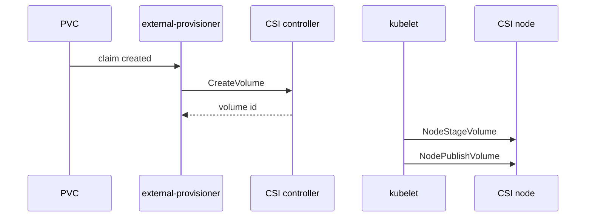

#kubernetes #component #storage #csi

相关笔记：[[k8s-development-roadmap]] | [[csi]] | [[csi-source]] | [[volume-lifecycle]] | [[csi-sidecars]] | [[csi-troubleshooting]] | [[ceph-csi]] | [[longhorn]] | [[openebs]] | [[cloud-provider-csi]] | [[kubelet-component]] | [[k8s-interview]]

# CSI Driver

## 概述

CSI Driver 负责把 Kubernetes PVC/PV 抽象对接到真实存储系统。它通过 CSI gRPC 接口实现卷创建、删除、attach、mount、扩容、快照等能力。

核心边界：**CSI 规范定义插件 RPC，Kubernetes sidecar 负责把对象事件翻译成 RPC。**

## 职责边界

| 组件 | 职责 |
| --- | --- |
| CSI Controller | 创建卷、删除卷、attach/detach、扩容、快照 |
| CSI Node | 在节点上 stage/publish/unpublish 卷 |
| external-provisioner | watch PVC 并调用 CreateVolume |
| external-attacher | watch VolumeAttachment 并调用 ControllerPublishVolume |
| node-driver-registrar | 把 Node plugin 注册给 kubelet |
| kubelet volume manager | 调用 NodeStageVolume、NodePublishVolume |

## 核心链路



## 关键机制

- CSI 有 Identity、Controller、Node 三组 service。
- Controller Pod 通常是 StatefulSet，Node Pod 通常是 DaemonSet。
- `NodeStageVolume` 做节点级一次性准备，`NodePublishVolume` 绑定到具体 Pod 路径。
- StorageClass 决定 provisioner、参数、reclaimPolicy、volumeBindingMode。
- `WaitForFirstConsumer` 可以等 Pod 调度后再按节点拓扑创建卷。

## 源码导读

| 目标 | 源码位置 | 读什么 |
| --- | --- | --- |
| kubelet CSI plugin | `pkg/volume/csi/csi_plugin.go` | `csiPlugin`、`RegistrationHandler`、`NewMounter` |
| CSI client | `pkg/volume/csi/csi_client.go` | `NodeStageVolume`、`NodePublishVolume` |
| attach/detach | `pkg/volume/csi/csi_attacher.go` | `Attach`、`WaitForAttach`、`MountDevice` |
| mount | `pkg/volume/csi/csi_mounter.go` | Pod volume publish |
| block volume | `pkg/volume/csi/csi_block.go` | raw block stage/publish |
| plugin manager | `pkg/kubelet/pluginmanager/` | CSI socket 注册 |
| external sidecars | `github.com/kubernetes-csi/external-*` | provisioner、attacher、resizer、snapshotter |
| CSI proto | `github.com/container-storage-interface/spec/csi.proto` | Identity、Controller、Node service |

节点挂载链路：

```text
CSI Node Pod starts
  -> node-driver-registrar exposes registration socket
  -> kubelet plugin watcher RegisterPlugin
  -> Pod scheduled to node
  -> kubelet volume manager waits for attach
  -> csiAttacher.MountDevice -> NodeStageVolume
  -> csiMounter.SetUpAt -> NodePublishVolume
```

精简源码骨架：

```go
func (c *csiAttacher) MountDevice(spec *volume.Spec, devicePath, deviceMountPath string, args DeviceMounterArgs) error {
    client := c.plugin.csiClient
    return client.NodeStageVolume(ctx, volumeID, deviceMountPath, fsType, accessMode, secrets)
}

func (c *csiMountMgr) SetUpAt(dir string, mounterArgs volume.MounterArgs) error {
    return c.csiClient.NodePublishVolume(ctx, volumeID, readOnly, stagingPath, dir, accessMode, publishContext)
}
```

## 深入：PVC 如何经过 sidecar 到 NodePublishVolume

这条链路回答一个具体问题：**用户创建 PVC 并让 Pod 使用它后，Kubernetes 如何通过 CSI sidecar 和 kubelet 把真实存储挂到 Pod 目录？**

### 0. 前置条件

| 前置项 | 说明 |
| --- | --- |
| StorageClass 存在 | `provisioner` 指向 CSI driver name |
| CSI controller 可用 | external-provisioner/attacher/resizer 等运行 |
| CSI node plugin 已注册 | kubelet plugin manager 发现 driver socket |
| Pod 已调度到节点 | NodePublishVolume 发生在目标节点 |
| 存储后端可用 | 云盘、Ceph、NFS、块存储等后端正常 |

核心边界：sidecar watch Kubernetes 对象并调用 CSI Controller RPC；kubelet 调用 CSI Node RPC。

### 1. PVC 触发 external-provisioner

动态供给链路：

```text
PVC created
  -> external-provisioner watches PVC
  -> checks StorageClass.provisioner
  -> CSI CreateVolume
  -> create PV object
  -> bind PVC/PV
```

`WaitForFirstConsumer` 场景下，provisioner 会等 Pod 被调度后再根据 selected node/topology 创建卷。

### 2. Attach 阶段

如果 driver 声明需要 attach：

```text
Pod scheduled
  -> attach/detach controller creates VolumeAttachment
  -> external-attacher watches VolumeAttachment
  -> CSI ControllerPublishVolume
  -> update VolumeAttachment status
```

云盘、多数块存储通常需要 attach；NFS 等文件存储可能不需要。

### 3. kubelet 节点挂载：Stage + Publish

源码入口：

- `pkg/volume/csi/csi_attacher.go`
- `pkg/volume/csi/csi_mounter.go`
- `pkg/volume/csi/csi_client.go`

节点侧链路：

```text
kubelet volume manager
  -> WaitForAttach
  -> MountDevice
      -> NodeStageVolume
  -> SetUpAt
      -> NodePublishVolume
  -> container bind mount sees volume
```

精简骨架：

```go
func (c *csiAttacher) MountDevice(spec *volume.Spec, devicePath, deviceMountPath string, args DeviceMounterArgs) error {
    return c.csiClient.NodeStageVolume(ctx, volumeID, deviceMountPath, fsType, accessMode, secrets)
}

func (c *csiMountMgr) SetUpAt(dir string, args volume.MounterArgs) error {
    return c.csiClient.NodePublishVolume(ctx, volumeID, readOnly, stagingPath, dir, accessMode, publishContext)
}
```

Stage 是节点级准备；Publish 是 Pod 级路径绑定。一个卷可以 Stage 一次，再 Publish 到一个或多个 Pod 路径，具体取决于访问模式和 driver 能力。

### 4. 失败点与排查映射

| 现象 | 对应阶段 | 先看哪里 |
| --- | --- | --- |
| PVC Pending | provision | StorageClass、external-provisioner、quota/topology |
| PV Bound 但 Pod Pending | scheduling | volumeBindingMode、node affinity |
| Attach 失败 | ControllerPublish | VolumeAttachment、external-attacher、云 API |
| Mount 失败 | NodeStage/NodePublish | kubelet、CSI node plugin、权限、fsck/mkfs |
| Pod 删除后卷卸载慢 | NodeUnpublish/Unstage | kubelet、driver cleanup、挂载占用 |
| Resize 卡住 | ControllerExpand/NodeExpand | external-resizer、filesystem expand |

## 源码阅读重点

### 注册链路

CSI driver 不是 kubelet 启动参数里硬编码的。Node plugin 通过 socket 被 kubelet plugin manager 发现，`RegistrationHandler.RegisterPlugin` 校验版本并把 driver 信息写入 kubelet 内部状态。

### Sidecar 和 Driver 分工

external-provisioner/attacher/resizer 这些 sidecar 是 Kubernetes 控制器；driver 本体实现 CSI RPC。读源码时不要把 sidecar 的 watch 逻辑和 driver 的存储逻辑混在一起。

### Stage / Publish

Stage 是节点级准备，Publish 是 Pod 级 bind mount。排查 mount 失败时，先分清失败发生在 `MountDevice` 还是 `SetUpAt`，否则容易看错日志。

## 故障信号

| 现象 | 常见方向 |
| --- | --- |
| PVC Pending | StorageClass、provisioner、quota、拓扑 |
| Attach 失败 | VolumeAttachment、external-attacher、云 API |
| Mount 失败 | kubelet、node plugin、权限、文件系统 |
| Resize 卡住 | external-resizer、NodeExpandVolume |

## 事故排查

### 先判断故障层级

CSI 事故按对象生命周期分层：

| 检查 | 结论 |
| --- | --- |
| PVC Pending | provisioning 或 binding 问题 |
| PVC Bound 但 Pod Pending | 调度和 volume topology 问题 |
| VolumeAttachment 未 attached | controller attach 问题 |
| Pod 卡 ContainerCreating 且 FailedMount | kubelet/CSI node mount 问题 |
| 删除卡住 | finalizer、detach、unmount 问题 |

### Event 保留时间

PVC、Pod、VolumeAttachment 相关 Event 默认保留 `1h`，由 kube-apiserver `--event-ttl` 控制。存储事故要及时保存 PVC describe、Pod describe、VolumeAttachment YAML、sidecar logs 和 kubelet logs。

### 证据保全

| 证据 | 用途 |
| --- | --- |
| PVC/PV YAML | binding、capacity、accessModes、volumeHandle |
| StorageClass YAML | provisioner、parameters、volumeBindingMode |
| VolumeAttachment YAML | attach 状态和错误 |
| sidecar logs | provision/attach/resize/snapshot 错误 |
| CSI node logs | NodeStage/NodePublish 错误 |
| kubelet logs | volume manager 调用上下文 |

### 常见事故路径

1. PVC Pending 先看 PVC event 和 provisioner 日志，不要直接查 kubelet。
2. `WaitForFirstConsumer` 下 PVC Pending 可能是正常等待 Pod 调度，需要看是否已有 consumer Pod。
3. Pod `FailedMount` 要先分清是 attach 未完成、stage 失败还是 publish 失败。
4. 云盘场景 attach 成功但 mount 失败，常见原因是文件系统、权限、节点设备路径或多挂载约束。

## 排查命令

```bash
kubectl describe pvc <pvc> -n <namespace>
kubectl get pv,pvc,volumeattachment -A
kubectl get storageclass
kubectl describe pod <pod> -n <namespace>
journalctl -u kubelet -n 300 --no-pager
kubectl -n <driver-namespace> get pods
kubectl -n <driver-namespace> logs deploy/<csi-controller> --tail=300
kubectl -n <driver-namespace> logs ds/<csi-node> --tail=300
```

## 面试要点

### Q: CSI driver 一定要 watch PVC 吗？

A: 不需要。通常 external-provisioner 等 sidecar watch Kubernetes 对象，然后调用 driver 的 CSI RPC。driver 本体只实现 gRPC service。

### Q: `NodeStageVolume` 和 `NodePublishVolume` 的区别？

A: Stage 是节点级、与 Pod 无关的一次性准备；Publish 是把卷挂载到具体 Pod 目录，可能对同一卷执行多次。

### Q: CSI Controller 和 CSI Node 为什么分开？

A: Controller 处理全局存储生命周期和云/存储 API；Node 处理某个节点上的设备发现、mount、bind mount 等本地操作。

### Q: PVC 一直 Pending 怎么排查？

A: 看 PVC event、StorageClass、external-provisioner 日志、容量/配额、拓扑约束和 `volumeBindingMode`。

### Q: CSI 和 cloud-controller-manager 的存储边界？

A: 现代 Kubernetes 中云盘生命周期和挂载主要由 CSI driver 负责，cloud-controller-manager 更偏 LoadBalancer、Route、Node 等云资源。
