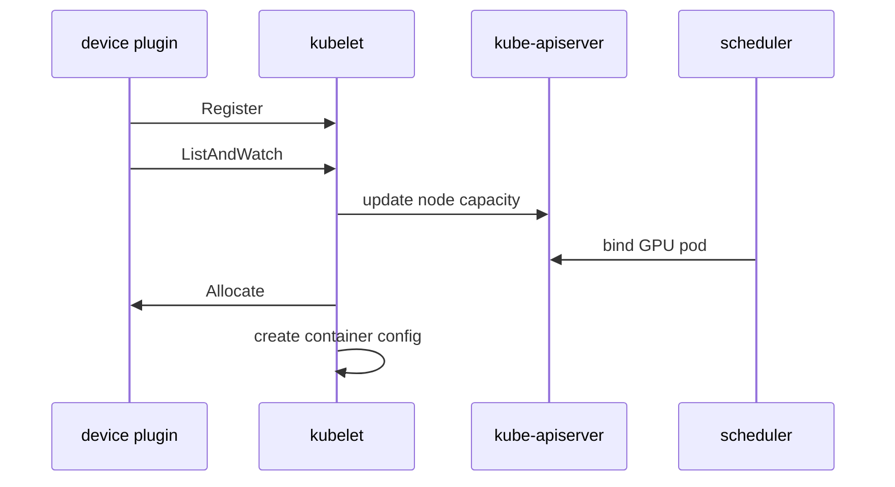

#kubernetes #component #node #device-plugin #gpu

相关笔记：[[k8s-development-roadmap]] | [[gpu-scheduling]] | [[gpu-scheduling-source]] | [[kubelet-cri-source]] | [[demo-device-plugin]] | [[demo-fake-gpu]] | [[hami-source]] | [[hami-learning-path]] | [[kubelet-component]] | [[kube-scheduler-component]] | [[k8s-interview]]

# Device Plugin

## 概述

Device Plugin 让 GPU、RDMA、FPGA、SmartNIC 等硬件以 Kubernetes extended resource 的形式暴露给 Pod。插件在节点上向 kubelet 注册设备，并在容器创建前通过 Allocate 返回设备文件、环境变量、mount 等配置。

核心边界：**scheduler 只看到资源数量并选 Node，kubelet 和 Device Plugin 在节点上完成具体设备分配。**

## 职责边界

| 职责 | 说明 |
| --- | --- |
| registration | 向 kubelet device plugin socket 注册资源名 |
| discovery | 发现本节点可用设备 |
| health | 通过 ListAndWatch 持续上报设备健康状态 |
| allocate | 为容器返回设备挂载、env、annotation 等配置 |
| capacity | kubelet 把设备数量写入 Node capacity/allocatable |

## 核心链路



## 关键机制

- 资源名必须是扩展资源格式，例如 `nvidia.com/gpu`。
- Pod 通过 `resources.limits` 请求设备资源。
- kubelet 的 DeviceManager 负责和插件通信。
- Device Plugin 适合数量型设备，复杂拓扑和共享资源逐步由 DRA 补强。
- GPU 虚拟化方案常在 Device Plugin、scheduler extender/webhook、runtime hook 之间协作。

## 源码导读

| 目标 | 源码位置 | 读什么 |
| --- | --- | --- |
| DeviceManager | `pkg/kubelet/cm/devicemanager/manager.go` | `Start`、`Allocate`、`devicesToAllocate` |
| 插件注册 handler | `pkg/kubelet/cm/devicemanager/plugin/v1beta1/handler.go` | `RegisterPlugin` |
| 插件客户端 | `pkg/kubelet/cm/devicemanager/plugin/v1beta1/client.go` | `ListAndWatch` stream |
| Device Plugin API | `staging/src/k8s.io/kubelet/pkg/apis/deviceplugin/v1beta1/` | `DevicePluginServer`、`AllocateRequest` |
| Topology Manager | `pkg/kubelet/cm/topologymanager/` | NUMA hint 和资源协同 |
| kubelet runtime | `pkg/kubelet/kuberuntime/` | Allocate 结果进入 container config |

注册与分配链路：

```text
device plugin starts
  -> creates Unix socket
  -> calls kubelet registration socket
  -> kubelet RegisterPlugin
  -> kubelet starts ListAndWatch client
  -> kubelet updates Node capacity
  -> Pod requests extended resource
  -> scheduler binds Pod to node
  -> kubelet DeviceManager.Allocate
  -> plugin Allocate returns devices/env/mounts/CDI
```

精简源码骨架：

```go
type DevicePluginServer interface {
    GetDevicePluginOptions(context.Context, *Empty) (*DevicePluginOptions, error)
    ListAndWatch(*Empty, DevicePlugin_ListAndWatchServer) error
    Allocate(context.Context, *AllocateRequest) (*AllocateResponse, error)
}

func (m *ManagerImpl) Allocate(pod *v1.Pod, container *v1.Container) error {
    for resource, needed := range container.Resources.Limits {
        devices := m.devicesToAllocate(pod.UID, container.Name, resource, needed)
        response := m.callPluginAllocate(resource, devices)
        m.podDevices.insert(pod.UID, container.Name, resource, response)
    }
    return nil
}
```

## 深入：GPU 设备如何注册、上报、Allocate 到容器

这条链路回答一个具体问题：**NVIDIA device plugin 启动后，Kubernetes 如何让 scheduler 看到 `nvidia.com/gpu`，并让容器最终看到具体 GPU 设备？**

### 0. 前置条件

| 前置项 | 说明 |
| --- | --- |
| 节点驱动可用 | GPU driver、container runtime hook/CDI 等正常 |
| device plugin Pod 运行 | 通常是 DaemonSet |
| kubelet device plugin socket 可用 | 插件能向 kubelet 注册 |
| Pod 请求 extended resource | 通常写在 `resources.limits` |

核心边界：scheduler 只根据 Node allocatable 选择节点；具体设备 ID 由 kubelet DeviceManager 在节点上分配。

### 1. 插件向 kubelet 注册资源名

源码入口：

- `pkg/kubelet/cm/devicemanager/plugin/v1beta1/handler.go`
- `staging/src/k8s.io/kubelet/pkg/apis/deviceplugin/v1beta1/`

链路：

```text
device plugin starts
  -> creates plugin unix socket
  -> calls kubelet registration socket
  -> Register(resourceName, endpoint, version)
  -> kubelet validates resource name
  -> kubelet connects plugin socket
```

资源名必须是扩展资源格式，例如 `nvidia.com/gpu`，不能伪装成内置 `cpu` 或 `memory`。

### 2. `ListAndWatch` 上报设备健康

插件注册后，kubelet 启动长连接：

```text
kubelet
  -> plugin.ListAndWatch
  <- []Device{ID, Health}
  -> update internal device store
  -> update Node capacity/allocatable
```

精简骨架：

```go
func (p *Plugin) ListAndWatch(_ *Empty, stream DevicePlugin_ListAndWatchServer) error {
    for {
        devices := p.discoverDevices()
        stream.Send(&ListAndWatchResponse{Devices: devices})
        <-p.healthChanged
    }
}
```

Device Plugin 不直接写 Node 对象；kubelet 汇总后上报 Node status。

### 3. scheduler 只选择 Node

Pod 请求 GPU：

```yaml
resources:
  limits:
    nvidia.com/gpu: "1"
```

scheduler 看到的是 Node allocatable 中的扩展资源数量。它不会决定具体 GPU ID，也不会调用 Device Plugin。

### 4. kubelet 在容器创建前调用 `Allocate`

源码入口：`pkg/kubelet/cm/devicemanager/manager.go`

当 Pod 已绑定到节点，kubelet 准备创建容器时：

```text
kubelet SyncPod
  -> container runtime options
  -> DeviceManager.Allocate
      -> devicesToAllocate
      -> plugin.Allocate(deviceIDs)
      -> store podDevices
  -> generateContainerConfig
      -> Devices / Mounts / Envs / CDIDevices
  -> CRI CreateContainer
```

精简骨架：

```go
func (m *ManagerImpl) Allocate(pod *v1.Pod, container *v1.Container) error {
    for resource, limit := range container.Resources.Limits {
        if !isDevicePluginResource(resource) {
            continue
        }
        ids := m.devicesToAllocate(pod.UID, container.Name, resource, int(limit.Value()))
        resp := m.callPluginAllocate(resource, ids)
        m.podDevices.insert(pod.UID, container.Name, resource, resp)
    }
    return nil
}
```

Allocate 返回的不是“资源数量”，而是运行容器需要注入的材料：device nodes、mounts、env、annotations、CDI devices。

### 5. 失败点与排查映射

| 现象 | 对应阶段 | 先看哪里 |
| --- | --- | --- |
| Node 没有 GPU capacity | 注册/ListAndWatch | plugin Pod、kubelet logs、driver |
| GPU Pod Pending | scheduler | Node allocatable、Pod limits、taints/labels |
| `Allocate` 失败 | kubelet/device plugin | plugin logs、设备健康、拓扑 |
| 容器内看不到 GPU | runtime injection | CDI/runtime hook、mounts/env、container runtime |
| kubelet 重启后资源消失 | 插件重注册 | socket、plugin restart、kubelet plugin manager |

## 源码阅读重点

### Node Capacity 更新

Device Plugin 不直接写 Node 对象。它把设备状态告诉 kubelet，kubelet 再把资源写入 Node status。scheduler 只消费 Node allocatable。

### Allocate 返回的是运行时注入材料

Allocate 不只是“选设备 ID”，还会返回 device nodes、mounts、envs、annotations、CDI devices。容器里能否看到 GPU，关键看这些材料是否进入 CRI container config。

### 复杂资源的限制

Device Plugin 的调度表达能力主要是数量。NUMA、拓扑、共享、分片、动态分配这些能力需要 Topology Manager、scheduler 扩展、DRA 或厂商方案配合。

## 故障信号

| 现象 | 常见方向 |
| --- | --- |
| Node 不显示 GPU capacity | 插件未注册、驱动缺失、socket 问题 |
| Pod Pending | extended resource 不足、调度约束 |
| 容器内看不到设备 | Allocate 返回、device mount、runtime hook |
| kubelet 重启后设备丢失 | 插件未重新注册、socket 监听失败 |

## 事故排查

### 先判断故障层级

GPU/设备事故按“节点发现、调度、分配、容器可见性”分层：

| 检查 | 结论 |
| --- | --- |
| Node allocatable 没资源 | device plugin/kubelet/driver |
| Pod Pending 且资源不足 | scheduler 资源视图 |
| Pod 已到节点但创建失败 | Allocate 或 runtime injection |
| 容器启动但看不到设备 | CDI/runtime hook/device mount |

### Event 保留时间

Device Plugin 相关失败常表现为 Pod Event 或 kubelet 日志，Event 默认只保留 `1h`，由 kube-apiserver `--event-ttl` 控制。GPU 事故要及时保存 Pod describe、Node YAML、device plugin logs 和 kubelet logs。

### 证据保全

| 证据 | 用途 |
| --- | --- |
| Node YAML | capacity/allocatable、labels、taints |
| Pod YAML | limits、nodeSelector、runtimeClass |
| device plugin logs | 注册、ListAndWatch、Allocate |
| kubelet logs | DeviceManager、TopologyManager 错误 |
| runtime config | CDI、NVIDIA runtime、containerd runtime handler |
| 节点驱动状态 | 设备是否被 OS 和驱动识别 |

### 常见事故路径

1. GPU Pod Pending 先看 Node allocatable 是否有 `nvidia.com/gpu`，没有就转 device plugin/driver。
2. Node 有资源但 Pod Pending，查 taint、nodeSelector、affinity、资源是否被其他 Pod 占用。
3. Pod 启动后容器内无 GPU，重点查 Allocate 返回材料是否进入 CRI config，以及 runtime/CDI 是否生效。
4. kubelet 重启后资源短暂消失通常和 plugin 重注册窗口有关，长时间不恢复要查 socket 和 plugin 进程。

## 排查命令

```bash
kubectl describe node <node>
kubectl get node <node> -o yaml
kubectl describe pod <pod> -n <namespace>
kubectl -n kube-system get pods -o wide
journalctl -u kubelet -n 300 --no-pager
kubectl -n kube-system logs ds/<device-plugin> --tail=300
crictl inspect <container-id>
```

## 面试要点

### Q: Device Plugin 如何把 GPU 暴露给 scheduler？

A: 插件向 kubelet 注册并通过 `ListAndWatch` 上报设备，kubelet 更新 Node capacity/allocatable，scheduler 看到 extended resource 后才能调度请求 GPU 的 Pod。

### Q: scheduler 会选择具体哪块 GPU 吗？

A: 传统 Device Plugin 模式下不会。scheduler 只选择 Node；具体设备 ID 通常由 kubelet DeviceManager 在节点上分配。

### Q: Allocate RPC 什么时候调用？

A: Pod 已经调度到节点、kubelet 准备创建容器时调用，用于返回设备文件、env、mount、annotation 等运行时配置。

### Q: Device Plugin 和 DRA 的关系？

A: Device Plugin 简单稳定，但表达能力有限。DRA 把资源声明和分配模型前移，支持更复杂的设备属性、共享和拓扑约束。

### Q: GPU Pod Pending 先看什么？

A: 先看 Pod event 和 Node allocatable 中是否有对应 extended resource，再看 Device Plugin Pod 和 kubelet 日志。
