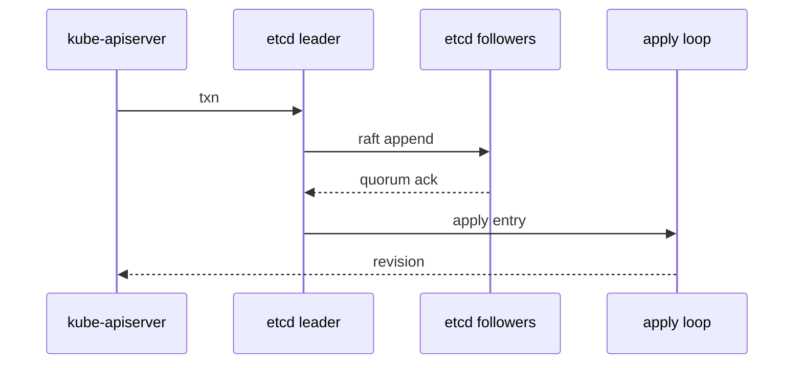

#kubernetes #component #control-plane #etcd

相关笔记：[[k8s-development-roadmap]] | [[kubernetes-basics]] | [[etcd]] | [[etcd-source]] | [[kube-apiserver-component]] | [[client-go-source]] | [[k8s-interview]]

# etcd

## 概述

`etcd` 是 Kubernetes 的强一致键值存储，保存所有持久化 API 对象。Kubernetes 不把 Pod 进程状态直接放进 etcd，而是保存对象的期望状态、观测状态和元数据。

核心边界：Kubernetes 组件不应绕过 `kube-apiserver` 直接访问 etcd。

## 职责边界

| 职责 | 说明 |
| --- | --- |
| durable storage | 持久化 API 对象 |
| consistency | 基于 Raft 提供线性一致读写 |
| revision | 每次写入产生全局递增 revision |
| watch | 按 revision 推送变更事件 |
| lease | 支撑租约、leader election 等能力 |

## 核心链路



## 关键机制

- Raft 负责复制日志和 leader 选举。
- MVCC 保存多版本数据，`resourceVersion` 可以理解为暴露到 Kubernetes API 层的 revision。
- watch 从某个 revision 开始订阅变更；如果 revision 被 compact，客户端需要重新 list。
- WAL 和 snapshot 是恢复数据的关键。
- etcd 延迟会直接拖慢 apiserver 写请求和控制器收敛。

## 源码导读

这里分两层看：Kubernetes 如何调用 etcd，以及 etcd 自己如何复制和存储。

| 目标 | 源码位置 | 读什么 |
| --- | --- | --- |
| K8s storage store | `staging/src/k8s.io/apiserver/pkg/storage/etcd3/store.go` | `New`、`Create`、`GuaranteedUpdate`、`Get`、`Watch` |
| K8s cacher | `staging/src/k8s.io/apiserver/pkg/storage/cacher/cacher.go` | watch cache 与 list/watch 语义 |
| K8s etcd client | `vendor/go.etcd.io/etcd/client/v3/kubernetes/client.go` | `OptimisticPut`、`OptimisticDelete` |
| etcd server | `vendor/go.etcd.io/etcd/server/v3/etcdserver/` | `Put`、`Txn`、`raftRequest`、`apply` |
| Raft node | `vendor/go.etcd.io/raft/v3/node.go`、`vendor/go.etcd.io/raft/v3/raft.go` | `Propose`、`Step`、`appendEntry`、`maybeCommit` |
| WAL | `vendor/go.etcd.io/etcd/server/v3/storage/wal/` | raft log 持久化 |
| MVCC | `vendor/go.etcd.io/etcd/server/v3/storage/mvcc/` | revision、key index、watchable store |

Kubernetes 写对象到 etcd 的简化链路：

```text
REST storage
  -> etcd3.store.Create / GuaranteedUpdate
  -> encode object
  -> etcd client txn
  -> etcd leader raft propose
  -> quorum append
  -> apply to MVCC
  -> return revision as resourceVersion
```

精简源码骨架：

```go
func (s *store) Create(ctx context.Context, key string, obj, out runtime.Object, ttl uint64) error {
    data := encode(obj)
    resp, err := s.client.Kubernetes.OptimisticPut(ctx, key, data, 0, kubernetes.PutOptions{LeaseID: lease})
    if err != nil {
        return err
    }
    if !resp.Succeeded {
        return storage.NewKeyExistsError(key, 0)
    }
    return decode(resp.Revision, out)
}

func (s *store) Watch(ctx context.Context, key string, opts ListOptions) (watch.Interface, error) {
    rev := opts.ResourceVersion
    return s.watcher.Watch(ctx, key, rev, opts.Predicate)
}
```

## 深入：一次 Kubernetes 写入如何落到 Raft/MVCC

这条链路回答一个具体问题：**apiserver 写一个 Pod/ConfigMap/Lease 时，etcd 如何保证多数派提交，并把 revision 返回给 Kubernetes？**

### 0. 前置条件

| 前置项 | 说明 |
| --- | --- |
| apiserver storage 已选定 key | 例如 Pod 约为 `/registry/pods/<namespace>/<name>` |
| 对象已编码 | protobuf/JSON bytes 已经由 apiserver storage 生成 |
| etcd leader 可用 | 写请求最终要由 leader propose |
| quorum 可达 | 多数派不可达时写请求不能成功 |

注意：Kubernetes 的 `resourceVersion` 不是 Pod 业务版本号，而是 storage 层从 etcd revision 映射出来的一致性标记。

### 1. apiserver 发起乐观写入：`OptimisticPut`

源码入口：

- `staging/src/k8s.io/apiserver/pkg/storage/etcd3/store.go`
- `vendor/go.etcd.io/etcd/client/v3/kubernetes/client.go`

Kubernetes 不直接“无条件 put”。`Create` 会要求 key 的 `ModRevision == 0`，`GuaranteedUpdate` 会要求 key 的 `ModRevision == origState.rev`。

精简骨架：

```go
func (k Client) OptimisticPut(ctx context.Context, key string, value []byte, expectedRevision int64, opts PutOptions) (PutResponse, error) {
    txn := k.KV.Txn(ctx).If(
        clientv3.Compare(clientv3.ModRevision(key), "=", expectedRevision),
    ).Then(
        clientv3.OpPut(key, string(value), clientv3.WithLease(opts.LeaseID)),
    )
    if opts.GetOnFailure {
        txn = txn.Else(clientv3.OpGet(key))
    }
    txnResp := txn.Commit()
    return PutResponse{
        Succeeded: txnResp.Succeeded,
        Revision:  txnResp.Header.Revision,
    }, nil
}
```

这解释了两个现象：

- create 已存在对象会失败，因为 `expectedRevision=0` 不成立。
- update 冲突会重试，因为 `GuaranteedUpdate` 发现 revision 变化后会重新读、重新执行 update function。

### 2. etcd server 接收写请求：`Txn/Put -> raftRequest`

源码入口：`vendor/go.etcd.io/etcd/server/v3/etcdserver/v3_server.go`

Kubernetes `OptimisticPut` 在 etcd 协议层是一个带 compare 的 transaction。只读 txn 可以走线性读路径；写 txn 必须进入 Raft。

精简骨架：

```go
func (s *EtcdServer) Put(ctx context.Context, r *pb.PutRequest) (*pb.PutResponse, error) {
    resp, err := s.raftRequest(ctx, pb.InternalRaftRequest{Put: r})
    if err != nil {
        return nil, err
    }
    return resp.(*pb.PutResponse), nil
}

func (s *EtcdServer) Txn(ctx context.Context, r *pb.TxnRequest) (*pb.TxnResponse, error) {
    if txn.IsTxnReadonly(r) {
        s.linearizableReadNotify(ctx)
        return txn.Txn(ctx, s.Logger(), r, mode, s.KV(), s.lessor)
    }
    resp, err := s.raftRequest(ctx, pb.InternalRaftRequest{Txn: r})
    return resp.(*pb.TxnResponse), err
}
```

`processInternalRaftRequestOnce` 会做几件关键事：

| 动作 | 目的 |
| --- | --- |
| 检查 apply index 和 commit index gap | 防止 apply 落后太多时继续堆写 |
| 写入 request header/id | 用 watcher 把 apply result 关联回请求 |
| 序列化 InternalRaftRequest | 准备作为 raft entry data |
| 检查 MaxRequestBytes | 防止超大请求拖垮 raft |
| 注册 wait channel | 等 apply loop 触发结果 |

### 3. Raft propose：`node.Propose -> raft.Step -> appendEntry`

源码入口：

- `vendor/go.etcd.io/raft/v3/node.go`
- `vendor/go.etcd.io/raft/v3/raft.go`

简化路径：

```text
EtcdServer.raftRequest
  -> processInternalRaftRequestOnce
  -> raft.Node.Propose
  -> node.stepWait(MsgProp)
  -> raft.Step
  -> raft.appendEntry
  -> send AppendEntries to followers
  -> quorum ack
  -> maybeCommit
```

精简骨架：

```go
func (n *node) Propose(ctx context.Context, data []byte) error {
    return n.stepWait(ctx, pb.Message{
        Type:    pb.MsgProp,
        Entries: []pb.Entry{{Data: data}},
    })
}

func (r *raft) appendEntry(es ...pb.Entry) bool {
    for i := range es {
        es[i].Term = r.Term
        es[i].Index = r.raftLog.lastIndex() + 1 + uint64(i)
    }
    r.raftLog.append(es...)
    r.trk.Progress[r.id].MaybeUpdate(r.raftLog.lastIndex())
    return r.maybeCommit()
}
```

这里的关键不变量：

- 写请求必须由 leader 复制到多数派后才能 commit。
- follower 只追加日志，不自行决定提交用户写入。
- leader 切换会影响写延迟，但不能破坏已经多数派提交的日志。

### 4. apply loop 把 committed entry 写入状态机

源码入口：`vendor/go.etcd.io/etcd/server/v3/etcdserver/server.go`

commit 只是 Raft 层确认“日志已经安全”，真正变成 KV 要经过 apply：

```text
apply
  -> applyEntryNormal
  -> applyInternalRaftRequest
  -> uberApply.Apply
  -> applierV3backend.Txn / Put
```

精简骨架：

```go
func (s *EtcdServer) apply(es []raftpb.Entry, confState *raftpb.ConfState, raftAdvancedC <-chan struct{}) {
    for _, e := range es {
        switch e.Type {
        case raftpb.EntryNormal:
            s.applyEntryNormal(&e, shouldApplyV3)
            s.setAppliedIndex(e.Index)
            s.setTerm(e.Term)
        case raftpb.EntryConfChange:
            s.applyConfChange(cc, confState, shouldApplyV3)
        }
    }
}

func (s *EtcdServer) applyEntryNormal(e *raftpb.Entry, shouldApplyV3 membership.ShouldApplyV3) {
    raftReq := unmarshalInternalRaftRequest(e.Data)
    result := s.applyInternalRaftRequest(&raftReq, shouldApplyV3)
    s.w.Trigger(raftReq.Header.ID, result)
}
```

请求方之所以能拿到 response，是因为发起写入时注册了 request id，apply 完成后 `s.w.Trigger` 唤醒等待者。

### 5. MVCC 写入 revision、index、watch event

源码入口：

- `vendor/go.etcd.io/etcd/server/v3/etcdserver/apply/apply.go`
- `vendor/go.etcd.io/etcd/server/v3/etcdserver/txn/txn.go`
- `vendor/go.etcd.io/etcd/server/v3/storage/mvcc/kvstore_txn.go`
- `vendor/go.etcd.io/etcd/server/v3/storage/mvcc/watchable_store_txn.go`

`applierV3backend.Put/Txn` 最终会打开 MVCC write txn：

```go
func Put(ctx context.Context, lg *zap.Logger, lessor lease.Lessor, kv mvcc.KV, p *pb.PutRequest) (*pb.PutResponse, *traceutil.Trace, error) {
    txnWrite := kv.Write(trace)
    defer txnWrite.End()
    resp.Header.Revision = txnWrite.Put(p.Key, p.Value, lease.LeaseID(p.Lease))
    return resp, trace, nil
}
```

MVCC 写事务核心行为：

| 动作 | 源码点 | 结果 |
| --- | --- | --- |
| 计算新 revision | `beginRev + 1` | 同一事务内多个 change 共享 main revision |
| 生成 `mvccpb.KeyValue` | `CreateRevision`、`ModRevision`、`Version` | 支撑 range/watch 语义 |
| 写 Bolt backend | `tx.UnsafeSeqPut(schema.Key, revBytes, data)` | 持久化版本数据 |
| 更新内存 index | `kvindex.Put(key, idxRev)` | range 能按 key 找 revision |
| 处理 lease | `Attach/Detach` | Event TTL 和 lease key 删除依赖这里 |
| 通知 watcher | `watchableStoreTxnWrite.End -> notify` | Kubernetes watch 事件来源 |

精简骨架：

```go
func (tw *storeTxnWrite) put(key, value []byte, leaseID lease.LeaseID) {
    rev := tw.beginRev + 1
    created, version := tw.s.kvindex.Get(key, rev)
    kv := mvccpb.KeyValue{
        Key:            key,
        Value:          value,
        CreateRevision: created.Main,
        ModRevision:    rev,
        Version:        version + 1,
        Lease:          int64(leaseID),
    }
    tw.tx.UnsafeSeqPut(schema.Key, RevToBytes(Revision{Main: rev, Sub: len(tw.changes)}), marshal(kv))
    tw.s.kvindex.Put(key, idxRev)
    tw.changes = append(tw.changes, kv)
}

func (tw *watchableStoreTxnWrite) End() {
    changes := tw.Changes()
    rev := tw.Rev() + 1
    tw.s.notify(rev, eventsFrom(changes))
    tw.TxnWrite.End()
}
```

这就是 `resourceVersion` 和 watch 事件的共同来源：一次成功写入产生新 revision，同时把对应 change 交给 watcher。

### 6. 失败点与排查映射

| 现象 | 对应源码阶段 | 先看哪里 |
| --- | --- | --- |
| apiserver 写入超时 | `raftRequest` 等 apply result | etcd leader、quorum、磁盘 fsync |
| `ErrTooManyRequests` | commit/apply gap 太大 | apply 延迟、backend 压力 |
| `request is too large` | `MaxRequestBytes` | 对象体积、managedFields、CRD 大对象 |
| `mvcc: required revision has been compacted` | MVCC range/watch | informer 落后、compaction 太激进 |
| `NOSPACE` alarm | backend quota | db size、compaction、defrag |
| leader 频繁变化 | Raft election | 网络延迟、磁盘 stall、节点负载 |
| Event 消失 | lease/TTL 到期 | kube-apiserver `--event-ttl` 默认 `1h` |

## 源码阅读重点

### `Create` vs `GuaranteedUpdate`

`Create` 要求 key 不存在；`GuaranteedUpdate` 是 Kubernetes 乐观并发更新的核心，典型用于 status 更新、finalizer 更新、resourceVersion 冲突重试。

读源码时重点看三件事：

- 更新函数基于当前对象计算新对象。
- 比较 revision 或 modRevision，避免覆盖并发写。
- 冲突时重新读、重新执行 update function。

### `resourceVersion`

Kubernetes API 对外只暴露 `resourceVersion`，但理解时可以把它映射到 etcd revision。关键是不把它当业务版本号：它用于一致性、watch 起点和冲突检测，不适合业务排序语义。

### Watch 与 Compaction

watch 从某个 revision 开始。如果客户端长期断开，目标 revision 被 compact，apiserver/client-go 必须 relist。Informer 的健壮性来自 `List -> Watch -> too old -> Relist` 这套循环。

## 故障信号

| 现象 | 常见方向 |
| --- | --- |
| apiserver 写请求慢 | etcd fsync、磁盘、leader 压力 |
| watch 报 compacted | 客户端落后太多，需要 relist |
| leader 频繁切换 | 网络抖动、磁盘慢、节点压力 |
| db size 过大 | compaction/defrag 策略不足 |

## 事故排查

### 先判断故障层级

etcd 事故通常要先区分是“不可用”“慢”“空间问题”还是“历史 revision 不够”：

| 类型 | 典型现象 | 优先方向 |
| --- | --- | --- |
| 不可用 | apiserver `/readyz` 的 etcd check 失败 | endpoint、证书、leader、quorum |
| 写慢 | apiserver create/update latency 升高 | leader fsync、WAL、backend commit、网络 |
| watch 异常 | informer 大量 relist、`compacted` | compaction、客户端落后、apiserver watch cache |
| 空间告警 | `NOSPACE` alarm、写入失败 | db size、quota、compact、defrag |
| leader 抖动 | endpoint status 频繁换 leader | 网络、磁盘 stall、CPU pause |

### Event 保留时间

Event 的默认保留时间不是 etcd 全局策略，而是 kube-apiserver 对 Event storage 设置 TTL：默认 `1h`，由 `--event-ttl` 控制。落到 etcd 时会变成带 lease 的 key；到期后 etcd 删除 Event，因此事故复盘不能依赖过期后的 `kubectl describe`。

### 证据保全

| 证据 | 用途 |
| --- | --- |
| `endpoint status` | 看 leader、raft index、applied index、db size |
| `endpoint health` | 快速判断 endpoint 是否能线性写入 |
| etcd metrics | 看 fsync、backend commit、proposal pending、leader changes |
| etcd logs | 看 leader election、slow apply、quota、snapshot、compaction |
| apiserver metrics | 关联 etcd request latency 和 API latency |
| snapshot | 数据风险操作前必须先备份 |

### 常见事故路径

1. apiserver 写慢时，先看 `apiserver_storage_objects`、`apiserver_request_duration_seconds` 和 etcd `wal_fsync` / `backend_commit` 延迟，区分是 admission 慢还是 etcd 慢。
2. `compacted` 不等于 etcd 坏了，通常是客户端 watch 落后超过 compaction 保留窗口。正确动作是 relist，并检查 controller 是否卡住。
3. `NOSPACE` 不能靠重启解决。需要确认 quota、执行 compaction、必要时 defrag，并检查是否有异常大对象或 Event 风暴。
4. leader 频繁切换先查磁盘和网络。Raft 对磁盘延迟敏感，fsync stall 会被表现成心跳超时。

## 排查命令

```bash
etcdctl endpoint status --write-out=table
etcdctl endpoint health --write-out=table
etcdctl alarm list
etcdctl alarm disarm
etcdctl compact <revision>
etcdctl defrag
etcdctl snapshot save <snapshot.db>
```

## 面试要点

### Q: etcd 在 Kubernetes 中保存什么？

A: 保存 API 对象的持久化状态，例如 Pod、Node、Deployment、Secret、ConfigMap、Lease、CRD 对象等。容器进程和网络包转发不在 etcd 中执行。

### Q: `resourceVersion` 和 etcd revision 有什么关系？

A: Kubernetes storage 层把 etcd revision 暴露为对象的 `resourceVersion`。Informer 用它做 list/watch 衔接和增量事件订阅。

### Q: 为什么 etcd 通常要求奇数个成员？

A: Raft 需要多数派确认。3 个成员可以容忍 1 个失败，5 个成员可以容忍 2 个失败；偶数成员通常不会提升容错能力，反而增加复制成本。

### Q: watch compacted 是什么含义？

A: 客户端请求的历史 revision 已被 etcd compaction 清理，不能继续增量 watch，必须重新 list 获取新快照。

### Q: etcd 慢会怎样影响集群？

A: apiserver 写入变慢，controller/scheduler watch 延迟增加，最终表现为 Pod 调度慢、状态更新慢、控制器收敛慢。
