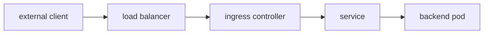

#kubernetes #component #networking #ingress

相关笔记：[[k8s-development-roadmap]] | [[service]] | [[kube-proxy-component]] | [[coredns-component]] | [[cni-plugin-component]] | [[k8s-interview]]

# Ingress Controller

## 概述

Ingress Controller 负责把 Kubernetes Ingress 资源转成真实的七层流量入口配置。常见实现包括 ingress-nginx、Traefik、HAProxy、云厂商 ALB/NLB Controller 等。

核心边界：**Ingress 是 API 对象，Ingress Controller 才是真正处理流量的组件。**

## 职责边界

| 职责 | 说明 |
| --- | --- |
| watch ingress | 监听 Ingress、Service、EndpointSlice、Secret |
| config generation | 生成 Nginx/Envoy/HAProxy 或云 LB 配置 |
| TLS termination | 读取 Secret 做 HTTPS 终止 |
| routing | 按 host/path 转发到 Service 后端 |
| status update | 写回 Ingress address |

## 核心链路



## 关键机制

- 没有 Ingress Controller 时，创建 Ingress 对象本身不会产生入口流量。
- Ingress 通常处理 HTTP/HTTPS 七层路由。
- TLS 证书一般存在 Kubernetes Secret 中。
- Controller 根据 IngressClass 决定是否处理某个 Ingress。
- 新系统可以关注 Gateway API，但 Ingress 仍然大量存在。

## 源码导读

Ingress Controller 是一类组件，不是 Kubernetes 主仓内置实现。以 `ingress-nginx` 为代表阅读即可，其他实现如 Traefik、HAProxy、Envoy Gateway、云厂商 LB Controller 都是同一类控制器模式。

| 目标 | 源码位置 | 读什么 |
| --- | --- | --- |
| ingress-nginx 入口 | `github.com/kubernetes/ingress-nginx/cmd/nginx/main.go` | controller 启动参数 |
| controller | `github.com/kubernetes/ingress-nginx/internal/ingress/controller/` | Ingress/Service/EndpointSlice/Secret watch |
| store | `internal/ingress/controller/store/` | informer cache 和事件入队 |
| translator | `internal/ingress/controller/controller.go` | Kubernetes 对象转 NGINX upstream/server/location |
| template | `rootfs/etc/nginx/template/` | NGINX 配置模板 |
| reload | `internal/ingress/controller/nginx.go` | 配置变更与 reload |
| admission | `internal/admission/` | Ingress 配置校验 webhook |

通用控制链路：

```text
controller starts
  -> watch Ingress / Service / EndpointSlice / Secret / IngressClass
  -> enqueue affected Ingress keys
  -> build desired routing model
  -> render proxy config
  -> test config
  -> reload proxy or update dynamic backend
  -> update Ingress status
```

精简源码骨架：

```go
func (c *Controller) syncIngress(key string) error {
    ingresses := c.store.ListIngresses()
    model := c.translator.Build(ingresses, c.store.Services(), c.store.Endpoints())
    config := c.template.Render(model)
    if c.nginx.Test(config) != nil {
        return err
    }
    return c.nginx.Reload(config)
}
```

## 深入：Ingress 如何生成 NGINX/Envoy 配置并 reload

这条链路回答一个具体问题：**创建或修改 Ingress 后，Ingress Controller 如何把 Kubernetes 对象转成真实七层代理配置，并让外部流量命中后端 Service？**

### 0. 前置条件

| 前置项 | 说明 |
| --- | --- |
| IngressClass 匹配 | controller class 与 Ingress 关联 |
| Controller 正在运行 | ingress-nginx/Traefik/Envoy/云 LB controller |
| Service 和 EndpointSlice 存在 | 后端 Service 有 ready endpoints |
| TLS Secret 可读 | HTTPS 场景需要证书 Secret |
| 外部入口可达 | LoadBalancer/NodePort/hostNetwork/云 LB 正常 |

核心边界：Ingress 对象只是规则；Ingress Controller 才会配置 NGINX/Envoy/HAProxy 或云负载均衡器。

### 1. Informer watch 多类对象

Ingress Controller 不只 watch Ingress：

| 对象 | 用途 |
| --- | --- |
| Ingress | host/path/TLS/rules |
| IngressClass | 判断是否归本 controller 管 |
| Service | 找后端 service port |
| EndpointSlice | 生成 upstream endpoints |
| Secret | TLS cert/key |
| ConfigMap | 全局代理配置 |

任何一个对象变化都可能触发重新构建代理配置。

### 2. Store 入队并构建 routing model

以 ingress-nginx 为代表：

```text
informer event
  -> store updates cache
  -> enqueue sync key
  -> list all relevant ingresses/services/endpoints/secrets
  -> build servers/upstreams/locations
```

精简骨架：

```go
func (c *Controller) syncIngress(key string) error {
    ingresses := c.store.ListIngresses()
    services := c.store.ListServices()
    endpoints := c.store.ListEndpointSlices()
    secrets := c.store.ListSecrets()

    model := c.translator.Build(ingresses, services, endpoints, secrets)
    return c.applyModel(model)
}
```

配置生成要处理冲突和优先级：同 host 多 path、rewrite、canary、TLS secret、default backend、annotation 扩展等。

### 3. 渲染配置、校验、reload

NGINX 类 controller 通常走：

```text
model
  -> render nginx.conf from template
  -> nginx -t
  -> reload nginx
  -> update status
```

Envoy/Traefik 可能用动态 xDS/API 更新，但本质也是把 Kubernetes 对象转成代理可执行配置。

精简骨架：

```go
func (c *Controller) applyModel(model Model) error {
    config := c.template.Render(model)
    if err := c.nginx.Test(config); err != nil {
        return err
    }
    if changed(config) {
        return c.nginx.Reload(config)
    }
    return nil
}
```

### 4. 外部请求路径

```text
client
  -> external LB or NodePort
  -> ingress controller pod
  -> match server by Host
  -> match location by Path
  -> choose upstream endpoint
  -> proxy to Pod IP or Service backend
```

不同 controller 可能转发到 Pod IP、Service ClusterIP 或云 LB target，但排查逻辑类似：先看规则匹配，再看后端 endpoint。

### 5. 失败点与排查映射

| 现象 | 对应阶段 | 先看哪里 |
| --- | --- | --- |
| Ingress 没地址 | status/LB | IngressClass、controller logs、Service type/LB |
| 404 | 路由未匹配 | Host、Path、IngressClass、rewrite |
| 503 | 有路由但无后端 | Service selector、EndpointSlice、Pod readiness |
| TLS 证书错误 | Secret/TLS config | secret name、namespace、cert SAN/chain |
| 配置不生效 | render/reload | controller logs、template test、annotation |
| 只外部不通 | 外部入口 | LB、NodePort、防火墙、安全组 |

## 源码阅读重点

### IngressClass

Controller 不应该处理所有 Ingress。`IngressClass`、controller class 参数、annotation 兼容逻辑共同决定一个 Ingress 是否归它处理。

### 配置生成是核心复杂度

Ingress Controller 的难点不在 watch，而在把多个 Ingress、Service、Secret、EndpointSlice 合并成一致的代理配置，并处理冲突、优先级、TLS、rewrite、canary、限流等扩展。

### 503 和 404 的分界

404 通常是路由规则没有匹配；503 通常是匹配到了路由但没有可用后端 endpoint。源码里这分别对应 server/location 选择和 upstream endpoint 生成。

## 故障信号

| 现象 | 常见方向 |
| --- | --- |
| Ingress 没地址 | controller 未处理、IngressClass、云 LB 权限 |
| 404 | host/path 规则、默认 backend、rewrite |
| 503 | Service 无 endpoint、Pod 不 ready |
| TLS 错误 | Secret、证书链、host 不匹配 |

## 事故排查

### 先判断故障层级

Ingress 事故先用状态码分层：

| 现象 | 优先方向 |
| --- | --- |
| 无法连接 | 外部 LB、NodePort、防火墙、controller Pod |
| 404 | host/path 没匹配到 Ingress 规则 |
| 503 | 匹配到规则但后端 endpoint 不可用 |
| TLS 错误 | Secret、证书、SNI、host |
| 地址 Pending | IngressClass、云 LB、controller status 更新 |

### Event 保留时间

Ingress Controller 和 Ingress 对象相关 Event 默认保留 `1h`，由 kube-apiserver `--event-ttl` 控制。入口事故要保存 Ingress describe、controller logs、生成配置和后端 EndpointSlice。

### 证据保全

| 证据 | 用途 |
| --- | --- |
| Ingress YAML | class、rules、tls、annotations |
| IngressClass YAML | controller 是否匹配 |
| Service/EndpointSlice | 后端是否 ready |
| TLS Secret | 证书和 key 是否匹配 |
| controller logs | render/reload/admission 错误 |
| 代理配置快照 | 确认规则是否真实下发 |

### 常见事故路径

1. 404 先查请求 Host header 和 path，不要直接查后端 Pod。
2. 503 先查 Service endpoint，再看 Pod readiness 和 targetPort。
3. Ingress address Pending 先查 IngressClass 是否匹配，再查 controller 是否有权限更新 status 或创建云 LB。
4. TLS 错误要区分证书不匹配、Secret 读取失败和客户端没有带正确 SNI。

## 排查命令

```bash
kubectl get ingress -A
kubectl describe ingress <name> -n <namespace>
kubectl get ingress <name> -n <namespace> -o yaml
kubectl get ingressclass
kubectl get svc,endpointslice -n <namespace>
kubectl get secret <tls-secret> -n <namespace> -o yaml
kubectl logs -n <controller-namespace> deploy/<ingress-controller> --tail=300
curl -vk -H 'Host: <host>' https://<address>/<path>
```

## 面试要点

### Q: Ingress 和 Ingress Controller 区别？

A: Ingress 是声明式路由规则；Ingress Controller 是 watch 规则并配置真实代理或云负载均衡器的控制器。

### Q: Ingress 和 Service 的关系？

A: Ingress 负责七层 host/path 路由，最终通常转发到 Service；Service 再转发到后端 Pod。

### Q: 为什么 Ingress 创建后没有外部地址？

A: 可能没有安装对应 controller、IngressClass 不匹配、云负载均衡器创建失败或 controller RBAC/权限不足。

### Q: 访问 Ingress 返回 503 常见原因？

A: 后端 Service 没有 ready endpoint，可能是 selector 不匹配、Pod 未 ready、端口配置错误。

### Q: Gateway API 和 Ingress 什么关系？

A: Gateway API 是更结构化、更可扩展的新一代流量入口 API，Ingress 是较早且简单的 HTTP 路由 API。
