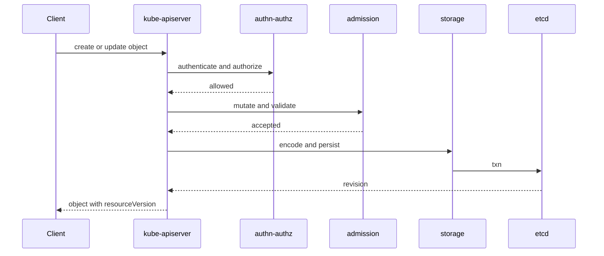

#kubernetes #component #control-plane #apiserver

相关笔记：[[k8s-development-roadmap]] | [[kubernetes-basics]] | [[api-resource]] | [[rbac]] | [[restful-api-design]] | [[etcd-component]] | [[admission-webhook-component]] | [[client-go-source]] | [[k8s-interview]]

# kube-apiserver

## 概述

`kube-apiserver` 是 Kubernetes 的唯一 API 入口。所有组件和用户都通过它读写对象；它负责认证、鉴权、准入控制、schema 校验、对象持久化、watch 分发和聚合 API 路由。

核心边界：**只有 apiserver 直接访问 etcd**。其他组件都应该通过 apiserver 读写状态。

## 职责边界

| 职责 | 说明 |
| --- | --- |
| REST API | 暴露 Pod、Node、Deployment、CRD 等资源接口 |
| authn/authz | 认证请求身份，再用 RBAC/NodeAuthorizer 等授权 |
| admission | 执行 Mutating/Validating admission chain |
| storage | 把资源对象序列化后写入 etcd |
| watch | 给 Informer、scheduler、controller、kubelet 提供 watch 流 |
| aggregation | 通过 APIService 转发到 aggregated apiserver |

## 核心链路



## 关键机制

- `resourceVersion` 来自 etcd revision，是 list/watch 一致性的基础。
- watch cache 减少对 etcd 的直接 watch 压力。
- admission 分 mutating 和 validating 两段，mutating 可能修改对象，validating 只能拒绝。
- CRD 扩展 Kubernetes API；aggregated apiserver 适合更复杂的自定义 API 行为。
- apiserver 是水平扩展组件，多副本共享同一个 etcd 集群。

## 源码导读

源码版本参考本机 `/Users/mac/github.com/kubernetes`：`master`，`v1.36.0-alpha.0-35-gea0dce1df19`。

| 目标 | 源码位置 | 读什么 |
| --- | --- | --- |
| 进程入口 | `cmd/kube-apiserver/app/server.go` | `NewAPIServerCommand`、`Run`、`CreateServerChain` |
| kube apiserver 配置 | `cmd/kube-apiserver/app/server.go` | `CreateKubeAPIServerConfig` |
| generic apiserver | `staging/src/k8s.io/apiserver/pkg/server/` | handler chain、认证鉴权、filter、secure serving |
| native API 安装 | `pkg/controlplane/apiserver/server.go`、`pkg/controlplane/apiserver/apis.go` | `completedConfig.New`、`InstallAPIs` |
| aggregator | `staging/src/k8s.io/kube-aggregator/pkg/apiserver/apiserver.go` | APIService 聚合路由 |
| storage | `staging/src/k8s.io/apiserver/pkg/storage/etcd3/store.go` | `Create`、`GuaranteedUpdate`、`Watch` |
| admission | `staging/src/k8s.io/apiserver/pkg/admission/` | `Admit`、`Validate`、webhook dispatch |

启动链路可以按这个顺序读：

```text
NewAPIServerCommand
  -> options.Complete
  -> Run
  -> CreateServerChain
      -> create APIExtensions server
      -> CreateKubeAPIServerConfig
      -> create kube-apiserver
      -> create aggregator server
  -> prepared.Run
```

精简源码骨架：

```go
func Run(ctx context.Context, opts CompletedOptions) error {
    config := NewConfig(opts)
    completed := config.Complete()
    server, err := CreateServerChain(completed)
    if err != nil {
        return err
    }
    return server.PrepareRun().RunWithContext(ctx)
}

func CreateServerChain(config CompletedConfig) (*APIAggregator, error) {
    apiExtensions := createAPIExtensionsServer(config)
    kubeAPIServer := createKubeAPIServer(config, apiExtensions)
    aggregator := createAggregatorServer(config, kubeAPIServer)
    return aggregator, nil
}
```

真正理解 apiserver 要抓三条线：

1. **请求线**：HTTP request 进入 handler chain，依次经过认证、鉴权、impersonation、audit、timeout、max-in-flight、request info、admission、REST storage。
2. **资源线**：每个 GroupVersionResource 会注册到 `APIGroupInfo`，再映射到对应 REST storage。
3. **存储线**：REST storage 调 storage.Interface，最终走 etcd3 store，把 Kubernetes object 编码成 bytes 后写入 etcd。

## 深入：一个 create Pod 请求如何写入 etcd

这条链路回答一个具体问题：**`kubectl create -f pod.yaml` 到底如何变成 etcd 里的一个 key/value，并返回带 `resourceVersion` 的 Pod？**

### 0. 前置条件

| 前置项 | 说明 |
| --- | --- |
| REST route 已安装 | core API 的 Pod REST storage 已经通过 `InstallAPIs` 注册 |
| handler chain 已构建 | 请求会先经过认证、鉴权、审计、限流、timeout、request info |
| etcd client 可用 | `storageFactory` 为 Pod 构造了 etcd3 storage |
| admission chain 可用 | Mutating/Validating admission 已按 apiserver 参数初始化 |

核心边界：**apiserver 负责把 API 语义变成存储语义；etcd 只看到 key/value、revision、lease，不理解 Pod 调度和容器启动。**

### 1. HTTP 先过 generic handler chain

源码入口：`staging/src/k8s.io/apiserver/pkg/server/config.go`

`DefaultBuildHandlerChain` 把 API handler 包成一串 filter。实际包裹顺序很多，读源码时抓这些关键层：

```text
DefaultBuildHandlerChain
  -> WithAuthorization
  -> WithPriorityAndFairness or WithMaxInFlightLimit
  -> WithImpersonation
  -> WithAudit
  -> WithAuthentication
  -> WithTimeoutForNonLongRunningRequests
  -> WithRequestDeadline
  -> WithRequestInfo
  -> WithPanicRecovery
  -> apiHandler
```

注意源码里 wrapper 的书写顺序和请求进入时的执行顺序需要按“最后包在最外层”理解。事故排查时看到 `forbidden`、`unauthorized`、`too many requests`、`timeout`，通常还没进入 REST storage。

### 2. 路由进入 `createHandler`

源码入口：`staging/src/k8s.io/apiserver/pkg/endpoints/handlers/create.go`

关键函数：`createHandler(r rest.NamedCreater, scope *RequestScope, admit admission.Interface, includeName bool)`

这一层把 HTTP 语义转成 Kubernetes object：

| 步骤 | 关键动作 | 失败表现 |
| --- | --- | --- |
| 解析 namespace/name | `scope.Namer.Name` / `Namespace` | URL 或 namespace 错误 |
| 协商 serializer | `NegotiateInputSerializer` | content-type 不支持 |
| 读取 body | `limitedReadBodyWithRecordMetric` | 请求体过大 |
| decode | `decoder.Decode` | YAML/JSON/schema 解析失败 |
| namespace 校验 | `EnsureObjectNamespaceMatchesRequestNamespace` | URL namespace 与对象 namespace 冲突 |
| 构造 admission attributes | `admission.NewAttributesRecord` | 后续准入使用 |
| mutating admission | `mutatingAdmission.Admit` | webhook/defaulting 拒绝或超时 |
| 调 REST storage | `r.Create` | 进入 registry store |

精简骨架：

```go
func createHandler(r rest.NamedCreater, scope *RequestScope, admit admission.Interface, includeName bool) http.HandlerFunc {
    return func(w http.ResponseWriter, req *http.Request) {
        namespace, name := scope.Namer.Name(req)
        serializer := negotiation.NegotiateInputSerializer(req, false, scope.Serializer)
        body := limitedReadBodyWithRecordMetric(req.Context(), req, scope.MaxRequestBodyBytes, scope.Resource.GroupResource(), requestmetrics.Create)

        obj, gvk := decoder.Decode(body, &scope.Kind, r.New())
        request.WithNamespace(req.Context(), namespace)
        rest.EnsureObjectNamespaceMatchesRequestNamespace(namespace, meta.Accessor(obj))

        attributes := admission.NewAttributesRecord(obj, nil, scope.Kind, namespace, name, scope.Resource, scope.Subresource, admission.Create, options, dryRun, userInfo)
        result := finisher.FinishRequest(ctx, func() (runtime.Object, error) {
            mutatingAdmission.Admit(ctx, attributes, scope)
            return r.Create(ctx, name, obj, rest.AdmissionToValidateObjectFunc(admit, attributes, scope), options)
        })

        transformResponseObject(ctx, scope, req, w, http.StatusCreated, outputMediaType, result)
    }
}
```

这里的关键点：mutating admission 在 storage 前执行；validating admission 会作为 `createValidation` 传给 registry store，在对象策略校验之后、真正写入前执行。

### 3. REST storage 执行 create 策略和 key 计算

源码入口：`staging/src/k8s.io/apiserver/pkg/registry/generic/registry/store.go`

关键函数：`Store.Create -> Store.create`

这一层已经不关心 HTTP，只处理资源对象的创建语义：

| 步骤 | 关键动作 |
| --- | --- |
| 填系统字段 | `rest.FillObjectMetaSystemFields` 设置 UID、creationTimestamp 等 |
| 生成 name | `GenerateName` 不为空且 `name` 为空时生成 |
| create strategy | `rest.BeforeCreate` 执行对象级准备和校验 |
| validating admission | 调 `createValidation(ctx, obj.DeepCopyObject())` |
| key 计算 | `ObjectNameFunc` + `KeyFunc` 生成 etcd key |
| TTL 计算 | `calculateTTL`，普通对象为 0，Event 可设置 TTL |
| storage create | `e.Storage.Create(ctx, key, obj, out, ttl, dryRun)` |

精简骨架：

```go
func (e *Store) create(ctx context.Context, obj runtime.Object, createValidation rest.ValidateObjectFunc, options *metav1.CreateOptions) (runtime.Object, error) {
    objectMeta := meta.Accessor(obj)
    rest.FillObjectMetaSystemFields(objectMeta)
    if objectMeta.GetGenerateName() != "" && objectMeta.GetName() == "" {
        objectMeta.SetName(e.CreateStrategy.GenerateName(objectMeta.GetGenerateName()))
    }

    rest.BeforeCreate(e.CreateStrategy, ctx, obj)
    if createValidation != nil {
        createValidation(ctx, obj.DeepCopyObject())
    }

    name := e.ObjectNameFunc(obj)
    key := e.KeyFunc(ctx, name)
    ttl := e.calculateTTL(obj, 0, false)
    out := e.NewFunc()
    e.Storage.Create(ctx, key, obj, out, ttl, dryrun.IsDryRun(options.DryRun))
    return out, nil
}
```

Pod 常见 key 形态可以理解为：

```text
/registry/pods/<namespace>/<name>
```

不要把这个路径当成稳定公共 API，它是 apiserver storage 实现细节；组件应该走 Kubernetes API。

### 4. etcd3 store 编码、加密并乐观写入

源码入口：`staging/src/k8s.io/apiserver/pkg/storage/etcd3/store.go`

关键函数：`store.Create`

这一层把 Kubernetes runtime object 转成 etcd bytes：

| 步骤 | 关键动作 | 说明 |
| --- | --- | --- |
| 检查 resourceVersion | create 对象不能带已有 resourceVersion | 防止把 update 当 create |
| storage prepare | `PrepareObjectForStorage` | 清理不该持久化的字段 |
| 编码 | `runtime.Encode(s.codec, obj)` | 默认 protobuf，部分资源可能 JSON/CBOR |
| TTL lease | `ttl != 0` 时 `leaseManager.GetLease` | Event 依赖这个机制过期 |
| storage transform | `TransformToStorage` | encryption at rest 在这里发生 |
| 乐观写入 | `OptimisticPut(..., expectedRevision=0)` | key 已存在则失败 |
| decode out | 用 etcd revision 解码出返回对象 | 返回对象带新 `resourceVersion` |

精简骨架：

```go
func (s *store) Create(ctx context.Context, key string, obj, out runtime.Object, ttl uint64) error {
    preparedKey := s.prepareKey(key, false)
    if version := s.versioner.ObjectResourceVersion(obj); version != 0 {
        return storage.ErrResourceVersionSetOnCreate
    }

    s.versioner.PrepareObjectForStorage(obj)
    data := runtime.Encode(s.codec, obj)

    var lease clientv3.LeaseID
    if ttl != 0 {
        lease = s.leaseManager.GetLease(ctx, int64(ttl))
    }

    newData := s.transformer.TransformToStorage(ctx, data, authenticatedDataString(preparedKey))
    txnResp := s.client.Kubernetes.OptimisticPut(ctx, preparedKey, newData, 0, kubernetes.PutOptions{LeaseID: lease})
    if !txnResp.Succeeded {
        return storage.NewKeyExistsError(preparedKey, 0)
    }
    return s.decoder.Decode(data, out, txnResp.Revision)
}
```

### 5. Event TTL 如何接入这条链路

Event 是少数默认带 TTL 的 Kubernetes 对象。源码入口：

| 源码位置 | 作用 |
| --- | --- |
| `pkg/controlplane/apiserver/options/options.go` | 默认 `EventTTL: 1 * time.Hour`，暴露 `--event-ttl` |
| `pkg/controlplane/apiserver/apis.go` | 把 `EventTTL` 传给 core 和 events storage provider |
| `pkg/registry/core/rest/storage_core_generic.go` | core/v1 Event storage 使用 `eventstore.NewREST(..., TTL)` |
| `staging/src/k8s.io/apiserver/pkg/registry/generic/registry/store.go` | `calculateTTL` 计算对象 TTL |
| `staging/src/k8s.io/apiserver/pkg/storage/etcd3/store.go` | `ttl != 0` 时申请 etcd lease |

结论：**默认情况下，`kubectl get events` 只能可靠看到最近约 1 小时的 Event**。生产事故要把 Event 当作短期线索，不要当长期审计。

### 6. create Pod 的失败定位表

| 现象 | 对应源码阶段 | 先看哪里 |
| --- | --- | --- |
| `Unauthorized` | `WithAuthentication` | kubeconfig、token、client cert |
| `Forbidden` | `WithAuthorization` | RBAC、NodeAuthorizer、impersonation |
| `TooManyRequests` | APF 或 max-in-flight | apiserver 流控指标 |
| `BadRequest` / strict decoding | `decoder.Decode` | YAML/JSON 字段、apiVersion/kind |
| webhook timeout | mutating/validating admission | webhook service、TLS、timeoutSeconds、failurePolicy |
| `AlreadyExists` | `OptimisticPut` 发现 key 已存在 | name/generateName、重试逻辑 |
| 写请求慢 | `Store.create` 或 `etcd3.store.Create` | admission 延迟、etcd fsync、对象过大、加密插件 |
| Event 查不到 | Event storage TTL | 默认 `1h` 已过期或 `--event-ttl` 太短 |

## 源码阅读重点

### Handler Chain

`staging/src/k8s.io/apiserver/pkg/server/config.go` 里组装 generic server 配置，handler chain 是理解 apiserver 横切能力的关键。顺序上不要只记“认证鉴权准入”，还要注意 timeout、audit、priority and fairness、request info 这些 filter。

简化模型：

```go
func buildHandler(apiHandler http.Handler) http.Handler {
    h := withAuthorization(apiHandler)
    h = withAuthentication(h)
    h = withAudit(h)
    h = withTimeout(h)
    h = withRequestInfo(h)
    return h
}
```

### REST Storage

Pod、Deployment、ConfigMap 这类资源最终都落到某个 REST storage。读 `pkg/controlplane/apiserver/apis.go` 时要看它如何把 `RESTStorageProvider` 安装进 generic apiserver。

```go
type RESTStorageProvider interface {
    GroupName() string
    NewRESTStorage(...) (APIGroupInfo, error)
}
```

### Watch Cache

watch cache 是 apiserver 扛住大量 watch 的关键。Informer 不是直接压到 etcd watch 上，而是通过 apiserver watch cache 复用事件流。排查大集群 watch 延迟时，需要同时看 apiserver 和 etcd，而不是只看 client-go。

## 故障信号

| 现象 | 常见方向 |
| --- | --- |
| `kubectl` 超时 | apiserver 不可达、证书、负载均衡、etcd 慢 |
| 大量 watch 断开 | apiserver 重启、网络抖动、watch cache 压力 |
| 写请求慢 | admission 慢、etcd fsync 慢、对象过大 |
| `forbidden` | RBAC、service account、NodeAuthorizer |
| `failed calling webhook` | webhook service/cert/failurePolicy 问题 |

## 事故排查

### 先判断故障层级

apiserver 事故先把问题分成四类：

| 类型 | 典型现象 | 优先方向 |
| --- | --- | --- |
| 入口不可达 | `kubectl` 连接失败、TLS handshake 失败 | LB、证书、apiserver 进程、网络 |
| 请求被拒绝 | `Unauthorized`、`Forbidden`、admission deny | authn、authz、admission |
| 请求很慢 | create/update/list/watch 延迟升高 | APF、admission、etcd、对象体积 |
| watch 异常 | informer relist、watch closed、too old resource version | watch cache、etcd compaction、客户端落后 |

### Event 保留时间

Event 默认保留 `1h`，由 kube-apiserver `--event-ttl` 控制。源码上默认值是 `pkg/controlplane/apiserver/options/options.go` 的 `EventTTL: 1 * time.Hour`，最终进入 Event REST storage 并在 etcd3 store 里变成带 lease 的写入。

事故里要先导出 Event：

```bash
kubectl get events -A --sort-by=.lastTimestamp
kubectl get events -n <namespace> --field-selector involvedObject.name=<object-name> --sort-by=.lastTimestamp
```

### 证据保全

| 证据 | 用途 |
| --- | --- |
| `/readyz?verbose` | 区分 apiserver 自身、etcd、post-start hook、informer sync |
| audit log | 证明谁在什么时候发起什么请求 |
| apiserver metrics | 定位 request latency、APF、watch、etcd request latency |
| apiserver logs | admission、storage、watch、panic、timeout 线索 |
| webhook 配置和 endpoints | 排查 `failed calling webhook` |
| etcd endpoint status | 排查写请求慢和 leader 异常 |

### 常见事故路径

1. `kubectl get --raw /readyz?verbose` 失败时，先看失败项。如果是 `etcd`，转 etcd；如果是 post-start hook 或 informer sync，继续看 apiserver 日志。
2. 只有写请求慢、读请求正常时，优先查 admission webhook 和 etcd fsync；只有 list/watch 慢时，优先查 watch cache、客户端过度 list 和 APF。
3. 大量 `failed calling webhook` 不要只重启 apiserver。先检查 webhook Service endpoints、证书 SAN、`timeoutSeconds`、`failurePolicy`。
4. Event 缺失不能证明事故没发生。默认 `1h` 后 Event 会过期，复盘要依赖日志、审计和监控。

## 排查命令

```bash
kubectl get --raw /readyz?verbose
kubectl get --raw /livez?verbose
kubectl get apiservices
kubectl auth can-i create pods --as system:serviceaccount:default:default
kubectl get events -A --sort-by=.lastTimestamp
kubectl get validatingwebhookconfigurations
kubectl get mutatingwebhookconfigurations
kubectl get --raw /metrics | grep apiserver_request_duration_seconds
```

## 面试要点

### Q: 为什么说 apiserver 是 Kubernetes 的通信枢纽？

A: 因为所有组件都通过 apiserver 共享状态。scheduler watch Pending Pod，controller-manager watch 各类资源，kubelet watch 绑定到本节点的 Pod，最终都通过 apiserver 读写对象，而不是组件之间互相调用。

### Q: apiserver 写一个对象经历哪些阶段？

A: 大致是认证、鉴权、Mutating admission、schema/defaulting、Validating admission、storage 写入 etcd，再返回带 `resourceVersion` 的对象。

### Q: 为什么只有 apiserver 直接访问 etcd？

A: 这样可以统一认证鉴权、准入、版本转换、审计和 watch 语义。如果每个组件直接访问 etcd，安全边界和 API 兼容性都会失控。

### Q: CRD 和 aggregated apiserver 怎么选？

A: 大多数声明式资源用 CRD；如果需要自定义存储、复杂子资源、特殊协议转换或非标准 API 行为，才考虑 aggregated apiserver。

### Q: apiserver 性能瓶颈通常在哪里？

A: 常见瓶颈是 etcd 延迟、watch 数量、对象体积、慢 admission webhook、apiserver inflight 请求限制和客户端过度 list。
