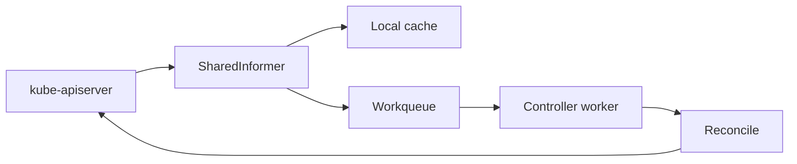

#kubernetes #component #control-plane #controller

相关笔记：[[k8s-development-roadmap]] | [[client-go-source]] | [[controller-runtime-source]] | [[informer]] | [[operator-pattern]] | [[kubebuilder]] | [[kube-apiserver-component]] | [[cloud-controller-manager-component]] | [[k8s-interview]]

# kube-controller-manager

## 概述

`kube-controller-manager` 运行 Kubernetes 内置控制器。控制器的共同模式是 watch 对象变化，然后 reconcile 期望状态和实际状态。

它不是一个单一控制循环，而是把 Deployment、ReplicaSet、Node、Job、EndpointSlice、ServiceAccount、Namespace 等多个控制器打包在同一个二进制里运行。

## 职责边界

| 控制器类型 | 例子 | 职责 |
| --- | --- | --- |
| workload | Deployment、ReplicaSet、Job | 维护工作负载副本和生命周期 |
| node | NodeController | 处理 Node heartbeat、NotReady、驱逐 |
| endpoint | EndpointSliceController | 根据 Service selector 维护 EndpointSlice |
| namespace | NamespaceController | namespace 删除与 finalizer 清理 |
| service account | ServiceAccountController | 默认 service account 与 token 相关对象 |
| volume | AttachDetachController、PVController | 维护 PV/PVC、VolumeAttachment 等状态 |

## 核心链路



## 关键机制

- 控制器通常不直接处理事件本身，而是把 key 放入 workqueue 后基于当前状态 reconcile。
- 同一个 key 需要串行处理，避免并发写同一对象导致状态震荡。
- rate limiting queue 用于错误重试和退避。
- leader election 保证同一控制器在多副本部署时只有 leader 执行写操作。
- 云厂商相关逻辑逐步从 kube-controller-manager 拆到 cloud-controller-manager。

## 源码导读

| 目标 | 源码位置 | 读什么 |
| --- | --- | --- |
| 进程入口 | `cmd/kube-controller-manager/app/controllermanager.go` | `NewControllerManagerCommand`、`Run` |
| 控制器清单 | `cmd/kube-controller-manager/app/controller_descriptor.go` | `KnownControllers` |
| 控制器启动 | `cmd/kube-controller-manager/app/controllermanager.go` | `RunControllers`、`ControllerContext` |
| Deployment 控制器 | `pkg/controller/deployment/` | Deployment -> ReplicaSet reconcile |
| ReplicaSet 控制器 | `pkg/controller/replicaset/` | selector -> Pod adoption/create/delete |
| Node lifecycle | `pkg/controller/nodelifecycle/` | Node condition、taint、eviction |
| EndpointSlice | `pkg/controller/endpointslice/` | Service selector -> EndpointSlice |
| Workqueue 模式 | `staging/src/k8s.io/client-go/util/workqueue/` | rate limiting queue |

内置控制器启动链路：

```text
NewControllerManagerCommand
  -> options.Config
  -> Run
  -> leader election
  -> create ControllerContext
  -> RunControllers
      -> start each controller
      -> wait for informer cache sync
      -> worker reconcile loop
```

精简源码骨架：

```go
func Run(ctx context.Context, c *CompletedConfig) error {
    run := func(ctx context.Context) {
        controllerCtx := CreateControllerContext(c)
        RunControllers(ctx, controllerCtx, controllers)
    }
    return RunWithLeaderElection(ctx, run)
}

func RunControllers(ctx context.Context, controllerCtx ControllerContext, controllers []Controller) {
    for _, controller := range controllers {
        go controller.Start(ctx, controllerCtx)
    }
}
```

## 深入：Deployment 如何创建和滚动 ReplicaSet

这条链路回答一个具体问题：**用户更新 Deployment template 后，kube-controller-manager 如何创建新 ReplicaSet，并按 rolling update 规则扩缩新旧 ReplicaSet？**

### 0. 前置条件

| 前置项 | 说明 |
| --- | --- |
| Deployment 已写入 apiserver | apiserver/etcd 已持久化期望状态 |
| controller-manager 是 leader | 多副本时只有 leader 执行控制器 |
| informer cache 已同步 | Deployment、ReplicaSet、Pod informer 均已 sync |
| selector 合法 | Deployment selector 不能为空且要匹配 template labels |

核心边界：Deployment controller 只维护 ReplicaSet；ReplicaSet controller 才根据 ReplicaSet 创建/删除 Pod；scheduler/kubelet 才让 Pod 跑起来。

### 1. 事件只负责入队

源码入口：`pkg/controller/deployment/deployment_controller.go`

Deployment、ReplicaSet、Pod 的 add/update/delete 事件最终都会找到相关 Deployment 并入队：

```text
Deployment informer event
  -> addDeployment / updateDeployment / deleteDeployment
  -> enqueueDeployment
  -> workqueue key: <namespace>/<name>

ReplicaSet/Pod informer event
  -> resolve owner reference or selector
  -> enqueue owning Deployment
```

关键点：控制器不直接基于事件对象做最终判断，而是把 key 放入队列，worker 后续从 cache 读取当前完整状态。

### 2. Worker 串行处理 key

源码入口：`pkg/controller/deployment/deployment_controller.go`

```go
func (dc *DeploymentController) Run(ctx context.Context, workers int) {
    cache.WaitForNamedCacheSyncWithContext(ctx, dc.dListerSynced, dc.rsListerSynced, dc.podListerSynced)
    for i := 0; i < workers; i++ {
        go wait.UntilWithContext(ctx, dc.worker, time.Second)
    }
}

func (dc *DeploymentController) worker(ctx context.Context) {
    for dc.processNextWorkItem(ctx) {
    }
}
```

同一个 Deployment key 可能被重复入队，但 reconcile 必须幂等。错误会通过 rate limiting queue 退避重试。

### 3. `syncDeployment` 读取当前世界

源码入口：`pkg/controller/deployment/deployment_controller.go`

`syncDeployment` 是 Deployment controller 的核心：

```text
syncDeployment
  -> split namespace/name
  -> get Deployment from lister
  -> get ReplicaSets for Deployment
      -> adoption / orphaning
  -> get Pods grouped by ReplicaSet
  -> handle deletion / paused / rollback / scaling
  -> rolloutRecreate or rolloutRolling
```

精简骨架：

```go
func (dc *DeploymentController) syncDeployment(ctx context.Context, key string) error {
    namespace, name := cache.SplitMetaNamespaceKey(key)
    deployment := dc.dLister.Deployments(namespace).Get(name)
    d := deployment.DeepCopy()

    rsList := dc.getReplicaSetsForDeployment(ctx, d)
    podMap := dc.getPodMapForDeployment(d, rsList)

    if d.DeletionTimestamp != nil {
        return dc.syncStatusOnly(ctx, d, rsList)
    }
    if d.Spec.Paused || dc.isScalingEvent(ctx, d, rsList) {
        return dc.sync(ctx, d, rsList)
    }

    switch d.Spec.Strategy.Type {
    case apps.RecreateDeploymentStrategyType:
        return dc.rolloutRecreate(ctx, d, rsList, podMap)
    case apps.RollingUpdateDeploymentStrategyType:
        return dc.rolloutRolling(ctx, d, rsList)
    }
    return nil
}
```

### 4. `rolloutRolling` 扩新缩旧

源码入口：`pkg/controller/deployment/rolling.go`、`pkg/controller/deployment/sync.go`

rolling update 的核心流程：

```text
rolloutRolling
  -> getAllReplicaSetsAndSyncRevision(createIfNotExisted=true)
      -> find new ReplicaSet by pod template hash
      -> create new ReplicaSet if missing
      -> sync revision annotations
  -> reconcileNewReplicaSet
      -> scale up within maxSurge
  -> reconcileOldReplicaSets
      -> scale down within maxUnavailable
  -> cleanupDeployment
  -> syncRolloutStatus
```

精简骨架：

```go
func (dc *DeploymentController) rolloutRolling(ctx context.Context, d *apps.Deployment, rsList []*apps.ReplicaSet) error {
    newRS, oldRSs := dc.getAllReplicaSetsAndSyncRevision(ctx, d, rsList, true)
    allRSs := append(oldRSs, newRS)

    scaledUp := dc.reconcileNewReplicaSet(ctx, allRSs, newRS, d)
    if scaledUp {
        return dc.syncRolloutStatus(ctx, allRSs, newRS, d)
    }

    scaledDown := dc.reconcileOldReplicaSets(ctx, allRSs, controller.FilterActiveReplicaSets(oldRSs), newRS, d)
    if scaledDown {
        return dc.syncRolloutStatus(ctx, allRSs, newRS, d)
    }

    if deploymentutil.DeploymentComplete(d, &d.Status) {
        dc.cleanupDeployment(ctx, oldRSs, d)
    }
    return dc.syncRolloutStatus(ctx, allRSs, newRS, d)
}
```

`maxSurge` 和 `maxUnavailable` 的取舍就在 `reconcileNewReplicaSet` 和 `reconcileOldReplicaSets` 中体现：先尽量扩新，再在可用性约束允许时缩旧。

### 5. 失败点与排查映射

| 现象 | 对应阶段 | 先看哪里 |
| --- | --- | --- |
| Deployment 不创建 ReplicaSet | informer/queue/syncDeployment | controller-manager leader、logs、RBAC |
| ReplicaSet 创建失败 | `getAllReplicaSetsAndSyncRevision` | selector、ownerReference、admission、quota |
| rollout 卡住 | `rolloutRolling` | 新 Pod readiness、maxUnavailable、progressDeadlineSeconds |
| old ReplicaSet 不缩容 | `reconcileOldReplicaSets` | 新 RS available replicas、PDB、不可用数 |
| status 不更新 | `syncRolloutStatus` | status subresource RBAC、apiserver 写入 |

## 源码阅读重点

### ControllerContext

`ControllerContext` 是所有内置控制器的运行时依赖集合，里面有 client、InformerFactory、RESTMapper、cloud、recorder、feature gates 等。看它能快速知道控制器能访问哪些信息。

### Reconcile 不等于事件处理

以 Deployment 为例，事件只负责把 key 放入队列；真正逻辑会重新读取当前 Deployment、ReplicaSet、Pod，再计算下一步。这个模型能抵抗事件乱序和重复。

### 内置控制器和自定义 Operator

二者模式一致：Informer + Workqueue + Reconcile。区别是内置控制器直接在 Kubernetes 主仓里，Operator 通常用 controller-runtime 封装同一套模式。

## 故障信号

| 现象 | 常见方向 |
| --- | --- |
| Deployment 不扩缩容 | controller-manager 不工作、RBAC、watch 延迟 |
| Node NotReady 后不驱逐 | node controller、lease、taint、eviction 配置 |
| EndpointSlice 不更新 | selector、Pod readiness、controller 延迟 |
| namespace 卡 Terminating | finalizer、APIService 不可用、资源清理失败 |

## 事故排查

### 先判断故障层级

控制器事故先区分“控制器没跑”“控制器跑了但写失败”“下游对象已创建但后续链路失败”：

| 判断 | 结论 |
| --- | --- |
| Deployment generation 增加但 observedGeneration 不变 | Deployment controller 没完成 sync/status |
| ReplicaSet 已创建但 Pod 没创建 | 转 ReplicaSet controller 或 admission/quota |
| Pod 已创建但 Pending | 转 scheduler |
| Pod 已绑定但不启动 | 转 kubelet/runtime/CNI/CSI |

### Event 保留时间

Deployment、ReplicaSet、Pod 的控制器事件默认只保留 `1h`，由 kube-apiserver `--event-ttl` 控制。rollout 事故要尽早保存 `kubectl describe deployment/rs/pod`，否则后续只能依赖 controller-manager 日志、审计和监控。

### 证据保全

| 证据 | 用途 |
| --- | --- |
| Deployment YAML | generation、strategy、selector、template hash |
| ReplicaSet 列表 | 判断新旧 RS、revision、replicas |
| Pod 列表 | 判断是控制器、调度还是节点问题 |
| controller-manager logs | workqueue 错误、admission/RBAC 写失败 |
| Events | 用户可读 rollout 失败原因 |
| Lease | 确认 controller-manager leader |

### 常见事故路径

1. rollout 卡住先看 `kubectl rollout status` 和 Deployment condition。如果是 `ProgressDeadlineExceeded`，继续看新 RS 的 Pod readiness。
2. 只有 status 不更新但对象实际已变化，优先查 status subresource 写入和 controller-manager 到 apiserver 的权限。
3. namespace 卡 `Terminating` 常常不是 namespace controller 本身，而是某个 APIService 不可用或 finalizer 清理失败。
4. 控制器日志里没有对应 key 时，先查 informer cache sync、leader election 和控制器是否被参数禁用。

## 排查命令

```bash
kubectl -n kube-system logs deploy/kube-controller-manager --tail=300
kubectl get lease -n kube-system
kubectl describe deployment <deployment> -n <namespace>
kubectl get deployment <deployment> -n <namespace> -o yaml
kubectl get rs,pod -n <namespace> -l <selector>
kubectl get events -n <namespace> --sort-by=.lastTimestamp
kubectl rollout status deployment/<deployment> -n <namespace>
```

## 面试要点

### Q: controller-manager 为什么要用 workqueue？

> [!question]- 参考答案（点击展开）
>
> 事件可能丢失、合并或乱序，控制器真正关心的是某个对象当前是否收敛。workqueue 存 key，worker 每次基于最新 cache/API 状态 reconcile，更符合声明式系统。

### Q: controller 和 operator 的关系是什么？

> [!question]- 参考答案（点击展开）
>
> operator 是面向某个业务领域的控制器模式实践。Kubernetes 内置控制器由 kube-controller-manager 运行，自定义 operator 通常由用户部署的 controller-runtime 进程运行。

### Q: 为什么控制器要做到幂等？

> [!question]- 参考答案（点击展开）
>
> 同一个 key 可能因重试、resync、多个事件重复进入队列。reconcile 必须能重复执行而不产生错误副作用。

### Q: controller-manager 是高可用的吗？

> [!question]- 参考答案（点击展开）
>
> 可以多副本部署，但通过 leader election 保证同一个控制器只有 leader 主动执行 reconcile，其他副本待命。

### Q: kube-controller-manager 和 cloud-controller-manager 的边界？

> [!question]- 参考答案（点击展开）
>
> kube-controller-manager 负责通用 Kubernetes 控制器；cloud-controller-manager 负责云厂商相关的 Node、Route、LoadBalancer 等逻辑。
