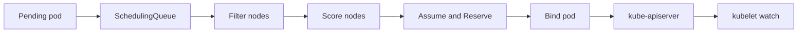

#kubernetes #component #control-plane #scheduler

相关笔记：[[k8s-development-roadmap]] | [[scheduler-deep-dive#关键机制：Assume 与 Bind|Assume 与 Bind]] | [[scheduler-framework-source]] | [[scheduler-podgroup-source]] | [[volcano-source]] | [[gpu-scheduling-source]] | [[kube-apiserver-component]] | [[kubelet-component]] | [[k8s-interview]]

# kube-scheduler

## 概述

`kube-scheduler` 负责给未绑定的 Pod 选择一个合适的 Node。它不创建容器、不分配 Pod IP，也不挂载卷；它的核心输出是把 Pod 绑定到某个 Node。

一句话边界：**scheduler 决定 Pod 去哪台机器，kubelet 负责在那台机器上把 Pod 跑起来。**

## 职责边界

| 职责 | 说明 |
| --- | --- |
| queue | 管理 activeQ、backoffQ、unschedulableQ |
| filter | 剔除不满足资源、亲和性、污点、端口、拓扑约束的节点 |
| score | 给可行节点打分并选择最优节点 |
| assume | 先在 scheduler cache 中乐观占位 |
| bind | 通过 apiserver 写入 Pod binding |
| extension | 通过 Scheduling Framework 或 extender 扩展调度逻辑 |

## 核心链路



## 关键机制

- 调度只处理 `spec.nodeName` 为空的 Pod。
- `Filter` 判断能不能放，`Score` 判断更适合放哪里。
- `assume` 是乐观缓存，避免 bind 前调度器重复把资源分给其他 Pod。
- `Permit` 可以实现 gang scheduling 等等待语义。
- 自定义调度器可以通过 profile、Framework Plugin、Extender、独立 scheduler 实现。

## 源码导读

| 目标 | 源码位置 | 读什么 |
| --- | --- | --- |
| 进程入口 | `cmd/kube-scheduler/app/server.go` | `NewSchedulerCommand`、`Run` |
| Scheduler 主体 | `pkg/scheduler/scheduler.go` | `Scheduler`、`Run`、Informer/queue 装配 |
| 单 Pod 调度 | `pkg/scheduler/schedule_one.go` | `ScheduleOne`、`bindingCycle` |
| 调度队列 | `pkg/scheduler/backend/queue/scheduling_queue.go` | activeQ、backoffQ、unschedulablePods |
| cache/snapshot | `pkg/scheduler/backend/cache/` | assume、finish binding、forget pod |
| Framework | `pkg/scheduler/framework/` | plugin interface、CycleState、Status |
| 内置插件 | `pkg/scheduler/framework/plugins/` | NodeResourcesFit、TaintToleration、InterPodAffinity 等 |

调度主链路：

```text
Scheduler.Run
  -> wait for cache sync
  -> schedulingQueue.Run
  -> loop ScheduleOne
      -> NextPod
      -> schedulingCycle
          -> PreFilter
          -> Filter
          -> PostFilter
          -> PreScore
          -> Score
          -> Reserve
          -> Permit
      -> assume pod
      -> bindingCycle
          -> PreBind
          -> Bind
          -> PostBind
```

精简源码骨架：

```go
func (sched *Scheduler) Run(ctx context.Context) {
    go wait.UntilWithContext(ctx, sched.ScheduleOne, 0)
    <-ctx.Done()
}

func (sched *Scheduler) ScheduleOne(ctx context.Context) {
    podInfo := sched.NextPod(logger)
    result := sched.SchedulePod(ctx, fwk, state, pod)
    sched.assume(pod, result.SuggestedHost)
    go sched.bindingCycle(ctx, state, fwk, result, assumedPodInfo, start, podsToActivate)
}
```

## 深入：一个 Pending Pod 如何经过 Filter/Score/Bind

这条链路回答一个具体问题：**一个 `spec.nodeName` 为空的 Pod，scheduler 如何选出 Node 并把绑定结果写回 apiserver？**

### 0. 前置条件

| 前置项 | 说明 |
| --- | --- |
| Pod 未绑定 | `spec.nodeName` 为空 |
| scheduler profile 匹配 | `spec.schedulerName` 等于某个 profile |
| informer cache 已同步 | scheduler 已看到 Pod、Node、PV/PVC 等对象 |
| Node 在 cache 中可用 | NotReady、unschedulable、taint 等会影响过滤 |

核心边界：scheduler 只写绑定结果，不拉镜像、不创建 sandbox、不分配 Pod IP。

### 1. Pod 从队列取出：`NextPod`

源码入口：`pkg/scheduler/schedule_one.go`、`pkg/scheduler/backend/queue/scheduling_queue.go`

调度队列不是简单 FIFO：

| 队列 | 作用 |
| --- | --- |
| `activeQ` | 立即可尝试调度 |
| `backoffQ` | 失败后退避，避免忙等 |
| `unschedulablePods` | 等待集群事件触发重新入队 |

精简骨架：

```go
func (sched *Scheduler) ScheduleOne(ctx context.Context) {
    podInfo := sched.NextPod(logger)
    pod := podInfo.Pod
    fwk := sched.frameworkForPod(pod)
    state := framework.NewCycleState()
    result := sched.SchedulePod(ctx, fwk, state, pod)
    sched.assume(pod, result.SuggestedHost)
    go sched.bindingCycle(ctx, state, fwk, result, podInfo, start, podsToActivate)
}
```

### 2. Scheduling Cycle：Filter 和 Score

源码入口：`pkg/scheduler/schedule_one.go`

调度循环可以按 Framework extension point 读：

```text
SchedulePod
  -> PreFilter
  -> findNodesThatFitPod
      -> Filter plugins
  -> prioritizeNodes
      -> PreScore
      -> Score plugins
      -> NormalizeScore
  -> selectHost
```

关键数据结构：

| 结构 | 作用 |
| --- | --- |
| `framework.CycleState` | 一个调度周期内插件共享状态 |
| `framework.NodeInfo` | Node、已调度 Pod、资源和镜像等快照 |
| `framework.Status` | 插件返回 `Success`、`Unschedulable`、`Error` 等 |
| `ScheduleResult` | 最终 host、评估节点数、可行节点数 |

Filter 是硬约束，任何一个必需插件拒绝都会让 Node 不可行；Score 只在可行节点上做排序。

### 3. Assume：先占 scheduler cache

源码入口：`pkg/scheduler/schedule_one.go`、`pkg/scheduler/backend/cache/cache.go`

选出 Node 后，scheduler 先在本地 cache 里 assume Pod：

```go
func (sched *Scheduler) assume(logger klog.Logger, assumed *v1.Pod, host string) error {
    assumed.Spec.NodeName = host
    return sched.Cache.AssumePod(logger, assumed)
}
```

这个步骤是防并发超卖：bind 写 apiserver 有延迟，如果不先 assume，下一个 Pod 可能基于旧 cache 再次占用同一份资源。

### 4. Binding Cycle：异步写绑定结果

源码入口：`pkg/scheduler/schedule_one.go`

绑定循环可以异步执行，因为它已经不再影响当前 scheduling cycle 的串行一致性：

```text
bindingCycle
  -> RunReservePluginsReserve
  -> RunPermitPlugins
  -> WaitOnPermit
  -> RunPreBindPlugins
  -> RunBindPlugins
      -> default binder writes Binding subresource
  -> RunPostBindPlugins
  -> FinishBinding
```

默认 bind 最终会通过 apiserver 写 Pod binding 或更新 Pod 的 `spec.nodeName`。kubelet watch 到这个 Pod 后才进入节点执行链路。

### 5. 失败点与排查映射

| 现象 | 对应阶段 | 先看哪里 |
| --- | --- | --- |
| `FailedScheduling: Insufficient cpu` | Filter | Node allocatable、requests、已调度 Pod |
| `node(s) had untolerated taint` | Filter | Pod tolerations、Node taints |
| `node(s) didn't match Pod's node affinity/selector` | Filter | nodeSelector、nodeAffinity、labels |
| `preemption is not helpful` | PostFilter/preemption | PDB、优先级、资源碎片 |
| Pod 反复 Pending/backoff | Queue | scheduler logs、events、backoffQ |
| Bind 失败 | Binding Cycle | RBAC、apiserver、default binder、assume cleanup |

## 源码阅读重点

### Scheduling Cycle 和 Binding Cycle

Scheduling Cycle 需要串行，因为它依赖 scheduler cache 的一致性；Binding Cycle 可以异步执行，这样慢 bind 不会阻塞下一个 Pod 的调度。理解这个分工后，`assume` 的意义就清楚了：调度器先在本地占位，再异步写 apiserver。

### Queue

调度失败的 Pod 不会一直忙等：

- `activeQ`：马上可调度。
- `backoffQ`：失败后等待退避。
- `unschedulablePods`：等待集群事件触发重新入队。

### Framework Plugin

扩展点不是“都必须实现”。大多数插件只实现其中几个点。读插件时先问：它是在做硬过滤、软打分、资源预留、等待许可，还是绑定前后处理？

## 故障信号

| 现象 | 常见方向 |
| --- | --- |
| Pod Pending | 资源不足、nodeSelector、affinity、taint、PVC、端口冲突 |
| 调度很慢 | 队列堆积、插件慢、节点过多、打分成本高 |
| GPU Pod 无法调度 | extended resource 不足、Device Plugin 未上报 |
| 多调度器冲突 | `schedulerName`、leader election、RBAC 配置 |

## 事故排查

### 先判断故障层级

Pending 事故先看 Pod 是否已经被绑定：

| 判断 | 结论 |
| --- | --- |
| `spec.nodeName` 为空 | scheduler 未完成绑定 |
| `spec.nodeName` 不为空但 Pod 没启动 | 已离开 scheduler，转 kubelet/runtime/CNI/CSI |
| event 是 `FailedScheduling` | 看 Filter/PostFilter 原因 |
| event 是 bind/update 失败 | 看 scheduler 到 apiserver 的权限和可用性 |

### Event 保留时间

调度失败最关键的证据通常在 Event 里，但 Kubernetes Event 默认保留 `1h`，由 kube-apiserver `--event-ttl` 控制。超过窗口后，`kubectl describe pod` 可能看不到早期 `FailedScheduling`，需要查 scheduler 日志和监控。

### 证据保全

| 证据 | 用途 |
| --- | --- |
| Pod YAML | requests、affinity、tolerations、schedulerName |
| `describe pod` events | Filter 插件给出的用户可读原因 |
| Node YAML | taints、labels、allocatable、conditions |
| scheduler logs | 插件错误、队列移动、bind 失败 |
| scheduler metrics | queue depth、scheduling latency、plugin latency |

### 常见事故路径

1. `0/<n> nodes are available` 先按 event message 分类，不要直接扩容。资源不足、taint、affinity、PVC、hostPort 是不同问题。
2. GPU Pod Pending 先查 Node capacity 里是否有扩展资源，再查 Device Plugin，而不是先看 kubelet 拉容器。
3. 多调度器场景先确认 `spec.schedulerName`，避免把 Pod 交给了不存在或没 leader 的 scheduler。
4. scheduler 日志显示 bind 成功但 Pod 不启动，说明问题已经转到 kubelet。

## 排查命令

```bash
kubectl describe pod <pod> -n <namespace>
kubectl get pod <pod> -n <namespace> -o yaml
kubectl get events -n <namespace> --sort-by=.lastTimestamp
kubectl get nodes -o wide
kubectl describe node <node>
kubectl -n kube-system logs deploy/kube-scheduler --tail=300
kubectl -n kube-system get lease
```

## 面试要点

### Q: kube-scheduler 的输入和输出是什么？

A: 输入是未绑定的 Pending Pod、Node、PV/PVC、拓扑和策略对象；输出是 Pod 到 Node 的绑定结果。

### Q: Filter 和 Score 的区别？

A: Filter 是硬约束，节点不满足就不能调度；Score 是软偏好，在可行节点中选择更优节点。

### Q: scheduler 和 kubelet 在资源分配上怎么分工？

A: scheduler 基于 Node capacity/allocatable 选择节点；kubelet 在节点上执行容器创建、volume mount、device allocation 等实际动作。

### Q: assume cache 解决什么问题？

A: 解决调度器在 bind 写入 apiserver 前的资源抢占窗口。assume 后调度器本地先认为资源已占用，避免后续 Pod 看到过期容量。

### Q: 调度扩展优先选 Plugin 还是 Extender？

A: 深度定制优先 Scheduling Framework Plugin，性能好且扩展点完整；Extender 通过 HTTP 调用，适合兼容外部系统，但延迟和可用性风险更高。
