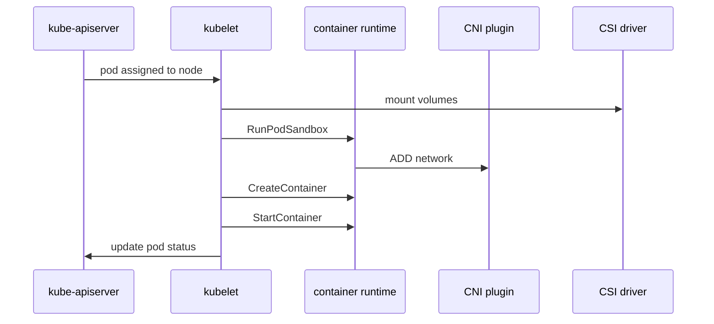

#kubernetes #component #node #kubelet

相关笔记：[[k8s-development-roadmap]] | [[kubernetes-basics]] | [[kubelet-cri-source]] | [[cri-source]] | [[container-runtime-component]] | [[cni-plugin-component]] | [[csi-driver-component]] | [[device-plugin-component]] | [[probes]] | [[k8s-interview]]

# kubelet

## 概述

`kubelet` 是每个 Node 上的核心 agent。它 watch 绑定到本节点的 Pod，然后通过 CRI、CNI、CSI、Device Plugin 等接口把 Pod 真正运行起来，并持续上报 Node/Pod 状态。

一句话边界：**apiserver 保存状态，scheduler 选择节点，kubelet 在节点上执行。**

## 职责边界

| 职责 | 说明 |
| --- | --- |
| pod lifecycle | 拉镜像、创建 sandbox、启动容器、重启失败容器 |
| node status | 上报 Node condition、capacity、allocatable |
| CRI | 通过 runtime service 和 image service 管理容器 |
| probes | 执行 liveness/readiness/startup probe |
| volume | 驱动 volume manager 调用 CSI 或 in-tree volume plugin |
| device | 管理 Device Plugin 注册和 Allocate |
| static pod | 从本地 manifest 运行静态 Pod |

## 核心链路



## 关键机制

- `syncLoop` 是 kubelet 主循环，处理 apiserver、PLEG、probe、timer 等事件。
- PLEG 感知 runtime 中容器实际状态变化。
- `podWorkers` 保证同一个 Pod 的 sync 串行执行。
- kubelet 不直接调用 CNI；现代 Kubernetes 中 CNI 通常由 CRI runtime 调用。
- 静态 Pod 由 kubelet 直接从本地文件运行，apiserver 中看到的是 mirror pod。

## 源码导读

| 目标 | 源码位置 | 读什么 |
| --- | --- | --- |
| 进程入口 | `cmd/kubelet/app/server.go` | `NewKubeletCommand`、`RunKubelet` |
| Kubelet 主体 | `pkg/kubelet/kubelet.go` | `Kubelet`、`syncLoop`、`syncLoopIteration` |
| Pod worker | `pkg/kubelet/pod_workers.go` | 单 Pod 串行 sync |
| Runtime manager | `pkg/kubelet/kuberuntime/` | `SyncPod`、sandbox/container 创建 |
| PLEG | `pkg/kubelet/pleg/` | runtime 状态事件 |
| Volume manager | `pkg/kubelet/volumemanager/` | Desired/Actual state reconciler |
| Device manager | `pkg/kubelet/cm/devicemanager/` | Device Plugin 注册与 Allocate |
| Probe manager | `pkg/kubelet/prober/` | liveness/readiness/startup probe |

节点执行链路总览：

```text
RunKubelet
  -> create Kubelet
  -> start managers
  -> syncLoop
      -> configCh / plegCh / probeCh / syncTicker
      -> HandlePodAdditions / HandlePodUpdates
      -> podWorkers.UpdatePod
      -> podWorkerLoop
      -> Kubelet.SyncPod
      -> kubeGenericRuntimeManager.SyncPod
      -> createPodSandbox
      -> startContainer
      -> CRI RunPodSandbox / CreateContainer / StartContainer
```

精简源码骨架：

```go
func (kl *Kubelet) syncLoop(ctx context.Context, updates <-chan PodUpdate, handler SyncHandler) {
    plegCh := kl.pleg.Watch()
    for {
        if !kl.syncLoopIteration(ctx, updates, handler, syncTicker.C, housekeepingTicker.C, plegCh) {
            return
        }
    }
}

func (kl *Kubelet) syncLoopIteration(...) bool {
    select {
    case update := <-configCh:
        handler.HandlePodUpdates(ctx, update.Pods)
    case event := <-plegCh:
        handler.HandlePodSyncs(ctx, podsFromPLEG(event))
    case <-syncCh:
        handler.HandlePodSyncs(ctx, podsToSync())
    }
    return true
}
```

## 深入：kubelet 如何拉起一个容器

这条链路回答一个具体问题：**一个已经被 scheduler 绑定到本节点的 Pod，如何被 kubelet 变成 containerd/runc 里的真实容器进程？**

### 0. 前置条件

进入 kubelet 前，scheduler 已经把 Pod 绑定到 Node：

| 前置状态 | 说明 |
| --- | --- |
| `pod.spec.nodeName` | 已经是当前 Node |
| apiserver watch | kubelet 能从 apiserver source watch 到这个 Pod |
| runtime ready | container runtime socket 可用 |
| network ready | CNI 配置和 runtime 网络状态可用，hostNetwork Pod 例外 |
| volume ready | Pod 引用的 volume 可 attach/mount |

注意：kubelet 不负责调度，也不负责直接执行 CNI。kubelet 的主要职责是把“绑定到本机的 Pod spec”转成一组 CRI 调用。

### 1. apiserver 事件进入 kubelet：`syncLoopIteration`

入口在 `pkg/kubelet/kubelet.go`：

| 函数 | 作用 |
| --- | --- |
| `syncLoop` | kubelet 主循环 |
| `syncLoopIteration` | select 多个事件源 |
| `HandlePodAdditions` | 新 Pod 第一次进入 kubelet |
| `HandlePodUpdates` | 已知 Pod spec 更新 |

关键逻辑：

```go
func (kl *Kubelet) syncLoopIteration(...) bool {
    select {
    case update := <-configCh:
        switch update.Op {
        case ADD:
            handler.HandlePodAdditions(update.Pods)
        case UPDATE:
            handler.HandlePodUpdates(update.Pods)
        }
    case event := <-plegCh:
        handler.HandlePodSyncs(podsFromPLEG(event))
    case <-syncCh:
        handler.HandlePodSyncs(podsToSync())
    }
    return true
}
```

这里的核心点是：`syncLoop` 只是事件路由器，不直接创建容器。真正的执行会被丢给 `podWorkers`。

### 2. Pod 入队：`HandlePodAdditions -> podWorkers.UpdatePod`

`HandlePodAdditions` 做三件关键事：

1. 把 Pod 放入 `podManager`，作为 kubelet 期望状态的一部分。
2. 做 admission/resource allocation，失败则 reject Pod。
3. 调 `podWorkers.UpdatePod`，让对应 Pod worker 串行处理。

源码路径：`pkg/kubelet/kubelet.go`

```go
func (kl *Kubelet) HandlePodAdditions(pods []*v1.Pod) {
    for _, pod := range pods {
        kl.podManager.AddPod(pod)

        if ok := kl.allocationManager.AddPod(kl.GetActivePods(), pod); !ok {
            kl.rejectPod(pod, reason, message)
            continue
        }

        kl.podWorkers.UpdatePod(UpdatePodOptions{
            Pod:        pod,
            MirrorPod:  mirrorPod,
            UpdateType: SyncPodCreate,
            StartTime:  start,
        })
    }
}
```

这个阶段还没拉镜像、没创建 sandbox，只是把工作交给 Pod worker。

### 3. 单 Pod 串行执行：`podWorkers.UpdatePod -> podWorkerLoop`

源码路径：`pkg/kubelet/pod_workers.go`

设计目的：同一个 Pod 的生命周期操作必须串行，否则会出现一边创建容器、一边删除容器、一边更新 status 的竞态。

关键结构：

| 结构 | 作用 |
| --- | --- |
| `podWorkers` | 管理每个 Pod 的 worker |
| `podSyncStatus` | 记录 Pod 是否 syncing、terminating、terminated |
| `UpdatePodOptions` | 一次 Pod 更新的输入 |
| `podWorkerLoop` | 具体消费该 Pod 的更新 |

精简骨架：

```go
func (p *podWorkers) UpdatePod(options UpdatePodOptions) {
    status := p.podSyncStatuses[uid]
    status.pendingUpdate = options
    p.podUpdates[uid] <- struct{}{}
}

func (p *podWorkers) podWorkerLoop(podUID types.UID, podUpdates <-chan struct{}) {
    for range podUpdates {
        ctx, update, canStart, canEverStart := p.startPodSync(podUID)
        if !canEverStart {
            return
        }
        if !canStart {
            continue
        }
        isTerminal, err := p.podSyncer.SyncPod(
            ctx,
            update.Options.UpdateType,
            update.Options.Pod,
            update.Options.MirrorPod,
            status,
        )
        p.completeWork(podUID, isTerminal, err)
    }
}
```

这里的关键不变量：**同一个 Pod 同一时刻只有一个 worker 在执行 SyncPod**。

### 4. kubelet 层准备 Pod：`Kubelet.SyncPod`

源码路径：`pkg/kubelet/kubelet.go`

`Kubelet.SyncPod` 是 kubelet 层的 Pod 执行编排。它还没直接调用 `CreateContainer`，而是先把节点侧前置条件准备好。

按源码注释和执行顺序，重点步骤是：

| 顺序 | 动作 | 失败表现 |
| --- | --- | --- |
| 1 | 生成 API PodStatus 并写 statusManager | Pod status 更新延迟 |
| 2 | 检查 network ready | `NetworkNotReady` |
| 3 | 注册 Secret/ConfigMap 引用 | secret/configmap 拉取失败 |
| 4 | 创建/更新 Pod cgroup | cgroup 或资源配置错误 |
| 5 | 创建 Pod data directories | 节点磁盘/权限问题 |
| 6 | 等待 volume attach/mount | `ContainerCreating`、mount 事件 |
| 7 | 获取 image pull secrets | 镜像认证失败 |
| 8 | 调 `containerRuntime.SyncPod` | 进入 runtime manager |

精简骨架：

```go
func (kl *Kubelet) SyncPod(ctx context.Context, updateType SyncPodType, pod *v1.Pod, mirrorPod *v1.Pod, podStatus *PodStatus) (bool, error) {
    apiStatus := kl.generateAPIPodStatus(pod, podStatus, false)
    kl.statusManager.SetPodStatus(logger, pod, apiStatus)

    if err := kl.runtimeState.networkErrors(); err != nil && !isHostNetworkPod(pod) {
        return false, err
    }

    kl.secretManager.RegisterPod(pod)
    kl.configMapManager.RegisterPod(pod)
    kl.makePodDataDirs(pod)
    kl.volumeManager.WaitForAttachAndMount(ctx, pod)

    pullSecrets := kl.getPullSecretsForPod(pod)
    result := kl.containerRuntime.SyncPod(ctx, pod, podStatus, pullSecrets, backOff, false)
    return false, result.Error()
}
```

这一层的关键边界：**Kubelet.SyncPod 负责准备 Pod 运行环境；真正 sandbox/container 操作在 runtime manager 里。**

### 5. 计算差异：`kubeGenericRuntimeManager.computePodActions`

源码路径：`pkg/kubelet/kuberuntime/kuberuntime_manager.go`

进入 runtime manager 后，第一步不是立即创建容器，而是比较“Pod 期望状态”和“runtime 实际状态”。

输出结构是 `podActions`，关键字段：

| 字段 | 含义 |
| --- | --- |
| `KillPod` | 是否需要杀掉整个 Pod sandbox |
| `CreateSandbox` | 是否需要新建 sandbox |
| `SandboxID` | 可复用的 sandbox id |
| `InitContainersToStart` | 需要启动哪些 init container |
| `ContainersToStart` | 需要启动哪些普通 container |
| `EphemeralContainersToStart` | 需要启动哪些 ephemeral container |
| `ContainersToKill` | 需要停止哪些旧容器 |
| `ContainersToUpdate` | 原地 resize 时需要更新哪些容器资源 |

精简骨架：

```go
func (m *kubeGenericRuntimeManager) SyncPod(...) PodSyncResult {
    changes := m.computePodActions(ctx, pod, podStatus, restartAllContainers)

    if changes.KillPod {
        m.killPodWithSyncResult(ctx, pod, runningPod, nil)
    }

    if changes.CreateSandbox {
        sandboxID, _, err := m.createPodSandbox(ctx, pod, changes.Attempt)
        if err != nil {
            return result
        }
        podSandboxID = sandboxID
    }

    for _, idx := range changes.InitContainersToStart {
        start(ctx, "init container", metrics.InitContainer, containerStartSpec(&pod.Spec.InitContainers[idx]))
    }

    for _, idx := range changes.ContainersToStart {
        start(ctx, "container", metrics.Container, containerStartSpec(&pod.Spec.Containers[idx]))
    }
}
```

这一步是读 kubelet 源码的关键。很多“为什么 kubelet 没有启动我的容器”的问题，答案都在 `computePodActions` 的分支里。

### 6. 创建 Pod sandbox：`createPodSandbox -> RunPodSandbox`

源码路径：`pkg/kubelet/kuberuntime/kuberuntime_sandbox.go`

Pod sandbox 是 Pod 网络命名空间、日志目录、Linux namespace 组合的基础，通常由 pause 容器承载。

关键步骤：

| 顺序 | 动作 |
| --- | --- |
| 1 | `generatePodSandboxConfig` 生成 CRI `PodSandboxConfig` |
| 2 | 创建 Pod log directory |
| 3 | 查 RuntimeClass，得到 runtime handler |
| 4 | 调 `runtimeService.RunPodSandbox` |
| 5 | runtime 内部创建 pause 容器并调用 CNI |
| 6 | kubelet 调 `PodSandboxStatus` 获取 Pod IP |

精简骨架：

```go
func (m *kubeGenericRuntimeManager) createPodSandbox(ctx context.Context, pod *v1.Pod, attempt uint32) (string, string, error) {
    config, err := m.generatePodSandboxConfig(ctx, pod, attempt)
    if err != nil {
        return "", "sandbox config failed", err
    }

    runtimeHandler := m.runtimeClassManager.LookupRuntimeHandler(pod.Spec.RuntimeClassName)
    sandboxID, err := m.runtimeService.RunPodSandbox(ctx, config, runtimeHandler)
    if err != nil {
        return "", "run sandbox failed", err
    }
    return sandboxID, "", nil
}
```

这里要明确：**kubelet 不直接 fork CNI plugin**。`RunPodSandbox` 发给 containerd/CRI-O 后，runtime 在创建 sandbox 网络时调用 CNI。

### 7. 启动容器：`startContainer`

源码路径：`pkg/kubelet/kuberuntime/kuberuntime_container.go`

这是“拉起一个容器”的核心函数。源码里已经分成 Step 1/2/3/4：

| 步骤 | 调用 | 做什么 |
| --- | --- | --- |
| Step 1 | `imagePuller.EnsureImageExists` | 检查/拉取镜像 |
| Step 2 | `generateContainerConfig` + `CreateContainer` | 生成 CRI ContainerConfig 并创建容器 |
| Step 3 | `StartContainer` | 启动容器进程 |
| Step 4 | `PostStart` hook | 执行生命周期钩子，失败则 kill container |

精简骨架：

```go
func (m *kubeGenericRuntimeManager) startContainer(ctx context.Context, sandboxID string, sandboxConfig *PodSandboxConfig, spec *startSpec, pod *v1.Pod, status *PodStatus, pullSecrets []v1.Secret, podIP string, podIPs []string, imageVolumes ImageVolumes) (string, error) {
    container := spec.container

    imageRef, msg, err := m.imagePuller.EnsureImageExists(
        ctx,
        ref,
        pod,
        container.Image,
        pullSecrets,
        sandboxConfig,
        runtimeHandler,
        container.ImagePullPolicy,
    )
    if err != nil {
        return msg, err
    }

    restartCount := nextRestartCount(status, container.Name)
    target := spec.getTargetID(status)
    containerConfig, cleanup, err := m.generateContainerConfig(
        ctx,
        container,
        pod,
        restartCount,
        podIP,
        imageRef,
        podIPs,
        target,
        imageVolumes,
    )
    if cleanup != nil {
        defer cleanup()
    }
    if err != nil {
        return err.Error(), ErrCreateContainerConfig
    }

    if err := m.internalLifecycle.PreCreateContainer(logger, pod, container, containerConfig); err != nil {
        return err.Error(), ErrPreCreateHook
    }

    containerID, err := m.runtimeService.CreateContainer(ctx, sandboxID, containerConfig, sandboxConfig)
    if err != nil {
        return err.Error(), ErrCreateContainer
    }

    if err := m.internalLifecycle.PreStartContainer(logger, pod, container, containerID); err != nil {
        return err.Error(), ErrPreStartHook
    }

    if err := m.runtimeService.StartContainer(ctx, containerID); err != nil {
        return err.Error(), ErrRunContainer
    }

    return "", runPostStartHook(ctx, pod, container, containerID)
}
```

### 8. 镜像拉取：`EnsureImageExists -> pullImage`

源码路径：`pkg/kubelet/images/image_manager.go`

`EnsureImageExists` 不是无脑 pull，它会按 `imagePullPolicy`、本地镜像、凭证和 backoff 做判断。

关键路径：

```text
EnsureImageExists
  -> applyDefaultImageTag
  -> imagePullPrecheck
      -> local image exists?
      -> pull policy check
  -> makeLookupPullCredentialsFunc
      -> imagePullSecrets
      -> node keyring
      -> external credential provider
  -> pullImage
      -> backoff check
      -> m.puller.pullImage
      -> CRI ImageService.PullImage
```

精简骨架：

```go
func (m *imageManager) EnsureImageExists(ctx context.Context, ref *v1.ObjectReference, pod *v1.Pod, requestedImage string, pullSecrets []v1.Secret, sandboxConfig *PodSandboxConfig, runtimeHandler string, pullPolicy v1.PullPolicy) (string, string, error) {
    image := applyDefaultImageTag(requestedImage)
    imageRef, _, message, err := m.imagePullPrecheck(ctx, ref, logPrefix, pullPolicy, spec, requestedImage)
    if err != nil {
        return "", message, err
    }
    if imageRef != "" && pullPolicy != PullAlways {
        return imageRef, "image already present", nil
    }

    credentials := lookupPullCredentials()
    return m.pullImage(ctx, logPrefix, ref, pod.UID, requestedImage, spec, credentials, sandboxConfig)
}

func (m *imageManager) pullImage(...) (string, string, error) {
    if m.backOff.IsInBackOffSinceUpdate(backOffKey, now) {
        return "", "back-off pulling image", ErrImagePullBackOff
    }
    m.puller.pullImage(ctx, imageSpec, credentials, pullChan, sandboxConfig)
    result := <-pullChan
    return result.imageRef, "", result.err
}
```

对应故障：

| 错误 | 常见原因 |
| --- | --- |
| `ErrImagePull` | 镜像不存在、认证失败、registry 不通 |
| `ImagePullBackOff` | 拉取失败后进入 backoff |
| `InvalidImageName` | 镜像名解析失败 |
| `PullNever` 失败 | 本地没有镜像但策略禁止拉取 |

### 9. 生成 CRI ContainerConfig：`generateContainerConfig`

源码路径：`pkg/kubelet/kuberuntime/kuberuntime_container.go`

这个函数把 Kubernetes `v1.Container` 转成 CRI 的 `runtimeapi.ContainerConfig`。

关键输入来源：

| 输入 | 进入 ContainerConfig 的内容 |
| --- | --- |
| `container.Command/Args` | `Command`、`Args` |
| env / Downward API / ConfigMap / Secret | `Envs` |
| volumeMounts | `Mounts` |
| Device Plugin / CDI | `Devices`、`CDIDevices` |
| image user / securityContext | Linux/Windows security config |
| resources | cgroup/resource config |
| probes/lifecycle | 不直接进入启动命令，但影响后续管理 |
| logs | `LogPath` |

精简骨架：

```go
func (m *kubeGenericRuntimeManager) generateContainerConfig(ctx context.Context, container *v1.Container, pod *v1.Pod, restartCount int, podIP string, imageRef string, podIPs []string, target *ContainerID, imageVolumes ImageVolumes) (*ContainerConfig, func(), error) {
    opts, cleanup, err := m.runtimeHelper.GenerateRunContainerOptions(ctx, pod, container, podIP, podIPs, imageVolumes)
    if err != nil {
        return nil, cleanup, err
    }

    uid, username := m.getImageUser(ctx, container.Image)
    verifyRunAsNonRoot(ctx, pod, container, uid, username)

    config := &runtimeapi.ContainerConfig{
        Metadata:    containerMetadata(container.Name, restartCount),
        Image:       imageSpec(imageRef, container.Image),
        Command:     expandCommand(container, opts.Envs),
        Args:        expandArgs(container, opts.Envs),
        Labels:      newContainerLabels(container, pod),
        Annotations: newContainerAnnotations(ctx, container, pod, restartCount, opts),
        Devices:     makeDevices(opts),
        CDIDevices:  makeCDIDevices(opts),
        Mounts:      m.makeMounts(opts, container),
        LogPath:     buildContainerLogsPath(container.Name, restartCount),
    }
    config.Envs = toCRIEnvs(opts.Envs)
    return config, cleanup, nil
}
```

这一步解释了很多现象：

- Secret/ConfigMap/env 解析失败会在创建 container config 前失败。
- Device Plugin 的 Allocate 结果最终通过 `Devices/CDIDevices/Mounts/Envs` 进入 runtime。
- `RunAsNonRoot` 这类安全校验在调用 `CreateContainer` 前就可能失败。

### 10. 最终 CRI 调用：`CreateContainer -> StartContainer`

在 kubelet 视角，容器真正创建和启动就是两次 CRI 调用：

```text
runtimeService.CreateContainer(sandboxID, containerConfig, sandboxConfig)
runtimeService.StartContainer(containerID)
```

containerd/CRI-O 收到后才会继续：

```text
CRI runtime
  -> prepare OCI spec
  -> create container snapshot/rootfs
  -> configure namespaces/cgroups/mounts/seccomp
  -> call OCI runtime
  -> runc create/start
  -> container process starts
```

kubelet 不直接调用 runc。kubelet 的边界停在 CRI。

### 11. 成功后的后处理

`StartContainer` 成功后，kubelet 还会做：

| 动作 | 说明 |
| --- | --- |
| 记录 `StartedContainer` event | `kubectl describe pod` 能看到 |
| 创建 legacy log symlink | 兼容 `/var/log/containers` 日志采集 |
| 执行 PostStart hook | 失败会 kill container |
| 等 PLEG 观测 runtime 状态 | 后续 status 更新依赖 runtime cache |
| probe manager 开始探测 | readiness/liveness/startup 进入状态机 |

## 拉起容器的失败定位表

| 现象 | 对应源码阶段 | 先看哪里 |
| --- | --- | --- |
| Pod 一直 Pending | scheduler 阶段，未到 kubelet | `kubectl describe pod` scheduling event |
| `NetworkNotReady` | `Kubelet.SyncPod` network check | kubelet 日志、CNI daemon |
| `FailedMount` | `WaitForAttachAndMount` | Pod event、kubelet 日志、CSI 日志 |
| `FailedCreatePodSandBox` | `createPodSandbox -> RunPodSandbox` | kubelet event、containerd 日志、CNI 配置 |
| `ErrImagePull` | `EnsureImageExists -> pullImage` | 镜像名、Secret、registry、node 网络 |
| `ImagePullBackOff` | image pull backoff | 上一次 pull 失败信息 |
| `CreateContainerConfigError` | `generateContainerConfig` | Secret/ConfigMap/env/securityContext |
| `CreateContainerError` | `runtimeService.CreateContainer` | CRI runtime 日志、OCI spec、mount/device |
| `RunContainerError` | `runtimeService.StartContainer` | containerd/runc 日志 |
| `PostStartHookError` | PostStart hook | lifecycle hook 命令和应用日志 |

## 源码阅读重点

### syncLoop 不是执行器

`syncLoop` 只负责分发事件；真正执行 Pod 生命周期的是 pod worker 和 runtime manager。不要把 kubelet 理解成一个“大循环里直接拉镜像起容器”的简单程序。

### Desired / Actual

kubelet 内部多个 manager 都是 desired/actual/reconciler 模式：volume manager、plugin manager、pod worker 都会维护期望状态和实际状态，然后持续收敛。

### CRI 边界

kubelet 调的是 CRI，不关心 containerd 里面如何调用 runc，也不关心 CNI 插件如何创建 veth。这个边界解释了为什么很多 Pod 网络错误在 kubelet 日志里只表现为 sandbox 创建失败。

### 容器拉起链路的核心不变量

这条链路有三个关键不变量：

- 同一个 Pod 的 sync 串行执行，由 `podWorkers` 保证。
- 创建业务容器前必须先有可用 Pod sandbox。
- kubelet 只调用 CRI，不直接调用 CNI 或 runc。

## 故障信号

| 现象 | 常见方向 |
| --- | --- |
| Node NotReady | kubelet、runtime、网络、磁盘、证书 |
| Pod 卡 ContainerCreating | 镜像、CNI、CSI、sandbox、secret/configmap |
| probe 失败重启 | 应用健康检查、超时、端口、路径 |
| GPU 不可用 | Device Plugin 注册、Allocate、node capacity |

## 事故排查

### 先判断故障层级

Pod 启动事故不要一上来就翻 kubelet 日志，先用 Pod phase、condition 和 event 把层级切开：

| 现象 | 优先层级 | 判断依据 |
| --- | --- | --- |
| `Pending` 且没有 `spec.nodeName` | scheduler | `kubectl describe pod` 里有 `FailedScheduling` |
| `Pending` 且已有 `spec.nodeName` | kubelet 或节点资源 | Pod 已分配到节点，但 kubelet 没推进状态 |
| `ContainerCreating` | kubelet、CSI、CRI、CNI | 常见是 mount、sandbox、image、secret/configmap |
| `ImagePullBackOff` | image service、registry、Secret | 看上一条 `ErrImagePull` event 的 message |
| `CrashLoopBackOff` | 应用进程、probe、生命周期钩子 | 容器已经启动过，重点看 previous logs 和 exit code |
| `NodeNotReady` | kubelet、runtime、node network、磁盘 | 看 Node condition、kubelet 日志和 runtime socket |

### Event 保留时间

Kubernetes Event 默认只保留 `1h`，不是长期审计日志。这个默认值在 kube-apiserver 源码 `pkg/controlplane/apiserver/options/options.go` 中是 `EventTTL: 1 * time.Hour`，可以通过 `--event-ttl` 调整；配置会传到 `pkg/controlplane/apiserver/apis.go` 和 `pkg/registry/core/rest/storage_core_generic.go` 的 Event storage TTL。

所以事故发生后第一时间要保存：

- `kubectl describe pod <pod> -n <namespace>` 的 Events 区域。
- `kubectl get events -A --sort-by=.lastTimestamp` 的相关时间窗口。
- Pod YAML、Node YAML、kubelet 日志、container runtime 日志。

### 证据保全

| 证据 | 为什么重要 |
| --- | --- |
| Pod YAML | 保存 `spec.nodeName`、image、volume、secret、resource、probe |
| Pod events | 记录 kubelet 在关键阶段上报的失败原因，但会过期 |
| kubelet 日志 | 能看到 `SyncPod`、volume、runtime、PLEG、probe 细节 |
| runtime 状态 | 能判断 sandbox/container 是否真实创建过 |
| CNI/CSI/Device Plugin 日志 | kubelet 只看到接口失败，插件日志才有底层原因 |
| previous container logs | `CrashLoopBackOff` 时当前日志可能不是第一次失败原因 |

### 常见事故路径

1. `ContainerCreating` 先看 `describe pod` 的最后三条 event。如果是 `FailedMount`，转 CSI；如果是 `FailedCreatePodSandBox`，转 runtime/CNI；如果是 `ErrImagePull`，转 registry/Secret。
2. `CrashLoopBackOff` 不优先查 CNI/CSI，因为容器已经启动过。先看 `kubectl logs --previous`、exit code、probe 配置和应用启动参数。
3. Node 级事故要同时看 kubelet 和 runtime。`NodeNotReady` 可能是 kubelet 心跳失败，也可能是 runtime 不通导致 kubelet 上报异常。
4. 如果 `kubectl describe` 已经没有关键 event，不能反推“没有失败”。Event 可能已经因 `--event-ttl` 过期，需要查日志系统或审计/监控。

## 排查命令

```bash
kubectl describe pod <pod> -n <namespace>
kubectl get pod <pod> -n <namespace> -o yaml
kubectl get events -n <namespace> --sort-by=.lastTimestamp
kubectl get node <node> -o wide
kubectl describe node <node>

journalctl -u kubelet -n 300 --no-pager
journalctl -u containerd -n 300 --no-pager

crictl pods
crictl ps -a
crictl inspectp <pod-sandbox-id>
crictl inspect <container-id>
crictl logs <container-id>

kubectl logs <pod> -n <namespace> -c <container> --previous
```

## 面试要点

### Q: kubelet watch 哪些 Pod？

A: 主要 watch `spec.nodeName` 等于本节点的 Pod，同时还可以从本地 static pod manifest 或 HTTP source 获取 Pod。

### Q: kubelet 和 container runtime 如何通信？

A: kubelet 通过 CRI gRPC 调用 runtime service 和 image service，例如 `RunPodSandbox`、`CreateContainer`、`StartContainer`、`PullImage`。

### Q: kubelet 是否直接调用 CNI？

A: 现代 Kubernetes 中 kubelet 不直接调用 CNI。kubelet 调 CRI 创建 Pod sandbox，containerd/CRI-O 再调用 CNI 插件配置网络。

### Q: PLEG 解决什么问题？

A: PLEG 从 runtime 观测 Pod/容器生命周期事件，让 kubelet 能发现容器退出、重启、删除等实际状态变化。

### Q: static pod 和普通 Pod 区别是什么？

A: static pod 由 kubelet 从本地文件直接管理，不通过 scheduler；kubelet 会在 apiserver 创建 mirror pod 便于观察。
