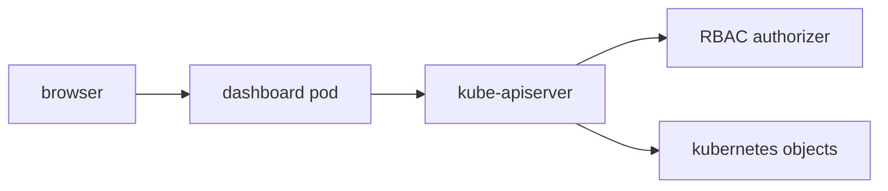

#kubernetes #component #addon #dashboard

相关笔记：[[k8s-development-roadmap]] | [[kubernetes-basics]] | [[kube-apiserver-component]] | [[rbac]] | [[metrics-server-component]] | [[k8s-interview]]

# Kubernetes Dashboard

## 概述

Kubernetes Dashboard 是历史上的官方 Web UI addon，用于通过浏览器查看和管理集群资源。它本质上是运行在集群内的普通应用，通过 kube-apiserver 读写资源。

重要版本状态：原 Kubernetes Dashboard 仓库已在 **2026-01-21** 归档并迁移到 `kubernetes-retired/dashboard`。因此它适合作为 legacy 组件和安全案例学习；新系统更建议评估 Headlamp、Lens、Rancher、KubeSphere 或自研平台控制台。

核心边界：**Dashboard 不是控制面必需组件，权限完全受 RBAC 和登录身份约束。**

## 职责边界

| 职责 | 说明 |
| --- | --- |
| resource view | 展示 Pod、Deployment、Service 等资源 |
| resource edit | 创建、更新、删除部分资源 |
| workload status | 展示事件、日志、状态 |
| auth integration | 使用 token、OIDC 或代理认证 |
| metrics display | 可结合 metrics-server 展示资源使用量 |

## 核心链路



## 关键机制

- Dashboard 通过 Kubernetes API 操作资源，不绕过 apiserver。
- 使用的 service account 或用户 token 决定它能看到和修改什么。
- 不应给 Dashboard 默认绑定 cluster-admin。
- 生产环境通常需要放在受控入口后，并启用 SSO、审计和最小权限。
- Dashboard 适合查看和低频操作，不替代 GitOps/CI/CD。

## 源码导读

Dashboard 已归档，读源码主要是为了理解“Web UI 如何安全访问 Kubernetes API”。不要把它作为新项目选型依据。

| 目标 | 源码位置 | 读什么 |
| --- | --- | --- |
| 仓库 | `github.com/kubernetes-retired/dashboard` | legacy Web UI 实现 |
| 后端 API | `modules/api/` 或历史版本 `src/app/backend/` | apiserver client、resource handlers |
| Web 前端 | `modules/web/` 或历史版本 `src/app/frontend/` | resource view、forms、auth flow |
| auth | `modules/auth/` | token、kubeconfig、session 处理 |
| metrics scraper | `modules/metrics-scraper/` | metrics-server 数据展示 |
| helm chart | `charts/kubernetes-dashboard/` | RBAC、Service、Ingress、Kong/API gateway |

典型请求链路：

```text
browser
  -> dashboard web
  -> dashboard API backend
  -> Kubernetes REST client
  -> kube-apiserver
  -> RBAC authorization
  -> Kubernetes objects
```

精简源码骨架：

```go
func handleListPods(w http.ResponseWriter, r *http.Request) {
    client := clientFromRequest(r)
    namespace := namespaceFromRequest(r)
    pods, err := client.CoreV1().Pods(namespace).List(r.Context(), metav1.ListOptions{})
    if err != nil {
        writeError(w, err)
        return
    }
    writeJSON(w, toPodListView(pods))
}
```

## 深入：Dashboard 请求如何带身份访问 apiserver

这条链路回答一个具体问题：**浏览器里点击 Pod 列表时，Dashboard 后端如何用某个身份调用 kube-apiserver，为什么经常遇到 403？**

### 0. 前置条件

| 前置项 | 说明 |
| --- | --- |
| Dashboard Pod 可访问 apiserver | 集群内网络和 ServiceAccount CA 正常 |
| 用户完成登录 | token、OIDC、代理或 kubeconfig 方式 |
| RBAC 已配置 | 用户或 Dashboard 使用的 service account 有最小权限 |
| 入口受控 | Ingress/Service 不应裸露高权限控制台 |

核心边界：Dashboard 是普通 workload。它不绕过 apiserver，也不拥有天然集群权限。

### 1. 浏览器请求进入 Dashboard 后端

典型链路：

```text
Browser
  -> Dashboard web/API
  -> auth/session middleware
  -> build Kubernetes REST client
  -> kube-apiserver
  -> authentication / authorization / admission
  -> response
```

精简骨架：

```go
func handleListPods(w http.ResponseWriter, r *http.Request) {
    userToken := tokenFromSession(r)
    cfg := rest.CopyConfig(inClusterConfig)
    cfg.BearerToken = userToken

    client := kubernetes.NewForConfig(cfg)
    pods, err := client.CoreV1().Pods(namespaceFromRequest(r)).List(r.Context(), metav1.ListOptions{})
    if err != nil {
        writeAPIError(w, err)
        return
    }
    writeJSON(w, toPodListView(pods))
}
```

如果 Dashboard 使用自己的 service account 作为后端身份，那么它能做什么完全取决于这个 service account 的 RoleBinding/ClusterRoleBinding。

### 2. RBAC 是真正安全边界

| 部署方式 | 风险 |
| --- | --- |
| 每个用户用自己 token | 权限边界清晰，但登录集成更复杂 |
| 统一 Dashboard service account | 简单，但容易把所有用户放大到同一权限 |
| service account 绑定 cluster-admin | 高危，入口泄漏即集群最高权限 |
| 放在公网且无强认证 | 高危，Web 漏洞或 token 泄漏影响集群 |

### 3. metrics 和 logs 是不同后端链路

Dashboard 页面里的资源、日志、指标来自不同 API：

| 页面能力 | 后端链路 |
| --- | --- |
| 资源列表 | Kubernetes core/apps API |
| Pod logs | apiserver 代理到 kubelet logs |
| CPU/Memory 指标 | metrics-server 的 `metrics.k8s.io` |
| Event 展示 | Kubernetes Event API，默认 TTL 约 `1h` |

### 4. 失败点与排查映射

| 现象 | 对应阶段 | 先看哪里 |
| --- | --- | --- |
| 登录失败 | auth/session | token、OIDC、cookie、代理头 |
| 403 | RBAC | `kubectl auth can-i` |
| 页面无指标 | metrics API | metrics-server、APIService |
| 日志打不开 | Pod logs 子资源 | kubelet、Pod 权限、apiserver proxy |
| UI 无法访问 | Service/Ingress | TLS、NetworkPolicy、Ingress auth |

## 源码阅读重点

### 安全边界不是 UI，而是身份

Dashboard 能做什么，完全取决于它拿什么身份访问 apiserver。最危险的部署方式是给 Dashboard service account 绑定 `cluster-admin`，再把入口暴露到公网。

### API 聚合层不在 Dashboard

Dashboard 通常直接调用 Kubernetes API 和 metrics API。它不是 apiserver 插件，也不参与控制面一致性。

### Legacy 迁移

如果集群里仍有 Dashboard，要把它当作遗留暴露面治理：确认是否公开、确认 RBAC、确认审计、确认镜像来源、确认是否有替代方案。

## 故障信号

| 现象 | 常见方向 |
| --- | --- |
| 登录后看不到资源 | RBAC 权限不足、namespace 范围 |
| 403 forbidden | service account 或用户权限 |
| 页面无指标 | metrics-server 不可用 |
| 无法访问 UI | Service、Ingress、证书、网络策略 |

## 事故排查

### 先判断故障层级

Dashboard 事故按“入口、登录、RBAC、后端 API、下游 addon”分层：

| 检查 | 结论 |
| --- | --- |
| 页面打不开 | Service/Ingress/TLS/NetworkPolicy |
| 登录失败 | token/OIDC/session |
| 资源 403 | RBAC，不是 Dashboard 渲染问题 |
| 资源能看但无指标 | metrics-server |
| 资源能看但日志失败 | Pod logs/kubelet 子资源 |

### Event 保留时间

Dashboard 展示的 Event 来自 Kubernetes Event API，默认只保留 `1h`，由 kube-apiserver `--event-ttl` 控制。Dashboard 页面看不到历史 Event 时，不能据此认定没有发生过故障。

### 证据保全

| 证据 | 用途 |
| --- | --- |
| Dashboard Deployment/Ingress YAML | 暴露方式、镜像、参数 |
| RBAC 绑定 | 判断是否越权或权限不足 |
| Dashboard logs | auth、API 调用错误 |
| apiserver audit | 确认 Dashboard 实际用什么身份访问 |
| APIService 状态 | 指标页面依赖 metrics-server |

### 常见事故路径

1. 403 先用同一身份跑 `kubectl auth can-i`，不要直接给 cluster-admin。
2. Dashboard 暴露到公网时先按安全事故处理：收回 token、查 audit、检查 RBAC。
3. 页面无指标通常是 metrics-server 或 APIService 问题，不是 Dashboard 本身。
4. legacy Dashboard 要优先评估替代和最小权限治理，不建议作为新平台入口默认方案。

## 排查命令

```bash
kubectl get pods -n kubernetes-dashboard
kubectl get svc,ingress -n kubernetes-dashboard
kubectl auth can-i list pods --as <user> -n <namespace>
kubectl auth can-i '*' '*' --as system:serviceaccount:kubernetes-dashboard:<service-account>
kubectl get clusterrolebinding
kubectl logs -n kubernetes-dashboard deploy/kubernetes-dashboard --tail=300
kubectl get apiservice v1beta1.metrics.k8s.io
```

## 面试要点

### Q: Dashboard 是 Kubernetes 必需组件吗？

> [!question]- 参考答案（点击展开）
>
> 不是。它是可选 addon，没有 Dashboard 集群也能正常工作。

### Q: 2026 年还建议新装 Kubernetes Dashboard 吗？

> [!question]- 参考答案（点击展开）
>
> 不建议作为新系统默认选择。原项目已经归档，缺少持续维护和安全更新；新项目应优先评估 Headlamp 或其他仍维护的平台 UI。

### Q: Dashboard 的权限来自哪里？

> [!question]- 参考答案（点击展开）
>
> 来自访问它时使用的用户身份或 service account，再由 apiserver 的 RBAC 鉴权决定能做什么。

### Q: 为什么不建议给 Dashboard cluster-admin？

> [!question]- 参考答案（点击展开）
>
> Dashboard 是 Web 入口，暴露面大。cluster-admin 会让任何入口漏洞或 token 泄漏直接变成集群最高权限。

### Q: Dashboard 能否绕过 apiserver？

> [!question]- 参考答案（点击展开）
>
> 不能。它通过 apiserver 读写资源，仍然经过认证、鉴权、审计和准入控制。

### Q: Dashboard 和平台控制台的区别？

> [!question]- 参考答案（点击展开）
>
> Dashboard 是通用资源 UI；生产平台控制台通常还会做租户、审计、审批、成本、模板和多集群治理。
