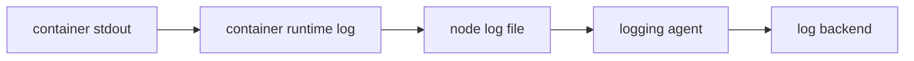

#kubernetes #component #addon #logging

相关笔记：[[k8s-development-roadmap]] | [[kubelet-component]] | [[container-runtime-component]] | [[kubernetes-basics]] | [[k8s-interview]]

# Logging Agent

## 概述

Logging Agent 是集群日志采集组件，常以 DaemonSet 运行在每个节点上，把容器 stdout/stderr、节点日志或系统日志采集到后端日志系统。常见实现包括 Fluent Bit、Fluentd、Vector、Promtail、Filebeat。

核心边界：**Kubernetes 负责把容器日志落到节点，日志 agent 负责采集、解析、转发和缓冲。**

## 职责边界

| 职责 | 说明 |
| --- | --- |
| tail files | 读取容器日志文件 |
| enrich metadata | 补充 namespace、pod、container、label |
| parse | 解析 JSON、多行日志、时间字段 |
| buffer | 后端不可用时缓冲 |
| ship | 转发到 Elasticsearch、Loki、Kafka、云日志等 |

## 核心链路



## 关键机制

- 容器日志通常由 runtime 写到节点文件，再由 kubelet 暴露给 `kubectl logs`。
- 日志 agent 常以 DaemonSet 部署，挂载节点日志目录。
- metadata enrich 需要访问 apiserver 或本地缓存。
- 多行日志和高基数字段是日志系统常见成本来源。
- 后端不可用时要关注缓冲、限速和丢弃策略。

## 源码导读

Logging Agent 是一类组件。Kubernetes 不内置完整日志后端，常见实现是 Fluent Bit、Fluentd、Vector、Promtail、Filebeat。这里以 Fluent Bit 的 Kubernetes 场景为阅读样本。

| 目标 | 源码位置 | 读什么 |
| --- | --- | --- |
| Tail input | `github.com/fluent/fluent-bit/plugins/in_tail/` | 追踪 `/var/log/containers/*.log` |
| Kubernetes filter | `github.com/fluent/fluent-bit/plugins/filter_kubernetes/` | metadata 解析、缓存、API/kubelet 查询 |
| Parser | `github.com/fluent/fluent-bit/plugins/filter_parser/`、parser config | CRI/Docker log 格式 |
| Buffer | `github.com/fluent/fluent-bit/src/flb_storage*` | 内存/文件缓冲 |
| Output | `plugins/out_es`、`out_loki`、`out_kafka`、`out_http` | 转发后端 |
| Kubernetes 部署 | Helm chart / DaemonSet manifest | hostPath、RBAC、service account |

日志采集链路：

```text
container writes stdout/stderr
  -> runtime writes CRI log file
  -> tail input reads file and tracks offset
  -> parser extracts timestamp/stream/log
  -> kubernetes filter extracts pod metadata from file tag
  -> filter queries apiserver or kubelet for labels/annotations
  -> output plugin sends logs to backend
```

精简源码骨架：

```go
func processLogRecord(record Record) error {
    metaKey := parseKubernetesTag(record.Tag)
    meta := cache.Get(metaKey)
    if meta == nil {
        meta = kubeClient.GetPod(metaKey.Namespace, metaKey.Pod)
        cache.Set(metaKey, meta)
    }
    record["kubernetes"] = meta
    return output.Send(record)
}
```

## 深入：Fluent Bit 如何采集容器日志并补 metadata

这条链路回答一个具体问题：**应用写到 stdout/stderr 后，日志如何从节点文件被 agent 读取、补上 Pod metadata，并发送到 Elasticsearch/Loki/Kafka 等后端？**

### 0. 前置条件

| 前置项 | 说明 |
| --- | --- |
| runtime 正常写日志 | CRI log 文件存在 |
| DaemonSet 覆盖节点 | 每个节点至少一个 logging agent |
| hostPath 挂载正确 | 通常挂载 `/var/log/containers`、`/var/log/pods` |
| RBAC 可读 Pod metadata | metadata enrich 需要访问 apiserver 或 kubelet |
| backend 可用 | 输出端、网络、认证、索引/tenant 配置正确 |

核心边界：kubelet/runtime 负责落本地日志；logging agent 负责采集、解析、补 metadata、缓冲和转发。

### 1. runtime 写 CRI log 文件

容器进程写 stdout/stderr 后，runtime 通常写成 CRI 日志格式：

```text
<timestamp> <stream> <flag> <log>
```

典型路径：

```text
/var/log/pods/<namespace>_<pod>_<uid>/<container>/<restart-count>.log
/var/log/containers/<pod>_<namespace>_<container>-<container-id>.log
```

`kubectl logs` 主要通过 kubelet 读取这些日志；日志平台则由 DaemonSet agent 读取这些文件。

### 2. Tail input 读取文件和 offset

以 Fluent Bit 为例：

```text
in_tail
  -> watch /var/log/containers/*.log
  -> read new lines
  -> track inode/offset
  -> parse CRI/Docker format
  -> emit record with tag
```

精简骨架：

```go
func tailLoop(path string) {
    for line := range follow(path, savedOffset(path)) {
        record := parseCRILog(line)
        record.Tag = tagFromPath(path)
        pipeline.Emit(record)
        saveOffset(path, line.Offset)
    }
}
```

offset 是日志重复/丢失排查的关键。agent 重启、inode 复用、log rotate 配置错误都可能影响读取位置。

### 3. Kubernetes filter 补 metadata

metadata 通常来自文件名/tag，再按需要查 apiserver 或 kubelet：

```text
tag/path
  -> pod name / namespace / container / containerID
  -> metadata cache lookup
  -> apiserver or kubelet query
  -> add namespace/pod/container/labels/annotations
```

精简骨架：

```go
func enrich(record Record) Record {
    key := parseKubernetesTag(record.Tag)
    meta := metadataCache.Get(key)
    if meta == nil {
        meta = kubeClient.GetPod(key.Namespace, key.Pod)
        metadataCache.Set(key, meta)
    }
    record["kubernetes"] = meta
    return record
}
```

### 4. Buffer 和 Output 决定故障语义

输出端不可用时，agent 行为取决于 buffer 策略：

| 策略 | 结果 |
| --- | --- |
| memory buffer | 快，但容易 OOM 或丢弃 |
| filesystem buffer | 更稳，但可能打满节点磁盘 |
| retry with backoff | 后端恢复可补发，但延迟升高 |
| drop on limit | 保护节点，但会丢日志 |

### 5. 失败点与排查映射

| 现象 | 对应阶段 | 先看哪里 |
| --- | --- | --- |
| `kubectl logs` 也无日志 | runtime/kubelet 写日志 | 容器是否写 stdout、runtime log path |
| `kubectl logs` 正常但平台无日志 | agent tail/output | DaemonSet、hostPath、offset、backend |
| 日志无 labels | metadata enrich | RBAC、apiserver/kubelet metadata、tag parser |
| 日志重复 | offset/rotate | DB 文件、inode、agent 重启 |
| 节点磁盘满 | buffer/log rotate | filesystem buffer、应用日志量、后端不可用 |

## 源码阅读重点

### 文件名是 metadata 入口

Kubernetes 容器日志路径通常带 pod、namespace、container、containerID 信息。日志 agent 先从 tag/path 解析元信息，再决定是否查 API 补 labels/annotations。

### `kubectl logs` 与日志平台不同链路

`kubectl logs` 通过 kubelet 读取节点日志；日志平台通过 DaemonSet agent 采集并转发。一个正常不代表另一个正常。

### Buffer 策略决定故障语义

后端不可用时，agent 是阻塞、丢弃、落盘还是限速，直接决定日志是否丢失以及节点磁盘是否被打满。生产排障不能只看 output 错误，还要看 buffer 使用量。

## 故障信号

| 现象 | 常见方向 |
| --- | --- |
| `kubectl logs` 正常但平台无日志 | logging agent、转发后端、metadata |
| 日志重复 | 文件 offset、Pod 重建、agent 重启 |
| 日志丢失 | buffer 满、限速、后端不可用 |
| 节点磁盘满 | 日志轮转、agent 卡住、应用刷日志 |

## 事故排查

### 先判断故障层级

日志事故先问两件事：`kubectl logs` 是否正常、agent 是否采到并发出。

| 检查 | 结论 |
| --- | --- |
| `kubectl logs` 失败 | kubelet/runtime/容器日志文件问题 |
| `kubectl logs` 正常但平台无日志 | logging agent 或 backend 问题 |
| 只有 metadata 缺失 | Kubernetes filter/RBAC/cache 问题 |
| 只有某节点缺日志 | DaemonSet 调度、hostPath、节点磁盘 |

### Event 保留时间

logging agent Pod 的调度、重启和探针事件默认保留 `1h`，由 kube-apiserver `--event-ttl` 控制。日志丢失事故要尽快保存 agent Pod events、agent logs、后端错误和节点磁盘状态。

### 证据保全

| 证据 | 用途 |
| --- | --- |
| agent DaemonSet YAML | hostPath、resources、buffer、env |
| agent logs | tail、parser、metadata、output 错误 |
| node log directory listing | 文件是否存在、大小、轮转 |
| backend error | 认证、限流、索引/tenant、网络 |
| buffer 状态 | 判断是延迟、丢弃还是磁盘风险 |

### 常见事故路径

1. 平台无日志时先用 `kubectl logs` 做对照，区分 Kubernetes 日志生成链路和采集链路。
2. 只有新 Pod 缺 metadata，重点查 metadata cache、RBAC 和 tag parser。
3. 后端不可用时，优先看 buffer 是否落盘和节点磁盘余量，避免日志事故扩大成节点事故。
4. 日志重复通常和 offset DB、文件轮转、agent 重启有关，不一定是应用重复打印。

## 排查命令

```bash
kubectl get ds -A
kubectl logs -n <namespace> ds/<logging-agent> --tail=300
kubectl logs <pod> -n <namespace> -c <container>
kubectl describe pod -n <namespace> -l app=<logging-agent>
du -sh /var/log/containers
ls -lah /var/log/containers | head
df -h
```

## 面试要点

### Q: `kubectl logs` 和日志平台的数据源一样吗？

> [!question]- 参考答案（点击展开）
>
> 都通常来自容器 stdout/stderr 在节点上的日志文件，但 `kubectl logs` 由 kubelet/runtime 提供读取，日志平台由 logging agent 采集后转发。

### Q: logging agent 为什么常用 DaemonSet？

> [!question]- 参考答案（点击展开）
>
> 因为容器日志文件在每个节点本地，DaemonSet 能保证每个节点都有一个采集进程。

### Q: 日志丢失常见原因？

> [!question]- 参考答案（点击展开）
>
> agent 未运行、文件 offset 错误、缓冲区满、后端不可用、限速策略、节点磁盘压力或日志轮转配置不当。

### Q: 为什么要给日志补 Kubernetes metadata？

> [!question]- 参考答案（点击展开）
>
> 原始日志只包含文本。补 namespace、pod、container、label 后，才能按服务、环境、版本和租户检索。

### Q: 日志系统和 Kubernetes 控制面是什么关系？

> [!question]- 参考答案（点击展开）
>
> 日志系统通常是 addon，不参与核心调度和运行链路，但对排障、审计和可观测性非常重要。
