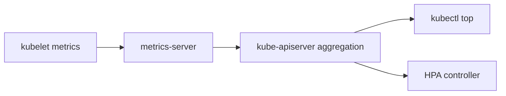

#kubernetes #component #addon #metrics

相关笔记：[[k8s-development-roadmap]] | [[kubelet-component]] | [[kube-apiserver-component]] | [[kubernetes-basics]] | [[k8s-interview]]

# Metrics Server

## 概述

`metrics-server` 是 Kubernetes 常见资源指标 addon。它从 kubelet Summary API 或 metrics endpoint 拉取 Pod/Node CPU、Memory 指标，并通过 aggregated API 暴露给 `kubectl top` 和 HPA。

核心边界：**metrics-server 提供短期资源指标，不是完整监控系统。**

## 职责边界

| 职责 | 说明 |
| --- | --- |
| scrape kubelet | 周期拉取 Node/Pod 资源使用量 |
| aggregate API | 注册 `metrics.k8s.io` API |
| HPA input | 为 HorizontalPodAutoscaler 提供 CPU/Memory 指标 |
| kubectl top | 支撑 `kubectl top node/pod` |

## 核心链路



## 关键机制

- metrics-server 通过 apiserver aggregation 暴露 `metrics.k8s.io`。
- 它不长期存储时间序列，不适合告警、看板和历史分析。
- HPA 默认 CPU/Memory 资源指标常依赖 metrics-server。
- 节点证书、kubelet address、TLS 配置是常见部署问题。

## 源码导读

Metrics Server 是独立项目：`github.com/kubernetes-sigs/metrics-server`。

| 目标 | 源码位置 | 读什么 |
| --- | --- | --- |
| 进程入口 | `cmd/metrics-server/metrics-server.go` | options、server 启动 |
| scraper | `pkg/scraper/scraper.go` | 周期抓取所有 Node |
| kubelet client | `pkg/scraper/client/resource/` | 调 kubelet metrics endpoint |
| storage | `pkg/storage/` | Node/Pod metrics 缓存 |
| API 安装 | `pkg/api/` | `metrics.k8s.io` API provider |
| API 类型 | `pkg/apis/metrics/` | NodeMetrics、PodMetrics |
| 部署清单 | `manifests/`、`charts/` | APIService、RBAC、Deployment |

指标链路：

```text
metrics-server starts
  -> registers metrics.k8s.io aggregated API
  -> lists Nodes from apiserver
  -> chooses kubelet address for each Node
  -> scrapes kubelet resource metrics
  -> stores latest NodeMetrics / PodMetrics in memory
  -> HPA or kubectl top requests metrics.k8s.io
```

精简源码骨架：

```go
func (s *Scraper) Scrape(ctx context.Context) {
    nodes := s.nodeLister.List()
    for _, node := range nodes {
        go func(node *v1.Node) {
            metrics := s.kubeletClient.GetMetrics(ctx, node)
            s.storage.Store(metrics)
        }(node)
    }
}

func (m *MetricsAPI) GetPodMetrics(namespace string) (*metrics.PodMetricsList, error) {
    return m.storage.GetPodMetrics(namespace), nil
}
```

## 深入：metrics-server 如何 scrape kubelet 并服务 HPA

这条链路回答一个具体问题：**HPA 或 `kubectl top` 请求 `metrics.k8s.io` 时，metrics-server 的数据从哪里来，为什么经常显示 unknown？**

### 0. 前置条件

| 前置项 | 说明 |
| --- | --- |
| APIService Ready | `v1beta1.metrics.k8s.io` 指向 metrics-server Service |
| metrics-server 能 list Node/Pod | RBAC 正确 |
| metrics-server 能访问 kubelet | Node address、端口、TLS、网络都正确 |
| kubelet 暴露资源指标 | kubelet metrics/resource endpoint 可用 |
| Pod 设置 requests | HPA 使用 utilization 时需要 CPU/Memory requests |

核心边界：metrics-server 提供最近窗口的资源指标，不存历史，不替代 Prometheus。

### 1. 聚合 API 注册

metrics-server 通过 API aggregation 暴露 `metrics.k8s.io`：

```text
kubectl top / HPA
  -> kube-apiserver
  -> APIService v1beta1.metrics.k8s.io
  -> metrics-server Service
  -> metrics-server API handler
```

如果 APIService `Available=False`，请求还没进入指标抓取逻辑，先查 Service、证书、聚合层和 metrics-server Pod。

### 2. 周期 scrape kubelet

源码入口：`github.com/kubernetes-sigs/metrics-server/pkg/scraper/`

简化路径：

```text
Scraper.Scrape
  -> list Nodes
  -> choose kubelet address
  -> kubelet client GET metrics/resource
  -> decode Node/Pod metrics
  -> store latest metrics in memory
```

精简骨架：

```go
func (s *Scraper) Scrape(ctx context.Context) {
    nodes := s.nodeLister.List()
    for _, node := range nodes {
        go func(node *v1.Node) {
            address := s.nodeAddressResolver.Address(node)
            metrics, err := s.kubeletClient.GetMetrics(ctx, address)
            if err != nil {
                s.recordScrapeError(node, err)
                return
            }
            s.storage.Store(metrics)
        }(node)
    }
}
```

### 3. API handler 从内存返回指标

metrics-server 不把指标写成普通 Kubernetes 对象，也不会写入 etcd。它把最近 scrape 结果保存在内存里：

```text
GET /apis/metrics.k8s.io/v1beta1/nodes
  -> NodeMetrics storage

GET /apis/metrics.k8s.io/v1beta1/namespaces/<ns>/pods
  -> PodMetrics storage
```

HPA controller 通过 resource metrics client 读取这些 API，再结合 Pod requests 计算 utilization。

### 4. 失败点与排查映射

| 现象 | 对应阶段 | 先看哪里 |
| --- | --- | --- |
| `kubectl top` 报 API 不可用 | APIService/aggregation | `kubectl describe apiservice` |
| 部分 Node 指标缺失 | scrape kubelet | Node address、TLS、网络、防火墙 |
| HPA `unknown` | HPA 计算 | Pod requests、metrics API、目标 Pod readiness |
| 指标延迟 | scrape/storage | metrics-server 资源、节点数量、scrape 超时 |
| 证书错误 | kubelet TLS | kubelet serving cert SAN、`--kubelet-insecure-tls` |

## 源码阅读重点

### Aggregated API

metrics-server 不是把指标写成普通 Kubernetes 对象。它通过 API aggregation 暴露 `metrics.k8s.io`，apiserver 作为聚合入口转发请求。

### Kubelet Address 选择

抓取失败常常不是 metrics-server 本身逻辑错，而是 Node address 选择、kubelet 证书 SAN、网络路径或 `--kubelet-insecure-tls` 配置问题。

### HPA 依赖 requests

HPA 基于 CPU utilization 时，需要 Pod 设置 CPU requests。metrics-server 有指标不代表 HPA 一定能算出利用率。

## 故障信号

| 现象 | 常见方向 |
| --- | --- |
| `kubectl top` 失败 | APIService、metrics-server Pod、RBAC |
| HPA unknown | metrics API 不可用、Pod 无 requests |
| scrape kubelet 失败 | kubelet TLS、address、网络 |
| 指标缺失 | metrics-server 资源不足、节点不可达 |

## 事故排查

### 先判断故障层级

metrics 事故先看 `APIService`：

| 检查 | 结论 |
| --- | --- |
| APIService 不可用 | apiserver aggregation 到 metrics-server 失败 |
| APIService 可用但 top 无数据 | metrics-server scrape/storage 失败 |
| top 有数据但 HPA unknown | HPA target、requests 或 Pod 状态问题 |
| 只有部分节点缺失 | kubelet address/TLS/网络的节点差异 |

### Event 保留时间

metrics-server Pod 调度、重启、探针和 APIService 相关事件默认保留 `1h`，由 kube-apiserver `--event-ttl` 控制。HPA 事故要同时保存 HPA describe、metrics-server logs 和 APIService describe。

### 证据保全

| 证据 | 用途 |
| --- | --- |
| APIService YAML/describe | 聚合 API TLS、Service、Available condition |
| metrics-server logs | kubelet scrape 错误和 TLS/address 错误 |
| HPA YAML/describe | target、condition、unknown 原因 |
| Pod spec | requests 是否存在 |
| Node addresses | metrics-server 选择哪个 kubelet 地址 |

### 常见事故路径

1. `kubectl top` 失败先查 `v1beta1.metrics.k8s.io`，不要先查 HPA。
2. HPA `missing request for cpu` 是 workload spec 问题，不是 metrics-server 没数据。
3. kubelet TLS 报错时，优先检查 Node address 选择是否命中证书 SAN。
4. 节点很多时，metrics-server 自身 CPU/Memory 不足会导致 scrape 延迟和指标缺口。

## 排查命令

```bash
kubectl get apiservice v1beta1.metrics.k8s.io
kubectl describe apiservice v1beta1.metrics.k8s.io
kubectl -n kube-system logs deploy/metrics-server --tail=300
kubectl top nodes
kubectl top pods -A
kubectl describe hpa <hpa> -n <namespace>
kubectl get pod <pod> -n <namespace> -o jsonpath='{.spec.containers[*].resources.requests}'
```

## 面试要点

### Q: metrics-server 和 Prometheus 的区别？

> [!question]- 参考答案（点击展开）
>
> metrics-server 提供短期资源指标给 HPA 和 `kubectl top`，不做长期存储和复杂查询；Prometheus 是完整监控系统，负责采集、存储、查询和告警。

### Q: HPA 为什么显示 unknown？

> [!question]- 参考答案（点击展开）
>
> 常见原因是 metrics API 不可用、Pod 没有设置 CPU/Memory requests、metrics-server 无法拉 kubelet 指标。

### Q: metrics-server 数据从哪里来？

> [!question]- 参考答案（点击展开）
>
> 从各节点 kubelet 暴露的资源指标接口拉取，再通过 aggregated API 暴露给 apiserver。

### Q: metrics-server 是否经过 etcd 存储指标？

> [!question]- 参考答案（点击展开）
>
> 不作为 Kubernetes API 对象长期写入 etcd。它聚合并临时提供 metrics API。

### Q: 为什么 `kubectl top` 不能替代监控？

> [!question]- 参考答案（点击展开）
>
> 它只提供近实时资源使用快照，没有长期历史、告警规则、标签查询和业务指标能力。
