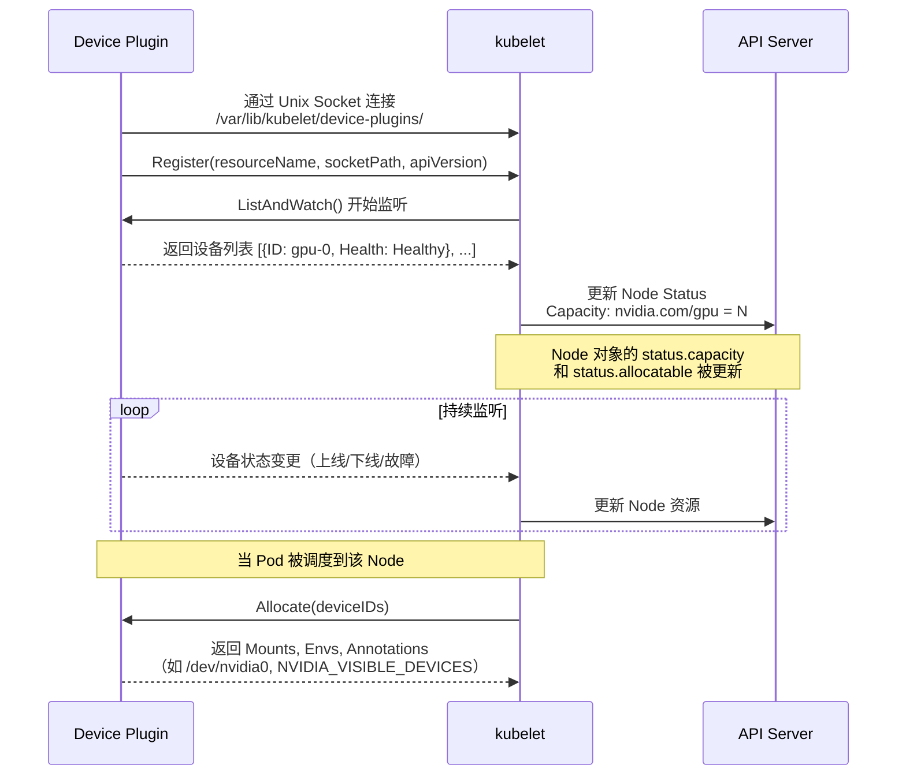
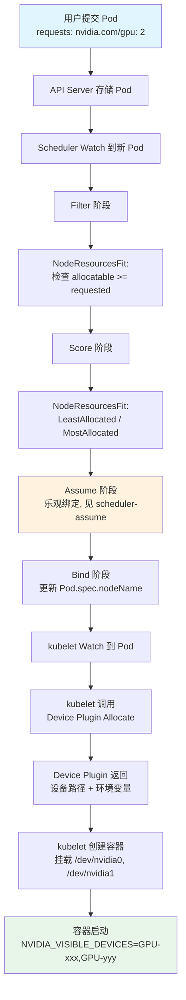
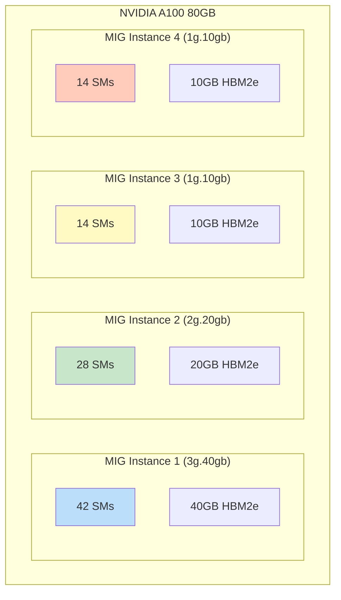

#kubernetes #gpu #ai-infra

相关笔记：[[kubernetes-basics]] | [[scheduler-assume]] | [[csi]] | [[k8s-interview]]

# Kubernetes GPU Scheduling（GPU 调度与资源管理）

## GPU 资源管理概述

Kubernetes 本身不直接感知 GPU 硬件，而是通过 **Extended Resource** 机制将 GPU 抽象为可调度的资源。整体架构涉及三个层次：

| 层次 | 组件 | 职责 |
|------|------|------|
| 硬件层 | NVIDIA Driver | 驱动 GPU 硬件 |
| 运行时层 | NVIDIA Container Toolkit | 让容器访问 GPU |
| 编排层 | Device Plugin + Scheduler | 资源上报与调度分配 |

核心资源名称：`nvidia.com/gpu`，属于 Extended Resource，由 Device Plugin 向 kubelet 注册。

与 CPU/Memory 不同，GPU 是**不可压缩资源（incompressible resource）**：
- 不支持 overcommit（超卖）
- `requests` 必须等于 `limits`
- 最小分配单位是 1 个 GPU（原生模式下）

## Device Plugin 机制

### 工作原理

Device Plugin 是 kubelet 提供的一套 gRPC 接口，允许第三方厂商将硬件设备暴露给 Kubernetes，而无需修改 kubelet 源码。

Device Plugin 需要实现以下 gRPC 接口：

```go
service DevicePlugin {
    // 返回设备列表及健康状态
    rpc ListAndWatch(Empty) returns (stream ListAndWatchResponse) {}
    // 容器创建前，返回设备挂载信息
    rpc Allocate(AllocateRequest) returns (AllocateResponse) {}
    // （可选）返回设备的拓扑信息
    rpc GetPreferredAllocation(PreferredAllocationRequest) returns (PreferredAllocationResponse) {}
}
```

### Device Plugin 注册流程



### 关键路径

Device Plugin 的 socket 注册在 `/var/lib/kubelet/device-plugins/` 目录下。kubelet 通过 `Registration` gRPC service 接受注册：

```
/var/lib/kubelet/device-plugins/kubelet.sock         # kubelet 的注册入口
/var/lib/kubelet/device-plugins/nvidia-gpu.sock       # NVIDIA plugin 的 socket
```

kubelet 重启后，Device Plugin 需要重新注册（通过 inotify 监听 kubelet.sock 重建事件）。

## NVIDIA Device Plugin 安装与配置

### 前置条件

1. 节点安装 NVIDIA Driver（如 535.x）
2. 安装 NVIDIA Container Toolkit（nvidia-ctk）
3. Container Runtime 配置为使用 nvidia runtime

### DaemonSet 部署

```yaml
apiVersion: apps/v1
kind: DaemonSet
metadata:
  name: nvidia-device-plugin-daemonset
  namespace: kube-system
spec:
  selector:
    matchLabels:
      name: nvidia-device-plugin-ds
  updateStrategy:
    type: RollingUpdate
  template:
    metadata:
      labels:
        name: nvidia-device-plugin-ds
    spec:
      tolerations:
        - key: nvidia.com/gpu
          operator: Exists
          effect: NoSchedule
      priorityClassName: system-node-critical
      containers:
        - name: nvidia-device-plugin-ctr
          image: nvcr.io/nvidia/k8s-device-plugin:v0.15.0
          env:
            - name: FAIL_ON_INIT_ERROR
              value: "false"
          securityContext:
            allowPrivilegeEscalation: false
            capabilities:
              drop: ["ALL"]
          volumeMounts:
            - name: device-plugin
              mountPath: /var/lib/kubelet/device-plugins
      volumes:
        - name: device-plugin
          hostPath:
            path: /var/lib/kubelet/device-plugins
```

### 验证 GPU 资源

```bash
# 查看节点 GPU 资源
kubectl describe node gpu-node-01 | grep -A 5 "Capacity"
# Capacity:
#   nvidia.com/gpu: 8
# Allocatable:
#   nvidia.com/gpu: 8

# 查看 GPU 使用情况
kubectl describe node gpu-node-01 | grep -A 5 "Allocated resources"
```

## GPU 调度流程

### 从 Pod 请求到 GPU 分配的完整流程



### 调度细节

**Filter 阶段**：Scheduler 检查 Node 的 `allocatable` 中 `nvidia.com/gpu` 的剩余数量是否满足 Pod 的 `requests`。这里使用的是 `NodeResourcesFit` 插件。

**Allocate 阶段**：kubelet 调用 Device Plugin 的 `Allocate` RPC，传入需要分配的 GPU 设备 ID 列表。Device Plugin 返回：
- **Mounts**：需要挂载到容器的设备文件（如 `/dev/nvidia0`）
- **Envs**：环境变量（如 `NVIDIA_VISIBLE_DEVICES`）
- **Annotations**：附加元信息

注意：**Scheduler 只负责数量级别的调度（几块 GPU），不关心具体哪块 GPU。具体的 GPU 设备选择由 kubelet 侧的 Device Plugin 决定。**

## GPU 共享方案

原生模式下，一个 GPU 只能分配给一个容器。以下方案实现 GPU 共享：

### Time-Slicing（时间片共享）

NVIDIA Device Plugin 支持 Time-Slicing，让多个容器分时使用同一块 GPU。本质上是利用 CUDA Time-Slicing 机制，类似 CPU 分时调度。

**ConfigMap 配置**：

```yaml
apiVersion: v1
kind: ConfigMap
metadata:
  name: nvidia-device-plugin-config
  namespace: kube-system
data:
  config.yaml: |
    version: v1
    sharing:
      timeSlicing:
        renameByDefault: false
        failRequestsGreaterThanOne: false
        resources:
          - name: nvidia.com/gpu
            replicas: 4    # 每块物理 GPU 虚拟成 4 个
```

配置 `replicas: 4` 后，一块物理 GPU 会被上报为 4 个 `nvidia.com/gpu` 资源。例如 8 卡机器变成 32 个可调度的 GPU 资源。

**优缺点**：

| 优点 | 缺点 |
|------|------|
| 配置简单，无需特殊硬件 | 无显存隔离，OOM 会影响所有容器 |
| 适合推理等轻量级任务 | 无 SM 隔离，任务互相影响性能 |
| 提高 GPU 利用率 | 不适合训练等需要独占 GPU 的场景 |

### MIG（Multi-Instance GPU）

MIG 是 NVIDIA Ampere 及以上架构（A100, A30, H100）的硬件级 GPU 分区技术。将一块物理 GPU 划分为多个独立的 GPU Instance，每个 Instance 有独立的 SM、显存和显存带宽。



**MIG 分区规格（A100 80GB 为例）**：

| Profile | SM 数量 | 显存 | 适用场景 |
|---------|---------|------|----------|
| 7g.80gb | 98 SMs | 80GB | 大模型训练 |
| 3g.40gb | 42 SMs | 40GB | 中等推理 |
| 2g.20gb | 28 SMs | 20GB | 小模型推理 |
| 1g.10gb | 14 SMs | 10GB | 轻量推理/开发 |

**Pod 请求 MIG 资源**：

```yaml
apiVersion: v1
kind: Pod
metadata:
  name: mig-inference-pod
spec:
  containers:
    - name: inference
      image: nvcr.io/nvidia/pytorch:24.01-py3
      resources:
        limits:
          nvidia.com/mig-3g.40gb: 1   # 请求一个 3g.40gb 的 MIG 实例
```

**MIG vs Time-Slicing**：

| 对比项 | MIG | Time-Slicing |
|--------|-----|-------------|
| 隔离级别 | 硬件级（SM + 显存） | 无隔离 |
| 硬件要求 | Ampere+ | 任何 NVIDIA GPU |
| 配置灵活性 | 固定分区规格 | 任意 replicas 数 |
| 性能影响 | 几乎无干扰 | 有上下文切换开销 |
| 适用场景 | 多租户推理 | 开发/轻量推理 |

### vGPU（NVIDIA Virtual GPU）

vGPU 需要 NVIDIA vGPU 商业许可证，主要用于虚拟化环境（VMware, KVM）。通过 Hypervisor 级别做 GPU 虚拟化，每个 VM 分到一个 vGPU 实例。

在 Kubernetes 场景中，vGPU 通常用于以下架构：
- 裸金属节点 -> 使用 MIG 或 Time-Slicing
- 虚拟化节点 -> 使用 vGPU pass-through 到 VM，VM 内再跑 K8s

## Topology-Aware GPU Scheduling

### 为什么需要拓扑感知

多 GPU 训练（如 Data Parallel、Model Parallel）中，GPU 之间的通信带宽差异巨大：

| 连接方式 | 带宽 | 延迟 |
|----------|------|------|
| NVLink (intra-node) | 600 GB/s (H100) | 极低 |
| PCIe Gen5 | 64 GB/s | 低 |
| InfiniBand NDR | 50 GB/s | 中 |
| Ethernet 100GbE | 12.5 GB/s | 高 |

如果 Scheduler 不考虑 GPU 拓扑，可能把需要频繁通信的 GPU 分配到不同 PCIe Switch 下，导致训练性能大幅下降。

### Topology Manager

kubelet 内置 Topology Manager，通过 `--topology-manager-policy` 配置：

- **none**：不考虑拓扑（默认）
- **best-effort**：尽量选择拓扑最优的设备
- **restricted**：如果无法满足拓扑亲和性，Pod 会被拒绝
- **single-numa-node**：所有设备必须在同一 NUMA Node

```yaml
# kubelet 配置
apiVersion: kubelet.config.k8s.io/v1beta1
kind: KubeletConfiguration
topologyManagerPolicy: "restricted"
topologyManagerScope: "pod"       # pod 级别或 container 级别
```

### GPU-Aware Scheduling（第三方方案）

原生 Scheduler 只做数量级调度，不感知 GPU 拓扑。以下方案增强拓扑感知能力：

**1. NVIDIA GPU Feature Discovery (GFD)**

自动为节点打 GPU 相关的 label：
```
nvidia.com/gpu.product=NVIDIA-A100-SXM4-80GB
nvidia.com/gpu.memory=81920
nvidia.com/mig.strategy=single
nvidia.com/gpu.count=8
```

**2. Volcano Scheduler**

专为 AI/HPC 场景设计的 batch scheduler，支持：
- Gang scheduling（一组 Pod 要么全部调度，要么全部不调度）
- GPU 拓扑感知
- Queue 和 Fair-share 调度

**3. Kubernetes Scheduler Framework Plugin**

通过自定义 Scheduler Plugin 实现 GPU 拓扑感知，在 `Filter` 和 `Score` 阶段加入 NVLink 拓扑信息。

## NVIDIA GPU Operator

GPU Operator 基于 Operator Framework，自动化管理 GPU 节点上的全部软件栈：

```
GPU Operator
├── NVIDIA Driver（容器化驱动）
├── NVIDIA Container Toolkit
├── NVIDIA Device Plugin
├── NVIDIA DCGM Exporter（监控）
├── GPU Feature Discovery
├── MIG Manager
└── Node Feature Discovery
```

**安装（Helm）**：

```bash
helm repo add nvidia https://helm.ngc.nvidia.com/nvidia
helm repo update

helm install gpu-operator nvidia/gpu-operator \
  --namespace gpu-operator \
  --create-namespace \
  --set driver.enabled=true \
  --set toolkit.enabled=true \
  --set devicePlugin.enabled=true \
  --set dcgmExporter.enabled=true \
  --set migManager.enabled=true
```

**GPU Operator 的价值**：不需要手动在每台 GPU 节点上安装驱动、toolkit、device plugin 等，全部通过 Operator 声明式管理。新节点加入集群后自动配置。

## 实际案例：AI 训练任务配置

### 单机多卡训练 Pod

```yaml
apiVersion: v1
kind: Pod
metadata:
  name: pytorch-training
  labels:
    app: ai-training
spec:
  restartPolicy: Never
  containers:
    - name: training
      image: nvcr.io/nvidia/pytorch:24.01-py3
      command: ["torchrun"]
      args:
        - "--nproc_per_node=4"
        - "--master_addr=localhost"
        - "--master_port=29500"
        - "train.py"
        - "--batch_size=64"
        - "--epochs=100"
      resources:
        requests:
          nvidia.com/gpu: 4
          memory: "64Gi"
          cpu: "16"
        limits:
          nvidia.com/gpu: 4
          memory: "64Gi"
          cpu: "16"
      volumeMounts:
        - name: dataset
          mountPath: /data
        - name: shm
          mountPath: /dev/shm    # PyTorch DataLoader 需要共享内存
      env:
        - name: NCCL_DEBUG
          value: "INFO"
        - name: NCCL_IB_DISABLE
          value: "0"
  volumes:
    - name: dataset
      persistentVolumeClaim:
        claimName: training-dataset-pvc
    - name: shm
      emptyDir:
        medium: Memory
        sizeLimit: "16Gi"       # 默认 /dev/shm 只有 64MB，训练时不够
  nodeSelector:
    nvidia.com/gpu.product: NVIDIA-A100-SXM4-80GB
  tolerations:
    - key: nvidia.com/gpu
      operator: Exists
      effect: NoSchedule
```

### 多机多卡分布式训练（使用 Volcano）

```yaml
apiVersion: batch.volcano.sh/v1alpha1
kind: Job
metadata:
  name: distributed-training
spec:
  minAvailable: 3              # Gang scheduling: 3 个 Pod 必须同时调度
  schedulerName: volcano
  plugins:
    ssh: []
    env: []
  queue: training-queue
  tasks:
    - replicas: 1
      name: master
      template:
        spec:
          containers:
            - name: trainer
              image: nvcr.io/nvidia/pytorch:24.01-py3
              command: ["torchrun"]
              args:
                - "--nnodes=3"
                - "--nproc_per_node=8"
                - "--node_rank=0"
                - "--master_addr=$(MF_MASTER_ADDR)"
                - "--master_port=29500"
                - "train.py"
              resources:
                limits:
                  nvidia.com/gpu: 8
              volumeMounts:
                - name: shm
                  mountPath: /dev/shm
          volumes:
            - name: shm
              emptyDir:
                medium: Memory
                sizeLimit: "32Gi"
    - replicas: 2
      name: worker
      template:
        spec:
          containers:
            - name: trainer
              image: nvcr.io/nvidia/pytorch:24.01-py3
              command: ["torchrun"]
              args:
                - "--nnodes=3"
                - "--nproc_per_node=8"
                - "--master_addr=$(MF_MASTER_ADDR)"
                - "--master_port=29500"
                - "train.py"
              resources:
                limits:
                  nvidia.com/gpu: 8
              volumeMounts:
                - name: shm
                  mountPath: /dev/shm
          volumes:
            - name: shm
              emptyDir:
                medium: Memory
                sizeLimit: "32Gi"
```

### 关键配置要点

1. **`/dev/shm` 必须加大**：PyTorch DataLoader 的 `num_workers > 0` 时使用共享内存做 IPC，默认 64MB 远远不够
2. **`nodeSelector` 选 GPU 型号**：不同训练任务对 GPU 型号有要求，用 GFD 自动打的 label 做选择
3. **`tolerations` 配置**：GPU 节点通常设置 taint 防止非 GPU 任务调度上去
4. **NCCL 环境变量**：多机训练需要配置 NCCL 使用 InfiniBand（`NCCL_IB_DISABLE=0`）或 RDMA

## 面试要点

### 常见面试问题

**Q1: Kubernetes 如何感知 GPU 资源？**

A: 通过 Device Plugin 机制。NVIDIA Device Plugin 以 DaemonSet 部署在 GPU 节点上，通过 gRPC 向 kubelet 注册 `nvidia.com/gpu` 这个 Extended Resource。kubelet 将 GPU 数量上报到 Node 的 `status.capacity` 和 `status.allocatable`。Scheduler 基于这些数量做调度决策。

**Q2: GPU 调度过程中，Scheduler 和 kubelet 各自负责什么？**

A: Scheduler 只负责 **数量级别** 的调度——判断哪个 Node 有足够的 GPU 资源，然后把 Pod 绑定到该 Node。具体 **哪块 GPU** 分配给容器，由 kubelet 侧的 Device Plugin 的 `Allocate` RPC 决定。

**Q3: 为什么 GPU requests 必须等于 limits？**

A: GPU 是 Extended Resource，Kubernetes 对 Extended Resource 的约束是 requests 必须等于 limits，不支持 overcommit。这是因为 GPU 不像 CPU 可以被内核分时调度，一块 GPU 在原生模式下只能独占分配给一个容器。

**Q4: Time-Slicing 和 MIG 怎么选？**

A: 如果硬件支持 MIG（A100/H100），且需要硬件级隔离（如多租户场景），选 MIG。如果是开发测试环境或轻量推理，GPU 型号不支持 MIG，用 Time-Slicing。Time-Slicing 没有显存隔离，一个容器 OOM 会影响同卡的所有容器。

**Q5: 分布式训练为什么需要 Gang Scheduling？**

A: 分布式训练（如 DDP）要求所有 Worker 同时在线，任何一个 Worker 未就绪都无法开始训练。如果用默认 Scheduler，可能只调度了一部分 Pod，剩余 Pod 因资源不足 Pending，已调度的 Pod 空耗 GPU 资源。Gang Scheduling（如 Volcano）确保要么全部 Pod 同时调度成功，要么全部不调度，避免资源浪费。

**Q6: GPU Operator 解决了什么问题？**

A: GPU Operator 自动化管理 GPU 节点的整个软件栈（驱动、Container Toolkit、Device Plugin、监控、MIG 配置等），无需手动逐节点安装配置。新 GPU 节点加入集群后，Operator 自动完成所有初始化。这对大规模 GPU 集群运维尤为重要。

**Q7: 如何监控 GPU 使用情况？**

A: 使用 DCGM Exporter 暴露 GPU metrics（利用率、显存使用、温度、功耗等），接入 Prometheus + Grafana 做可视化。关键指标：
- `DCGM_FI_DEV_GPU_UTIL`：GPU 计算利用率
- `DCGM_FI_DEV_FB_USED`：已用显存
- `DCGM_FI_DEV_FB_FREE`：可用显存
- `DCGM_FI_DEV_POWER_USAGE`：功耗

### 面试加分项

- 了解 **DRA (Dynamic Resource Allocation)**：K8s 1.26+ 引入的新 API，用 ResourceClaim 替代 Device Plugin，支持更灵活的设备分配（类似 PVC/PV 模型）
- 了解 **NCCL 通信优化**：Ring AllReduce、Tree AllReduce、NVLink vs PCIe vs InfiniBand 对训练吞吐的影响
- 了解 **Kueue**：K8s SIG-Scheduling 的任务队列管理方案，支持 ResourceFlavor（按 GPU 型号分组）和 ClusterQueue（集群级配额）
- 了解 **GPU 碎片化问题**：集群中每台机器剩余少量 GPU，但没有一台机器能满足大任务的 GPU 需求，需要通过 bin-packing 策略或 defragmentation 解决
