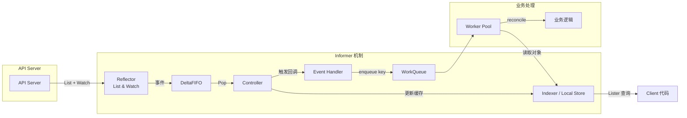
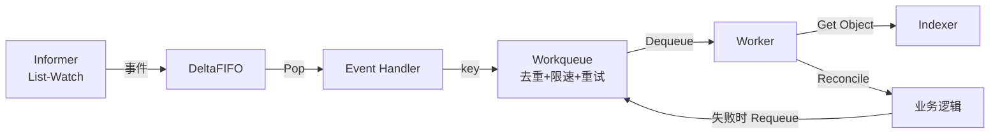

#kubernetes #informer

相关笔记：[[kubebuilder]] | [[api-resource]] | [[k8s-interview]]

## 概述

Informer 是 Kubernetes client-go 提供的 List+Watch 资源监听与本地缓存机制，用于实时感知集群中对象的增删改事件并触发回调。它内部包含 Reflector（负责与 API Server 通信）、DeltaFIFO（事件队列）、Store/Indexer（本地缓存）和 Controller（带 WorkQueue 的事件消费者）等模块协同工作。通过 SharedInformerFactory，可让多个 Controller 共享同一套缓存与 Watch 连接，显著提升性能并降低 API Server 压力。

## 什么是 Informer

Informer 是 Kubernetes client-go 库中用于监听资源对象变化（Add/Update/Delete）的机制。它会先通过 List 获取全部对象，再通过 Watch 持续获取增量更新，将所有数据同步到本地缓存，并支持注册事件处理函数（AddFunc、UpdateFunc、DeleteFunc）。

## 解决的核心问题

### 性能优化
- 初始化时一次性 List 全量对象，后续通过 Watch 获取增量，避免频繁的 API Server 请求
- 所有读取操作均可从本地缓存完成，延迟更低、压力更小

### 事件驱动
- 支持注册回调函数，当资源变化时自动触发，替代手动轮询
- 实现低延迟、反应式的控制器逻辑

## 底层工作流程

### Reflector
- **List**: 拉取资源全量快照，写入 DeltaFIFO
- **Watch**: 在 List 后保持长连接，接收新增/修改/删除事件，持续写入 DeltaFIFO

### DeltaFIFO（变更队列）
- 维护按时间顺序的事件（Delta）列表
- 保证事件有序交付，通过 Pop() 提供给 Controller

### Store / Indexer（本地缓存）
- 以 map（key=namespace/name，value=完整对象）存储资源
- 支持自定义索引（Label、Field）查询
- 用户可通过 Lister 在本地缓存中高效检索，无需访问 API Server

### Controller（工作线程）
1. 从 DeltaFIFO Pop() 获取事件对应的 key
2. 将 key 放入带速率限制和重试能力的 WorkQueue
3. 启动多个 Worker goroutine：
   - Get() 拉取 key
   - 通过 Indexer 获取最新对象
   - 执行业务逻辑（syncHandler）
   - Done() / 重试 / 速率限流

## 架构图



## 使用方式（代码示例）

```go
factory := informers.NewSharedInformerFactory(kubeClient, 30*time.Second)

// 构建 Pod informer
podInformer := factory.Core().V1().Pods().Informer()
podInformer.AddEventHandler(cache.ResourceEventHandlerFuncs{
    AddFunc:    onAdd,
    UpdateFunc: onUpdate,
    DeleteFunc: onDelete,
})

stopCh := make(chan struct{})
factory.Start(stopCh)
factory.WaitForCacheSync(stopCh)
```

- **SharedInformerFactory**: 多个 Controller 调用同一资源的 Informer()，可复用 List/Watch 连接和本地缓存
- **ResyncPeriod**: 周期性触发本地缓存内所有对象的 Update 事件（可用于重试和最终一致性）

## 优化设计

- **SharedInformerFactory 共享**: 多个 Controller 复用 Reflector、DeltaFIFO 和 Store，降低连接数和内存开销
- **自定义索引**: 在 Indexer 上添加 Label/Field 索引，加速特定维度的查询
- **速率限制 & 重试**: WorkQueue 内置 RateLimiter，支持指数退避、限流，防止突发重试过载

## 数据一致性保障机制

### List-Watch 机制的内在一致性
- **初始全量同步 (List)**: 通过 List 操作获取资源的完整快照，作为数据同步的起点
- **增量事件同步 (Watch)**: Watch 连接保证后续资源变化的实时推送

然而，网络抖动、API Server 压力等因素可能导致 Watch 连接中断或事件丢失。为此引入了 Resync 机制。

### Resync 机制: 周期性数据校对

通过定期执行 List 操作，重新获取全量数据，与本地缓存比对，纠正由 Watch 连接中断或事件丢失导致的数据不一致问题。

Resync 周期通过 `resyncPeriod` 参数配置，需在数据一致性和 API Server 压力之间权衡。

### ResourceVersion: 乐观并发控制

每个 Kubernetes 资源对象都有 ResourceVersion 字段，每次更新时递增。
- **List 操作**: 可指定 ResourceVersion，API Server 只返回大于该值的资源对象（增量 List）
- **Watch 操作**: 基于上次返回的 ResourceVersion 开始监听

### DeltaFIFO 的可靠性保障
- **队列加锁处理 (queueActionLocked)**: 保证队列操作的原子性
- **事件去重 (dedupDeltas)**: 自动去重重复事件
- **本地缓存 (items)**: 网络中断时已接收事件不丢失
- **Pop 操作消费**: 保证事件被及时处理

## Informer 与 Workqueue 协同工作



1. Informer 通过 List-Watch 监听资源变化，事件放入 DeltaFIFO
2. Controller 从 DeltaFIFO 消费事件，调用 Handler 将 key 放入 Workqueue
3. Workqueue 负责排队、去重、重试和限速
4. Worker 线程从 Workqueue 取出任务，从 Indexer 获取对象，执行 reconcile

## Informer 在 Operator 开发中的应用

- **监听 CRD**: Operator 控制器监听自定义资源定义（CRD）的变化
- **多资源协同**: SharedInformerFactory 管理多个 Informer 实例
- **状态机管理**: Informer 事件通知驱动状态机迁移
- **Operator SDK**: 自动生成 Informer 代码，降低开发门槛

## 最佳实践

- 使用 SharedInformer 减少 API Server 压力
- 合理配置 Resync 周期
- 事件处理函数保证幂等性
- 完善错误处理（重试、死信队列）
- 控制器停止时及时清理 Informer 资源
- 建立 Prometheus 监控和告警

## 常见错误

- 事件处理逻辑错误（资源泄露、死循环）
- 缓存不一致（Resync 配置不当）
- 过度依赖本地缓存（关键逻辑应直接从 API Server 校验）
- 忽略错误处理导致程序崩溃

## 面试延展问题

### Q：Resync 是什么？

> [!question]- 参考答案（点击展开）
>
> 周期性地将本地缓存中的对象重新推回 DeltaFIFO，触发 Update 事件，不会再次调用 API Server，确保最终一致性与重试机会。

### Q：Informer 与 Lister 有何关系？

> [!question]- 参考答案（点击展开）
>
> Lister 是基于 Informer 本地缓存（Indexer）提供的查询接口，用户通过 List()/Get() 从缓存获取对象，无需访问 API Server。

### Q：本地存储 key 还是对象？

> [!question]- 参考答案（点击展开）
>
> Store 以 namespace/name 为 key，value 为完整对象（如 *v1.Pod）。

### Q：Controller 如何处理并发？

> [!question]- 参考答案（点击展开）
>
> 使用带速率限制和重试的 WorkQueue，启动多个 Worker goroutine，保证同一 key 不被并发处理，并提供限速和重试策略。

> **总结**: Informer 是 Kubernetes 控制器模式的基础组件，凭借 List+Watch、DeltaFIFO、Indexer 和 WorkQueue，实现高性能、低延迟且可靠的事件驱动机制；通过 SharedInformerFactory 和自定义索引，可进一步优化多控制器场景下的资源共享与查询效率。
