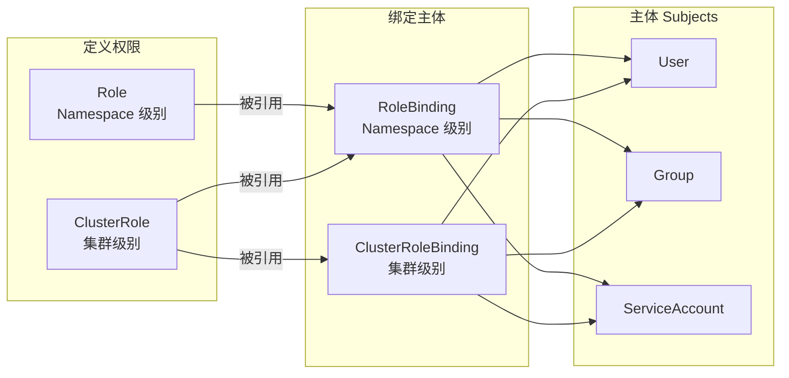

#kubernetes #rbac

相关笔记：[[kubernetes-basics]] | [[restful-api-design]] | [[api-resource]]

## 背景

基于角色（Role）的访问控制（RBAC）是一种基于组织中用户的角色来调节控制对计算机或网络资源的访问的方法。

RBAC 鉴权机制使用 `rbac.authorization.k8s.io` [API 组](https://kubernetes.io/zh-cn/docs/concepts/overview/kubernetes-api/#api-groups-and-versioning)来驱动鉴权决定，允许你通过 Kubernetes API 动态配置策略。

## RBAC 核心对象

RBAC API 声明了四种 Kubernetes 对象：**Role**、**ClusterRole**、**RoleBinding** 和 **ClusterRoleBinding**。



### Role 和 ClusterRole

- **Role** 针对的是 **Namespace**，定义在某个命名空间内的权限
- **ClusterRole** 针对的是**集群**范围的角色，可以跨命名空间

### RoleBinding 和 ClusterRoleBinding

- **RoleBinding** 在指定的命名空间中执行授权
- **ClusterRoleBinding** 在集群范围执行授权

一个 RoleBinding 可以引用同一命名空间中的任何 Role。或者，一个 RoleBinding 可以引用某 ClusterRole 并将该 ClusterRole 绑定到 RoleBinding 所在的命名空间。如果你希望将某 ClusterRole 绑定到集群中所有命名空间，你要使用 ClusterRoleBinding。

### 总结


## YAML 配置实战

### 1. 创建 Namespace

```yaml
apiVersion: v1
kind: Namespace
metadata:
  name: staging
---
apiVersion: v1
kind: Namespace
metadata:
  name: prod
```

### 2. 创建 ServiceAccount

```yaml
apiVersion: v1
kind: ServiceAccount
metadata:
  name: qa-sa
  namespace: staging
```

### 3. 创建 Role（定义权限）

```yaml
apiVersion: rbac.authorization.k8s.io/v1
kind: Role
metadata:
  name: qa-role
  namespace: staging
rules:
  - apiGroups:
      - ""              # 核心 API 组
    resources:
      - services
      - pods
      - pods/log
    verbs:
      - get
      - list
```

### 4. 创建 RoleBinding（绑定权限到用户）

```yaml
apiVersion: rbac.authorization.k8s.io/v1
kind: RoleBinding
metadata:
  name: qa-role-binding
  namespace: staging
roleRef:
  apiGroup: rbac.authorization.k8s.io
  kind: Role
  name: qa-role
subjects:
  - kind: ServiceAccount
    name: qa-sa
    namespace: staging
```

### 5. 创建测试 Pod

```yaml
apiVersion: v1
kind: Pod
metadata:
  name: myapp
  namespace: staging
spec:
  containers:
    - name: myapp
      image: aputra/myapp-192:v2
      ports:
        - containerPort: 8080
---
apiVersion: v1
kind: Pod
metadata:
  name: myapp
  namespace: prod
spec:
  containers:
    - name: myapp
      image: aputra/myapp-192:v2
      ports:
        - containerPort: 8080
```

## 权限验证

```bash
# 验证 qa-sa 是否有权限获取 staging 命名空间的 pods（应返回 yes）
kubectl auth can-i get pods -n staging --as=system:serviceaccount:staging:qa-sa

# 验证 qa-sa 是否有权限获取 prod 命名空间的 pods（应返回 no）
kubectl auth can-i get pods -n prod --as=system:serviceaccount:staging:qa-sa
```

## 面试要点

### 高频问题

**Q: RBAC 中的四种核心对象分别是什么？它们的关系是怎样的？**

> [!question]- 参考答案（点击展开）
>
> 四种对象是 Role、ClusterRole、RoleBinding、ClusterRoleBinding。前两者负责"定义权限"（一组 rules），后两者负责"绑定主体"（把权限授予 User/Group/ServiceAccount）。Role/RoleBinding 作用于单个 Namespace，ClusterRole/ClusterRoleBinding 作用于整个集群。绑定关系通过 Binding 的 `roleRef` 引用角色、`subjects` 指定主体来建立。

**Q: Role 和 ClusterRole 有什么区别？**

> [!question]- 参考答案（点击展开）
>
> Role 是 Namespace 级别的，必须指定 `namespace`，只能定义该命名空间内的资源权限；ClusterRole 是集群级别的，没有命名空间字段。ClusterRole 还能授予 Role 无法表达的权限，比如集群范围资源（nodes、PV）、非资源型 URL（如 `/healthz`）以及跨所有命名空间的命名空间级资源。

**Q: RoleBinding 能引用 ClusterRole 吗？这样做有什么意义？**

> [!question]- 参考答案（点击展开）
>
> 可以。RoleBinding 既能引用同命名空间的 Role，也能引用一个 ClusterRole，此时该 ClusterRole 的权限被限定在 RoleBinding 所在的命名空间内生效。这种模式非常实用：定义一套通用 ClusterRole（如只读权限），然后在多个命名空间用 RoleBinding 复用，避免在每个命名空间重复定义相同的 Role。

**Q: RBAC 的 Subject（主体）有哪几种？ServiceAccount 的标识格式是什么？**

> [!question]- 参考答案（点击展开）
>
> 三种主体：User、Group、ServiceAccount。其中 User 和 Group 由外部认证系统（证书、OIDC、Token 等）提供，K8s 本身不存储它们；ServiceAccount 是 K8s 原生对象，存储在 etcd 中。ServiceAccount 在鉴权时的用户名格式为 `system:serviceaccount:<namespace>:<name>`，例如 `system:serviceaccount:staging:qa-sa`。

**Q: RBAC 的权限模型是默认拒绝还是默认允许？权限可以叠加吗？**

> [!question]- 参考答案（点击展开）
>
> RBAC 是纯增量（additive）、默认拒绝（deny by default）模型，不存在 "deny" 规则。一个主体最终拥有的权限是它通过所有绑定获得的权限的并集，没有任何规则授予的操作一律被拒绝。要收回权限只能删除或修改对应的 Binding/Role，无法通过显式 deny 覆盖。

**Q: 如何验证某个主体是否拥有某项权限？**

> [!question]- 参考答案（点击展开）
>
> 用 `kubectl auth can-i` 命令，结合 `--as` 模拟主体身份。例如 `kubectl auth can-i get pods -n staging --as=system:serviceaccount:staging:qa-sa`，有权限返回 `yes`，无权限返回 `no`。这是排查 RBAC 配置最直接的手段，无需真正切换身份。

**Q: rules 中的 apiGroups、resources、verbs 各代表什么？空字符串 apiGroup 指什么？**

> [!question]- 参考答案（点击展开）
>
> apiGroups 指定 API 组，`""`（空字符串）代表核心组（core group，如 pods、services、configmaps）；resources 指定资源类型，还可以是子资源如 `pods/log`、`pods/exec`；verbs 指定允许的操作动词，如 get、list、watch、create、update、patch、delete。三者共同构成一条权限规则。

### 面试加分点

- 区分清楚 RBAC 在请求链路中的位置：一个 API 请求先经过 Authentication（认证，确认你是谁），再经过 Authorization（鉴权，RBAC 在此判断你能做什么），最后是 Admission Control。RBAC 只解决"能否操作"，不解决"身份是谁"。
- 能说明 `verbs` 中 list 和 watch 的区别（list 是一次性拉取，watch 是 Informer 建立长连接持续接收增量事件），以及为什么 controller/operator 的 RBAC 通常需要 get/list/watch 三件套。
- 知道集群内置的几个常用 ClusterRole：`cluster-admin`（超级权限）、`admin`、`edit`、`view`，以及带 `system:` 前缀的系统角色，生产中应基于最小权限原则优先复用 `view`/`edit` 而非直接给 `cluster-admin`。
- 理解 resourceNames 字段可以把权限精确到具体资源实例（如只允许操作名为 `my-config` 的 ConfigMap），但它对 list/watch/create/deletecollection 等不针对单个已存在对象命名的动词无效。
- 清楚 Pod 内程序如何使用 ServiceAccount：默认会挂载投射卷（projected token，自 1.22 起 BoundServiceAccountTokenVolume GA，为有时效、绑定到 Pod 的短时 Token）到 `/var/run/secrets/kubernetes.io/serviceaccount/`，client-go 的 InClusterConfig 会自动读取它向 APIServer 认证。
- 能指出常见反模式与排查思路：给应用绑 `cluster-admin` 是越权风险；RoleBinding/ClusterRoleBinding 的 `roleRef` 一旦创建不可修改（immutable），改角色引用需删除重建；权限不生效时优先用 `kubectl auth can-i --as` 复现并检查 namespace 是否匹配。
