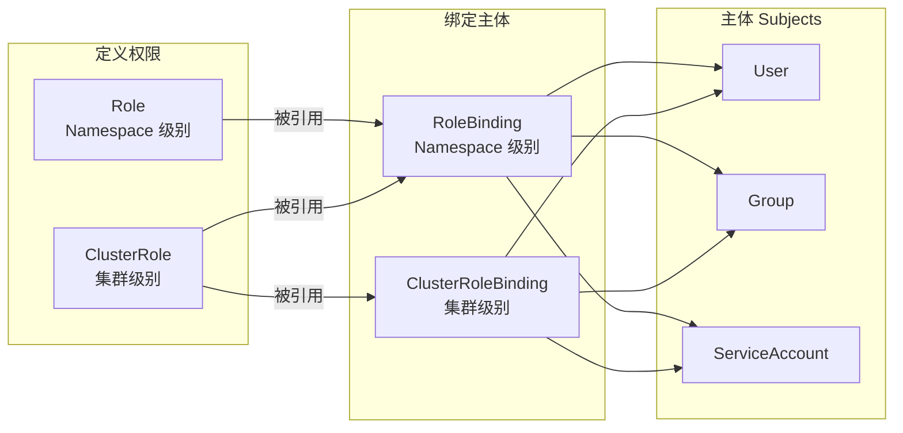

#kubernetes #rbac

相关笔记：[[kubernetes-basics]] | [[restful-api-design]] | [[api-resource]]

## 背景

基于角色（Role）的访问控制（RBAC）是一种基于组织中用户的角色来调节控制对计算机或网络资源的访问的方法。

RBAC 鉴权机制使用 `rbac.authorization.k8s.io` [API 组](https://kubernetes.io/zh-cn/docs/concepts/overview/kubernetes-api/#api-groups-and-versioning)来驱动鉴权决定，允许你通过 Kubernetes API 动态配置策略。

## RBAC 核心对象

RBAC API 声明了四种 Kubernetes 对象：**Role**、**ClusterRole**、**RoleBinding** 和 **ClusterRoleBinding**。



### Role 和 ClusterRole

- **Role** 针对的是 **Namespace**，定义在某个命名空间内的权限
- **ClusterRole** 针对的是**集群**范围的角色，可以跨命名空间

### RoleBinding 和 ClusterRoleBinding

- **RoleBinding** 在指定的命名空间中执行授权
- **ClusterRoleBinding** 在集群范围执行授权

一个 RoleBinding 可以引用同一命名空间中的任何 Role。或者，一个 RoleBinding 可以引用某 ClusterRole 并将该 ClusterRole 绑定到 RoleBinding 所在的命名空间。如果你希望将某 ClusterRole 绑定到集群中所有命名空间，你要使用 ClusterRoleBinding。

### 总结


## YAML 配置实战

### 1. 创建 Namespace

```yaml
apiVersion: v1
kind: Namespace
metadata:
  name: staging
---
apiVersion: v1
kind: Namespace
metadata:
  name: prod
```

### 2. 创建 ServiceAccount

```yaml
apiVersion: v1
kind: ServiceAccount
metadata:
  name: qa-sa
  namespace: staging
```

### 3. 创建 Role（定义权限）

```yaml
apiVersion: rbac.authorization.k8s.io/v1
kind: Role
metadata:
  name: qa-role
  namespace: staging
rules:
  - apiGroups:
      - ""              # 核心 API 组
    resources:
      - services
      - pods
      - pods/log
    verbs:
      - get
      - list
```

### 4. 创建 RoleBinding（绑定权限到用户）

```yaml
apiVersion: rbac.authorization.k8s.io/v1
kind: RoleBinding
metadata:
  name: qa-role-binding
  namespace: staging
roleRef:
  apiGroup: rbac.authorization.k8s.io
  kind: Role
  name: qa-role
subjects:
  - kind: ServiceAccount
    name: qa-sa
    namespace: staging
```

### 5. 创建测试 Pod

```yaml
apiVersion: v1
kind: Pod
metadata:
  name: myapp
  namespace: staging
spec:
  containers:
    - name: myapp
      image: aputra/myapp-192:v2
      ports:
        - containerPort: 8080
---
apiVersion: v1
kind: Pod
metadata:
  name: myapp
  namespace: prod
spec:
  containers:
    - name: myapp
      image: aputra/myapp-192:v2
      ports:
        - containerPort: 8080
```

## 权限验证

```bash
# 验证 qa-sa 是否有权限获取 staging 命名空间的 pods（应返回 yes）
kubectl auth can-i get pods -n staging --as=system:serviceaccount:staging:qa-sa

# 验证 qa-sa 是否有权限获取 prod 命名空间的 pods（应返回 no）
kubectl auth can-i get pods -n prod --as=system:serviceaccount:staging:qa-sa
```
